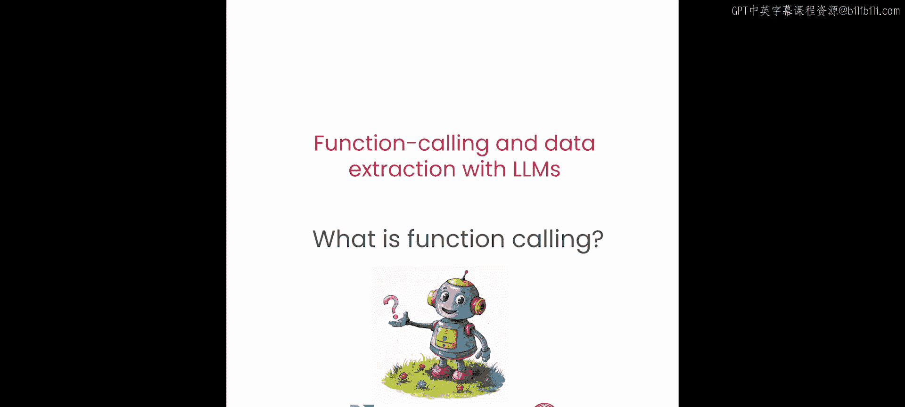
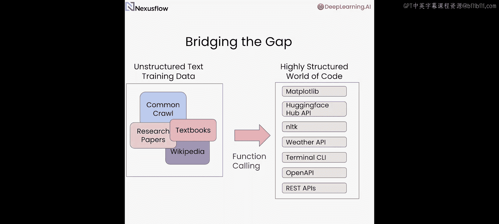

# 002：函数调用入门




在本节课中，我们将深入学习大语言模型（LLM）的“函数调用”能力。我们将详细解释其概念，并通过动手实践，让你理解如何让LLM根据自然语言指令生成可执行代码。现在，让我们开始吧。

## 什么是函数调用？

上一节我们简单介绍了函数调用。本节中，我们来详细看看它的定义。

函数调用是指大语言模型的一种能力：它接收一个自然语言查询和一个函数的描述，然后输出一个可用于调用该函数的字符串。

考虑以下例子：你想知道纽约的温度，并且你有一个名为 `get_temp` 的函数可以提供这个值。在没有函数调用能力的情况下，你的LLM无法直接调用这个函数。但有了具备函数调用能力的LLM，你可以将查询和函数描述提供给LLM。LLM经过训练，能够识别出它可以使用提示词中定义的函数来回答查询。它会生成一个可用于调用该函数的字符串。在这个例子中，就是 `get_temp(city=‘New York’)`。现在，你可以执行这个函数，并将结果和原始查询一起返回给LLM。LLM现在就能正确地回答问题。

**请注意**：尽管被称为“函数调用”，但LLM本身只生成字符串，并不实际执行调用。执行调用需要由开发者来完成。

## 通用模型 vs. 专用模型

在深入实践之前，有必要区分一下通用LLM和专用LLM。

*   **通用LLM**：响应所有类型的查询，其中也包括函数调用查询。
*   **专用LLM**：经过微调，专注于单一或少量任务。例如，NexusRayn13B模型可以微调以提供函数调用服务，并且对于用户查询，它总是尝试返回一个函数调用。

专用LLM通常更小，延迟更低。因为它们针对特定任务（如函数调用）进行了微调，所以在这些任务上的表现往往优于通用模型。

## 核心概念辨析：函数调用、工具

我们使用了“函数调用”和“工具”等术语。它们的区别如下：

*   **函数调用**：指LLM生成包含函数调用信息的字符串这种能力。
*   **工具**：指实际被调用的函数本身。

下面，我们将通过构建一些具体的工具来让这些概念变得更清晰。

## 动手实践：构建本地Python工具

让我们从构建一个本地Python工具开始。我们将尝试一个依赖Matplotlib库的工具。

这个工具接收两个输入 `x` 和 `y`，并绘制由 `x` 和 `y` 指定的坐标点。

一个使用场景是：如果用户说他们想为 `x` 的一组特定值绘制 `y = 10x`，你就可以用这个工具来响应用户查询。

实现方式是运行一个大致如下的函数调用：

```python
plot_coordinates(x=[1, 2, 3], y=[10, 20, 30])
```

在这个函数调用中，你提取出 `x = [1, 2, 3]`，并根据请求的转换函数，将这些值映射到Y轴上的 `[10, 20, 30]`。

虽然你可以手动完成这些，但我们希望LLM能替我们做。为此，你需要将工具描述和用户查询提供给LLM。

以下是构建提示词的方法：

首先，提供你之前使用的函数原型。你将使用的LLM（Raven）使用Python格式的函数，因此你也将采用这种格式。

你还需要添加一些关于工具功能的描述。这将告诉LLM这个函数或工具是做什么用的，并帮助它判断是否应该使用这个工具来回答用户查询。

最后，提供用户查询。假设用户查询是“绘制 y = 10x”，我们只需将其添加进来。

这样，你的提示词就准备好了。你提供了一个工具和用户查询。

接下来，调用名为Raven的LLM。你可以通过 `query_raven` 函数来完成。结果是一个字符串。

```python
# 示例输出字符串
“plot_coordinates(x=[1, 2, 3], y=[10, 20, 30])”
```

函数名来自函数原型，参数来自用户查询，LLM实际进行了一些数学计算来生成 `10 * x` 的值。现在，你可以像这样执行这个字符串：

```python
exec(function_call_string)
```

运行结果完全符合预期。你可以自己尝试修改查询，以产生不同的结果。

## 深入理解提示词

回顾一下你刚才的操作：你通过提示词告诉LLM如何格式化你之前定义的函数，采用了Python风格的函数命名和参数格式。你还提供了必要的描述信息，以帮助LLM理解工具何时与用户查询相关。

重要的是，LLM经过训练能够识别函数调用。这种格式对于这类LLM来说是非常特定的。LLM会用你可以用来调用函数的字符串来响应你的用户查询。

## 更复杂的例子：绘制小丑脸

现在，让我们看一个更复杂的例子。与之前类似，你将使用一个依赖Matplotlib的函数，但功能更丰富。

你将编写一个绘制小丑脸的函数，并使用三个参数（控制脸部、眼睛和鼻子的颜色）来参数化它。函数的具体实现细节不是关键，我们可以快速实现它然后继续。

与之前类似，你需要构建一个包含工具描述和用户查询的提示词，并提交给你的LLM。

假设你想让LLM绘制一个粉色脸、红鼻子的小丑。请据此格式化并创建提示词。

现在看看你构建的提示词。可以看到，函数描述被 `function` 标签标识。LLM可以从函数描述和用户查询中识别出：首先，它应该调用这个函数；其次，它可以从用户查询的信息中填充参数（`face_color`, `eye_color`, `nose_color`）。

现在调用函数调用LLM，并查看它生成的字符串。它从用户提示中提取了必要的信息：脸部颜色是粉色，鼻子颜色是红色。

执行这个字符串，结果是一个粉色脸、红鼻子的小丑，完全符合预期。

你可以尝试修改查询或提示词，创建你自己的小丑。

## 使用OpenAI的函数调用API

Raven并不是唯一能够进行函数调用的LLM。让我们尝试在同一个例子中使用OpenAI的函数调用。

你需要导入必要的模块。本例中将使用GPT-3.5 Turbo模型。

你将构建一个客户端，以及一个封装了所有操作的辅助函数，以便查询OpenAI API。

关键区别在于：使用OpenAI API时，你需要以JSON格式提供工具及其参数的描述。虽然描述和参数内容与你之前使用的Python格式相同，但呈现方式略有不同。

在OpenAI的响应中，你会注意到参数以一种不能直接为我们所用的格式返回。你需要使用以下方法提取参数：

```python
arguments = response.choices[0].message.tool_calls[0].function.arguments
```

最终，你将得到一个可以直接执行的Python调用。

通过这个例子，你可以看到如何利用OpenAI的函数调用API来构建一个满足用户查询的小丑绘制工具。你所做的，实际上是在LLM训练所用的非结构化文本世界与高度结构化的代码世界之间架起了一座桥梁。

## 总结



本节课中，我们一起学习了函数调用的核心概念。我们区分了通用LLM与专用LLM，明确了“函数调用”与“工具”的区别。通过动手实践，我们使用Raven和OpenAI两种方式，让LLM根据自然语言描述生成了可执行的函数调用字符串，从而将用户意图转化为具体的代码操作。在下一课中，我们将聚焦于函数调用的多种变体，包括并行、多重和嵌套调用，更多精彩内容即将到来。