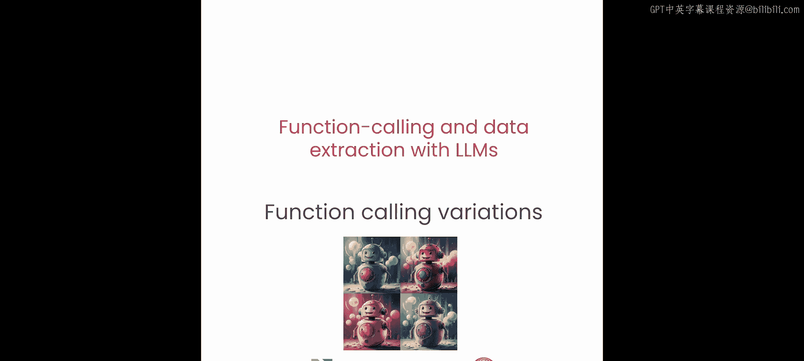
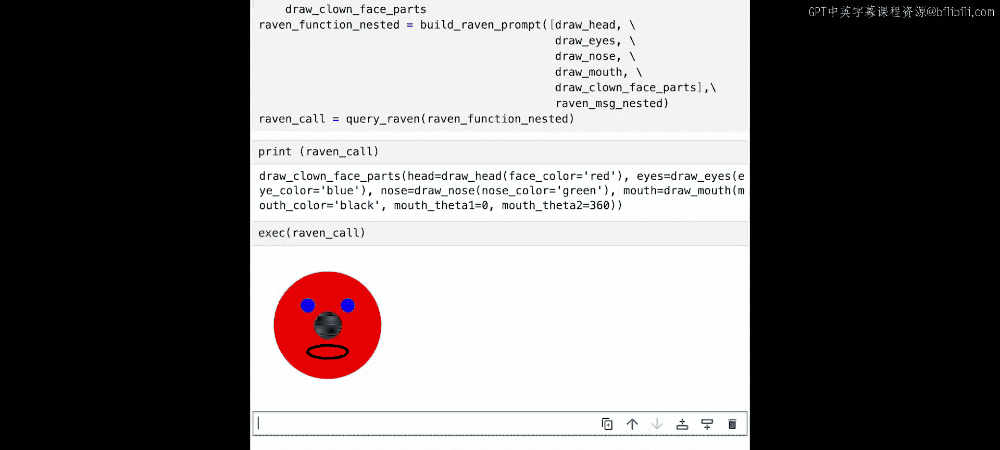

# 003：3.函数调用




## 概述
在本节课中，我们将学习大型语言模型（LLM）进行函数调用的各种变体。我们将涵盖并行调用、多函数选择、无调用以及嵌套函数调用等场景，并通过具体的代码示例来演示如何构建提示词和解析LLM的响应。

---

## 从单一函数到多种变体
上一节我们介绍了如何使用LLM调用单个函数。本节中，我们将探讨LLM能够发出的所有函数调用变体。

这些变体包括：
*   单一调用
*   并行调用
*   无调用
*   多函数选择
*   嵌套函数调用

让我们从并行调用开始。

---

## 准备工作：自动构建提示词
在深入之前，我们先做一些准备工作。上一节课中，我们手动创建了一个函数，并在提示词中嵌入了该函数的描述。实际上，我们可以更高效地利用函数定义本身来自动生成提示词。

为了演示这一点，我们定义一个通用的函数 `function`。你可以使用函数名和 `.` 属性来提取相关信息，例如 `function.__name__` 获取函数名。

你还可以使用Python的 `inspect` 模块来获取函数的签名或参数，例如 `inspect.signature(function)`。

你可以将所有这些整合到一个工具函数中，用于为给定的函数列表创建提示词。以下是一个名为 `build_raven_prompt` 的实用工具：

```python
import inspect

def build_raven_prompt(function_list, user_query):
    prompt_parts = []
    for func in function_list:
        # 获取函数签名
        sig = inspect.signature(func)
        # 获取函数文档字符串
        docstring = func.__doc__ or ""
        # 构建函数描述
        func_desc = f"Function: {func.__name__}\nArguments: {sig}\nDescription: {docstring}\n"
        prompt_parts.append(func_desc)
    # 添加用户查询
    prompt_parts.append(f"User Query: {user_query}")
    return "\n".join(prompt_parts)
```

这个工具接受一个函数列表和一个用户查询。对于函数列表中的每个函数，它使用我们之前讨论的技巧提取函数的签名和文档字符串，并以此创建每个函数的注释，最后在末尾添加上用户查询。

让我们用我们的例子来测试一下。生成的提示词看起来没问题。

现在，在这个例子中，我们将使用第一课中的函数。为了保持笔记本的简洁，我们已将此函数定义在 `utils.py` 文件中。如果你想查看这个文件，请点击“查看”下的“文件浏览器”来打开可用文件列表，然后点击 `utils.py` 来打开包含我们将要描述的所有函数的文件。

这个函数现在有更多的参数，使其更加复杂。之前，我们只有面部颜色、眼睛颜色和鼻子颜色。然而，我们现在扩展了它，包含了小丑面部的更多参数化选项，例如眼睛大小、嘴巴大小、嘴巴颜色、眼睛偏移量和嘴巴数据。这些参数控制着小丑嘴巴的宽度和高度，以及起始和结束角度等属性。它们还控制着眼睛的偏移量以及眼睛的大小。

现在回到并行调用。

---

## 并行函数调用
并行调用是指LLM在同一轮对话中，需要发出多个函数调用字符串，这些调用可以指向同一个函数，也可以指向一组不同的函数。

让我们看一个例子。你将使用一个用户查询，这个查询虽然类似，但比第一课中使用的查询更复杂。在这个用户查询中，你要求生成两个小丑：一个红脸，一个蓝脸；一个蓝鼻子，一个绿鼻子；并且第一个小丑应该是悲伤的微笑，第二个小丑应该是开心的微笑。

你很快就会明白为什么我们指定数值表示（例如，用角度范围表示表情），而不是仅仅说“开心”或“悲伤”。但现在，我们暂时保持原样。

你看到新的 `draw_clown_face` 函数比之前复杂得多。你现在可以通过传入 `draw_clown_face` 函数和你的用户查询来构建Raven提示词。

是的，提示词看起来符合预期。这是函数分隔符，这是函数本身，这是函数参数的描述，最后是函数功能的描述。

调用Raven。很好，你可以看到这里有两个函数调用。这是第一个，这是第二个。第一个调用要求绘制一个红脸小丑，第二个要求绘制一个蓝脸小丑。第一个调用要求蓝鼻子，第二个要求绿鼻子。第一个要求悲伤的微笑，第二个要求开心的微笑。

我们看到小丑符合我们在用户查询中要求的描述。你可以自己尝试，请求三个或更多具有不同特征的面孔。

以上就是并行函数调用。现在，让我们谈谈多函数选择。

---

## 多函数选择与无调用
你可以向LLM提供多个函数，例如F1, F2, F3, F4，一直到FM，LLM应该能够从列表中挑选出正确的函数或函数组合。实际上，你还可以提供一个“无相关查询”函数，如果LLM认为你提供的函数中没有一个与用户查询相关，它可以使用这个函数。

让我们来看一下。在这个例子中，有一个名为 `draw_tie` 的新函数，用于绘制领带。为了保持你的笔记本整洁，这个函数也在 `utils.py` 文件中。这是它的样子。

你将指定一个用户查询，要求Raven只画一条领带。然而，你将同时向Raven提供 `draw_clown_face` 和 `draw_tie` 这两个函数。

这是提示词，你可以看到两个函数都存在：`draw_clown_face` 和 `draw_tie`，并且我们有用户查询。让我们将其发送给LLM。

是的。很好，你注意到Raven只使用了 `draw_tie` 函数，而忽略了 `draw_clown_face` 函数。看看它返回了什么。现在让我们执行这个调用。很好，一条领带。我们准备好参加正式晚宴了。

同样重要的是，可以同时结合多函数选择和并行函数调用。在这个例子中，你将要求Raven绘制一个小丑和一条领带。

和之前一样，你向Raven提供 `draw_tie` 和 `draw_clown_face` 函数。让我们看看Raven的调用。

由于在涉及小丑面部时，Raven没有被给予任何具体的要求，它根据函数 `.docstring` 中提供的默认值，对哪些参数效果最好做出了最佳猜测假设，例如面部颜色和眼睛颜色。让我们调用它。很好，一个戴着领带的小丑。

---

## 函数文档字符串的重要性
在这一点上，值得讨论一下你所提供函数的 `.docstring` 的重要性，尤其是当函数复杂性增加，并且你向Raven提供多个工具时。`.docstring` 的重要性变得更加突出。

让我们展示一个失败案例。你要求Raven画一个绿头发的悲伤小丑。

当你查看这个调用时，它不太对劲，对吧？它得到了面部颜色，但小丑是开心的。可能的原因是函数的 `.docstring` 不够详细，因此我们需要进行一些迭代，以明确函数参数的作用。

你可以采用之前的提示词，并替换对影响小丑感知情绪最大的参数的描述。之前你只是说明嘴巴的起始和结束角度控制了什么，但这非常模糊，没有清晰地链接回用户查询的本质，Raven无法理解这实际上意味着什么。

你要做的就是简单地用更清晰的描述替换它，说明这个参数的作用。例如，添加这样一行：“此参数控制嘴巴的弧度，负值表示悲伤，正值表示开心。”

你现在将用这个新的提示词查询Raven。你现在注意到出现了一个新的参数。这看起来很棒。现在我们有了一个按要求绘制的悲伤小丑。

在这个例子中，我们观察到了良好 `.docstring` 的影响，因为它可以帮助Raven理解如何最好地处理用户查询。当你注意到提示词失败时，有时可以通过编辑 `.docstring` 来添加提示，使这些失败对模型来说更易理解。另一方面，你也可以添加一些简短的示例来传达这一点。

我们已经讨论了多函数选择，现在让我们谈谈嵌套函数。

---

## 嵌套函数调用
多函数选择的一个结果是，你现在可以定义独立的函数，其中一个函数（例如F2）的输入依赖于另一个函数（例如F1）的输出。LLM可以先利用函数F1，使用它从用户提示中提取的参数调用F1，然后获取输出并将其反馈给F2。这种能力有时可以避免对LLM进行多次调用。一些智能体解决方案通过一次调用产生中间结果，然后通过第二次调用产生最终结果。通过嵌套调用，这可以一步完成。

让我们通过一个更具体的例子来看看。在这个例子中，小丑函数被分割成许多部分。你现在有多个函数来绘制小丑的各个部分，例如头部、眼睛、鼻子和嘴巴。并且你有一个函数来将它们全部组合在一起。你可以在 `utils.py` 文件中找到这些函数。

你只是要求Raven生成一个红脸、蓝眼睛、绿鼻子和黑色张开嘴巴的小丑。这是一个旧函数可以处理的提示。但让我们看看Raven如何处理多个函数。

我们将简单地向Raven提供 `draw_head`、`draw_eyes`、`draw_nose`、`draw_mouth` 和组合函数，以及用户查询。

你会注意到，响应首先调用了绘制小丑面部部分的函数，例如 `draw_head`、`draw_eyes`、`draw_nose`、`draw_mouth` 等，并带有必要的参数。然后，它通过将这些调用的输出传递给我们定义的组合函数，将它们组合起来。

让我们运行它。很好，这是我们的小丑。你可以自己尝试一些提示词的变体，也许可以尝试添加并行嵌套的小丑。

---

## 总结
本节课中，我们一起学习了LLM函数调用的各种变体，包括并行调用、多函数选择、无调用以及嵌套函数调用。我们了解了如何自动构建提示词，并强调了为函数编写清晰文档字符串的重要性。我们还通过实例看到了这些调用方式如何组合使用，以完成更复杂的任务。



在下一课中，你将使用外部函数，例如依赖于OpenAPI规范和API端点的函数，这将使你能够为LLM的函数调用添加Web服务功能。