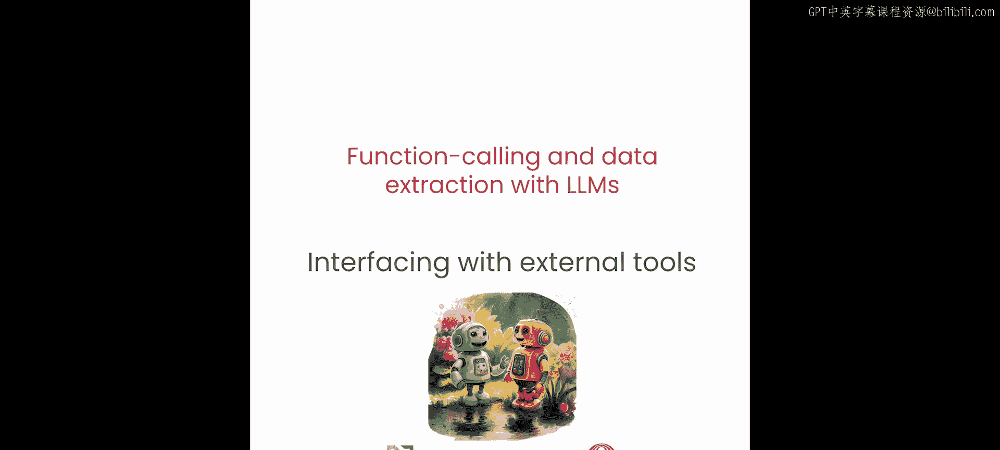
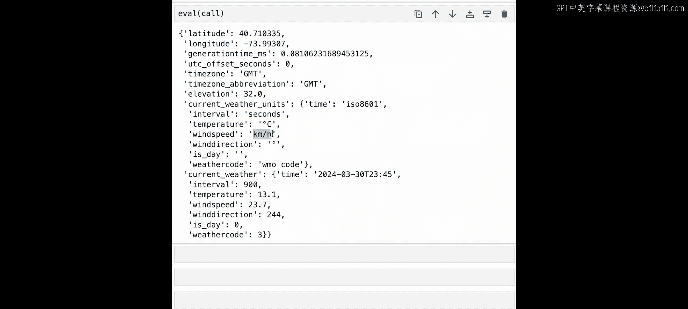

# 004：如何与外部资源交互 🌐



在本节课中，我们将学习如何让大型语言模型（LLM）通过函数调用与互联网上的外部服务（如各种API）进行交互。我们将了解如何将外部API封装成LLM可以使用的工具，并实践一个使用OpenAPI规范与天气服务交互的例子。


---

## 与外部服务交互的核心概念

上一节我们介绍了如何调用本地函数。然而，互联网上存在着一个庞大的服务网络，你可能希望利用它们。本节将描述如何使用这些外部资源。

许多在线服务都提供RESTful API接口。这些接口通常使用诸如OpenAPI规范之类的API标准来描述。能够将我们的函数调用型LLM与此类服务集成起来非常有帮助。

让我们看看如何实现这一点。

## 一个简单的API调用示例

以下是一个使用Python代码与“笑话API”交互的简单示例。你只需向笑话API的端点发送一个GET请求，就会收到一个包含多个键的JSON响应，其中最相关的键是笑话的“铺垫”（setup）和“笑点”（delivery）。

```python
import requests

response = requests.get("https://v2.jokeapi.dev/joke/Any")
joke_data = response.json()
print(f"{joke_data['setup']}\n{joke_data['delivery']}")
```

运行这段代码，你可以成功使用简单的Python与这个外部资源交互。然而，LLM无法直接调用这个API。你需要做的是编写一个工具来封装这个端点。

## 为LLM封装API工具

让我们尝试一下。你将编写一个Python函数，它接收一个“类别”（category）参数，并提供一个描述字符串（docstring）。核心在于使URL动态化：你传递给URL的类别参数将是你Python工具的输入参数。

```python
def get_joke(category: str):
    """
    Fetches a joke from the JokeAPI based on the specified category.
    """
    url = f"https://v2.jokeapi.dev/joke/{category}"
    response = requests.get(url)
    joke_data = response.json()
    return f"{joke_data['setup']}\n{joke_data['delivery']}"
```

此时，你就可以用你的LLM来尝试调用这个工具了。你需要提供函数定义和用户查询，然后调用LLM（例如Raven）。LLM会解析用户意图，生成调用此工具所需的参数，并最终执行函数获取笑话。

核心思想是：**你正在为外部API添加一个适配器，这个适配器将LLM生成的Python参数转换为外部API所需的参数格式。**

## 使用OpenAPI规范与复杂服务交互

许多外部服务使用不同类型的API规范，OpenAPI是其中之一。工具（Tools）允许你将它们统一起来。让我们实践一下，编写一个使用OpenAPI规范的工具。

在这个例子中，我们将使用Open-Meteo天气API。首先，你需要下载YAML格式的OpenAPI规范文件。

这个YAML文件描述了Open-Meteo API的行为，包括API的高级描述。最重要的是，它提供了你可以发送请求以获取不同响应的路径（paths）列表。例如，向 `/v1/forecast` 路径发送GET请求，将为你提供特定坐标的7天天气预报。

请求中还可以添加参数，这些参数在规范中有描述，并具有特定的类型（如数组，数组内元素为字符串等）和允许的枚举值。这允许你通过改变发送给端点的GET请求中的参数，来改变API返回的7天预报数据。

由于这是YAML格式，你需要将其转换为JSON以供工具使用。然后，你可以使用OpenAPI Python生成器工具，将JSON转换为能够查询端点的Python代码。

以下是关键步骤的代码示意：

```python
# 1. 加载YAML并转换为JSON（处理数据类型）
import yaml
import json

with open('openmeteo_spec.yaml', 'r') as file:
    spec = yaml.safe_load(file)
# ... 手动转换整数、浮点数等数据类型 ...
with open('openmeteo_spec.json', 'w') as file:
    json.dump(spec, file)

# 2. 使用生成器创建客户端代码 (示例，具体命令取决于生成器)
# 通常在命令行执行，例如：openapi-python-client generate --path openmeteo_spec.json

# 3. 导入生成的客户端并定义工具函数
from openmeteo_client import OpenMeteoClient

def get_weather(latitude: float, longitude: float):
    """
    Gets the current weather and wind speed for a given location.
    """
    client = OpenMeteoClient()
    forecast = client.forecast_get(latitude=latitude, longitude=longitude)
    current = forecast.current
    return f"Temperature: {current.temperature_2m}°C, Wind Speed: {current.wind_speed_10m} km/h"
```

定义好工具后，你可以提供一个依赖此API的用户查询，例如“询问纽约当前的天气和风速”。接着，使用我们在上一课讨论的`inspect`方法来构建提示词（prompt），其中包含从生成步骤自动构建的函数定义、你编写的描述字符串以及用户查询。最后，将这个提示发送给LLM（如Raven）执行。

运行调用后，你将获得来自API的JSON输出，其中包含纽约当前的气温（例如13.1摄氏度）和风速（例如23.7公里/小时）。你可以尝试修改查询，获取你所在城市的信息。

---

## 总结

本节课中，我们一起学习了如何让LLM与外部资源交互。关键步骤包括：**将外部API封装成带有清晰描述的工具函数**，以及**利用OpenAPI等规范自动化生成客户端代码**。通过这种方式，LLM的能力得以扩展到广阔的互联网服务中。



在下一课中，你将使用Raven进行结构化数据提取，例如从非结构化文本中抽取见解和详细的结构化数据。我们下节课见。