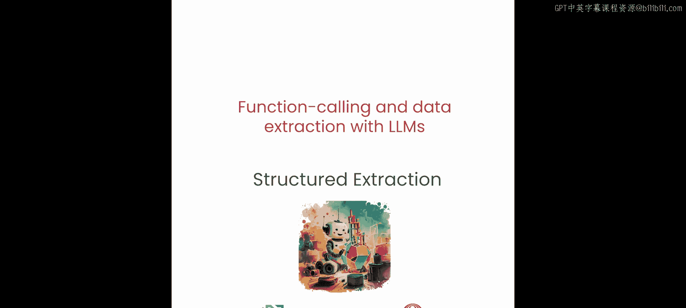
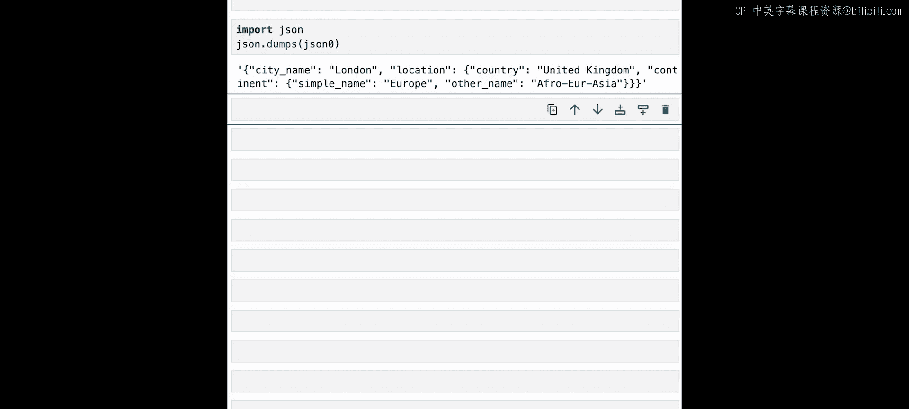

# 005：使用函数调用进行结构化数据提取 🧩



在本节课中，我们将学习如何利用函数调用的能力，从非结构化的文本中提取并组织出结构化的数据。我们将探索几种不同的方法，包括简单的参数提取、使用数据类处理复杂关系，以及生成格式严格的JSON数据。


---

## 从非结构化文本中提取信息

在之前的课程中，我们使用函数调用来与内部或外部工具进行交互。本节中，我们将进一步扩展函数调用的能力，实现一种称为“结构化提取”的操作。

结构化提取是指我们需要从非结构化的文本中提取细节和洞察。例如，如果我们有一段文本“Mary had a little lamb whose fleece was white as snow”，我们想从中提取提到的人物以及该人物拥有的物品，就可以使用函数调用来提取这些信息。

具体做法是，我们只需提供一个函数，其参数包含“人物姓名”和“拥有的物品”，然后指示大语言模型从非结构化的文本中提取信息来填充这些参数。这与之前课程中，大语言模型根据用户查询填充函数参数以调用Python或OpenAPI工具的行为非常相似。我们将利用同样的行为，但这里我们只是标注出希望提取的信息类型，并让大语言模型从非结构化文本中提取。在这个例子中，大语言模型将提取“Mary”作为人物姓名，“lamb”作为拥有的物品。

让我们通过一个例子来具体了解这个过程。

## 示例：地址提取

以下是一个简单的地址提取示例。这里有一段简短的文字，其中包含多个姓名及其关联的地址。

假设你想提取这些姓名，并将其映射到对应的地址上。你可以使用函数调用来实现。你只需提供一个提示词，其中包含函数注解，指明希望Raven提取“姓名”（作为字符串列表）和“地址”（作为另一个字符串列表）。你告诉Raven，你希望提供姓名及其关联的地址，并附上之前的文本。

以下是实现此功能的代码示例：

```python
# 定义提取姓名和地址的函数
def extract_info(names: list[str], addresses: list[str]):
    # 此函数体仅用于接收LLM提取的参数
    pass

# 构造提示词，指示LLM从文本中提取信息
prompt = f"""
请从以下文本中提取姓名和对应的地址。
文本内容：{your_unstructured_text}
"""
# 调用Raven模型进行处理
response = raven.invoke(prompt, tools=[extract_info])
print(response)
```

调用Raven并打印结果后，输出将包含我们预期的姓名及其关联的地址列表。

## 处理更复杂的映射关系

对于更复杂的结构化提取场景，有另一种方法可以提取信息。

你可以使用**数据类**来向Raven传达你希望如何关联要提取的信息。数据类是Python的一个类装饰器，它标记了后续的变量或字段，并通过类型注解来定义它们。经过Python代码训练的大语言模型能够理解这一点，这为定义参数提供了一种新的、便捷的方式。

例如，在下面这段非结构化文本中，某些姓名关联了多个地址（如“Jane”关联了“555 Some Drive”和“777 Data Drive”）。之前的方法可能无法很好地处理这种不平衡的姓名-地址映射关系。

在这种更复杂的情况下，你可以使用数据类方法。你只需定义一个名为`Record`的数据类，其属性包括`name`和一个字符串列表`addresses`。数据类的名称本身并不关键，但它是Raven理解你意图的方式，因此最好使用有意义的名称。

然后，你定义一个函数注解，该函数接受一个此数据类列表作为参数，并提供之前的不平衡文本。

以下是使用数据类进行复杂提取的代码示例：

```python
from pydantic import BaseModel
from typing import List

# 定义数据类（使用Pydantic的BaseModel）
class Record(BaseModel):
    name: str
    addresses: List[str]

# 定义接收Record列表的函数
def extract_complex_info(records: List[Record]):
    pass

# 构造提示词
prompt = f"""
请从以下文本中提取信息，并将每个人名及其所有关联地址组织成记录。
文本内容：{your_complex_unstructured_text}
"""
# 调用模型
response = raven.invoke(prompt, tools=[extract_complex_info])
print(response)
```

运行后，输出将显示Raven发起了一个函数调用，其参数值是`Record`数据类的实例。你会注意到，某些姓名被映射到了多个地址（例如“Jane”映射到了我们之前列出的三个地址）。这正是我们想要的结果，展示了使用函数调用从非结构化数据中提取更复杂洞察的更好方法。

## 生成有效的JSON

函数调用另一个非常强大的应用是**生成有效的JSON**。有时，让较小的语言模型（如70亿或130亿参数模型）生成有效的JSON非常困难，而函数调用可以在这方面提供帮助。

假设你想生成一个如下结构的JSON：第一层是城市名称，第二层包含国家信息，第三层包含大洲信息。

你可以定义具有相同层次结构的工具。首先定义一个工具，它包含一个`city_info`函数，该函数需要一个`location_dict`作为参数。然后定义第二个工具`construct_location_dict`，它接收国家信息和一个`continent_dict`作为参数。最后定义第三个工具`continent_dict`，它接收两个参数（例如`name`和`other_name`）。

为了让你的大语言模型成功调用这些函数，它需要首先构建`location_dict`，这需要通过嵌套调用来实现：调用`location_dict`函数，而该函数又需要`continent_dict`，这又会触发对`continent_dict`函数的嵌套调用。这允许你将嵌套调用转换为你想要的JSON层次结构。

这里需要介绍一下`locals()`函数的作用。它简单地返回当前作用域中定义的变量，作为一个字典，其中键是变量名，值是变量值。在这里使用它，可以方便地将参数值作为字典返回。

让我们尝试使用这种方法将嵌套调用转换为有效的JSON。你只需在Raven提示词中提供之前创建的三个工具，并为你的问题留出位置。

例如，你的问题是：“请提供伦敦的完整城市信息，伦敦位于英国，英国位于欧洲（或非洲/欧亚大陆）。” 这包含了你的JSON所需的所有信息。通过传入之前的工具，你现在可以强制你的大语言模型生成你需要的嵌套层次结构。

以下是生成嵌套JSON的代码示例：

```python
# 定义生成各层级信息的工具函数
def get_continent_info(name: str, other_name: str):
    # 返回大洲信息字典
    return locals()

def get_country_info(country: str, continent_dict: dict):
    # 返回包含大洲信息的国家字典
    info = {'country': country, 'continent': continent_dict}
    return info

def get_city_info(city: str, location_dict: dict):
    # 返回包含国家信息的城市字典
    info = {'city': city, 'location': location_dict}
    return info

# 构造提示词，要求模型生成特定结构的JSON
prompt = f"""
请根据以下信息，生成一个结构化的JSON。
城市：伦敦， 国家：英国， 大洲：欧洲。
请使用提供的工具函数来构建数据。
"""
# 调用模型，传入定义的工具
response = raven.invoke(prompt, tools=[get_city_info, get_country_info, get_continent_info])
print(response.choices[0].message.tool_calls)  # 假设响应中包含工具调用
# 根据工具调用的结果，组装成最终的JSON
final_json = {
    "London": {
        "country": "United Kingdom",
        "continent": {
            "name": "Europe",
            "other_name": "Eurasia"
        }
    }
}
print(final_json)
```

调用Raven并打印JSON后，我们得到了完全符合我们所需格式的JSON。现在，你可以更可预测地从大语言模型中获取有效的JSON了。

---

## 总结



本节课中，我们一起学习了如何将函数调用用于结构化数据提取。我们从简单的姓名-地址提取入手，然后探讨了使用数据类处理更复杂的、一对多的映射关系。最后，我们学习了如何利用函数调用的嵌套特性，引导大语言模型生成格式严格、层次分明的有效JSON数据。这些技巧极大地增强了大语言模型处理和组织非结构化文本信息的能力。