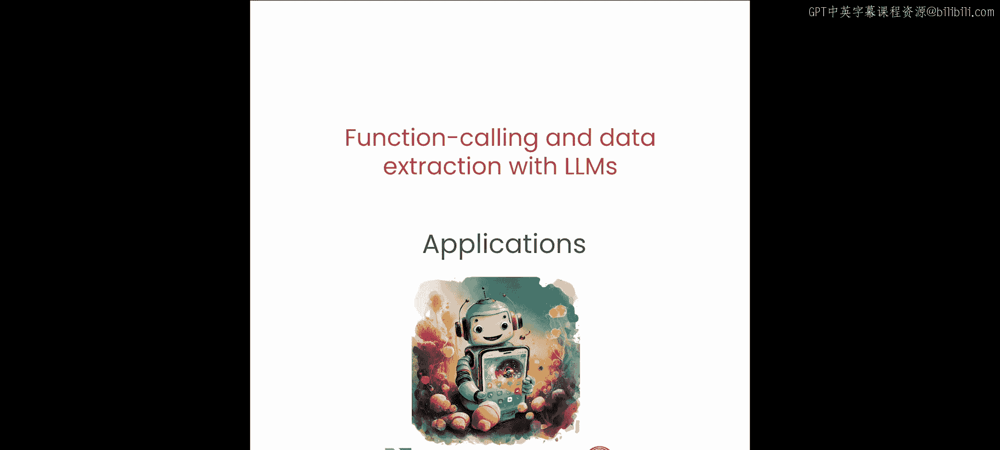
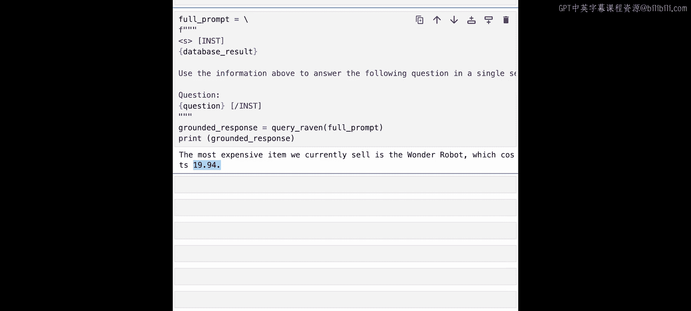

# 006：为你的LLM添加网络搜索功能 🔍

在本节课中，我们将学习函数调用的几个典型应用。我们将开始应用函数调用，让LLM能够获取实时信息。

## 概述

传统的大型语言模型（LLM）是在静态数据集上训练的，缺乏访问或处理其最后一次训练更新后出现的信息的能力。这会导致其回答可能过时或不相关，尤其是在技术、医学或时事等快速发展的领域。函数调用允许LLM实时从网络或公司内部数据库中检索最新数据。例如，可以调用一个函数来获取最新的新闻、股市更新或天气预报，确保所提供的信息是最新的。这种能力对于信息时效性和准确性至关重要的应用来说至关重要。

让我们深入探讨几个例子。

## 通过网络搜索获取最新信息

假设你对LLM训练完成后发生的事件感兴趣。你如何让LLM适应这些新信息？例如，让我们询问一个最近发布的产品公告。

首先，我们将加载环境变量文件（.env）。

现在，你将询问关于Rabbit R1设备的信息，该设备是在LLM训练结束后很久才发布的。因此，直接向LLM提出关于Rabbit R1的问题并提交查询。

你会发现，LLM会拒绝回答，声称它没有所需的信息。

让我们尝试进行网络搜索。

定义一个名为 `do_web_search` 的工具，它接受用户查询和要限制的搜索结果数量。在这个工具内部，你将向网络搜索API的搜索端点发送查询，请求负载中包含你的API密钥和用户查询。提交一个POST请求，并将所有响应内容收集到一个字符串中返回。

与之前类似，你将定义一个Raven（一个函数调用LLM）将使用的提示。为你之前定义的网络搜索工具定义函数注解，指定函数签名和一个描述字符串。你还提供一个单样本示例，包含一个示例用户查询和函数调用，供Raven在理解你构建的工具时作为参考。

然后，你将提供从第一个单元格开始使用的用户查询，并会得到一个Raven函数调用。你可以执行这个调用来获取你的工具返回的信息列表。

接着，你将把工具返回的信息连同从第一个单元格开始使用的用户查询一起提供给LLM。

将这个提示提供给LLM，以获得一个有根据的回答。

查看响应，你会发现它内容丰富得多，包含了更多细节，例如产品尺寸和产品功能。这些信息是LLM原本不知道的，因为该产品是在其训练日期之后很久才发布的。然而，因为我们通过搜索工具提供了互联网访问权限，LLM能够找到这些信息，然后消化结果，为你提供了一个非常具体的答案。

请你自己尝试使用其他查询。

## 与SQL数据库交互

接下来，让我们看看如何与你的SQL数据库进行对话。

通常，对于许多公司来说，很多见解都隐藏在公司的内部数据库和知识库中。因为这些数据是公共模型无法访问的，许多公共开源语言模型无法为你提供依赖于这些锁定数据源的问题的有意义答案。解决这个问题的一个好方法是通过函数调用，为你的LLM提供访问数据库的权限。

让我们具体看看如何实现。

首先，在同一个文件夹中找到的 `utils.py` 文件中创建一个随机数据库。你会找到一个名为 `create_random_database` 的工具。这个工具将创建一个名为 `toy_database.db` 的数据库，并用随机的玩具名称和随机的玩具价格填充。数据库将创建一个名为 `toys` 的表，包含玩具名称和玩具价格。

你将在同一个 `utils.py` 文件中定义另一个名为 `execute_sql` 的工具。它简单地接收一些SQL代码，并针对你在上一个工具中定义的 `toy_database.db` 数据库执行它。

导入 `create_random_database` 工具并运行它。

然后，提出一个问题，例如：“你们公司目前销售的最贵商品是什么？”回答这个问题依赖于你之前创建的数据库中的数据。

让我们尝试运行并收集一些信息。

由于LLM并不真正理解你之前定义的模式，让我们具体化，将这个模式提供给LLM。这个模式再次告诉LLM，你创建了一个名为 `toys` 的数据库，包含玩具名称和玩具价格。

你将这个模式连同你的函数注解一起提供给Raven提示。

你还会将之前的用户问题或用户查询再次提供给模型。

然后运行模型以获取输出。

很好，你看到模型返回了一个SQL调用，从名为 `toys` 的数据库表中选择名称和价格，并按价格降序排列，限制为1条记录，从而获取表中当前定义的最贵商品。这正是我们想要回答的查询。

你将之前从数据库获得的结果连同之前的问题一起提供给LLM。

然后你得到一个响应，说明你公司目前销售的最贵商品是“Wonder robot”，价格接近20美元。这直接回答了你之前提出的问题。

但你会注意到，你必须允许LLM完全访问你的数据库。你允许LLM直接生成原始SQL代码。

## 更安全的数据库交互方式

但是，如果你不想这样做呢？如果出于安全考虑，你不想让LLM生成可以在数据库上执行的原始SQL代码，该怎么办？有一个更受限制的版本，可以提供更高的安全性。

与其要求LLM生成可能有问题原生SQL，我们可以更谨慎地控制对数据库的访问。

让我们定义几个函数来实现这一点。我们可以允许更安全的数据库交互。你将定义一个函数来封装你设想的操作。

首先，定义一个函数来连接到你的数据库。

你将定义一个函数来列出数据库中的所有玩具，并在幕后实现SQL。

类似地，定义按前缀查找玩具、按价格范围查找玩具、获取随机玩具、获取最贵玩具以及获取最便宜玩具的函数。

最后，你将使用函数注解格式，将之前定义的所有函数提供给Raven。

由于Raven没有直接访问你的数据库，你无需向Raven提供你之前设计的数据库模式。相反，Raven将只使用你提供的模板来回答用户查询。

让我们运行这个看看输出。

很好，Raven能够与你的数据库交互，并提取出回答用户查询所需的信息。

你可以将结果反馈给Raven，以获取对原始查询的原始答案，即价格接近20美元的“Wonder robot”。

现在，创建一个查询来使用我们定义的其他函数之一。我们已经定义了几个函数。请尝试可以利用我们之前定义的其他一些函数的查询。

## 总结

在本节课中，我们一起学习了如何使用Raven和其他函数调用LLM，通过以下方式为用户查询提供具体答案：
1.  **网络搜索**：获取互联网上的最新信息。
2.  **原生SQL**：直接访问数据库。
3.  **更安全的模板化方法**：通过预定义函数安全地访问数据库。

这些查询可能依赖于公司内部数据或最新的时事动态。

在下一节课中，我们将通过研究结构化提取，进一步探索函数调用LLM的能力。在整个课程讨论的进展中，我们已经学到了很多。在下一课中，我们将把所学的一切结合起来，创建一个课程项目。

我们下节课见。