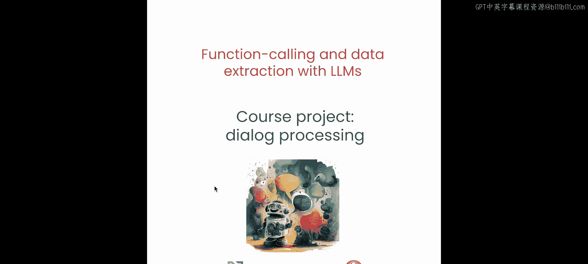
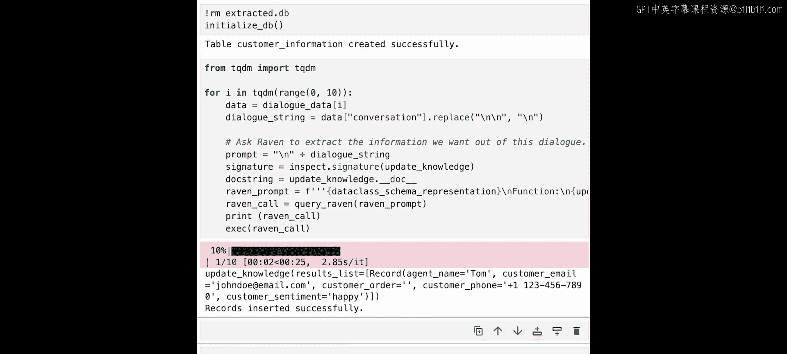
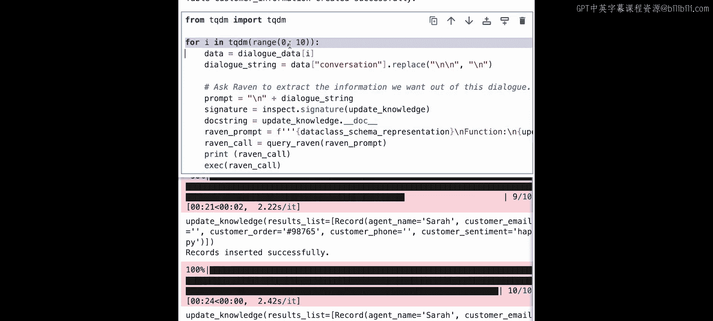
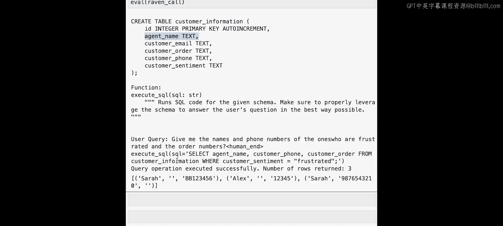

# 007：使用函数调用构建对话特征提取管道



## 概述


在本节课中，我们将综合运用之前学到的函数调用技能，构建一个完整的对话处理系统项目。我们将处理客户服务代表与客户之间的对话记录，从中提取结构化信息，并将其存储到数据库中，最后利用大语言模型对数据库进行聚合查询分析。


## 项目背景与目标

在之前的课程中，我们学习了如何使用函数调用来连接外部工具（如API）和内部Python工具，以及如何利用函数调用从非结构化数据中提取结构化信息。

本节课程中，我们将把这些知识结合起来，构建一个对话处理系统。具体来说，我们将处理客户服务对话的文本记录，从中提取诸如**客服姓名**、**产品ID**和**客户信息**等关键信息，然后利用大语言模型将这些信息存储到数据库中，并进一步执行需要生成SQL代码的聚合查询。

## 构建系统所需的工具

以下是构建此系统所需的核心组件。

### 定义要提取的数据结构

我们将使用数据类（`dataclass`）方法来定义要提取的重要信息，这种方法适用于处理复杂的抽象任务。

```python
from dataclasses import dataclass

@dataclass
class CustomerInfo:
    agent_name: str
    customer_email: str
    customer_order: str
    customer_phone: str
    customer_sentiment: str
```

我们使用 `@dataclass` 装饰器，以便Python解释器能够理解我们定义的新格式。

### 初始化数据库

接下来，我们需要构建一个数据库来存储提取的信息。数据库将包含几个不同的列，对应我们想要提取的属性。

```python
import sqlite3

def initialize_database():
    conn = sqlite3.connect('extracted_info.db')
    cursor = conn.cursor()
    cursor.execute('''
        CREATE TABLE IF NOT EXISTS customer_information (
            agent_name TEXT,
            customer_email TEXT,
            customer_order TEXT,
            customer_phone TEXT,
            customer_sentiment TEXT
        )
    ''')
    conn.commit()
    conn.close()
```

这个工具初始化了一个名为 `extracted_info.db` 的数据库，并在其中创建了一个名为 `customer_information` 的表。

### 创建数据插入工具

我们需要创建一个工具来将提取的数据记录插入到数据库中。

```python
def update_knowledge_base(records):
    conn = sqlite3.connect('extracted_info.db')
    cursor = conn.cursor()
    for record in records:
        cursor.execute('''
            INSERT INTO customer_information (agent_name, customer_email, customer_order, customer_phone, customer_sentiment)
            VALUES (?, ?, ?, ?, ?)
        ''', (record.agent_name, record.customer_email, record.customer_order, record.customer_phone, record.customer_sentiment))
    conn.commit()
    conn.close()
```

让我们用一些虚拟数据测试一下这个工具。

```python
# 创建一条虚拟记录
dummy_record = CustomerInfo(
    agent_name="Agent_Smith",
    customer_email="dummy@example.com",
    customer_order="ORDER_12345",
    customer_phone="555-0100",
    customer_sentiment="neutral"
)

# 插入数据库
update_knowledge_base([dummy_record])
print("记录插入成功。")
```

### 创建数据查询工具

我们还需要一个工具来从数据库中提取信息。

```python
def execute_sql_query(sql_query):
    conn = sqlite3.connect('extracted_info.db')
    cursor = conn.cursor()
    cursor.execute(sql_query)
    results = cursor.fetchall()
    conn.close()
    return results
```

让我们测试这个查询工具。我们将运行一个SQL查询，从之前讨论的表中提取客户感到满意时的客服姓名。

```python
sql = "SELECT agent_name FROM customer_information WHERE customer_sentiment = 'happy';"
results = execute_sql_query(sql)
print(results)  # 预期输出: [('Agent_Smith',)]
```

## 构建数据处理管道

现在我们已经准备好了工具，可以开始构建完整的数据处理管道了。

### 准备数据

首先，我们删除之前的示例数据库并重新初始化它。

```python
import os
if os.path.exists('extracted_info.db'):
    os.remove('extracted_info.db')
initialize_database()
```

接下来，我们将从Hugging Face下载一个客户服务聊天数据集。这个数据集包含了客服与客户之间的对话记录。

```python
from datasets import load_dataset

dataset = load_dataset("customer_service_chat_dataset")  # 假设的数据集名称
```

让我们打印数据集中的一个对话样本。

```python
sample_dialogue = dataset['train'][5]  # 获取第6个元素
print(sample_dialogue['text'])
```

我们注意到数据的格式与之前看到的示例数据有很多相似之处。值得指出的是，这里的客服姓名是Alex，客户的订单号是12345，客户的情绪似乎是“frustrated”（沮丧）。

### 使用大语言模型提取信息

我们将使用之前讨论过的“inspect”方法，将数据类的函数签名提供给大语言模型（如Raven），让它生成函数调用，从而提取结构化信息。

```python
import inspect

# 获取数据类的函数签名
func_signature = inspect.signature(CustomerInfo)
# 清理函数签名，移除 inspect 可能添加的多余细节
# ... 清理代码 ...
# 构建提示词
prompt = f"""
请从以下对话中提取信息。
数据类定义：{func_signature}
对话文本：{sample_dialogue['text']}
请生成填充了提取信息的 CustomerInfo 函数调用。
"""
# 将提示词发送给大语言模型（例如 Raven）
# generated_call = raven.generate(prompt)
# 假设生成的调用是：CustomerInfo(agent_name='Alex', customer_order='12345', customer_sentiment='frustrated')
```

大语言模型成功生成了函数调用，指出客服姓名为Alex，订单号为12345，客户情绪为frustrated，这与我们观察到的完全一致。

我们可以运行这个生成的代码，并将结果插入到数据库中。

```python
# 假设我们从大语言模型得到了一个结果列表
extracted_record = CustomerInfo(agent_name='Alex', customer_order='12345', customer_sentiment='frustrated')
update_knowledge_base([extracted_record])
```

让我们快速处理另一个示例。

```python
another_sample = dataset['train'][10]
# ... 使用相同流程提取信息 ...
# 假设提取到：agent_name='John', customer_order='BB789012', customer_sentiment='happy'
another_record = CustomerInfo(agent_name='John', customer_order='BB789012', customer_sentiment='happy')
update_knowledge_base([another_record])
```

### 执行聚合查询

假设我们想从中获取一些洞察。我们可以使用SQL来查询，例如，选择客服姓名为John且客户情绪为happy的记录数量。这本质上是查询数据库，看看John让多少客户感到满意。

```python
query = "SELECT COUNT(*) FROM customer_information WHERE agent_name='John' AND customer_sentiment='happy';"
result = execute_sql_query(query)
print(f"John让感到开心的客户数量：{result[0][0]}")
```

但这有点手动。我们可以让它更自动化吗？可以，我们可以将之前定义的 `execute_sql_query` 工具也通过函数调用的方式交给大语言模型，让它来生成SQL。

```python
# 构建一个自然语言查询
nl_query = "John让多少客户感到开心？"
# 使用 inspect 方法获取 execute_sql_query 的函数签名和模式
# ... 构建包含SQL表模式的提示词 ...
# prompt_to_raven = f"数据库表 customer_information 有列：agent_name, customer_email, ... 请为以下问题生成SQL查询：{nl_query}"
# 发送给 Raven
# generated_sql = raven.generate(prompt_to_raven) # 假设生成：SELECT COUNT(*) FROM customer_information WHERE agent_name='John' AND customer_sentiment='happy'
# result = execute_sql_query(generated_sql)
```

## 在整个数据集上运行管道

现在我们已经准备好对整个数据集运行这个管道了。让我们尝试处理数据集中的前10个样本。

```python
# 重新初始化数据库
if os.path.exists('extracted_info.db'):
    os.remove('extracted_info.db')
initialize_database()



# 处理前10个样本
for i in range(10):
    dialogue = dataset['train'][i]
    # 使用之前详述的相同方法构建Raven提示词并调用Raven进行信息提取
    # extracted_info = ... 调用大语言模型提取 ...
    # update_knowledge_base([extracted_info])
print("已使用10个不同样本填充了数据库。")
```



### 执行复杂聚合查询

现在我们可以尝试运行一些聚合查询。使用相同的“inspect”方法，并传递相同的模式，我们可以提出更复杂的问题。

例如，询问“在这10个样本中，有多少开心的客户？”

```python
nl_query_1 = "有多少开心的客户？"
# ... 构建提示词，让大语言模型生成SQL ...
# generated_sql_1 = raven.generate(...) # 假设生成：SELECT COUNT(*) FROM customer_information WHERE customer_sentiment='happy'
# result_1 = execute_sql_query(generated_sql_1)
# print(f"开心客户数量：{result_1[0][0]}") # 假设输出 7
```

接下来，可以询问“获取那些感到沮丧的客户的姓名、电话号码和订单号”。

```python
nl_query_2 = "获取感到沮丧的客户的客服姓名、客户电话号码和订单号。"
# ... 构建提示词 ...
# generated_sql_2 = raven.generate(...) # 假设生成：SELECT agent_name, customer_phone, customer_order FROM customer_information WHERE customer_sentiment='frustrated'
# result_2 = execute_sql_query(generated_sql_2)
# for row in result_2:
#     print(row) # 输出沮丧客户的相关信息
```

## 扩展练习

请尝试添加一个额外的需求，例如在查询中同时要求“客户姓名”。提示：你将需要修改数据库的初始化、数据插入逻辑、数据类定义以及相应的SQL表结构。请动手试一试。

## 总结

在本节课中，我们一起构建了一个完整的对话特征提取管道。我们首先定义了要提取的数据结构，然后创建了数据库初始化、数据插入和查询工具。接着，我们利用大语言模型的函数调用能力，从非结构化的对话文本中提取出结构化的客户信息，并将其存储到数据库中。最后，我们再次借助大语言模型，将自然语言问题转化为SQL查询，从而从数据库中提取出有价值的聚合洞察。



本课程涵盖了函数调用的多种应用，展示了其强大的 versatility（多功能性）。希望你享受探索函数调用不同应用的旅程。