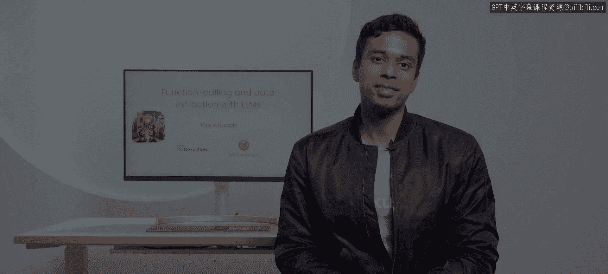

# 008：总结 🎉

在本节课中，我们将回顾并总结整个课程的核心内容与所学技能。

---

恭喜你完成本课程。以下是你在课程中掌握的一些技能。

上一节我们介绍了如何利用LLM提取结构化数据，本节中我们来对整个课程进行总结。

以下是你在本课程中学到的核心技能列表：

*   你创建了能够使LLM执行**函数调用**的提示词。
*   你使用了LLM进行**多次函数调用**，甚至是嵌套的函数调用。
*   你通过函数调用**调用了网络服务**。
*   你使用了LLM来**提取结构化数据**。

---

感谢你学习本课程。希望你能在自己的应用中找到函数调用的多种用途。

本节课中我们一起学习了如何通过精心设计的提示词，让大型语言模型执行复杂的函数调用、处理嵌套逻辑、与外部服务交互，并可靠地提取结构化数据。这些技能是构建强大、自动化AI应用的关键基础。