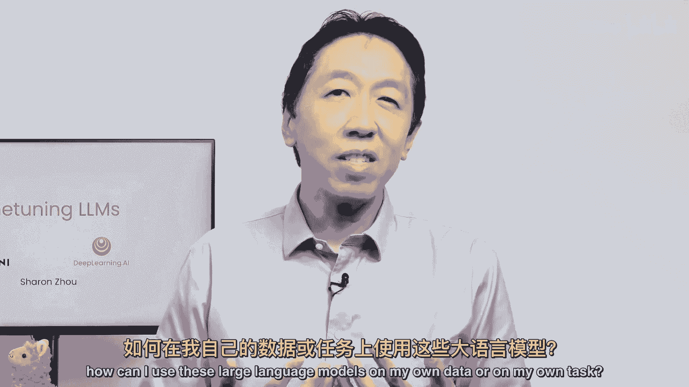
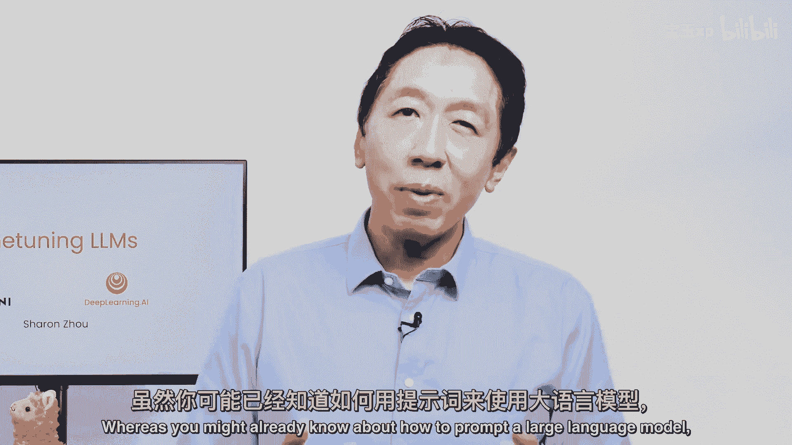
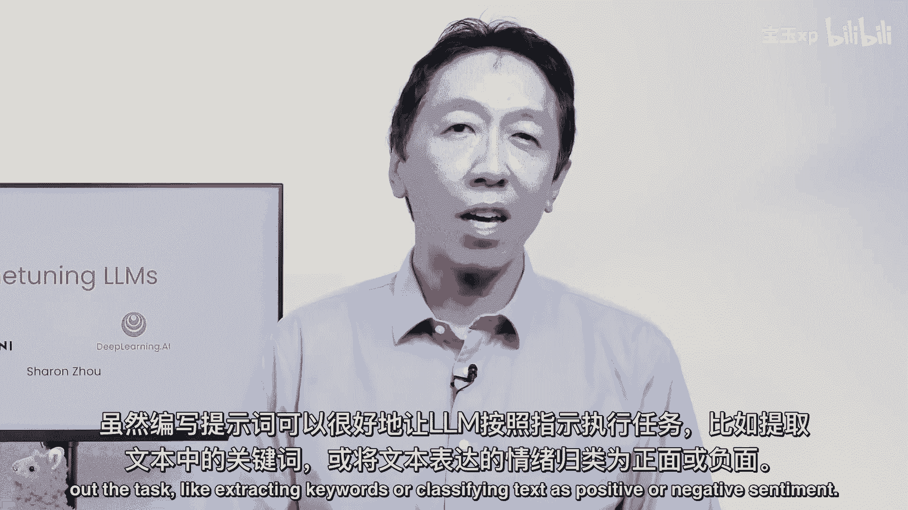
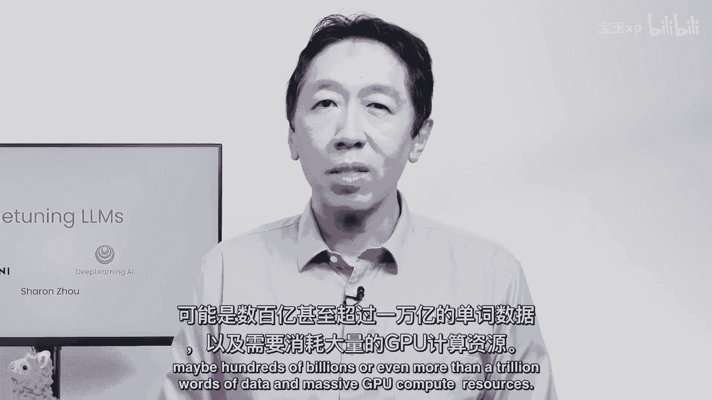
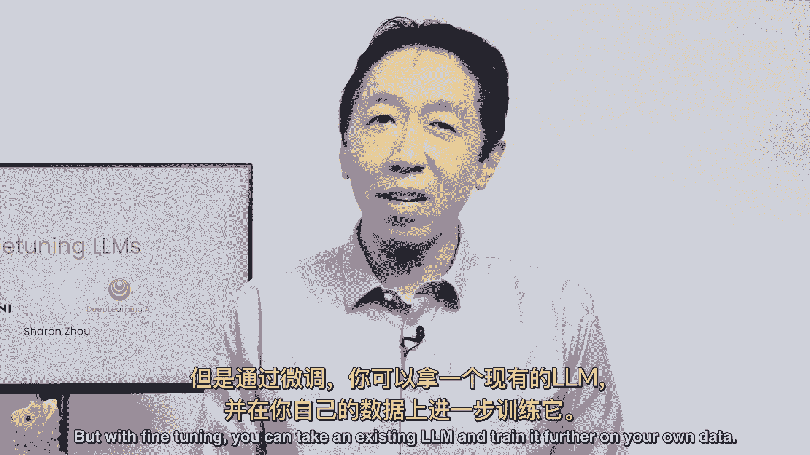
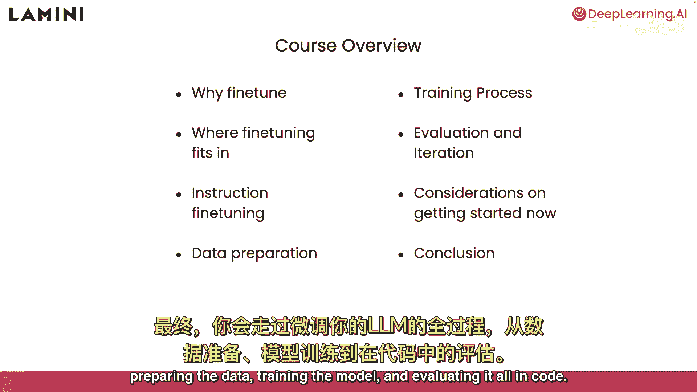
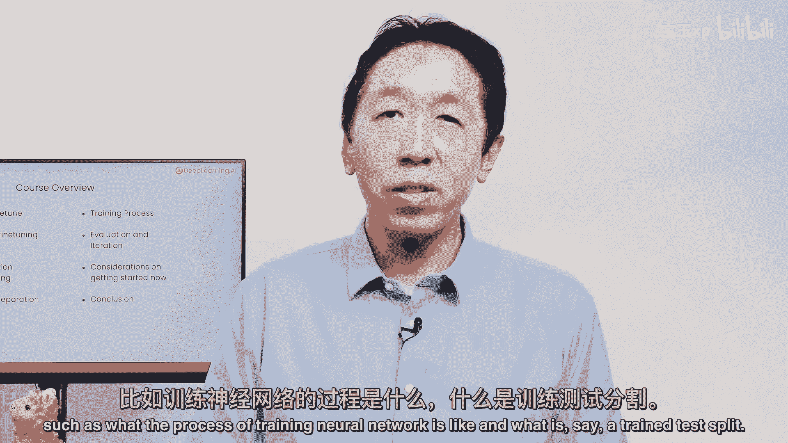
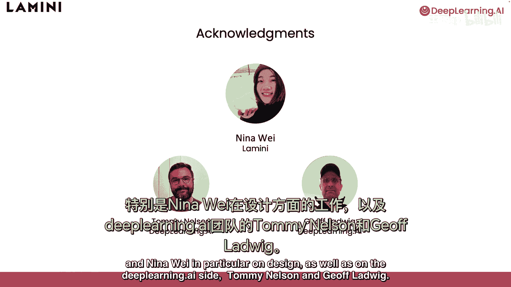

# 001：介绍 🧠

在本节课中，我们将要学习大型语言模型微调的基本概念。我们将了解什么是微调，它为何重要，以及它如何帮助你将通用的大型语言模型应用于你自己的数据和特定任务。

---

当我和不同的团队交流时，经常听到一个问题：如何让大型语言模型在我们自己的数据或任务上发挥作用？

你可能已经知道如何通过**提示**来使用大型语言模型。

本课程将讨论另一个至关重要的工具：**微调**。微调是指获取一个开源的大型语言模型，并在你自己的数据上对其进行进一步的训练。使用提示时，你可以让模型执行诸如提取关键词或进行情感分类等任务。

如果你进行微调，那么你可以让模型更稳定、更一致地执行你期望的操作。我发现，通过微调可以调整模型的语言风格，例如使其回答更乐于助人、更有礼貌，或者更简洁。仅通过提示来实现这一点有时颇具挑战性，而微调被证明是调整模型语气的有效方法。

如今，人们已经见识了ChatGPT等流行大模型在广泛主题上的强大问答能力。然而，许多个人和公司希望拥有能够处理其私有和专有数据的同类界面。

实现这一目标的方法之一就是用你自己的数据来训练一个大模型。当然，从头训练一个基础模型需要海量数据（可能达到数千亿甚至上万亿词）以及巨大的GPU计算资源。

但通过**微调**，你可以利用一个已经预训练好的模型，并仅基于你自己的数据对其进行进一步训练。

所以，在本课程中，你将学习：
*   什么是微调。
*   微调在何时可能对你的应用有帮助。
*   微调在整个模型训练流程中处于什么位置。
*   它与提示工程或检索增强生成等技术有何不同，以及这些技术如何与微调结合使用。

你将深入探究一种特定的微调变体——**指令微调**，它教导一个大模型遵循指令。最后，你将亲身体验微调你自己大模型的完整步骤：准备数据、训练模型，并在代码中进行评估。

本课程专为熟悉Python的学习者设计。要完全理解所有代码，最好具备一些深度学习的基础知识，例如了解训练过程、神经网络的基本概念以及训练集/测试集划分。

我们要感谢Lamini团队和Wei Neena在设计方面所做的卓越工作，以及DeepLearning.AI的Tommy Nelson和Jeff Lord。大约一小时后，通过这个简短的课程，你将能更深入地理解如何通过对现有大模型进行微调，来构建属于你自己的、适配特定数据的语言模型。

---

**本节课总结**：我们一起学习了大型语言模型微调的核心价值。我们了解到，微调是一种高效的方法，能够让我们在预训练模型的基础上，利用自有数据对其进行定制化训练，从而使其更稳定地执行特定任务、适应特定风格，并处理私有领域知识。这为将通用大模型转化为专属工具提供了关键路径。