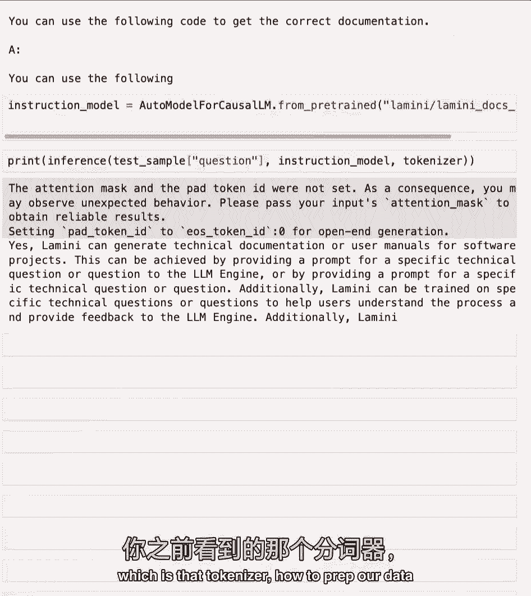
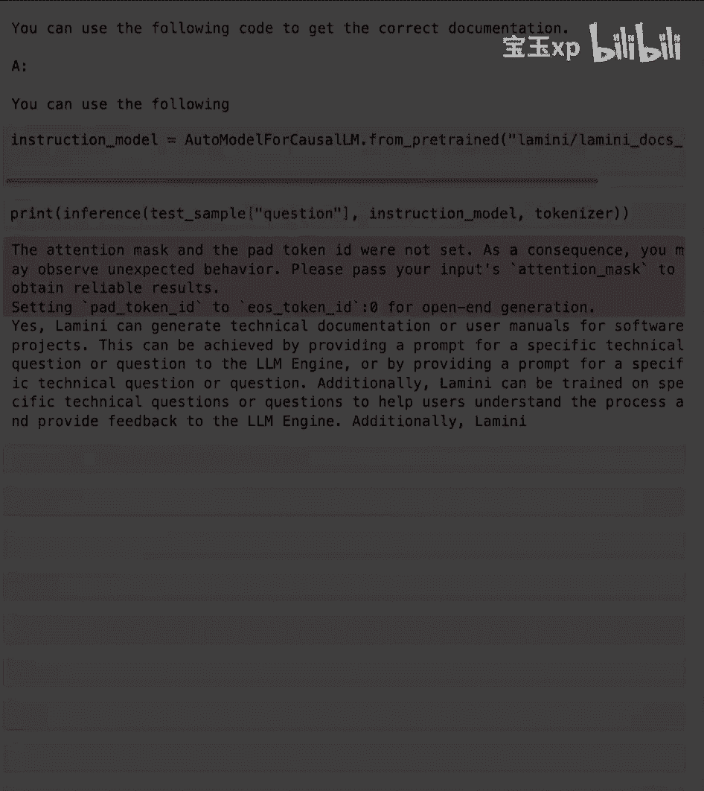

# 004：指令微调 🧠

在本节课中，我们将学习指令微调。这是一种将基础大语言模型（如 GPT-3）转变为具备聊天或遵循指令能力的模型（如 ChatGPT）的关键技术。我们将了解其概念、数据准备方法，并通过实例对比微调前后的模型表现差异。

## 什么是指令微调？

上一节我们介绍了微调的基本概念，本节中我们来看看指令微调的具体含义。

指令微调是微调的一种特定类型。其核心目标是**教会模型遵循指令**，使其行为更像一个聊天机器人。这为用户与模型交互提供了一个更好的界面，正如我们在 ChatGPT 中所见。将 GPT-3 转变为 ChatGPT 正是采用了这种方法，这极大地促进了人工智能在广大人群中的普及和应用。

## 指令微调的数据集

理解了指令微调的目标后，接下来我们看看如何准备相应的数据。

对于指令微调，您可以使用多种现成的数据集，这些数据集可能来自公开资源或您公司的特定资料。常见的数据来源包括：
*   常见问题解答
*   客户支持对话记录
*   即时通讯消息

本质上，这是一个**对话数据集**或**指令-响应数据集**。如果您没有现成的数据，也无需担心。您可以通过使用提示模板，将现有数据转换为问答格式或指令遵循格式。

例如，一段“Readme”文档可以被转换为一组问答对。您甚至可以借助另一个大语言模型（如 ChatGPT）来自动完成这种转换。斯坦福大学提出的 **Alpaca** 技术就采用了这种方法。当然，您也可以使用不同的开源模型管道来实现。

## 指令微调的优势

数据准备是基础，而指令微调带来的能力提升才是关键。

指令微调最显著的优势之一是它能教会模型新的行为模式。虽然您的微调数据中可能只包含类似“法国的首都是什么？”这样的简单问答对，但模型能够**推广**这种问答模式。

模型可能没有在微调数据集中见过某些特定问题，但它可以利用在预训练阶段学到的知识来回答。例如，关于代码的问题。这正是 ChatGPT 论文中的发现：经过指令微调的模型可以回答关于代码的问题，尽管其指令微调数据集中并没有专门的代码问答对。这是因为创建高质量的、带标注的代码问答数据集成本很高。

## 指令微调步骤概述

了解了优势，我们来系统性地看一下指令微调的全过程。

指令微调（以及其他类型的微调）是一个高度迭代的过程，主要包含以下步骤：
1.  **数据准备**
2.  **模型训练**
3.  **效果评估**

评估模型后，通常需要返回**数据准备**阶段进行改进，然后再次训练和评估，如此循环以提升模型性能。其中，**数据准备**环节因任务而异，您需要根据具体的微调目标（如指令遵循、聊天等）来调整和构建数据。而**训练**和**评估**的流程则相对通用。

## 实战：观察指令微调数据集

理论需要实践验证，现在让我们深入实验室，观察一个实际的指令微调数据集。

您将看到用于指令微调的 Alpaca 数据集，并比较经过指令微调与未经过指令微调的模型表现。

首先导入必要的库，其中关键的是从 `datasets` 库加载数据集的函数。

```python
from datasets import load_dataset
```

让我们加载这个指令微调数据集，即指定的 Alpaca 数据集。我们使用流式加载，因为它是一个较大的数据集。

```python
dataset = load_dataset("tatsu-lab/alpaca", split="train", streaming=True)
```

与海量的预训练语料不同，这个数据集更有条理。它并非纯文本，而更像是问答对。Alpaca 论文的作者设计了两类提示模板，以使模型能处理两种任务：
*   **含输入的指令**：例如，指令是“将两个数字相加”，输入是“第一个数字是3，第二个数字是4”。
*   **不含输入的指令**：例如，指令是“告诉我一个笑话”。

在数据集中，有些样本的“输入”字段是空或不相关的。这些提示模板会被填充，并在整个数据集中应用。打印一个样本可以看到，它最终被构造成“指令 + 输入 -> 输出”的形式，并以“Response：”开头引导模型的回答。

## 实战：对比微调前后的模型

看过数据后，我们来直观感受一下指令微调带来的变化。

我们将比较两个模型对同一指令的响应。首先是一个未经指令微调的 LLaMA 2 模型。

**指令**：告诉我如何训练我的狗坐下。
**未经微调模型的输出**：模型可能输出无关的文本或无法遵循指令，例如重复指令或开始随机生成。

现在，我们比较经过指令微调的模型对同一指令的响应。
**经过微调模型的输出**：模型会生成一系列合理的训练步骤，例如：“1. 准备一些狗粮作为奖励。2. 让狗保持站立姿势。3. 清晰地说出‘坐下’口令，同时用手轻轻按压它的臀部…”。

作为参考，ChatGPT 对此指令也会产生一套详细、步骤清晰的回答。需要注意的是，ChatGPT 的参数量（据传约700亿）远大于我们示例中使用的 LLaMA 2 模型（70亿参数）。

## 实战：在特定领域数据上的测试

通用指令的对比很直观，现在我们测试模型在特定领域知识上的表现。

我们将加载一个较小的、拥有7000万参数且未经指令微调的模型。然后，从一个关于“Lamini”公司的特定数据集中抽取一个问题来测试它。

```python
# 示例问题
question = "Lamini 能否为软件项目生成技术文档或用户手册？"
# 期望答案
expected_answer = "是的，Lamini 可以为软件项目生成技术文档和用户手册。"
```

**未经微调模型的回答**：模型可能给出不相关或错误的回答，例如：“我有一个关于以下内容的问题：如何获得正确的文档来工作？我认为您需要使用以下代码…”。这表明模型既不理解该领域知识，也不明白它应该以直接回答问题作为期望行为。

现在，将其与我们已为您微调好的模型（或您将在后续课程中自己微调的模型）进行比较。
**经过指令微调模型的回答**：模型回答：“是的，Lamini 可以为软件项目生成技术文档和用户手册，它能够…” 这个回答准确得多，遵循了我们所期望的正确行为模式。

## 总结



本节课中，我们一起学习了指令微调的核心内容。



我们明确了**指令微调**是一种赋予基础大模型聊天和遵循指令能力的关键微调方法。我们探讨了其数据集的来源与构建方式，包括使用现成对话数据和通过模板进行转换。通过实战对比，我们清晰地观察到指令微调如何显著提升模型在遵循指令和领域知识问答上的表现。最后，我们了解到指令微调是一个包含数据准备、训练和评估的迭代过程。下一步，我们将深入探讨如何为模型训练准备数据，包括分词器的使用。