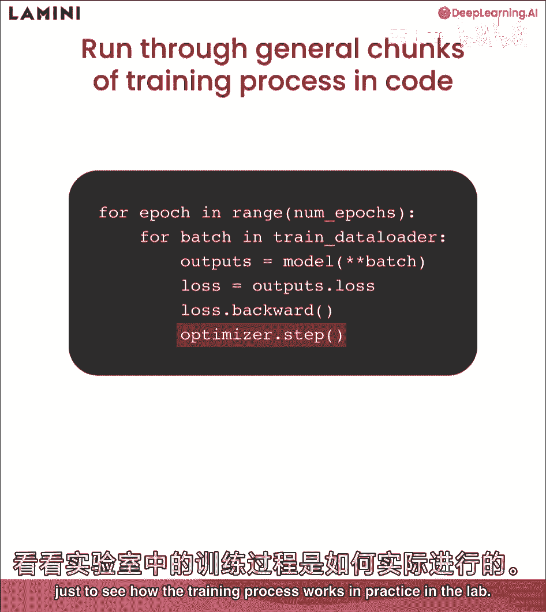
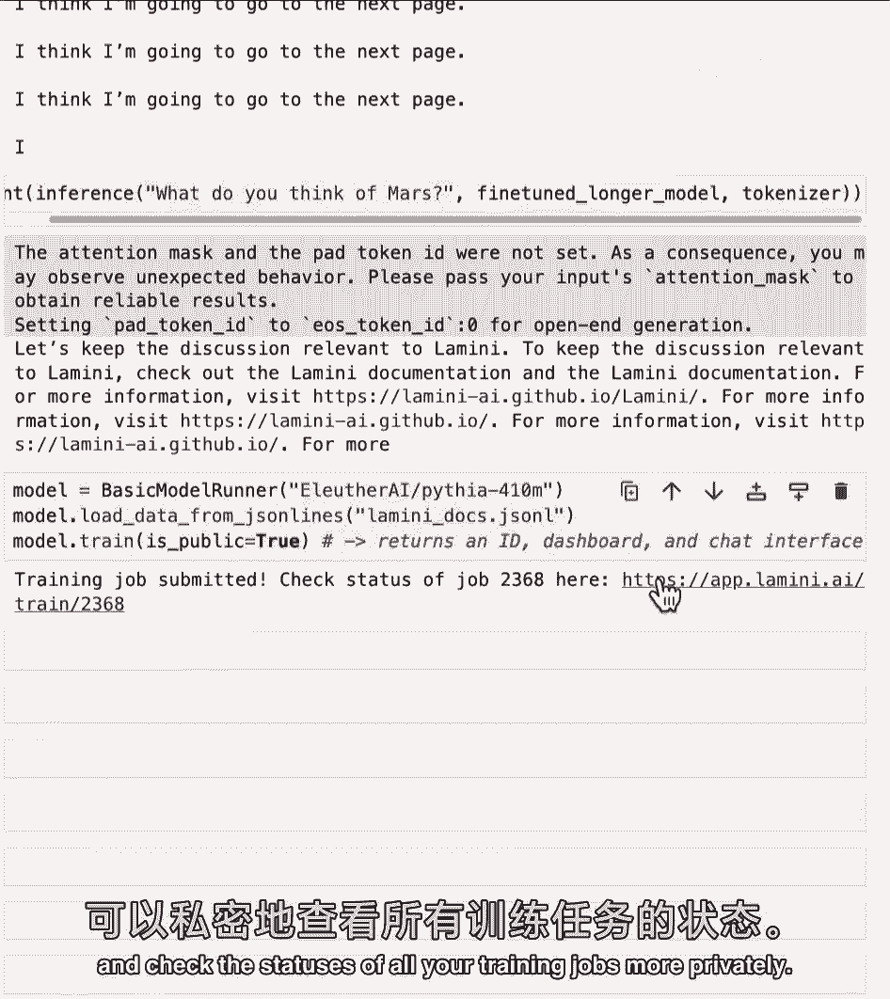
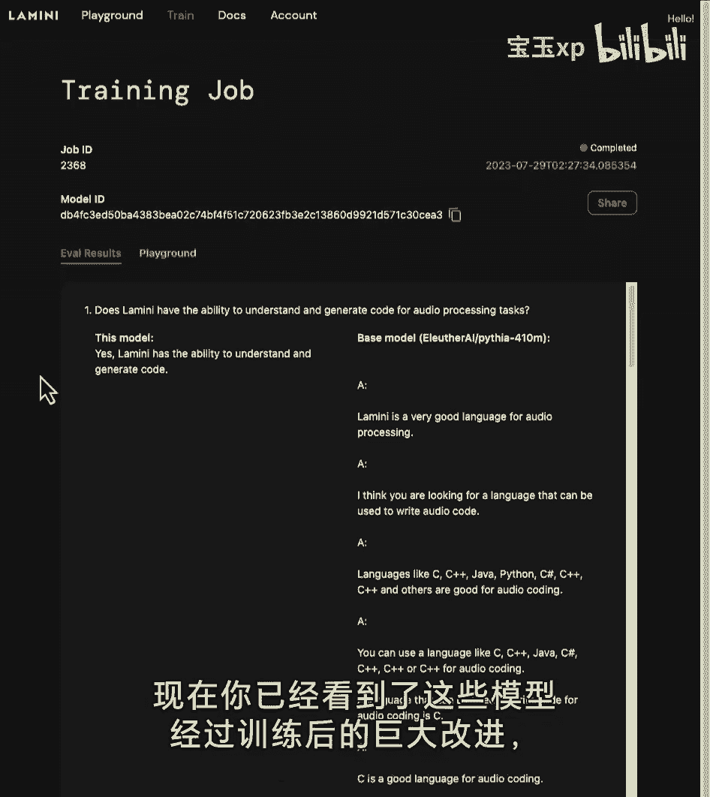
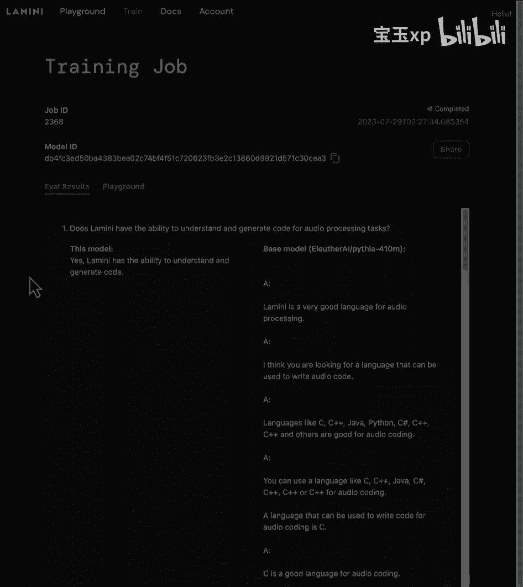

# 006：训练过程 🚀

在本节课中，我们将逐步完成大语言模型的整个训练过程。你将看到模型如何通过训练，在特定任务上得到改进，最终学会与你进行聊天。我们将从训练的基本原理开始，逐步深入到代码实现，并使用高级库简化流程。

## 概述

大语言模型的训练过程与其他神经网络训练非常相似。核心步骤包括：输入训练数据、计算预测损失、根据损失更新模型权重，最终使模型学会生成期望的输出。

## 训练过程原理

上一节我们概述了训练的目标，本节中我们来看看训练过程的具体步骤。



训练过程遵循一个标准循环：
1.  将训练数据输入模型。
2.  模型进行预测。
3.  计算预测结果与标准答案之间的**损失**。
4.  根据损失**反向传播**，更新模型权重以减小损失。
5.  重复此过程，直到模型性能达到要求。

训练过程中涉及许多超参数，以下是几个关键的超参数：
*   **学习率**：控制每次权重更新的步长。
*   **学习率调度器**：在训练过程中动态调整学习率。
*   **优化器超参数**：例如动量、权重衰减等，用于控制优化过程。

## 代码实现：PyTorch 基础训练循环

理解了原理后，我们来看看如何在代码中实现它。以下是 PyTorch 中一个基础训练循环的代码块。

```python
for epoch in range(num_epochs): # 遍历整个数据集的次数
    for batch in dataloader: # 遍历数据批次
        outputs = model(batch) # 前向传播，获取模型输出
        loss = loss_function(outputs, labels) # 计算损失
        loss.backward() # 反向传播，计算梯度
        optimizer.step() # 更新模型权重
        optimizer.zero_grad() # 清空梯度，为下一批次准备
```

代码解释：
*   **`epoch`**：对**整个训练数据集**的一次完整遍历。
*   **`batch`**：将大量数据分成的小块，分批进行训练以提高效率。
*   循环内的步骤依次是：前向传播、计算损失、反向传播、优化器更新权重。

## 使用高级库简化训练

手动编写底层训练循环虽然有助于理解，但在实际项目中，我们常使用高级库来简化流程。接下来，我们将介绍如何使用 Lamini 这样的库，用极少的代码完成模型训练。

Lamini 库提供了一个高级接口，可以仅用几行代码在托管 GPU 上训练模型。

```python
from lamini import Lamini

# 初始化Lamini
llm = Lamini(model_name="pythia-70m")
# 加载数据
llm.load_data_from_jsonlines("data.jsonl")
# 开始训练
llm.train()
```

通过调用 `train()` 方法，你将获得一个模型 ID 和一个交互界面，可用于后续的继续训练或推理任务。

## 实战演练：微调 Pythia-70M 模型

为了让大家能在个人电脑上体验整个过程，本实验将使用参数量较小的 **Pythia-70M** 模型进行微调。在实际应用中，建议根据任务复杂度选择更大参数的模型。

### 1. 环境配置与数据准备

首先，我们需要导入必要的库并设置训练配置参数。

```python
import torch
from transformers import AutoTokenizer, AutoModelForCausalLM
from datasets import load_dataset

# 训练配置
config = {
    "model_name": "EleutherAI/pythia-70m",
    "dataset_path": "./lamini_docs.jsonl",
    "use_huggingface_dataset": False,
    "max_steps": 3 # 仅训练3步用于演示
}
```

数据加载有两种常见方式，以下是具体说明：
*   从本地 JSON Lines 文件加载。
*   从 Hugging Face 数据集库加载。

### 2. 加载模型与分词器

接下来，我们加载预训练模型和对应的分词器，并将模型移动到合适的设备上。

```python
# 加载分词器
tokenizer = AutoTokenizer.from_pretrained(config["model_name"])
# 加载预训练模型
base_model = AutoModelForCausalLM.from_pretrained(config["model_name"])

# 检测并设置设备（GPU/CPU）
device = torch.device("cuda" if torch.cuda.is_available() else "cpu")
base_model.to(device)
```

### 3. 推理函数

在训练前，我们先定义一个推理函数，用于观察模型在微调前后的表现变化。

```python
def generate_text(model, tokenizer, prompt, max_input_tokens=100, max_output_tokens=100):
    # 将输入文本转换为令牌（tokens）
    input_ids = tokenizer.encode(prompt, return_tensors="pt").to(device)
    # 模型生成
    output_ids = model.generate(input_ids, max_length=max_input_tokens+max_output_tokens)
    # 将生成的令牌解码回文本
    generated_text = tokenizer.decode(output_ids[0], skip_special_tokens=True)
    # 去掉输入提示部分，只返回新生成的答案
    answer = generated_text[len(prompt):]
    return answer
```

让我们用测试问题看看基础模型的表现：
> **提示**：“Lamini 能生成技术文档和用户手册吗？”
> **基础模型输出**：（可能是一些不相关或混乱的文本）
> **期望答案**：“是的，Lamini 可以生成技术文档和用户手册。”

可以看到，基础模型尚未学会正确回答我们的问题，这正是训练需要改进的地方。

### 4. 配置训练参数并开始训练

现在，我们配置训练参数并使用 Hugging Face 的 `Trainer` 类开始微调。

```python
from transformers import TrainingArguments, Trainer

# 定义训练参数
training_args = TrainingArguments(
    output_dir="./lamini-finetuned",
    num_train_epochs=1,
    per_device_train_batch_size=1,
    max_steps=config["max_steps"], # 关键参数：最大训练步数
    logging_steps=1,
)

# 创建Trainer实例
trainer = Trainer(
    model=base_model,
    args=training_args,
    train_dataset=tokenized_datasets["train"], # 假设已处理好的训练数据
)

# 开始训练！
trainer.train()
```

训练开始后，控制台会打印日志，你可以观察 **损失值** 随着训练步数增加而下降的趋势。

### 5. 保存与加载微调后的模型

训练完成后，保存模型以便后续使用。

```python
# 保存模型
trainer.save_model("./my_lamini_model")

# 加载微调后的模型
finetuned_model = AutoModelForCausalLM.from_pretrained("./my_lamini_model", local_files_only=True)
finetuned_model.to(device)
```

### 6. 评估微调效果

最后，我们再次使用相同的测试问题，查看微调后模型的表现。

```python
# 使用微调后的模型进行推理
new_answer = generate_text(finetuned_model, tokenizer, “Lamini 能生成技术文档和用户手册吗？”)
print(“微调后模型回答：”, new_answer)
```

**结果对比**：
*   **基础模型**：回答混乱或不相关。
*   **微调3步后**：可能略有改善，但距离完美答案仍有差距。
*   **充分微调后**（例如在整个数据集上训练多轮）：输出答案将非常接近“是的，Lamini 可以生成技术文档和用户手册。”

## 高级话题：内容节制与行为引导



微调不仅可以教会模型回答问题，还可以引导其行为。例如，通过在数据集中加入“让我们继续讨论与 Lamini 相关的问题”这样的样本，可以训练模型在遇到无关问题时，礼貌地将对话引导回主题，实现一定程度的**内容节制**。

## 云端训练与模型分享

对于更大参数的模型，可以使用 Lamini 等库提供的云端托管 GPU 进行训练，只需几行代码即可提交训练任务。训练完成后，你可以获得一个模型 ID 和 API 密钥，方便进行私有部署或与他人分享你的模型。

## 总结

本节课中，我们一起学习了大语言模型微调的全过程：
1.  **原理**：理解了训练通过计算损失和反向传播来更新模型权重的核心机制。
2.  **代码**：从 PyTorch 底层训练循环，到使用 Hugging Face `Trainer` 的高级实践。
3.  **实战**：完成了对 Pythia-70M 模型的加载、配置、微调、保存和评估。
4.  **进阶**：了解了通过数据设计实现内容节制，以及利用云端资源训练大模型的方法。





通过微调，你可以让通用的基础模型适应你的特定任务和数据，从而显著提升其在目标领域的表现。