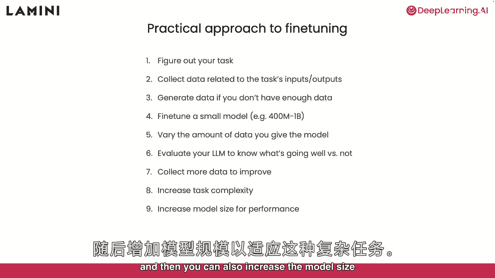
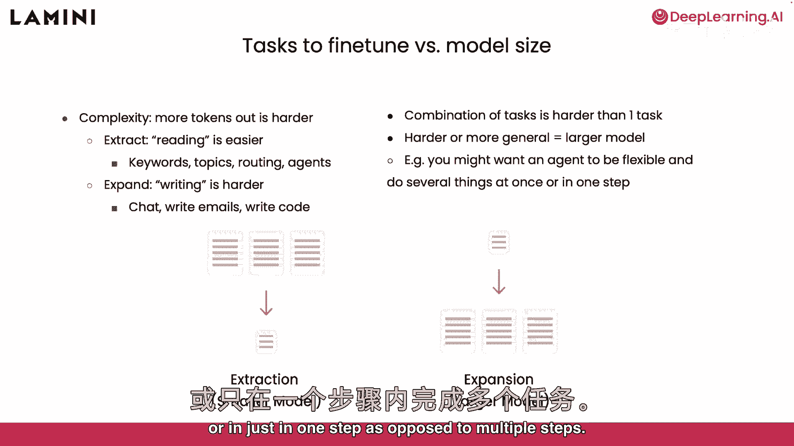
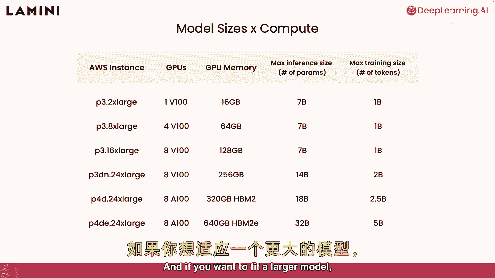
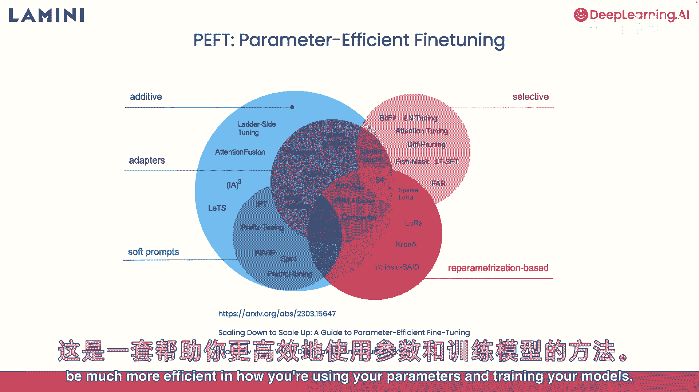
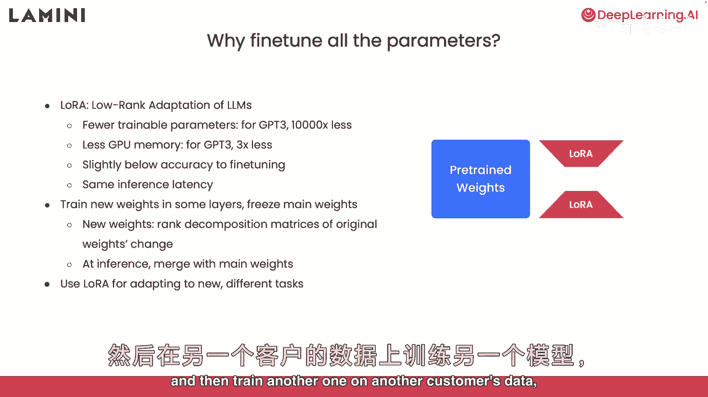

# 008：建议与实用技巧 🧠💡

在本节课中，我们将学习大模型微调的最后一部分内容，涵盖一些实用的步骤、技巧以及对更先进训练方法的初步了解。我们将从基础任务开始，逐步探讨如何应对更复杂的挑战，并介绍提升训练效率的关键技术。

## 微调的实际步骤 📋

上一节我们介绍了微调的基本概念，本节中我们来看看具体执行的步骤。遵循一个清晰的流程可以帮助你更高效地完成微调任务。

以下是进行微调时需要遵循的关键步骤：

1.  **明确你的任务**：首先需要清晰地定义你希望模型完成的具体任务。
2.  **收集与任务相关的数据**：准备包含输入和输出的数据对，并将其构造成模型可接受的格式。
3.  **处理数据不足的情况**：如果数据量不够，可以通过生成数据或使用提示模板来创建更多训练样本。
4.  **从小模型开始微调**：建议先从一个参数在4亿到10亿之间的小模型开始，以初步了解模型性能。
5.  **调整数据量进行实验**：通过改变用于训练的数据量，来观察数据如何影响模型的学习效果。
6.  **评估模型性能**：对微调后的模型进行评估，分析其成功与不足之处。
7.  **迭代优化**：根据评估结果收集更多数据，以改进模型。
8.  **提升任务复杂度**：在基础任务表现良好后，可以尝试让任务变得更复杂。
9.  **增大模型规模**：对于更复杂的任务，可以考虑使用参数更多的大模型来提升性能。

## 理解任务复杂度与模型规模的关系 ⚖️

在了解了基本步骤后，我们需要理解任务本身的性质如何影响我们的策略。你学到了阅读任务和写作任务的区别，其中写作任务（如聊天、写邮件、编写代码）通常更具挑战性。

这是因为写作任务需要模型生成更多的令牌（tokens），对模型能力的要求更高。因此，处理更困难的任务往往需要更大的模型。另一种应对复杂任务的方法是将多个子任务组合起来，要求模型同时或按顺序处理多个步骤，而不是执行单一指令。

## 计算资源与硬件需求 💻

确定了任务和模型规模后，接下来需要考虑实际的硬件和计算资源。这直接关系到实验能否顺利进行。

基本上，你需要根据实验室条件选择能运行模型的硬件。例如，在CPU上运行7000万参数的模型效果通常不理想，建议从性能更好的配置开始。

以下是一些常见的GPU配置及其能力参考：

*   **NVIDIA V100 (16GB内存)**：可用于对70亿参数模型进行推理，但用于训练时，由于需要存储梯度和优化器状态，通常只能训练约10亿参数的模型。
*   **其他更强大的GPU选项**：如果你的任务需要更大的模型，可以考虑内存更大的GPU，例如A100等。

## 参数高效微调技术预览 🚀

如果你发现现有硬件不足以训练理想的大模型，有一种称为**参数高效微调**的技术可以帮到你。这套方法能让你在训练模型时更有效地利用参数和计算资源。

其中，我最喜欢的技术是 **LoRA**。

**LoRA** 代表 **低秩适应**。它的核心作用是大幅减少需要训练的参数数量。

例如，在对GPT-3这样的大模型进行微调时，研究发现可训练参数量能减少 **一万倍**，这使得GPU内存需求降低了 **3倍**。虽然微调精度可能略低于全参数微调，但它是一种到达目标的更高效途径，并且在推理时不会增加延迟。

那么LoRA具体是如何工作的呢？

在数学上，LoRA不对原始预训练权重（图中蓝色部分）进行更新，而是冻结它们。它训练一组新的、低秩的权重矩阵（图中橙色部分），这些矩阵是原始权重矩阵的秩分解近似。

**关键点在于**：这些新的权重可以独立于预训练权重进行训练，但在推理时，能够将它们合并回主预训练权重中，从而得到一个高效的微调模型。

使用LoRA最让我兴奋的一点是它的**任务适应性**。这意味着你可以用客户A的数据训练一个LoRA适配器，然后用客户B的数据训练另一个不同的适配器，而基础模型保持不变，实现了灵活的多任务适配。

---

**本节课总结**

在本节课中，我们一起学习了微调大模型的完整实用流程：从定义任务、准备数据、从小规模实验开始，到评估与迭代。我们探讨了任务复杂度与所需模型规模的关系，以及对应的硬件考量。最后，我们预览了**参数高效微调**技术，特别是**LoRA**的原理与优势，它通过大幅减少可训练参数量，让我们能在有限资源下高效地微调大模型。