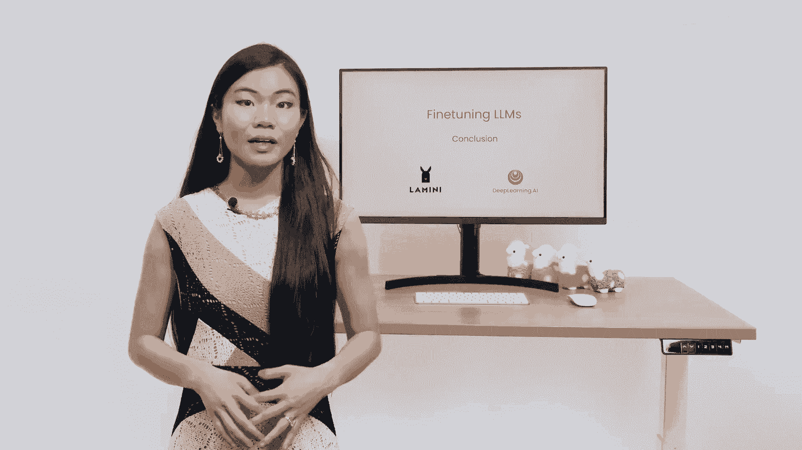
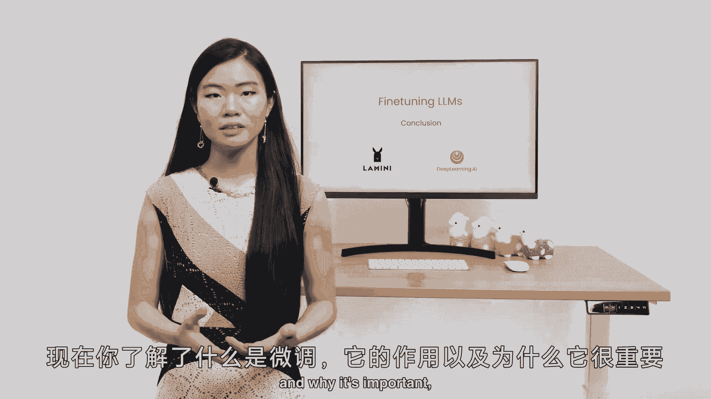
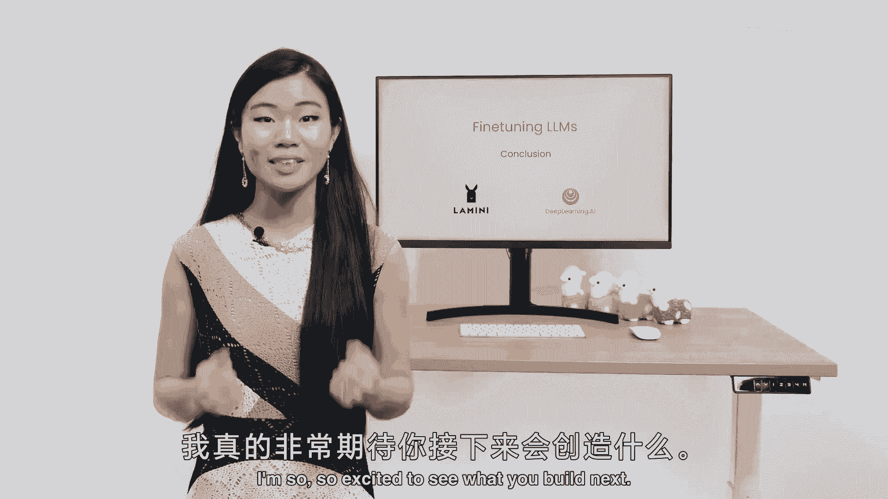

# 009：总结 🎯

在本节课中，我们将一起回顾整个大模型微调的学习历程，总结核心概念、关键步骤以及微调技术在整个机器学习工作流中的位置。

---

上一节我们介绍了模型评估与部署，本节中我们来对整个微调课程进行总结。

现在你明白什么是微调了，它适合的应用场景，以及为什么它很重要。

现在微调已成为你工具箱中的一个实用工具。你已经经历了从数据准备，到模型训练，再到评估模型的所有不同步骤。

---

## 课程核心回顾

以下是本课程涵盖的核心内容要点：

*   **微调的定义**：在预训练好的大语言模型基础上，使用特定领域的数据进行额外训练，使其适应新任务的过程。核心公式可表示为：`微调后模型 = 预训练模型 + Δ(特定任务数据)`。
*   **微调的价值**：相比于从头训练或仅使用提示词，微调能以更低的计算成本和数据需求，获得在特定任务上性能更优、行为更可控的模型。
*   **完整工作流程**：你已学习并实践了微调的标准化流程，主要包括：
    1.  **数据准备**：收集、清洗、格式化特定任务数据。
    2.  **模型训练**：选择合适的微调方法（如全参数微调、LoRA等），配置超参数，启动训练。
    3.  **模型评估**：使用验证集和测试集评估模型性能，确保其达到预期目标。
    4.  **模型部署**：将训练好的模型集成到应用中进行推理。

---

## 总结

本节课中我们一起学习了微调技术的全貌。你不仅理解了微调的基本概念和重要性，还掌握了从数据到可部署模型的完整实践路径。微调是连接通用大模型与具体业务需求的关键桥梁，希望你能够将这门课程中学到的知识，有效地应用到实际项目中去。