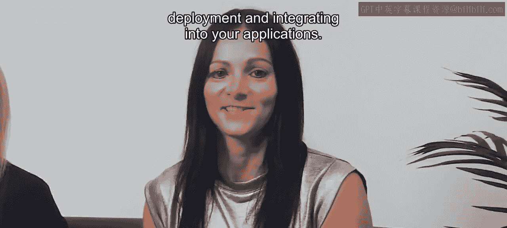
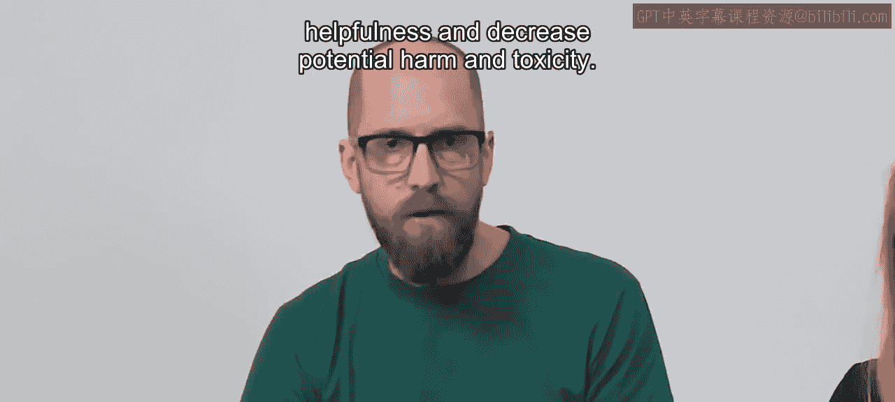
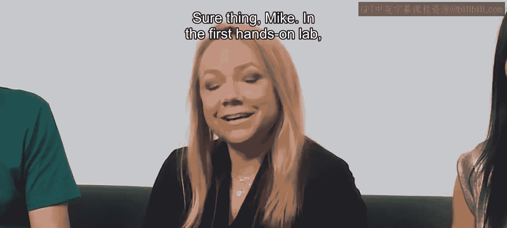
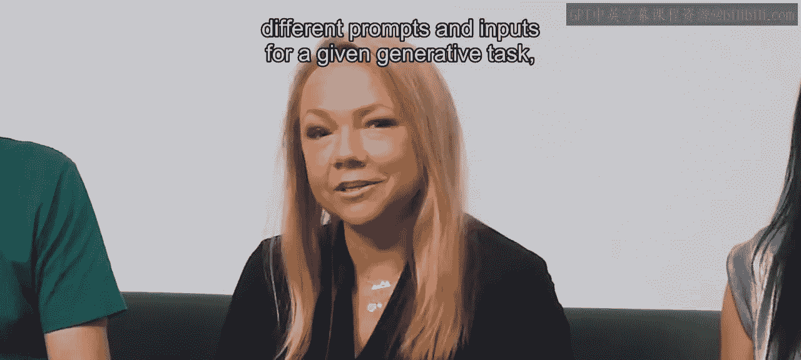
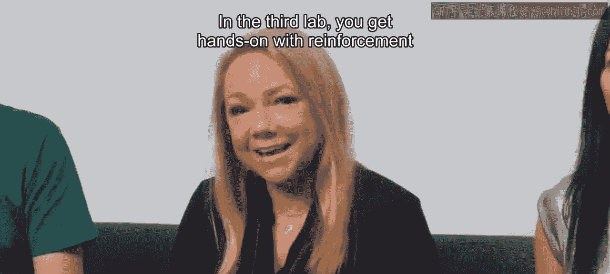

# 001：0_课程介绍

在本课程中，我们将深入学习如何使用大型语言模型构建生成式人工智能应用。我们将探讨其技术原理、项目生命周期以及实际应用方法。

大型语言模型是一项非常令人兴奋的技术。尽管备受关注，但其作为开发者工具的潜力仍被许多人低估。具体而言，过去需要数月才能构建的许多机器学习和人工智能应用，现在可以在数天或数周内完成。本课程将深入探讨LLM技术的工作原理，涵盖模型训练、指令微调、精调等许多技术细节，并介绍生成式AI项目生命周期框架，以帮助您规划和执行项目。

生成式AI，特别是大型语言模型，是一项通用技术。这意味着，与深度学习和电力等其他通用技术类似，它不仅适用于单一应用，而且适用于经济体中许多不同领域的众多应用。因此，类似于大约15年前开始的深度学习浪潮，未来多年我们面前有许多重要工作需要完成，需要包括您在内的许多人来识别用例并构建具体应用。

由于这项技术非常新颖，真正知道如何使用它的人很少，许多公司目前也正急于寻找和聘用真正懂得如何使用LLM构建应用的人才。如果您希望更好地定位自己以获得这些职位，我希望本课程也能为您提供帮助。

我很高兴能与来自AWS团队的优秀讲师们共同为您带来这门课程，包括今天在场的Antje Baf、Mike Chambers、Shelby Eenbroke，以及将在实验环节授课的第四位讲师Chris Frankly。Antje和Mike都是生成式AI开发者布道师，Shelby和Chris都是生成式AI解决方案架构师。他们都有丰富的经验，帮助许多不同公司使用LLM构建了许多富有创意的应用。我期待他们所有人在这门课程中分享这些丰富的实践经验。他们与亚马逊AWS、Hugging Face以及全球许多顶尖大学的众多行业专家和应用科学家合作，共同开发了本课程的内容。

Antje，或许您可以再介绍一下这门课程？

当然，谢谢Andrew。很高兴能再次与您在这个令人兴奋的生成式AI领域合作。通过这门关于大型语言模型的生成式AI课程，我们创建了一系列课程，面向希望学习LLM工作原理技术基础，以及其训练、微调和部署最佳实践的AI爱好者、工程师或数据科学家。

在预备知识方面，我们假设您已经熟悉Python编程，并至少具备基础的数据科学和机器学习概念。如果您有一些PyTorch或TensorFlow的经验，那就足够了。

在本课程中，您将详细探索构成典型生成式AI项目生命周期的各个步骤，从界定问题、选择语言模型，到为部署优化模型并将其集成到您的应用程序中。本课程不仅浅显地涵盖所有主题，还会花时间确保您对这些技术有深入的技术理解，并为您在构建自己的生成式AI项目时真正知道自己在做什么做好充分准备。

Mike，您能更详细地介绍一下学习者每周会看到什么内容吗？

当然，Antje，谢谢。在第一周，您将研究为大型语言模型提供动力的Transformer架构，探索这些模型是如何训练的，并理解开发这些强大LLM所需的计算资源。您还将学习一种称为**上下文学习**的技术，了解如何通过**提示工程**在推理时引导模型输出，以及如何调整LLM最重要的生成参数来优化模型输出。

在第二周，您将探索通过一个称为**指令精调**的过程，使预训练模型适应特定任务和数据的选项。

在第三周，您将了解如何使语言模型的输出与人类价值观保持一致，以增加帮助性并减少潜在的危害和毒性。

但我们不止于理论。每周都包含一个动手实验，您将能够在AWS环境中亲自尝试这些技术，该环境包含处理大型模型所需的所有资源，且对您免费。

Shelby，您能再介绍一下动手实验吗？

在第一个动手实验中，您将针对给定的生成任务（本例中是对话摘要）构建并比较不同的提示和输入。您还将探索不同的推理参数和采样策略，以获得如何进一步改进生成模型响应的直观理解。

在第二个动手实验中，您将对来自流行的开源模型中心Hugging Face的现有大型语言模型进行精调。您将尝试**完全精调**和**参数高效精调**，并了解PEFT如何让您的工作流程更加高效。

在第三个实验中，您将动手实践**基于人类反馈的强化学习**。您将构建一个奖励模型分类器，将模型响应标记为有毒或无毒。如果您现在还不理解所有这些术语和概念，请不要担心，您将在本课程中更详细地深入探讨每一个主题。

我很高兴能与Antje、Mike、Shelby以及Chris一起，为您呈现这门深入探讨LLM技术的课程。您完成本课程后，将实践许多不同的具体代码示例，了解如何构建或使用LLM。我相信，许多代码片段将直接对您自己的工作有用。希望您享受这门课程，并运用所学知识构建一些真正令人兴奋的应用。

那么，让我们进入下一个视频，开始深入探讨如何使用LLM构建应用程序。