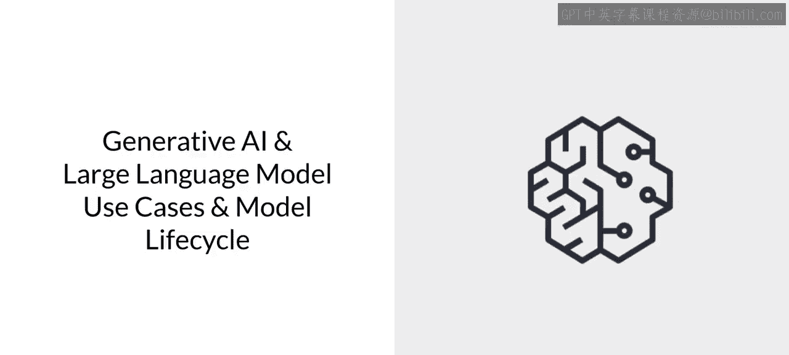
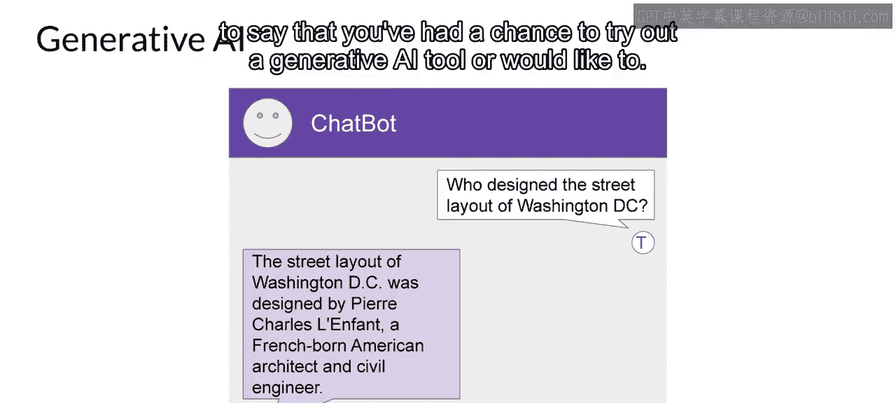
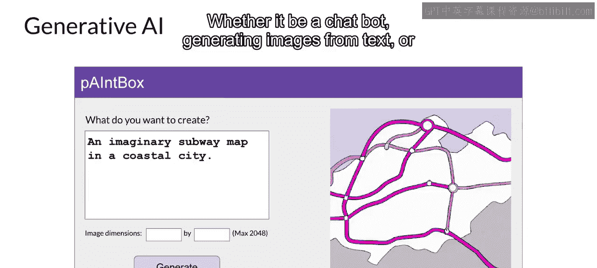
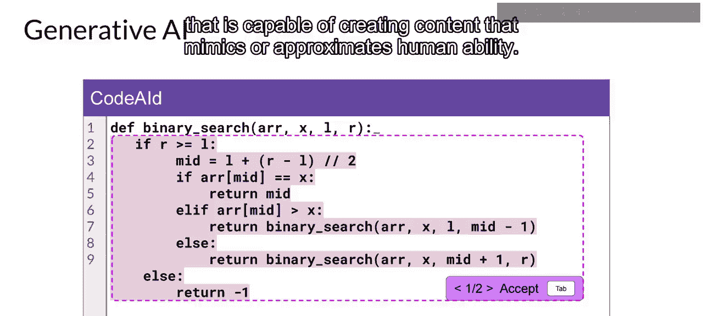
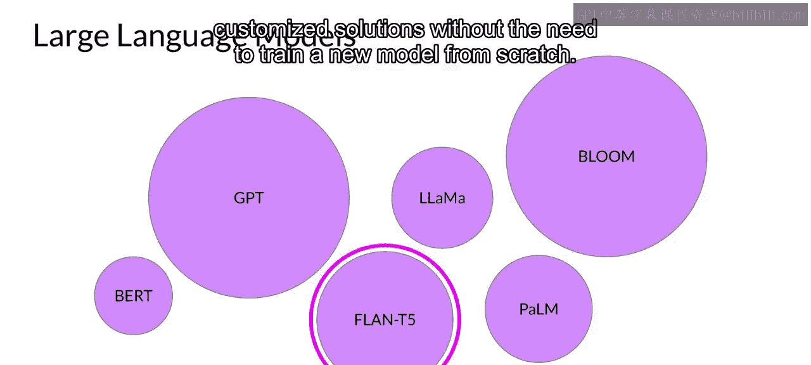
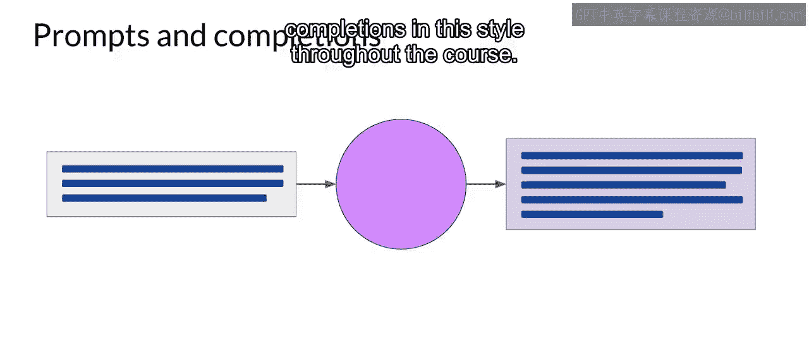

# 003：2_生成式AI与大语言模型

## 概述

在本节课中，我们将要学习大型语言模型的基础知识。我们将探讨其应用场景、工作原理、提示工程技巧、如何生成创意文本，并概述生成式AI项目的生命周期。

## 什么是生成式AI？

鉴于您对本课程的兴趣，您很可能已经尝试过生成式AI工具，或者有此意愿。无论是聊天机器人、根据文本生成图像的工具，还是帮助您开发代码的插件，您在这些工具中看到的是一种能够创建模仿或接近人类能力内容的机器。

生成式AI是传统机器学习的一个子集。支撑生成式AI的机器学习模型，通过在海量由人类生成的数据集中寻找统计模式，从而习得这些能力。

大型语言模型经过数周乃至数月的时间，在大量计算资源的支持下，在数万亿单词上进行了训练。这些我们称之为基础模型的模型，拥有数十亿参数，展现出超越单纯语言处理的新兴能力，研究人员正在解锁它们分解复杂任务、进行推理和解决问题的能力。

以下是部分基础模型（有时称为基座模型）及其相对参数规模的集合。您将在后续课程中更详细地了解这些参数。目前，您可以将参数视为模型的“记忆”。模型参数越多，其“记忆”就越丰富，事实证明，它能执行的任务也越复杂。

在本课程中，我们将用紫色圆圈代表大型语言模型。在实验环节，您将使用一个特定的开源模型 **FLAN-T5** 来执行语言任务。您可以直接使用这些模型，也可以通过应用微调技术使其适应您的特定用例。这样，您无需从头开始训练新模型，就能快速构建定制化解决方案。

虽然生成式AI模型正被开发用于多种模态（包括图像、视频、音频和语音），但在本课程中，您将专注于大型语言模型及其在自然语言生成中的应用。您将了解它们的构建和训练方式、如何通过文本（称为提示）与它们交互、如何针对您的用例和数据对模型进行微调，以及如何将它们部署到应用程序中以解决您的业务和社会任务。

## 与大型语言模型的交互方式

与语言模型的交互方式与其他机器学习和编程范式有很大不同。在其他情况下，您需要编写具有正式语法的计算机代码来与库和API交互。相比之下，大型语言模型能够接收自然语言或人类编写的指令，并像人类一样执行任务。

您传递给大型语言模型的文本被称为 **提示**。提示可用的内存称为 **上下文窗口**。这个窗口通常足够容纳几千个单词，但具体大小因模型而异。

## 提示与补全示例

在这个例子中，您要求模型确定木卫三在太阳系中的位置。提示被传递给模型，模型随后预测接下来的单词。因为您的提示包含一个问题，所以模型生成了一个答案。模型的输出被称为 **补全**。使用模型生成文本的行为被称为 **推理**。

补全由原始提示中包含的文本和生成的文本共同组成。您可以看到，这个模型很好地回答了您的问题。它正确地识别出木卫三是木星的一颗卫星，并为您的疑问生成了一个合理的答案，指出这颗卫星位于木星的轨道内。

在本课程中，您将看到许多这种风格的提示和补全示例。

## 总结

本节课中，我们一起学习了生成式AI与大型语言模型的基础概念。我们了解了生成式AI如何作为机器学习的一个子集，通过在海量数据中学习模式来模仿人类创造力。我们认识了基础模型及其参数规模的意义，并明确了本课程将专注于大型语言模型在自然语言生成中的应用。我们还学习了与LLM交互的核心方式——通过提示和上下文窗口，并理解了推理过程如何产生补全。这些基础知识为我们后续深入探讨提示工程、模型微调和项目生命周期奠定了坚实的基础。