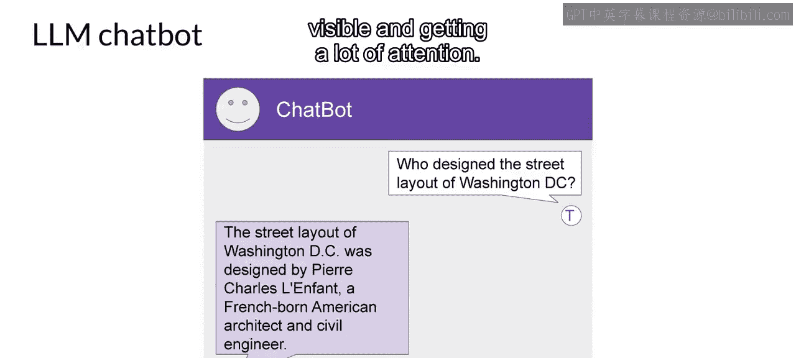
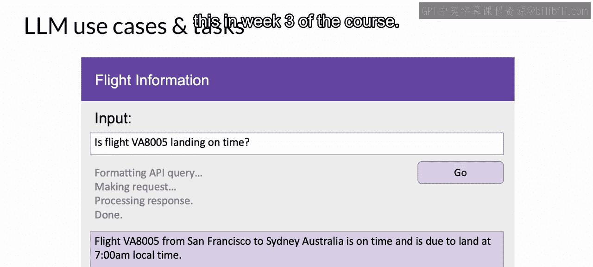
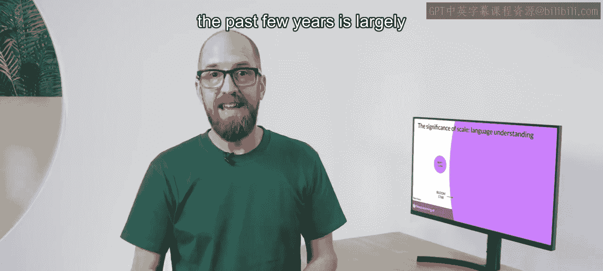

# 004：3_大语言模型的应用场景和任务

在本节课中，我们将要学习大型语言模型（LLMs）和生成式人工智能（Generative AI）的多种应用场景和任务。许多人可能认为LLMs主要专注于聊天任务，因为聊天机器人非常引人注目且备受关注。然而，基于“下一个词预测”这一核心概念，LLMs的能力远不止于此。我们将探讨从文本生成到代码翻译，再到信息检索等一系列任务，并了解模型规模如何影响其能力。

## 文本生成任务 🖋️

上一节我们提到了“下一个词预测”是LLMs的基础。本节中我们来看看这一概念如何应用于多种文本生成任务。

以下是基于提示词（prompt）进行文本生成的一些具体应用：

*   **基础聊天机器人**：这是最直接的应用，模型根据对话历史生成连贯的回复。
*   **文章撰写**：你可以提供一个主题或开头句作为提示，让模型续写一篇文章或论述。
*   **对话摘要**：你可以将一段对话作为提示的一部分输入给模型，模型会利用其对自然语言的理解来生成摘要。

## 翻译任务 🌐

除了生成文本，LLMs在翻译领域也表现出强大的能力。

以下是LLMs可以执行的翻译任务类型：

*   **传统语言翻译**：例如，在法语与德语、英语与西班牙语等不同语言之间进行互译。
*   **自然语言到机器代码的翻译**：你可以用自然语言描述一个编程任务，模型会生成相应的代码。例如，提示词可以是：“写一段Python代码，用于返回数据框中每一列的平均值。” 模型生成的代码可以直接传递给解释器执行。

## 信息提取与分类任务 🔍

LLMs同样可以用于执行更具体、更聚焦的任务，例如从文本中提取特定信息。

一个典型的应用是**命名实体识别**，这是一种词语分类任务。例如，你可以要求模型从一篇新闻文章中识别出所有提到的人物和地点。模型凭借其参数中编码的知识理解，能够正确执行此任务并将请求的信息返回给你。

## 增强与扩展能力 🚀

LLMs一个活跃的发展领域是通过连接外部数据源或调用外部API来增强其能力。

这种能力使模型能够获取其预训练阶段未知的信息，并实现与现实世界的交互。在本课程的第三周，你将深入学习如何实现这一点。

## 模型规模与能力 📈

开发者们发现，随着基础模型的参数规模从数亿增长到数十亿甚至数千亿，模型对语言的主观理解能力也随之显著提升。

这种存储在模型参数中的语言理解能力，正是模型处理、推理并最终解决你所给任务的基础。

但同时，较小的模型也可以通过**微调**在特定的、聚焦的任务上表现出色。在本课程的第二周，你将了解更多关于微调的方法。

过去几年LLMs能力的快速提升，很大程度上归功于其背后的架构。让我们进入下一个视频来更仔细地探讨这一点。

---

**本节课总结**：本节课我们一起学习了大型语言模型广泛的应用场景。我们了解到，基于“下一个词预测”，LLMs不仅能驱动聊天机器人，还能完成文章撰写、摘要、多种翻译（包括生成代码）、信息提取（如命名实体识别）等任务。此外，通过连接外部数据或API可以进一步增强模型。模型的参数规模与其语言理解能力密切相关，而较小的模型也可以通过微调在特定任务上取得优异表现。这些能力的核心都源于其强大的模型架构。