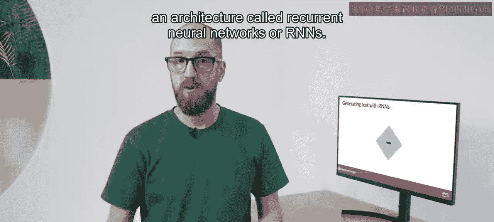
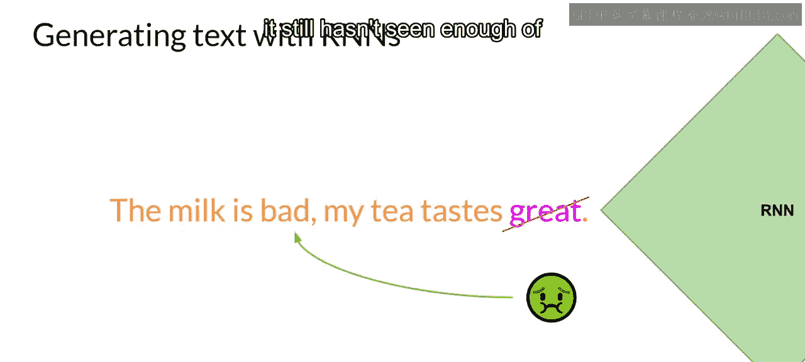
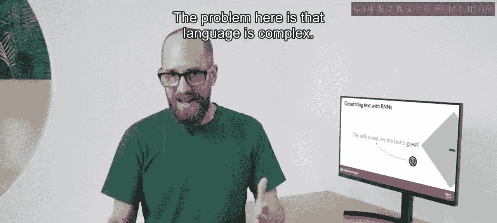
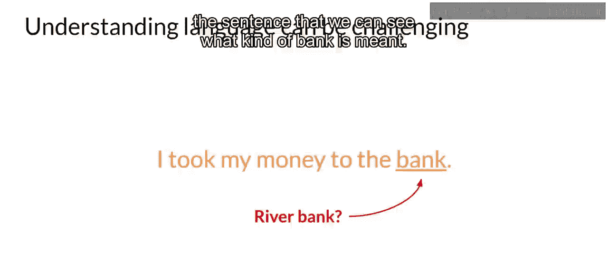
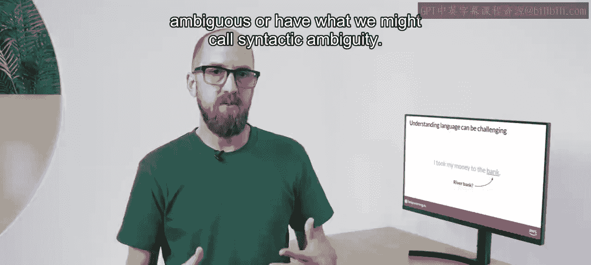
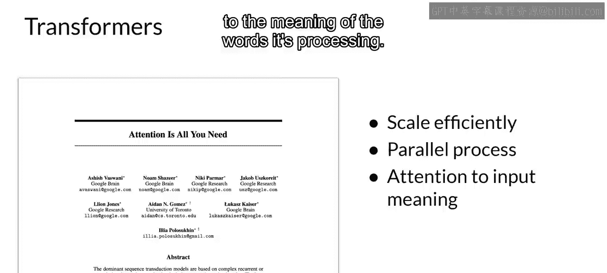

# 005：Transformer之前的文本生成

在本节课中，我们将要学习Transformer架构出现之前的文本生成技术。我们将回顾循环神经网络（RNN）的工作原理及其局限性，并探讨语言本身的复杂性如何为早期模型带来挑战。最后，我们将看到Transformer架构的诞生如何解决了这些问题，为现代生成式AI的突破奠定了基础。

---

生成算法并非新事物。

在Transformer出现之前，历代语言模型使用一种称为循环神经网络（RNN）的架构。

RNN在其时代虽然强大，但受限于执行生成任务所需的计算量和内存。

让我们看一个RNN执行简单“下一个词预测”生成任务的例子。

当模型只看到前一个词时，预测效果不可能很好。为了能让RNN看到文本中更多的上文，你必须显著扩展模型使用的资源。然而，即使扩展了模型，预测仍然可能失败，因为它仍然没有看到足够的输入来做出好的预测。

为了成功预测下一个词，模型需要看到的不仅仅是前几个词。模型需要理解整个句子，甚至整个文档。

这里的问题在于语言是复杂的。在许多语言中，一个词可以有多种含义，这些词被称为同形异义词。

在这个例子中，只有通过句子的上下文，我们才能明白“bank”指的是哪种含义。

句子结构中的词语可能具有歧义，或者存在我们所说的句法歧义。

以这个句子为例：“The teacher taught the student with the book.”（老师用书教学生。/ 老师教了那个有书的学生。）老师是用书来教，还是学生有书，或者两者都是？如果有时连我们自己都无法理解，算法又如何能理解人类语言呢？

然而在2017年，随着谷歌和多伦多大学发表的论文《Attention Is All You Need》的发布，一切都改变了，Transformer架构诞生了。

这种新颖的方法解锁了我们今天所见的生成式AI的进展。它可以高效地扩展以利用多核GPU，能够并行处理输入数据，从而利用更大的训练数据集。最关键的是，它能够学会关注其正在处理的词语的含义。

而“注意力就是你所需要的一切”，这正是论文的标题。

---

本节课中我们一起学习了Transformer架构出现前的文本生成技术。我们探讨了循环神经网络（RNN）在生成任务中的工作原理及其在计算资源和理解上下文方面的局限性。我们还分析了语言本身的复杂性，如同形异义词和句法歧义，给早期模型带来的挑战。最后，我们了解到2017年Transformer架构的提出，通过其高效的并行处理能力和注意力机制，为克服这些限制、推动生成式AI的飞速发展奠定了基础。