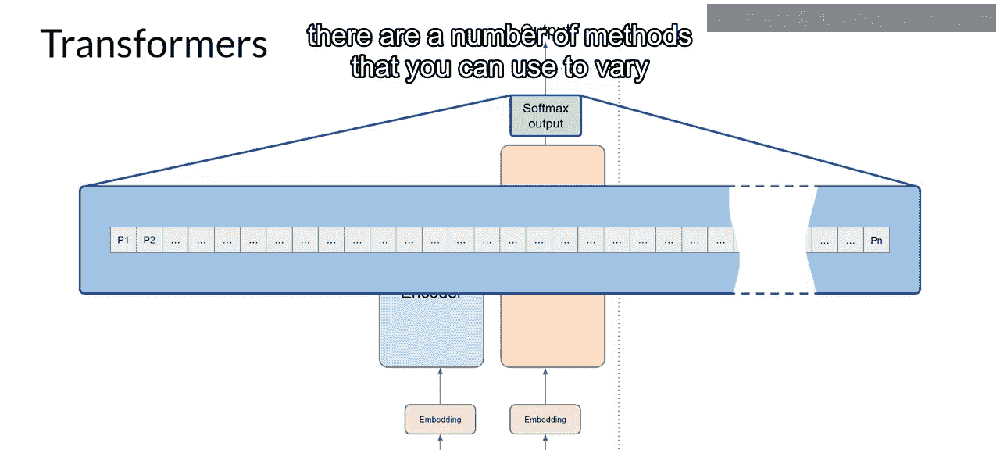
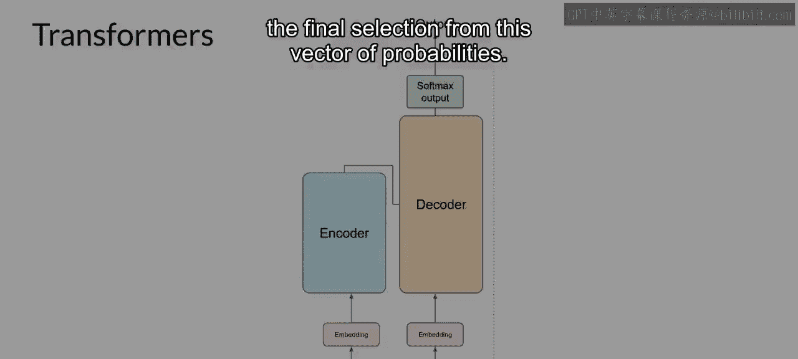

# 006：Transformer架构

在本节课中，我们将要学习Transformer架构，这是构建现代大型语言模型（LLM）的核心。我们将了解它如何通过自注意力机制显著提升自然语言处理任务的性能，并详细拆解其编码器和解码器的工作流程。

## 概述

使用Transformer架构构建大型语言模型，相比早期的循环神经网络（RNN），极大地提升了自然语言任务的性能，并引发了生成能力的爆炸式增长。

Transformer架构的强大之处在于其能够学习句子中所有单词的相关性和上下文联系。

## 自注意力机制

上一节我们提到了Transformer的核心优势，本节中我们来看看这种能力的具体实现：自注意力机制。

该架构不仅关注相邻的单词，更能关注句子中的每一个其他单词。它通过为这些关系应用注意力权重，使得模型能够学习每个单词与其他所有单词之间的相关性，无论它们在输入中的位置如何。这赋予了算法理解“谁拥有书”、“谁可能拥有书”以及这是否与文档更广泛的上下文相关的能力。

这些注意力权重是在LLM训练过程中学习得到的。下图被称为注意力图，在这个示意性示例中，它有助于说明每个单词与所有其他单词之间的注意力权重。可以看到，“书”这个词与“老师”和“学生”有很强的关联（即给予了高度关注）。这就是所谓的**自注意力**。以这种方式在整个输入中学习注意力的能力，显著提升了模型编码语言的能力。

## Transformer架构总览

既然我们已经了解了Transformer架构的一个关键属性——自注意力，现在让我们从高层次上看看模型是如何工作的。

以下是Transformer架构的简化图示，以便我们能从高层次关注这些过程发生的位置。Transformer架构分为两个不同的部分：**编码器**和**解码器**。这两个组件协同工作，并且有许多相似之处。另外请注意，您看到的图示源自原始的《Attention Is All You Need》论文。请注意模型的输入在底部，输出在顶部。在课程中，我们将尽可能保持这种表示方式。

## 文本的数值化表示：分词与嵌入

机器学习模型本质上是大型的统计计算器，它们处理的是数字，而非单词。因此，在将文本传递给模型处理之前，必须首先对单词进行**分词**。简而言之，这会将单词转换为数字，每个数字代表模型可以处理的所有可能单词词典中的一个位置。

以下是可选的分词方法：
*   分词ID可以对应完整的单词。
*   分词ID也可以代表单词的一部分。

重要的是，一旦选择了用于训练模型的分词器，在生成文本时也必须使用相同的分词器。

当输入被表示为数字后，就可以将其传递到**嵌入层**。该层是一个可训练的向量嵌入空间，一个高维空间，其中每个分词被表示为一个向量，并占据该空间内的一个独特位置。词汇表中的每个分词ID都被映射到一个多维向量，其直观理解是这些向量能够学习编码输入序列中各个分词的语义和上下文。

向量嵌入空间在自然语言处理中已使用了一段时间。上一代语言算法如Word2Vec就使用了这一概念。如果您不熟悉这个，请不要担心，您将在整个课程中看到相关示例，并且本周的阅读练习中提供了一些额外资源的链接。

回顾示例序列，在这个简单案例中，每个单词都匹配到一个分词ID，并且每个分词都被映射到一个向量。在原始Transformer论文中，向量大小实际上是512，远比本图能容纳的大。为了简化，假设向量大小仅为3，您可以将单词绘制到一个三维空间中，并观察这些单词之间的关系。现在您可以看到如何关联嵌入空间中位置相近的单词，以及如何计算单词之间的距离（作为一个角度），这赋予了模型从数学上理解语言的能力。

## 位置编码与自注意力层

当您将分词向量输入到编码器或解码器的基础部分时，还需要添加**位置编码**。模型并行处理每个输入分词，因此通过添加位置编码，可以保留关于单词顺序的信息，而不会丢失单词在句子中位置的相关性。

在将输入分词和位置编码相加之后，将得到的向量传递到**自注意力层**。在这里，模型分析输入序列中分词之间的关系。正如前面所看到的，这使得模型能够关注输入序列的不同部分，以更好地捕捉单词之间的上下文依赖关系。

在训练期间学习并存储在这些层中的自注意力权重，反映了该输入序列中每个单词对所有其他单词的重要性。

但这并非只发生一次。Transformer架构实际上具有**多头自注意力**。这意味着多组自注意力权重（或称“头”）被并行学习，且彼此独立。注意力层中包含的注意力头数量因模型而异，但通常在12到100个之间。

其直观理解是，每个自注意力头将学习语言的不同方面。例如，一个头可能关注句子中人物实体之间的关系，而另一个头可能聚焦于句子的活动，还有一个头可能关注其他属性，比如单词是否押韵。

重要的是要注意，您无需事先规定注意力头将学习语言的哪些方面。每个头的权重是随机初始化的，在给予足够的训练数据和时间后，每个头会学习到语言的不同方面。虽然一些注意力图（如这里讨论的例子）很容易解释，但其他的可能并非如此。

## 前馈网络与输出

在将所有注意力权重应用于输入数据后，输出会通过一个**全连接前馈网络**进行处理。该层的输出是一个逻辑值向量，与分词化词典中每个分词的概率得分成比例。

然后，您可以将这些逻辑值传递到最终的**Softmax层**，在那里它们被归一化为每个单词的概率得分。这个输出包含了词汇表中每个单词的概率，因此这里可能有成千上万个得分。

其中一个单一的分词将拥有比其他分词更高的得分。这就是最可能的预测分词。但正如您将在课程后面看到的，有多种方法可以用来从这个概率向量中进行最终选择，以产生变化。

## 总结

本节课中，我们一起学习了Transformer架构的核心组件和工作原理。我们从其核心优势——自注意力机制开始，了解了它如何全局理解文本。接着，我们拆解了架构的编码器-解码器整体流程，并详细探讨了文本如何通过分词和嵌入转换为模型可处理的数值表示。我们还学习了位置编码的重要性，以及多头自注意力如何并行学习语言的多个方面。最后，我们看到了信息如何通过前馈网络处理，并输出为下一个词的概率分布。理解这些基础概念，是掌握现代大型语言模型如何工作的关键一步。