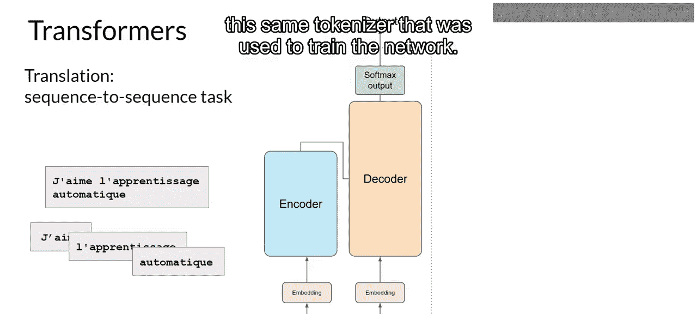
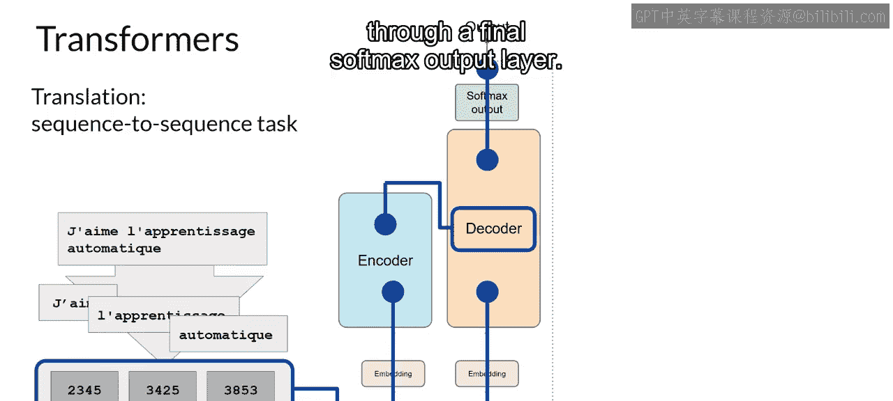
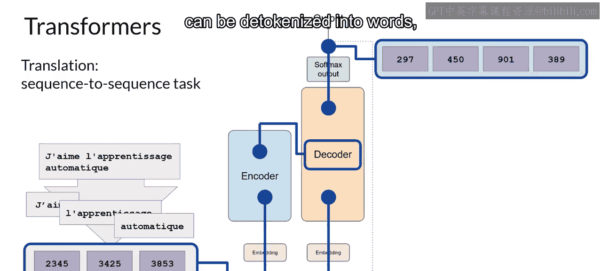
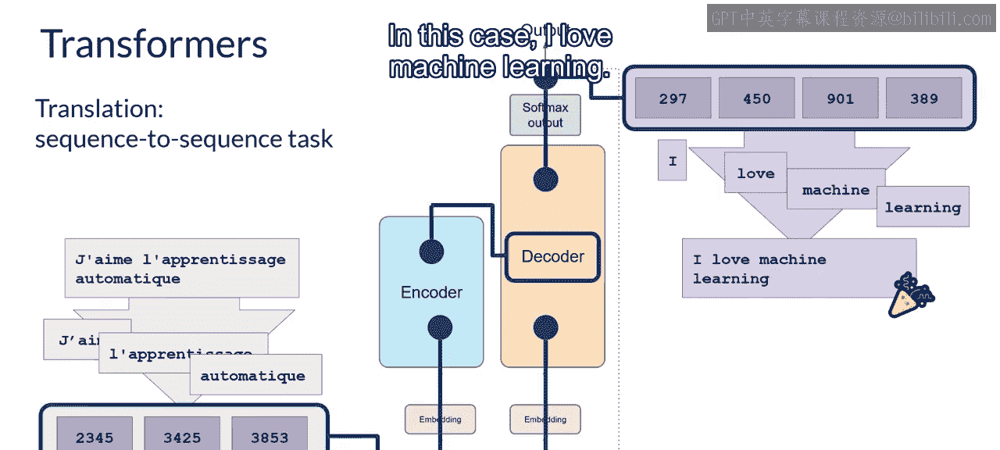
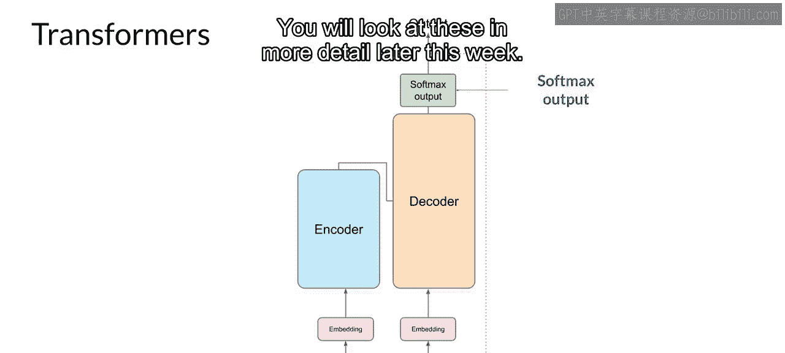
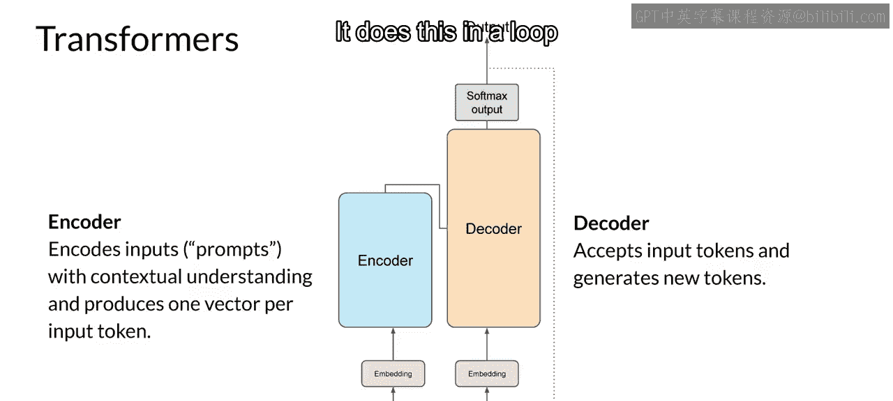
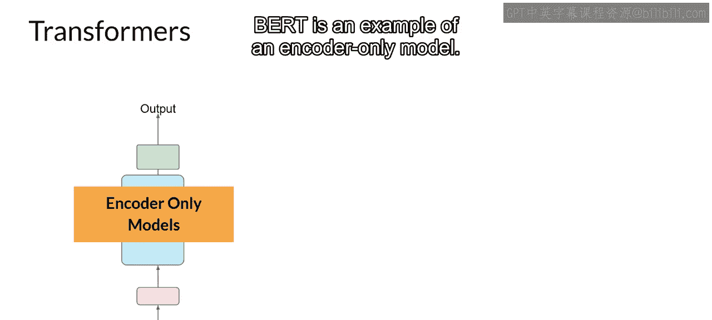
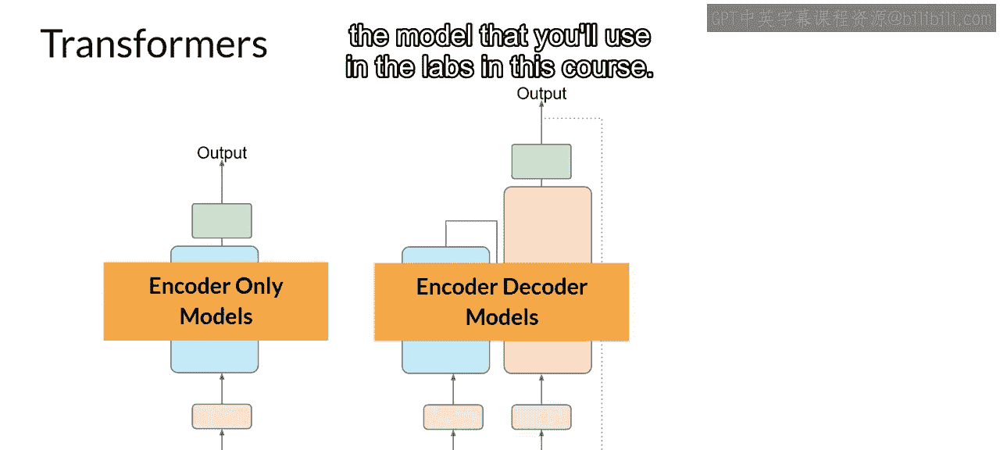
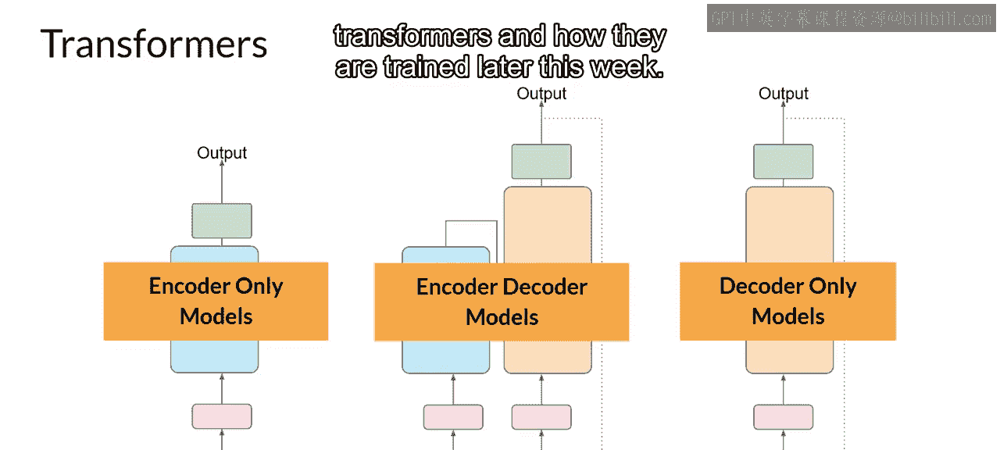

# 007：用Transformer生成文本 🧠

在本节课中，我们将学习Transformer架构如何从端到端地完成文本生成任务。我们将通过一个简单的翻译示例，详细拆解编码器-解码器的工作流程，并了解不同Transformer变体的特点。

---

## 概述

到目前为止，我们已经从高层级了解了Transformer架构中的一些主要组件。但我们尚未看到整个预测过程是如何端到端工作的。因此，让我们通过一个简单的例子来逐步解析。

## 翻译任务示例

在这个示例中，我们将观察一个翻译任务，即序列到序列任务。这恰好是Transformer架构设计者的最初目标。我们将使用一个Transformer模型将法语短语“J‘aime l’apprentissage automatique”翻译成英语。

以下是翻译过程的详细步骤：

1.  **分词**：首先，使用训练网络时使用的相同分词器对输入单词进行分词。
2.  **编码器处理**：这些分词后的标记被送入网络的编码器侧。它们经过嵌入层，然后输入到多头注意力层。
3.  **生成深度表示**：多头注意力层的输出通过一个前馈网络传递到编码器的输出端。此时，离开编码器的数据是输入序列结构和含义的深度表示。
4.  **解码器启动**：这个表示被插入到解码器的中间部分，以影响解码器的自注意力机制。接着，一个序列开始标记被添加到解码器的输入中。
5.  **预测首个标记**：这触发解码器基于编码器提供的上下文理解来预测下一个标记。解码器自注意力层的输出通过解码器前馈网络和最终的Softmax输出层。此时，我们得到了第一个预测出的标记。
6.  **循环生成**：我们将输出标记反馈到输入，以触发下一个标记的生成，并持续这个循环，直到模型预测出一个序列结束标记。
7.  **反分词**：最后，将最终的标记序列反分词为单词，我们就得到了输出结果。在这个例子中，输出是“I love machine learning”。

## 文本生成的多样性

有多种方法可以利用Softmax层的输出来预测下一个标记，这些方法会影响生成文本的创造性。我们将在本周晚些时候更详细地探讨这些方法。

## Transformer架构总结

让我们总结一下目前所学的内容。完整的Transformer架构由编码器和解码器组件构成。

*   **编码器**：将输入序列编码为输入结构和含义的深度表示。
*   **解码器**：从输入标记触发开始工作，利用编码器的上下文理解来生成新的标记，并循环进行此过程，直到达到某个停止条件。

## Transformer的三种变体

虽然我们探讨的翻译示例同时使用了Transformer的编码器和解码器部分，但我们可以将这些组件拆分，形成不同的架构变体。

以下是三种主要的Transformer模型变体：

1.  **仅编码器模型**：这类模型也可以作为序列到序列模型工作，但在未进一步修改的情况下，输入序列和输出序列长度相同。如今它们的使用已不常见，但通过在架构上添加额外的层，可以训练仅编码器模型来执行分类任务，例如情感分析。**BERT**就是一个仅编码器模型的例子。
2.  **编码器-解码器模型**：正如我们所见，这类模型在序列到序列任务（如翻译）上表现良好，其中输入序列和输出序列的长度可以不同。我们也可以扩展和训练这类模型来执行通用的文本生成任务。编码器-解码器模型的例子包括**BART**（与BERT相对）和**T5**（本课程实验中将使用的模型）。
3.  **仅解码器模型**：这是当今最常用的一些模型。同样，随着规模的扩大，它们的能力也在增长，这些模型现在可以泛化到大多数任务。流行的仅解码器模型包括**GPT**系列模型、**BLOOM**、**Jurassic**、**Llama**等。

我们将在本周晚些时候了解更多关于这些不同Transformer变体及其训练方式的信息。

## 结语与展望

以上就是很多内容。本次Transformer模型概述的主要目标是为你提供足够的背景知识，以理解世界上正在使用的各种模型之间的差异，并能够阅读模型文档。我想强调，你不需要担心记住这里看到的所有细节，因为你可以根据需要随时回顾这个解释。

请记住，你将通过自然语言与Transformer模型交互，使用书面文字（而非代码）创建提示。要做到这一点，你不需要理解底层架构的所有细节。这被称为**提示工程**，而这正是我们将在课程下一部分探索的内容。

让我们继续观看下一个视频以了解更多。