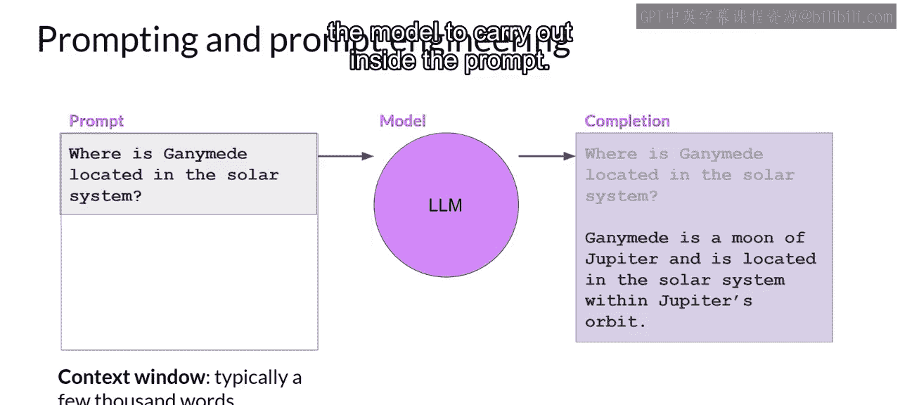
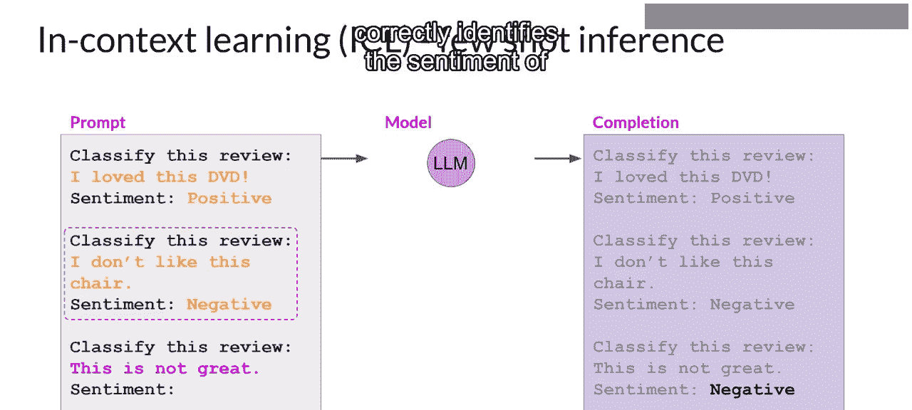
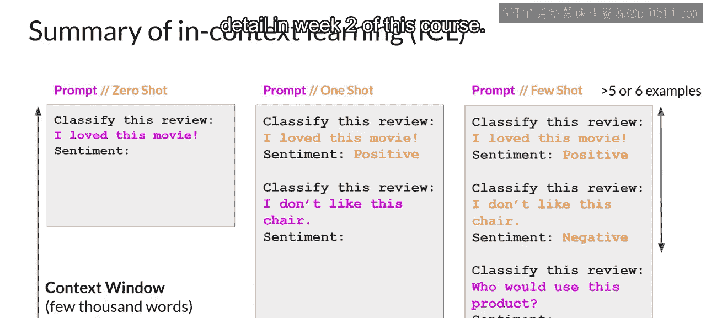

# 008：提示和提示工程 🎯

在本节课中，我们将要学习大型语言模型（LLM）中关于提示（Prompt）和提示工程（Prompt Engineering）的核心概念。我们将了解如何通过精心设计输入文本来引导模型生成期望的输出，并探讨不同规模模型的能力差异。

## 概述

首先，我们来回顾一些关键术语。输入到模型的文本被称为**提示**。模型生成文本的过程被称为**推理**，而输出的文本则被称为**补全**。可用于提示的文本总量或模型的“记忆”被称为**上下文窗口**。



尽管模型有时表现良好，但你经常会遇到模型初次尝试未能产生理想结果的情况。你可能需要多次修改提示的语言或写作方式，才能使模型按照你的期望运行。这种开发和改进提示的工作被称为**提示工程**。

## 上下文学习：通过示例引导模型

提示工程是一个重要的主题。一个让模型产生更好结果的强大策略是在提示中包含你希望模型执行的任务示例。在上下文窗口中提供示例的方法被称为**上下文学习**。

以下是上下文学习的具体示例。在下面的提示中，你要求模型对一条影评进行情感分类，即判断该影评是正面还是负面。

```text
提示：对这条评论进行分类。
评论：“这部电影太棒了，我强烈推荐！”
情感：
```

这个提示由指令“对这条评论进行分类”、上下文（即评论文本本身）以及一个在末尾生成情感的指令组成。这种将输入数据包含在提示中的方法被称为**零样本推理**。最大的LLM在这方面表现出色，能够理解任务并返回正确答案。在这个例子中，模型正确地识别出情感为“正面”。

然而，较小的模型可能会在这方面遇到困难。例如，由早期较小版本模型（如GPT-2）生成的补全可能无法遵循指令。虽然它生成的文本与提示相关，但模型无法理解任务的细节，也就无法识别情感。

## 从零样本到少样本推理

这正是通过在提示中提供示例来提升性能的地方。现在，提示文本变得更长，并以一个完整的示例开头，向模型演示了需要执行的任务。

在指定模型应对评论进行分类后，提示文本包含了一个样本评论“我喜欢这部电影”，以及一个已完成的情感分析（本例中为“正面”）。接着，提示再次陈述指令，并包含我们想要模型分析的实际输入评论。

将这个新的、更长的提示传递给较小的模型，它现在有更好的机会理解任务。你正在指定你期望的响应格式。包含单个示例的方法被称为**单样本推理**，与之前提供的零样本提示形成对比。

有时，单个示例不足以让模型理解你的意图。因此，你可以扩展这个思路，从提供一个示例增加到包含多个示例。这被称为**少样本推理**。



例如，假设你正在使用一个更小的模型，它在单样本推理下未能进行良好的情感分析。你可以尝试少样本推理，加入第二个示例（这次是一条负面评论）。包含不同输出类别的混合示例可以帮助模型理解它需要做什么。

将新的提示传递给模型，这次它理解了指令，并生成了一个正确将评论情感识别为“负面”的补全。

## 模型规模与任务能力的关系



随着模型规模越来越大，模型执行多任务的能力以及执行这些任务的表现，强烈依赖于模型的规模。正如本课前面提到的，拥有更多参数的模型能够捕捉更多对语言的理解。

最大的模型在零样本推理方面表现出奇地好，能够推断并成功完成许多它们并未专门训练过的任务。相比之下，较小的模型通常只擅长少量任务，特别是那些与它们训练任务相似的任务。

你可能需要尝试几个模型，才能找到适合你用例的那一个。一旦找到适合你的模型，你可以尝试调整一些配置设置，以影响模型生成的补全的结构和风格。

## 总结


本节课中，我们一起学习了提示工程的核心概念。我们了解到，可以通过在提示中包含示例（即上下文学习）来引导模型，具体方法包括零样本、单样本和少样本推理。同时，我们认识到模型的规模对其任务执行能力有决定性影响：大模型擅长零样本推理，而小模型则更依赖于示例引导。最后，我们提到了可以通过调整配置参数来优化模型的输出。在下一节视频中，我们将具体探讨这些配置设置。