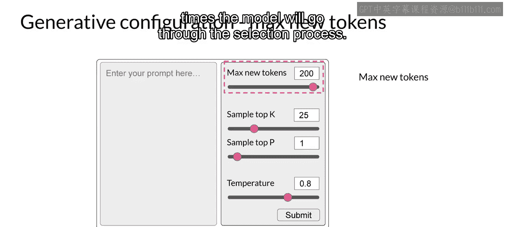
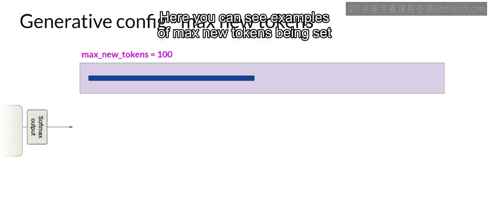
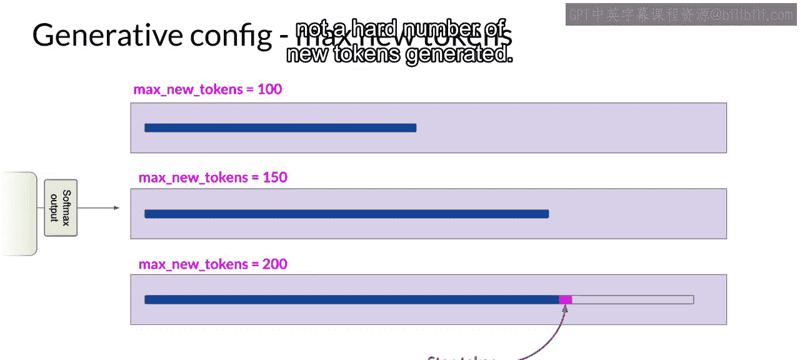
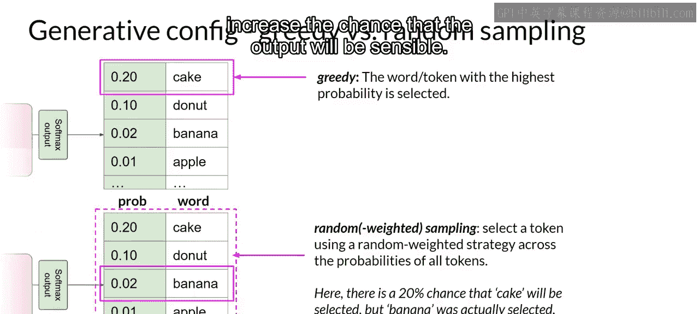
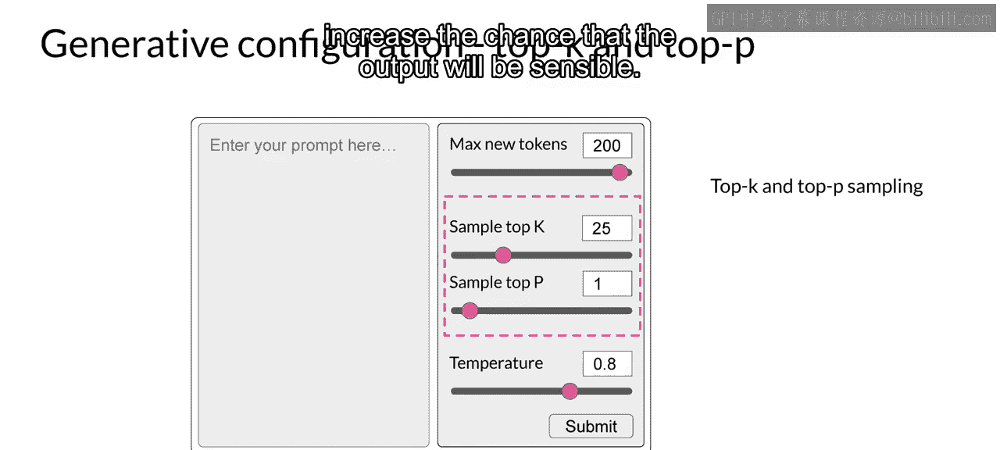
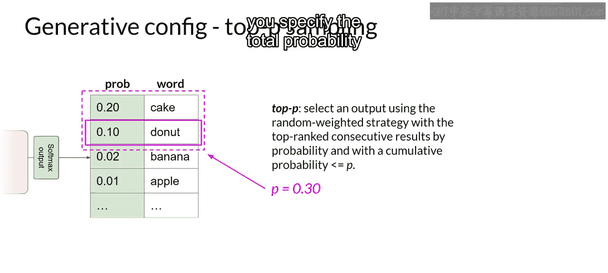
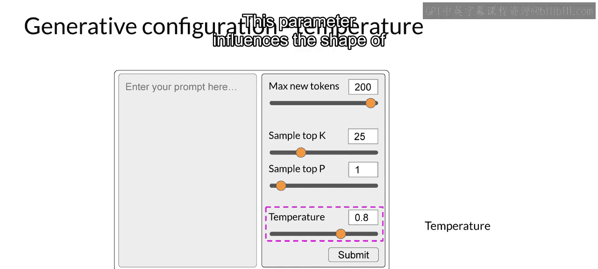
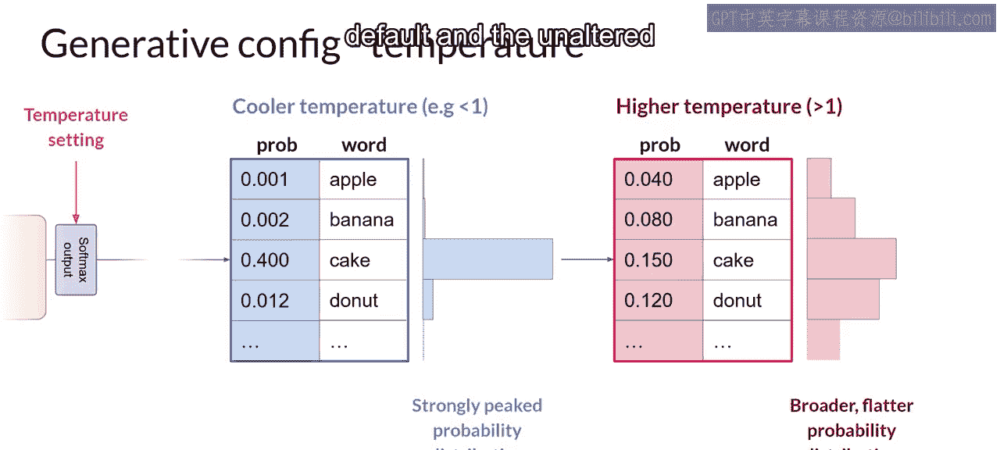

# 009：生成式配置

在本节课中，我们将要学习如何通过调整生成式配置参数，来影响大型语言模型在生成下一个词时的决策方式。这些参数允许我们控制生成文本的长度、创造性和随机性。

## 概述

在之前的课程中，我们了解了大型语言模型的能力和其背后的Transformer架构。本节我们将深入探讨在模型推理（生成文本）时，我们可以使用哪些配置参数来调整其行为。这些参数不同于训练时学习的参数，它们是在模型使用时进行设置的。



## 最大新令牌数

首先，我们来看看最简单的参数之一：**最大新令牌数**。这个参数用于限制模型生成的新令牌（可以理解为词或词片段）的数量。





你可以将其视为对模型选择下一个词这一过程的循环次数设置了一个上限。例如，你可以将其设置为100、150或200。需要注意的是，这是一个最大值，如果模型在达到此上限前预测到了一个序列结束标记，生成过程也会提前停止。

**代码示例**：
```python
max_new_tokens = 100
```

## 解码策略：从贪婪解码到随机采样

默认情况下，大多数大型语言模型使用**贪婪解码**。这意味着模型在每一步总是选择概率最高的词作为下一个词。

**公式**：
`下一个词 = argmax(P(词 | 上下文))`

这种方法对于短文本生成效果很好，但容易导致词语或短语的重复。为了生成更自然、更具创造性且避免重复的文本，我们需要引入随机性。

**随机采样**是实现这一目标的最简单方法。模型不再总是选择概率最高的词，而是根据整个词典的概率分布来随机选择下一个词。例如，一个词的概率为0.02，那么它被选中的几率就是2%。

**代码示例**（以Hugging Face Transformers为例）：
```python
do_sample = True
```

## 高级采样技术：Top-K 与 Top-P





为了在引入随机性的同时，确保生成的文本依然合理，我们可以使用两种采样技术：**Top-K** 和 **Top-P**。

### Top-K 采样

Top-K采样通过指定一个K值，将模型的选择范围限制在概率最高的K个词之内。模型会在这K个候选词中，根据它们的概率权重进行随机选择。

例如，设置K=3，模型就只从概率最高的三个词中挑选下一个词。这能在保持一定随机性的同时，防止模型选择概率极低的词。

### Top-P 采样（核采样）

Top-P采样则设定一个概率累计值P（例如0.9）。模型会从概率最高的词开始累加，直到累计概率超过P，然后仅从这个候选池中根据概率权重随机选择下一个词。





例如，设置P=0.3，模型会选取概率从高到低累加至刚好超过0.3的那些词作为候选。

**核心区别**：
*   **Top-K**：基于候选词的数量进行限制。
*   **Top-P**：基于候选词的概率总和进行限制。

## 温度参数

另一个控制输出随机性的关键参数是**温度**。这个参数直接影响模型为下一个词计算出的概率分布的形状。

**公式**（简化概念）：
调整后的概率 = softmax(原始逻辑值 / 温度)

*   **低温度（< 1）**：会使概率分布更加“尖锐”，概率集中在少数几个高概率词上。这导致生成文本的随机性更低，更可预测，更贴近训练数据中的常见模式。
*   **高温度（> 1）**：会使概率分布更加“平坦”，概率更均匀地分散在所有词上。这导致生成文本的随机性更高，更具创造性，但也可能产生不连贯或无意义的内容。
*   **温度 = 1**：使用模型原始的、未调整的概率分布。

与Top-K和Top-P不同，温度参数直接改变了模型对每个词的原始预测概率。

## 总结



本节课我们一起学习了影响大型语言模型文本生成行为的几种关键配置参数：
1.  **最大新令牌数**：控制生成文本的长度。
2.  **解码策略**：从确定性的**贪婪解码**切换到引入随机性的**随机采样**。
3.  **采样技术**：使用**Top-K**和**Top-P**在随机性和合理性之间取得平衡。
4.  **温度**：通过缩放概率分布来全局控制输出的随机性与创造性程度。

通过熟练运用这些参数，你可以引导模型生成更符合你需求、长度适宜且创造性可控的文本。在接下来的课程中，我们将基于这些基础知识，探讨如何开发和部署一个由大型语言模型驱动的应用程序。