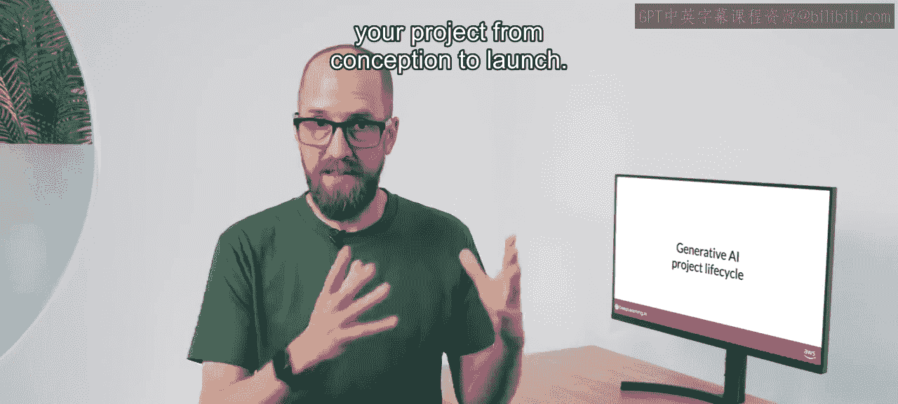
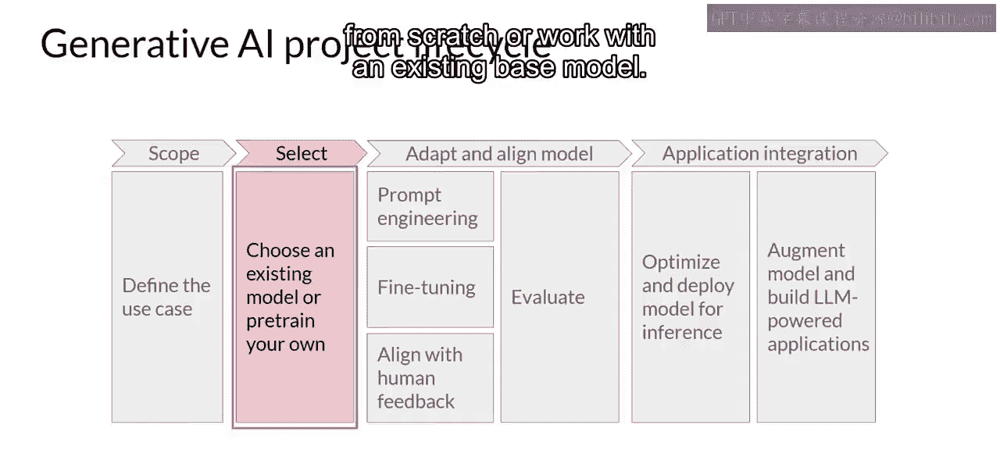
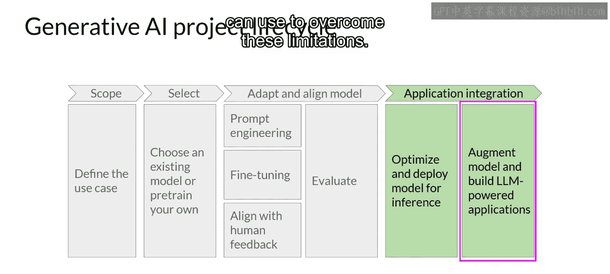

# 010：生成式AI项目生命周期

在本节课中，我们将学习开发和部署一个由大型语言模型驱动的应用程序所需的技术。我们将介绍一个生成式AI项目生命周期框架，它能指导你完成从构思到上线的全过程。

## 🎯 项目范围定义

任何项目中最重要的步骤是尽可能准确、具体地定义项目范围。正如本课程目前所展示的，LLM能够执行许多任务，但其能力在很大程度上取决于模型的规模和架构。你需要思考LLM在你的具体应用中承担什么功能。

以下是需要考虑的关键点：
*   你是否需要模型能够执行许多不同的任务，包括生成长文本或具备高度的通用能力？
*   或者任务非常具体，例如命名实体识别，因此你的模型只需要擅长一件事？

正如你将在课程后续部分看到的，明确界定模型需要完成的任务，可以节省你的时间，或许更重要的是，节省计算成本。

## 🤔 选择模型策略

一旦你明确了需求并界定了模型的范围，可以开始开发时，你的第一个决定将是：从头开始训练自己的模型，还是使用现有的基础模型。

通常，你会从一个现有模型开始，尽管在某些情况下你可能发现有必要从头开始训练模型。本周晚些时候，你将了解更多关于这个决策背后的考量因素，以及一些经验法则，帮助你评估使用自己的资源训练模型的可行性。

## 🔧 评估与模型调优

有了模型之后，下一步是评估其性能，并根据你的应用需求进行额外的训练。

正如本周早些时候所见，提示工程有时足以让你的模型表现良好。因此，你可能会从尝试情境学习开始，使用适合你任务和用例的示例。然而，在某些情况下，即使使用单样本或少样本推理，模型的表现可能仍达不到你的要求。

在这种情况下，你可以尝试对模型进行微调。这个监督学习过程将在第2周详细介绍，并且你将在第2周的实验中亲自尝试微调一个模型。

随着模型能力越来越强，确保它们在部署中表现良好且符合人类偏好变得日益重要。在第3周，你将学习一种额外的微调技术，称为**基于人类反馈的强化学习**，它有助于确保你的模型行为良好。

所有这些技术的一个重要方面是评估。下周，你将探索一些指标和基准，用于确定你的模型表现如何，或者它与你的偏好对齐得如何。

请注意，应用开发的这个“调整与对齐”阶段可能是高度迭代的。你可能从尝试提示工程和评估输出开始，然后使用微调来提高性能，接着再次重新审视和评估提示工程，以获得所需的性能。

## 🚀 部署与优化

最后，当你获得一个满足性能需求且对齐良好的模型时，你可以将其部署到你的基础设施中，并与你的应用程序集成。

在这个阶段，一个重要步骤是优化模型以进行部署。这可以确保你充分利用计算资源，并为应用程序用户提供最佳体验。

## 🛠️ 补充基础设施

最后但非常重要的一步是考虑你的应用程序良好运行所需的任何额外基础设施。LLM存在一些基本限制，仅通过训练可能难以克服，例如它们在不知道答案时倾向于捏造信息，或者它们执行复杂推理和数学的能力有限。

在本课程的最后一部分，你将学习一些强大的技术，可以用来克服这些限制。

我知道这里有很多需要考虑的内容，但不必担心现在就全部掌握。在本课程中，当你探索每个阶段的细节时，你会反复看到这个视觉框架。

---

**总结**：本节课我们一起学习了生成式AI项目的完整生命周期，从**定义范围**、**选择模型策略**、**评估与调优**，到最终的**部署优化**和**补充基础设施**。这个框架将帮助你系统化地规划和执行LLM应用开发项目。