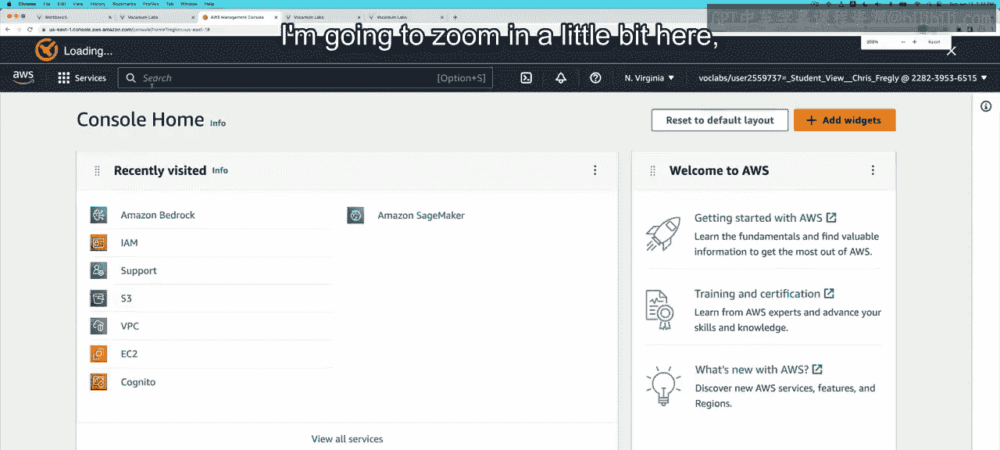
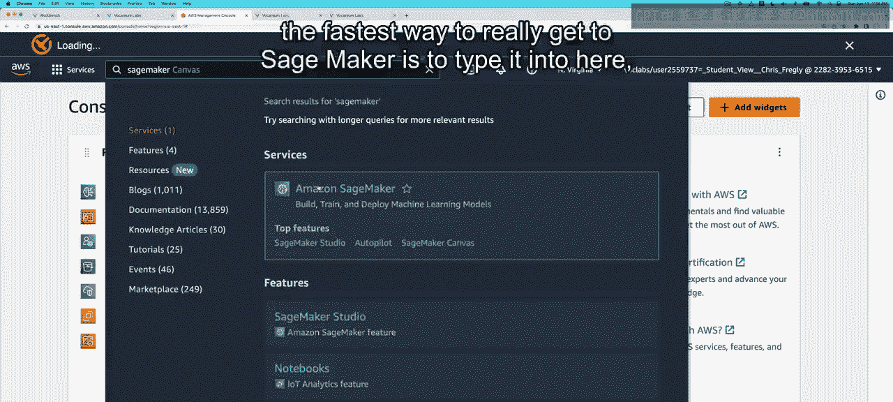
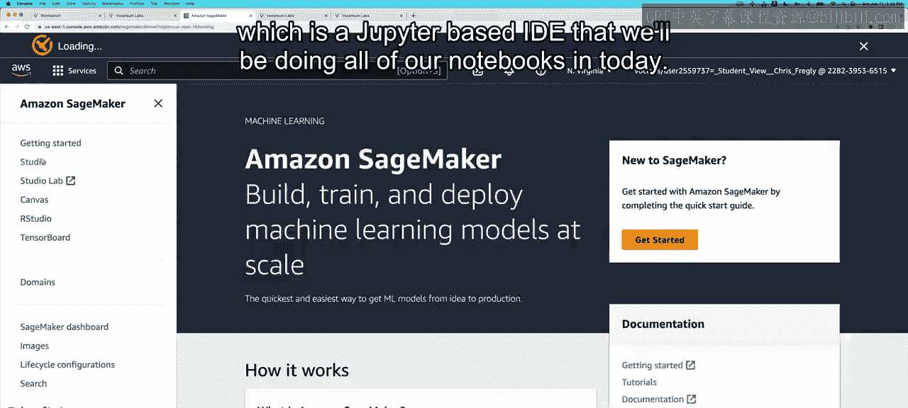
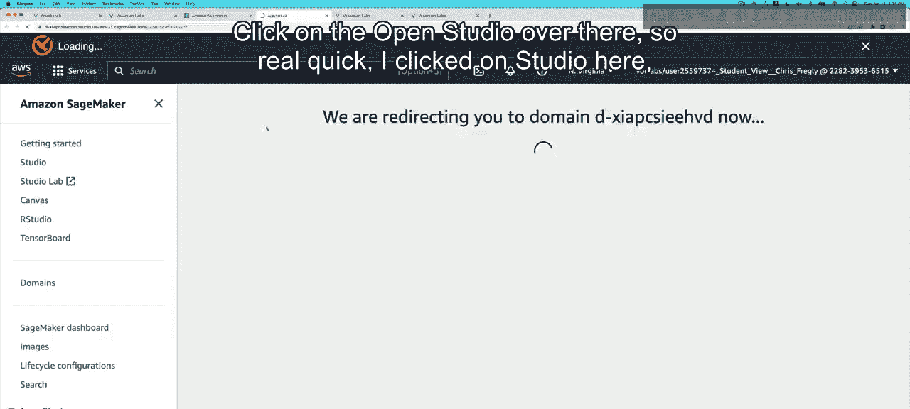
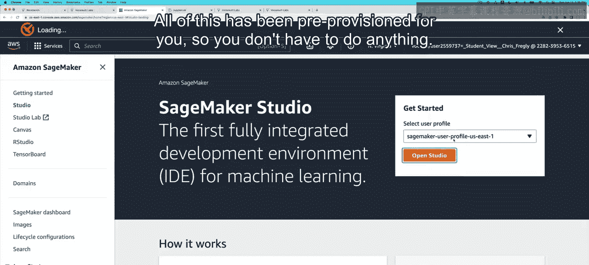
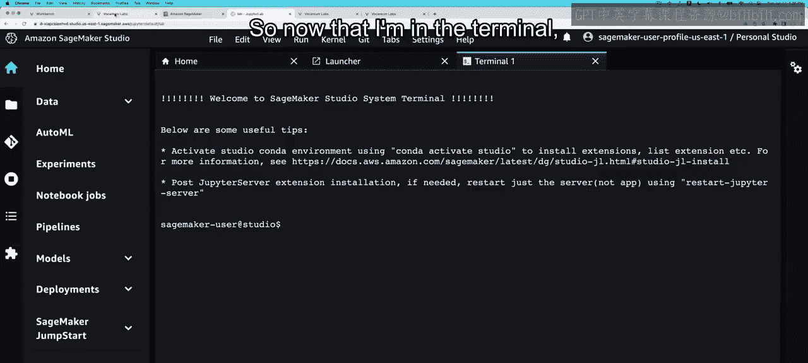
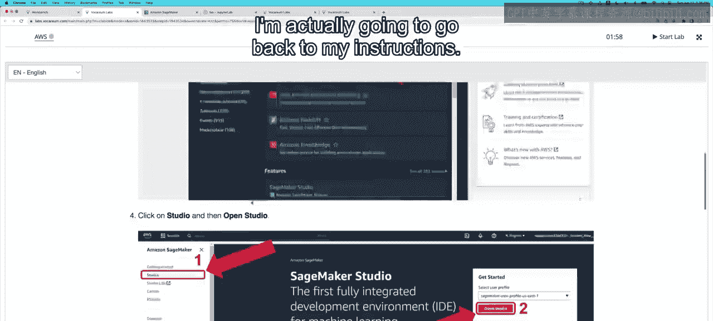
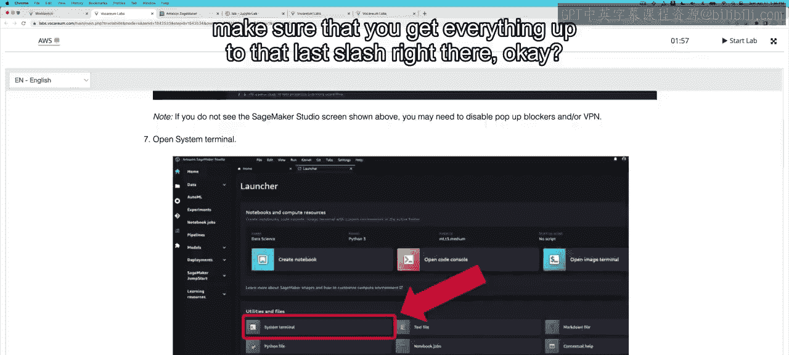
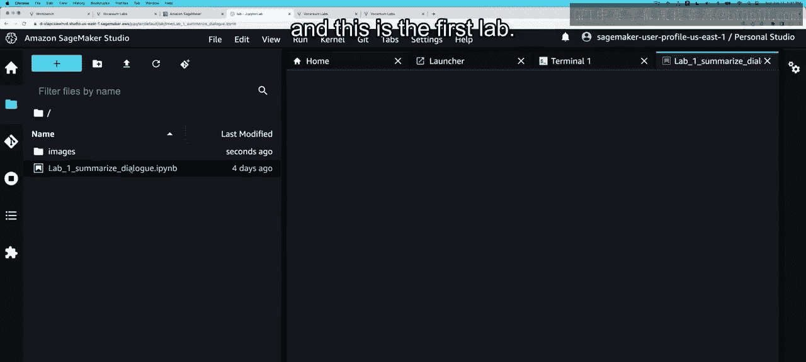
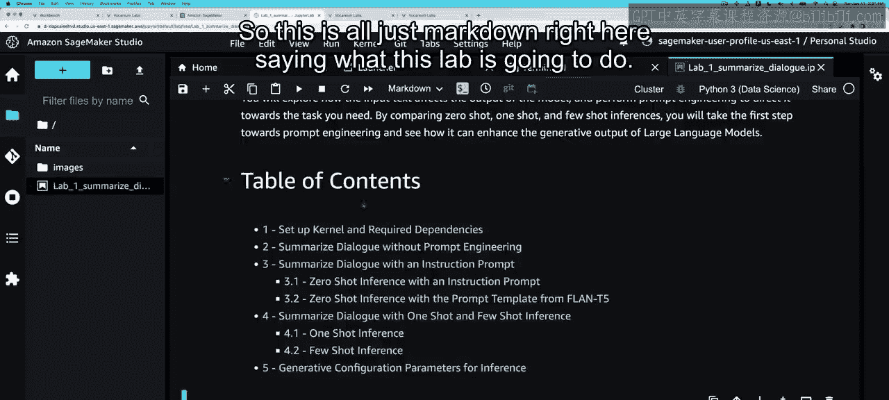

# 011：AWS实验室介绍 🚀

在本节课中，我们将学习如何访问和设置本课程所需的AWS实验室环境。通过动手实践，你将能更好地巩固视频中学到的核心概念。

---

课程至此，你已经学习了大量知识。巩固这些概念的最佳方式，就是亲自动手尝试编写一些代码。

正如Andrew在本周开始时提到的，我的同事Chris Frly主导开发了本课程的实验练习。每周都包含一个实验，让你可以亲自实践视频中的关键概念。

接下来，Chris将帮助你入门，向你展示实验环境，并引导你完成本周的活动。

你好，Chris。😊

你好，Mike。现在让我们来看看实验环境和第一个实验。

在正式开始实验之前，让我先解释一下我们将要使用的系统环境，它叫做“Vcaria”。

在这里，你将启动自己的AWS账户，从而获得Amazon SageMaker的访问权限。因此，你可以免费运行这些笔记本。

以下是需要注意的几点：

当你进入Vquaium实验环境时，首先要点击 **`Start Lab`**。这是你在左上角看到的第一个操作。你会看到AWS的状态从红色变为黄色，再变为绿色。绿色表示就绪。

绿色意味着我们可以点击它并进入实验。这里有几个快速提示：你**有两小时**的时间来完成每个实验。完成后，你**不需要**点击任何“结束实验”的按钮，只需关闭浏览器，然后按你的意愿进入下一个实验或视频即可。

这里有一些说明，但我现在将直接带你一步步操作。

我们要做的是点击 **`AWS`**，这将启动AWS控制台。如果你已经登录了另一个AWS控制台，你需要先点击**登出**，然后再点击这里同样的绿色 **`AWS`** 按钮。

我将稍微放大一下界面。

进入SageMaker最快的方法是在这里的搜索字段中输入 **`SageMaker`**，然后点击它。我们的目标是进入**SageMaker Studio**，这是一个基于Jupyter的IDE，我们今天所有的笔记本操作都将在这里进行。点击那边的 **`Open Studio`**。

简单来说，我在这里点击了 **`Studio`**，然后点击了 **`Open Studio`**。所有这些资源都已为你预先配置好，你无需进行任何设置。

这将直接带你进入Jupyter笔记本界面。让我放大一下。默认启用了深色模式，如果你愿意，可以切换到浅色模式。

你可以点击 **`Theme`**，然后切换到 **`Jupyter Lab Light`** 模式。默认是SageMaker UI的深色模式，也就是我们看到的这种黑色。

第一步是点击 **`Open Launcher`**。我们实际上需要进入系统终端，因为我们要做的第一件事是从我们的S3存储桶复制实验文件。

S3是云中的对象存储，这个公共存储桶包含了本次实验所需的所有笔记本、图像和数据集。

现在我已经在终端里了，我将回到我的操作说明。我们已经完成了所有这些步骤：第一步，点击Studio；第二步，点击Open Studio。

有时学习者可能会通过另一种方式进入Studio。如果你在探索时看到了某个屏幕，只需知道你可以点击 **`Launch`**，然后点击 **`Studio`**，这将以同样的方式打开Studio笔记本。从那时起，所有操作说明都相同：点击 **`Open Launcher`**，点击 **`System Terminal`**。

现在，这是我需要复制的代码。请确保你复制了直到最后一个斜杠 `/` 的所有内容。

我将回到Jupyter Launcher，然后直接在这里粘贴这段代码。

好的，下一步是点击文件夹，我们应该能看到下载好的笔记本。因为我放大了很多，所以我需要滚动到这里。这就是第一个实验。

正如我所说，所有的计算资源都已为我们配置好。我们现在应该可以直接开始运行这些实验了。

如果你不熟悉Jupyter笔记本，只需知道你可以使用 **`Shift + Enter`** 在单元格之间跳转并执行。或者，如果你觉得时间紧迫，可以点击 **`Restart Kernel and Run All Cells`**，这将一键运行所有单元格。

对于这些实验，我建议你一步一步地运行，即按 **`Shift + Enter`**，再按 **`Shift + Enter`**。这里的所有内容都只是Markdown格式的说明，告诉你这个实验将要做什么。

---

本节课中，我们一起学习了如何访问AWS实验室环境、启动SageMaker Studio、从云端S3存储桶获取实验材料，以及运行Jupyter笔记本的基本操作。现在，你已经准备好开始动手实践，巩固生成式AI与大型语言模型的相关知识了。