# 013：12_预训练大型语言模型 🧠

在本节课中，我们将要学习大型语言模型（LLM）的预训练过程。我们将探讨不同模型架构（编码器、解码器、编码器-解码器）的预训练目标，理解它们如何影响模型的能力和适用场景，并了解选择合适模型时需要考虑的因素。

## 模型选择与模型中心

在上一节视频中，我们介绍了生成式AI项目生命周期。在确定了用例范围并规划了LLM在应用中的工作方式后，下一步是选择一个模型来使用。

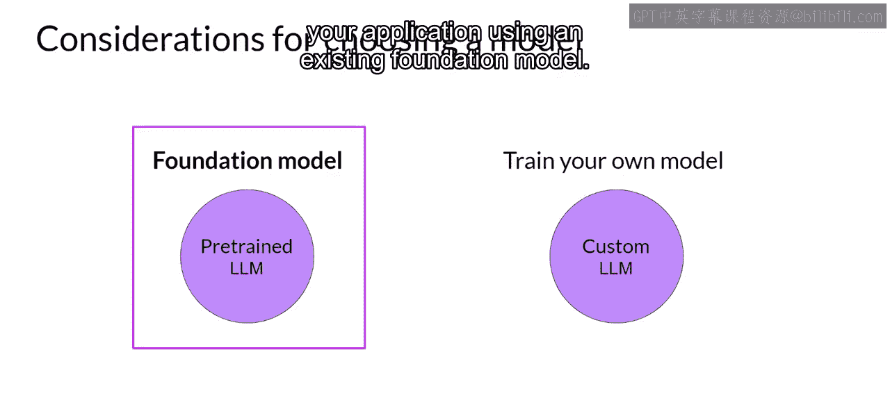

你的第一个选择是使用现有模型，还是从头开始训练自己的模型。在某些特定情况下，从头训练自己的模型可能是有利的，我们将在本课后面学习这些情况。然而，通常情况下，你会使用现有的基础模型来开始开发你的应用程序。

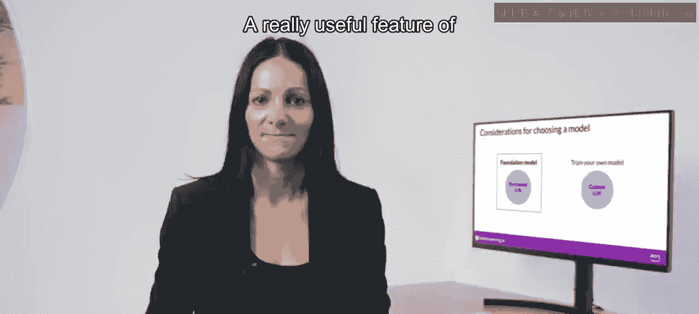

许多开源模型可供像你这样的AI社区成员在应用中使用。一些主要的生成式AI应用框架（如Hugging Face和PyTorch）的开发者创建了模型中心，你可以在其中浏览这些模型。

这些模型中心的一个非常有用的功能是包含了模型卡片。

它们描述了重要的细节，包括每个模型的最佳用例、训练方式以及已知的限制。你可以在本周结束时的阅读材料中找到这些模型中心的链接。

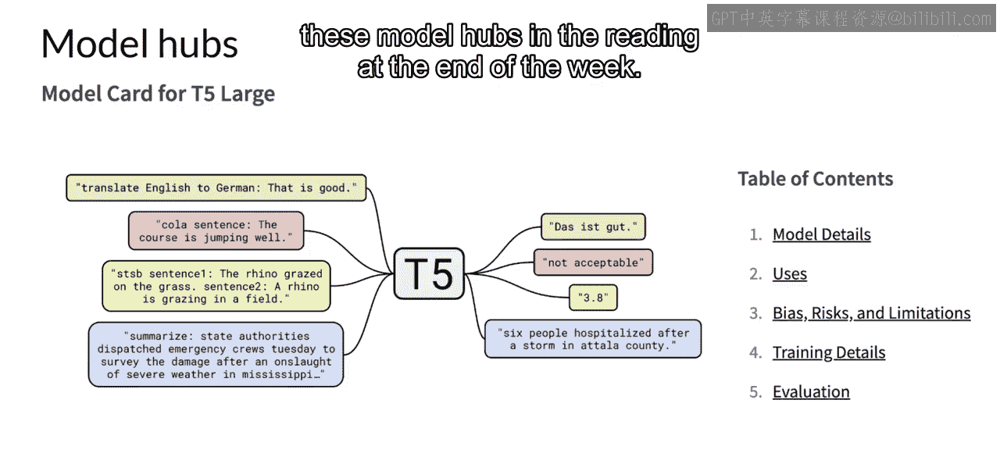

你选择的具体模型将取决于你需要执行的任务的细节。Transformer模型架构的变体适用于不同的语言任务，这主要是由于模型训练方式的差异。为了帮助你更好地理解这些差异，并对特定任务使用哪种模型形成直觉，让我们更深入地看看大型语言模型是如何训练的。

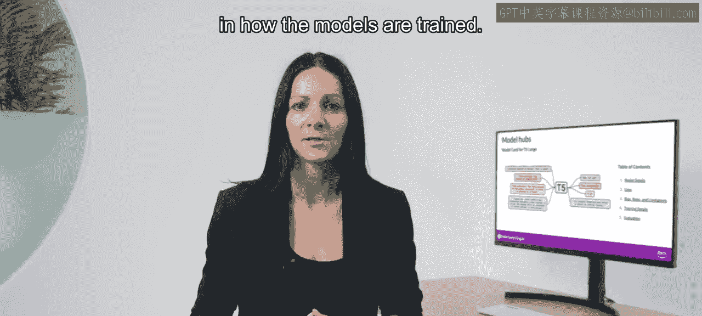

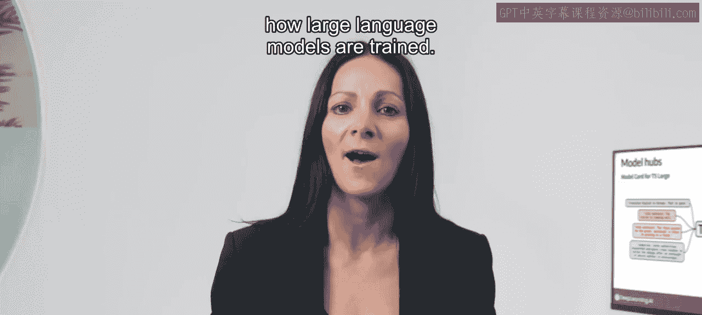

掌握了这些知识后，你会发现更容易浏览模型中心，并为你的用例找到最佳模型。

## 预训练概览

首先，让我们从高层次了解一下LLM的初始训练过程。这个阶段通常被称为**预训练**。

正如你在第1课中所见，LLM编码了语言的深层统计表示。这种理解是在模型的预训练阶段形成的，此时模型从海量的非结构化文本数据中学习。这些数据可能达到千兆字节、太字节甚至拍字节的规模，来源包括互联网抓取的数据以及专门为训练语言模型而组装的文本语料库。

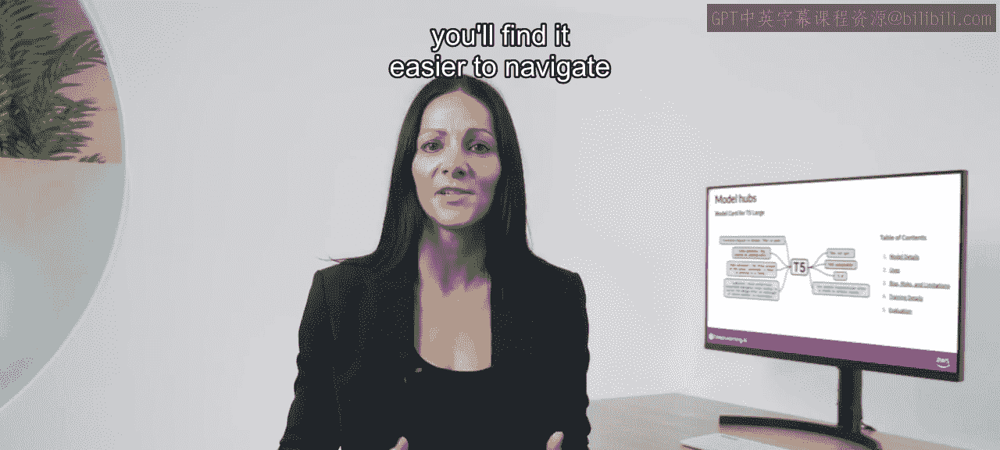

在这个自监督学习步骤中，模型内化了语言中存在的模式和结构。这些模式使模型能够完成其训练目标，而该目标取决于模型的架构。

在预训练期间，模型权重会更新以最小化训练目标的损失。预训练还需要大量的计算资源和GPU的使用。

请注意，当你从公共网站（如互联网）抓取训练数据时，通常需要处理数据以提高质量、解决偏见并移除其他有害内容。由于这种数据质量筛选，通常只有1%到3%的标记（tokens）被用于预训练。如果你决定预训练自己的模型，在估算需要收集多少数据时应考虑这一点。

## 不同架构的预训练目标

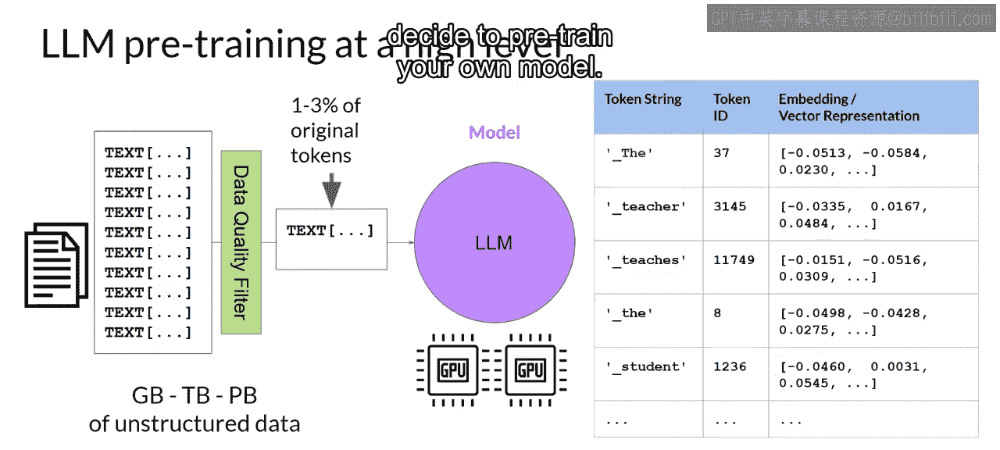

本周早些时候，你了解到Transformer模型有三种变体：仅编码器模型、编码器-解码器模型和仅解码器模型。每种模型都有不同的训练目标，因此学习执行不同的任务。

**仅编码器模型**也被称为**自编码模型**，它们使用**掩码语言建模**进行预训练。

在这里，输入序列中的标记被随机掩码，训练目标是预测被掩码的标记以重建原始句子。这也被称为**去噪目标**。

自编码模型构建输入序列的**双向表示**，这意味着模型理解标记的完整上下文，而不仅仅是它前面的词。

仅编码器模型非常适合受益于双向上下文的任务。例如，你可以用它们执行句子分类任务（如情感分析）或标记级任务（如命名实体识别或词分类）。

一些著名的自编码模型例子是**BERT**和**RoBERTa**。

现在，让我们看看**仅解码器模型**或**自回归模型**，它们使用**因果语言建模**进行预训练。

这里的训练目标是根据之前的标记序列预测下一个标记。研究人员有时将预测下一个标记称为**全语言建模**。基于解码器的自回归模型会掩码输入序列，并且只能看到所讨论标记之前的输入标记。模型不知道句子的结尾。然后，模型逐个遍历输入序列以预测下一个标记。

与编码器架构相比，这意味着上下文是**单向的**。通过学习从大量示例中预测下一个标记，模型构建了语言的统计表示。这种类型的模型利用了原始架构的解码器组件，而没有编码器。

仅解码器模型通常用于文本生成，尽管较大的仅解码器模型表现出强大的零样本或少样本推理能力，并且通常可以很好地执行一系列任务。

著名的基于解码器的自回归模型例子是**GPT**和**BLOOM**。

Transformer模型的最后一种变体是**序列到序列模型**，它使用了原始Transformer架构的编码器和解码器部分。

预训练目标的具体细节因模型而异。一个流行的序列到序列模型**T5**使用**跨度损坏**来预训练编码器，它会掩码输入标记的随机序列。这些被掩码的序列随后被替换为唯一的哨兵标记（此处显示为X）。哨兵标记是添加到词汇表中的特殊标记，但不对应于输入文本中的任何实际单词。然后，解码器的任务是自回归地重建被掩码的标记序列。输出是哨兵标记后跟预测的标记。

你可以使用序列到序列模型进行翻译、摘要和问答。它们通常在输入和输出都是文本体的情况下很有用。除了你将在本课程实验中使用的T5之外，另一个著名的编码器-解码器模型是**BART**（不是BERT）。

## 架构对比总结

以下是不同模型架构及其预训练目标的快速比较总结：

*   **自编码模型**使用掩码语言建模进行预训练。它们对应于原始Transformer架构的编码器部分，通常用于句子分类或标记分类。
*   **自回归模型**使用因果语言建模进行预训练。这种类型的模型利用了原始Transformer架构的解码器组件，通常用于文本生成。
*   **序列到序列模型**使用原始Transformer架构的编码器和解码器部分。预训练目标的具体细节因模型而异。T5模型使用跨度损坏进行预训练。序列到序列模型通常用于翻译、摘要和问答。

现在你已经了解了这些不同模型架构是如何训练的，以及它们各自最适合的特定任务，你可以选择最适合你用例的模型类型。

## 模型规模与能力

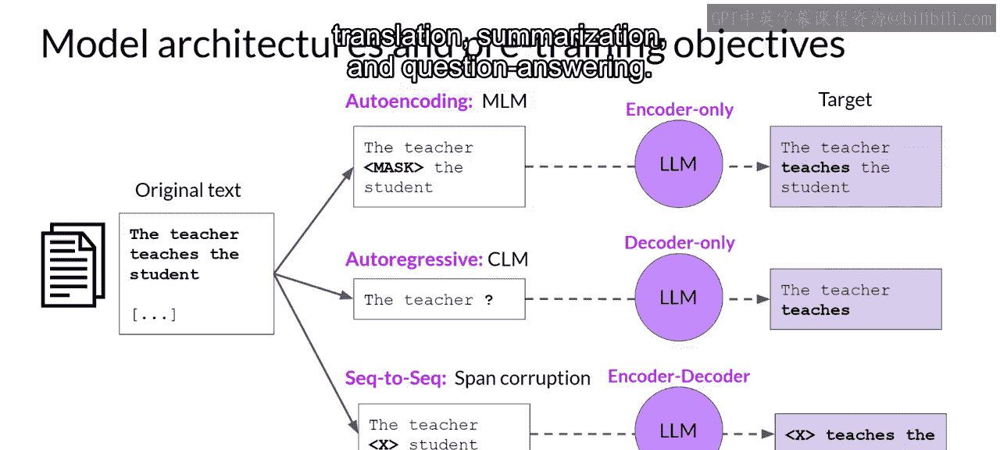

需要记住的另一点是，任何架构的**较大模型**通常都能更好地执行其任务。

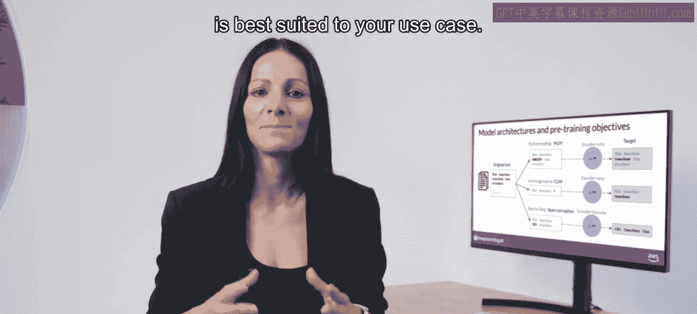

研究人员发现，模型越大，它就越有可能按照你的需要工作，而无需额外的上下文学习或进一步训练。

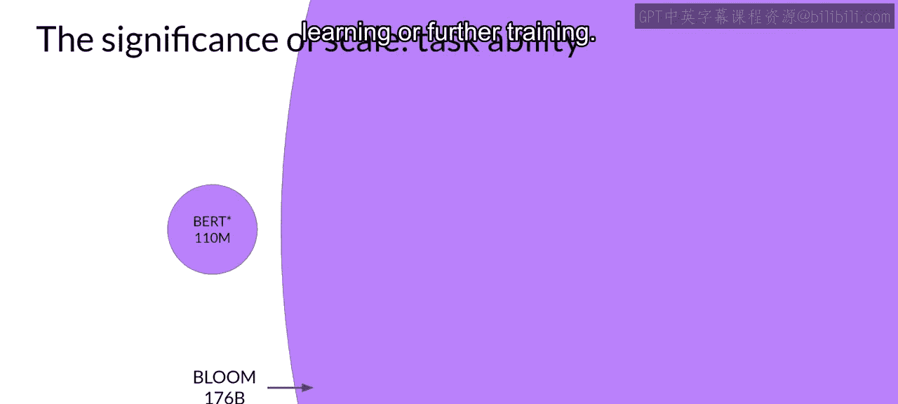

这种观察到的模型能力随规模增长的趋势，推动了近年来模型规模越来越大的发展。这种增长得益于研究中的转折点，例如高度可扩展的Transformer架构的引入、用于训练的海量数据的获取以及更强大计算资源的发展。

模型规模的这种稳步增长实际上让一些研究人员假设存在一种适用于LLM的新“摩尔定律”。你可能想问，我们是否可以不断添加参数来提高性能并使模型更智能？这种模型增长会走向何方？

虽然这听起来很棒，但事实证明，训练这些庞大的模型非常困难且成本高昂，以至于持续训练越来越大的模型可能不可行。

让我们在下一个视频中更仔细地看看与训练大型模型相关的一些挑战。

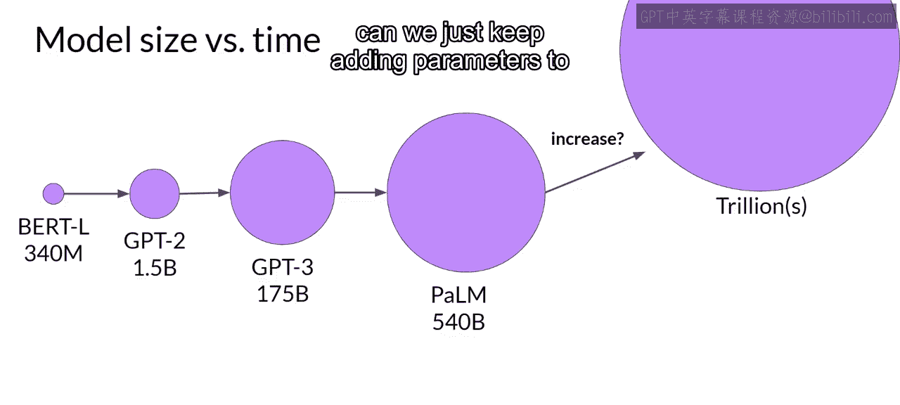

## 总结

本节课中，我们一起学习了大型语言模型预训练的核心概念。我们了解了三种主要Transformer架构（仅编码器、仅解码器、编码器-解码器）的区别，以及它们各自通过掩码语言建模、因果语言建模和跨度损坏等不同目标进行预训练的方式。这些预训练方式决定了模型最适合的任务类型，如分类、文本生成或翻译。我们还认识到，模型规模通常与其能力正相关，但训练超大模型也面临着巨大的成本和挑战。掌握这些知识，将帮助你在开发自己的生成式AI应用时，更明智地浏览和选择最合适的预训练模型。