# 014：13_训练大型语言模型的计算挑战 💻

在本节课中，我们将要学习训练大型语言模型时遇到的核心计算挑战——内存不足问题。我们将探讨其根本原因，并通过量化技术来理解如何有效减少内存需求。

## 内存不足的常见问题

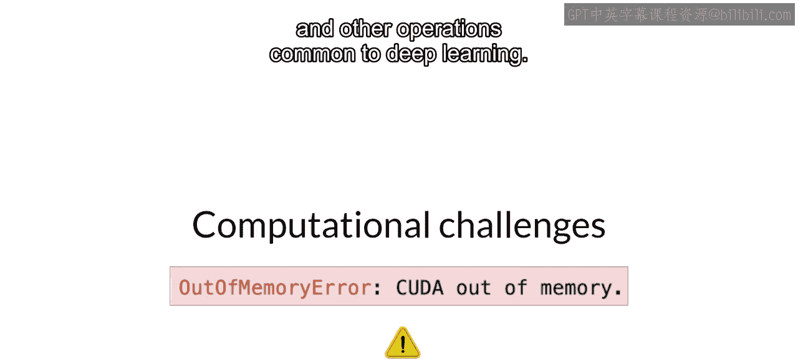

当你尝试训练大型语言模型时，最常见的问题之一是内存耗尽。

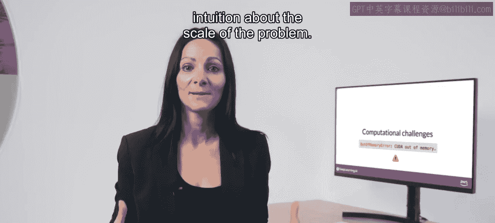

如果你曾尝试在NVIDIA GPU上训练甚至只是加载模型，可能会对以下错误信息感到熟悉。

CUDA，全称为Compute Unified Device Architecture，是为NVIDIA GPU开发的一系列库和工具。

诸如PyTorch和TensorFlow等库使用CUDA来提升矩阵乘法及其他深度学习常见操作的性能。

你会遇到这些内存不足问题，因为大多数大型语言模型非常庞大，需要大量内存来存储和训练其所有参数。

## 理解问题的规模

让我们做一些快速计算，以直观理解问题的规模。

一个参数通常由一个32位浮点数表示，这是计算机表示实数的方式。稍后你将看到关于数字如何以这种格式存储的更多细节。

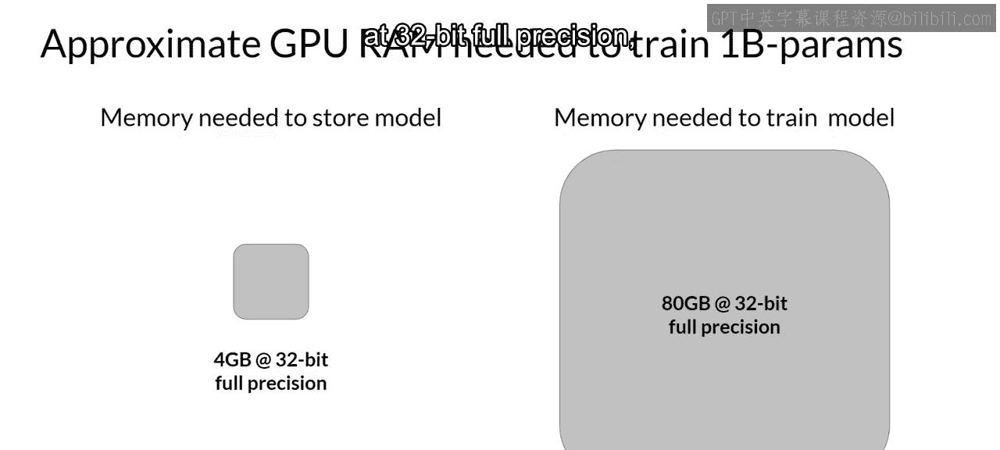

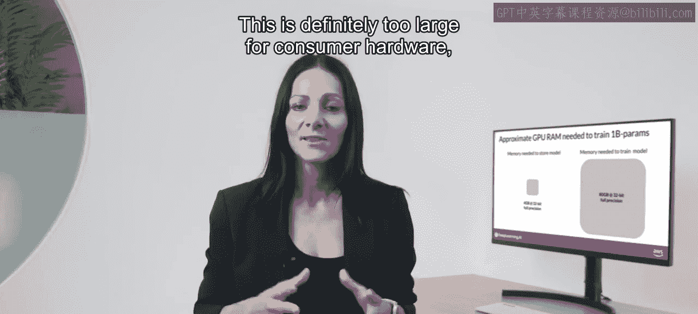

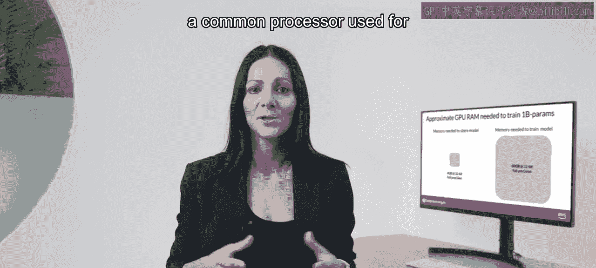

一个32位浮点数占用4字节内存。因此，要存储10亿个参数，你需要 `4字节 * 10亿参数 = 4GB` 的GPU内存（以32位全精度计算）。

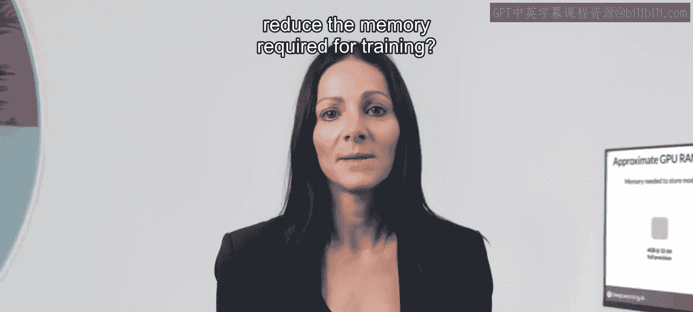

这是很大的内存量。请注意，到目前为止你只考虑了存储模型权重所需的内存。如果你想训练模型，还必须为训练期间使用GPU内存的额外组件做规划。这些组件包括优化器状态、梯度、激活值以及函数所需的临时变量。

实际上，这很容易导致每个模型参数需要额外20倍的内存。为了在训练期间考虑所有这些开销，你实际上需要大约20倍于模型权重本身所占用的GPU内存。要在32位全精度下训练一个10亿参数的模型，你大约需要 `4GB * 20 = 80GB` 的GPU内存。

这对于消费级硬件来说绝对太大了，甚至对数据中心使用的硬件来说也是一个挑战。如果你想使用单个处理器进行训练，80GB是单个NVIDIA A100 GPU的内存容量，A100是云端机器学习任务常用的处理器。

## 减少训练内存需求的技术

那么，有哪些选项可以减少训练所需的内存呢？

以下是你可以用来减少内存的一种技术，称为量化。

## 量化技术详解

其主要思想是，通过将权重的精度从32位浮点数降低到16位浮点数或8位整数，来减少存储模型权重所需的内存。

深度学习框架和库中使用的相应数据类型有：用于32位全精度的FP32，用于16位半精度的FP16或Bfloat16，以及用于8位整数的INT8。

FP32可以表示的数字范围大约从 `3 * 10^-38` 到 `3 * 10^38`。默认情况下，模型权重、激活值和其他模型参数以FP32存储。

量化通过使用基于原始32位浮点数范围计算出的缩放因子，将原始的32位浮点数统计性地投影到更低精度的空间中。

让我们看一个例子。假设你想以不同精度存储π到小数点后六位。

浮点数存储为一系列比特（0和1）。以FP32全精度存储数字的32位包括：1位用于符号（0表示正数，1表示负数），8位用于数字的指数，23位表示数字的小数部分。小数部分也称为尾数或有效数字，它代表数字的精度位。

如果你将32位浮点值转换回十进制值，会注意到精度的轻微损失。作为参考，以下是π到小数点后19位的真实值。

现在让我们看看，如果你将这个π的FP32表示投影到FP16（16位低精度）空间会发生什么。16位包括：1位用于符号（与FP32相同），但现在FP16只分配5位来表示指数，10位来表示小数部分。因此，FP16可以表示的数字范围要小得多，从-65504到+65504。

原始的FP32值在16位空间中被投影为3.140625。注意，通过这个投影你失去了一些精度，现在小数点后只有六位。你会发现，在大多数情况下，这种精度损失是可以接受的，因为你正在为减少内存占用进行优化。

在FP32中存储一个值需要4字节内存。相比之下，在FP16中存储一个值只需要2字节内存。因此，通过量化，你将内存需求减少了一半。

## BFloat16：一种流行的选择

人工智能研究界已经探索了优化16位量化的方法。一种名为Bfloat16的数据类型最近已成为FP16的热门替代品。Bfloat16，全称为Brain Floating Point Format，由Google Brain开发，已成为深度学习中的热门选择。包括Falcon在内的许多大型语言模型都已使用Bfloat16进行预训练。

Bfloat16或BF16是半精度FP16和全精度FP32之间的混合体。BF16显著有助于训练稳定性，并受到较新GPU（如NVIDIA A100）的支持。Bfloat16通常被描述为截断的32位浮点数，因为它捕获了完整32位浮点数的全部动态范围，但只使用16位。BF16使用完整的8位来表示指数，但将小数部分截断为仅7位。这不仅节省了内存，还通过加速计算提高了模型性能。缺点是BF16不太适合整数计算，但这些在深度学习中相对少见。

为了完整性，让我们看看如果你将π从32位量化到更低精度的8位空间会发生什么。如果你使用1位表示符号，那么8位值由剩余的7位表示。这给出了表示从-128到+127的数字范围。不出所料，π在8位低精度空间中被投影为3。这将内存需求从原来的4字节降低到仅1字节，但显然导致了相当显著的精度损失。

## 量化效果总结

让我们总结一下你在这里学到的内容，并强调你应该从这次讨论中带走的关键点。

请记住，量化的目标是通过降低模型权重的精度，来减少存储和训练模型所需的内存。量化使用基于原始32位浮点数范围计算出的缩放因子，将原始的32位浮点数统计性地投影到更低精度的空间中。

现代深度学习框架和库支持训练中量化，即在训练过程中学习量化缩放因子。这个过程的细节超出了本课程的范围，但你已经看到了关键点：你可以使用量化来减少训练期间模型的内存占用。

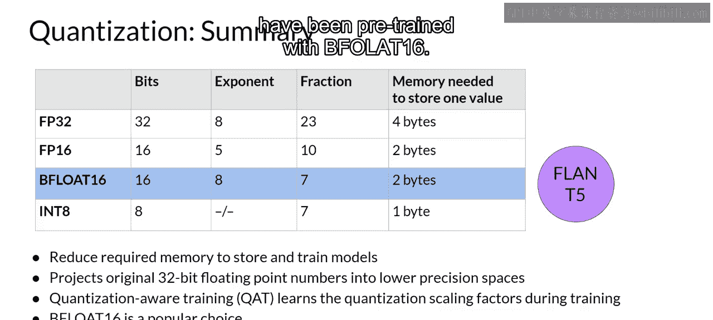

BF16已成为深度学习中一种流行的精度选择，因为它保持了FP32的动态范围，但将内存占用减少了一半。包括Falcon在内的许多大型语言模型都已使用Bfloat16进行预训练。

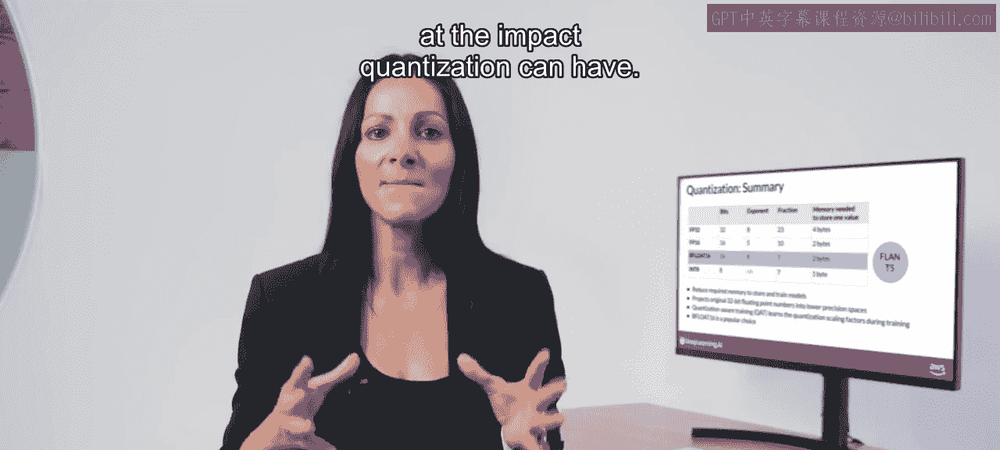

请注意下周实验中对Bfloat16的提及。

## 量化对GPU内存的影响

现在，让我们回到将模型装入GPU内存的挑战，看看量化可能产生的影响。

通过应用量化，你可以将存储模型参数所需的内存消耗减少到仅2GB（使用16位半精度），节省了50%。你还可以通过将模型参数表示为8位整数，进一步将内存占用再减少50%，这只需要1GB的GPU内存。请注意，在所有这些情况下，你仍然拥有一个10亿参数的模型。正如你所见，代表模型的圆圈大小相同。

量化在训练方面会给你带来相同程度的节省。正如你之前听到的，当你尝试以32位全精度训练一个10亿参数模型时，你很快就会达到单个NVIDIA A100 GPU 80GB内存的极限。如果你想在单个GPU上训练，就需要考虑使用16位或8位量化。请记住，现在许多模型的规模超过500亿甚至1000亿参数，这意味着你需要多达500倍的内存容量来训练它们，达到数万GB。

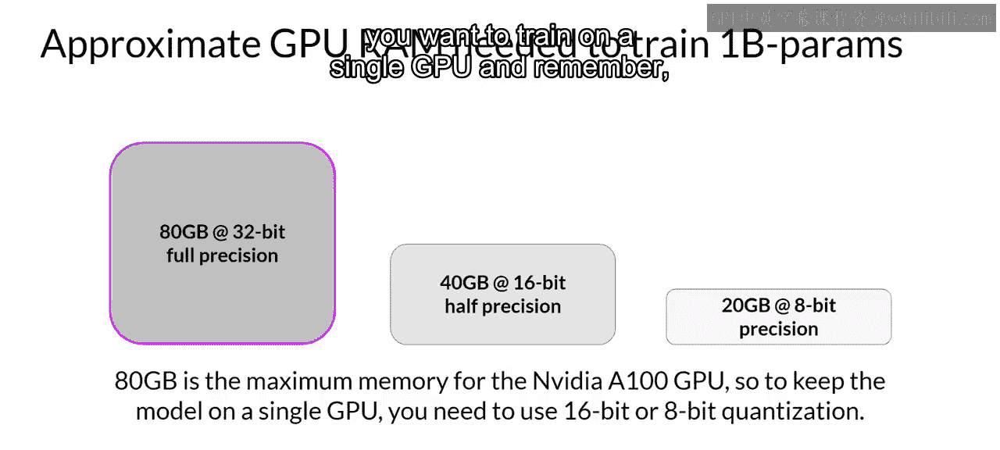

## 模型规模与分布式训练

这些庞大的模型使我们一直在考虑的10亿参数模型相形见绌，左侧是按比例显示的对比图。

当模型规模超过几十亿参数时，在单个GPU上训练它们变得不可能。相反，你需要转向分布式计算技术，在多个GPU上训练你的模型。这可能需要访问数百个GPU，这非常昂贵。这也是大多数时候你不会从头开始预训练自己的模型的另一个原因。

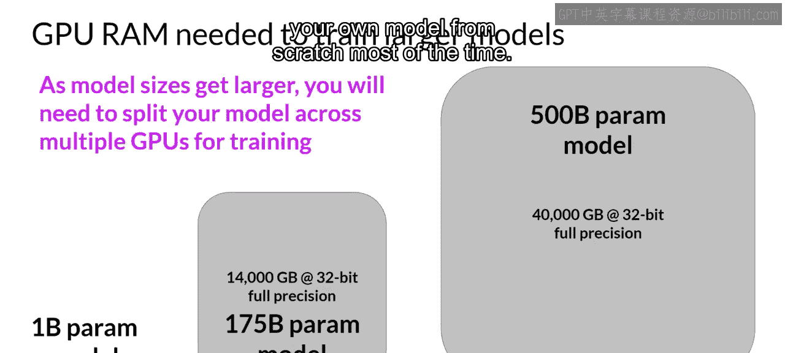

然而，一种称为微调的额外训练过程（你将在下周学习）也需要将所有训练参数存储在内存中，而且你很可能会在某个时候想要微调模型。

为了帮助你更多地了解跨GPU训练的技术方面，我们为你准备了一个可选视频。它非常详细，但将帮助你了解像你这样的开发者为训练更大模型而存在的一些选项。你可以自由跳过这个视频，但如果你有兴趣了解更多，我希望你能看一看。

## 课程总结

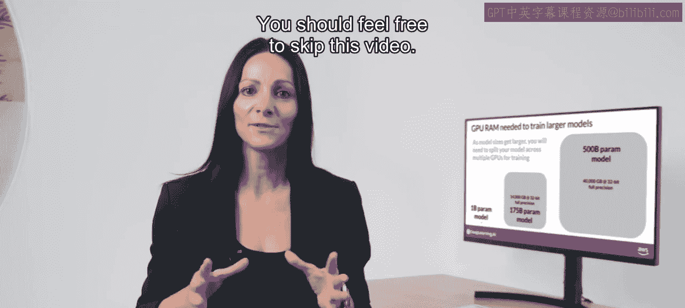

本节课中，我们一起学习了训练大型语言模型时面临的核心内存挑战。我们探讨了内存不足问题的根源，并深入了解了量化技术如何通过降低参数精度（从FP32到FP16/BF16或INT8）来显著减少内存占用。我们还认识到，对于超大规模模型，分布式训练是必不可少的。理解这些计算限制和技术解决方案，是有效利用和定制大型语言模型的基础。