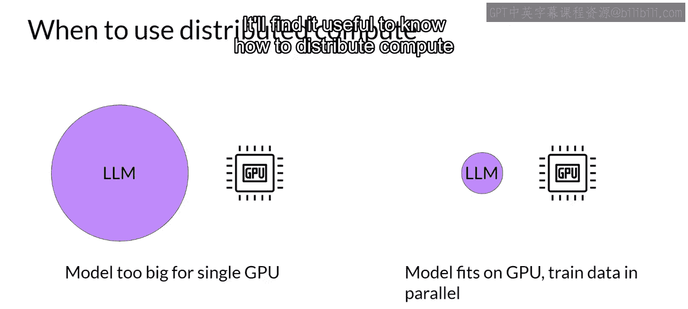
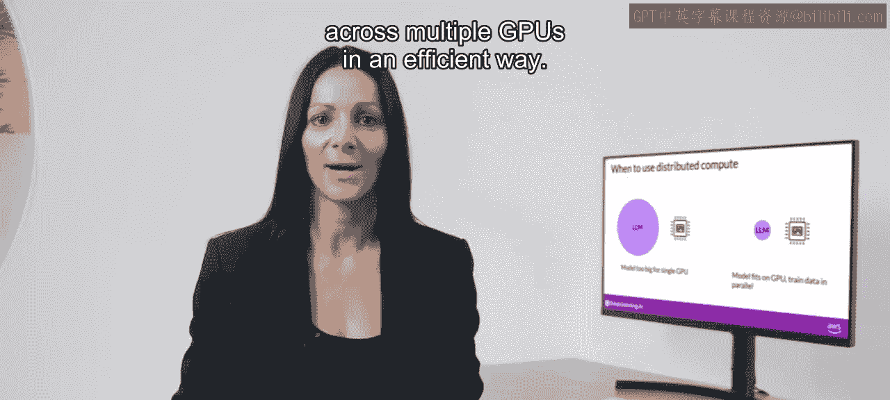
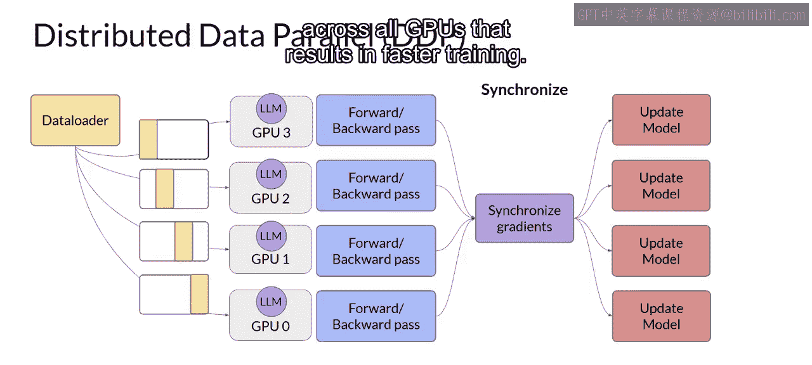
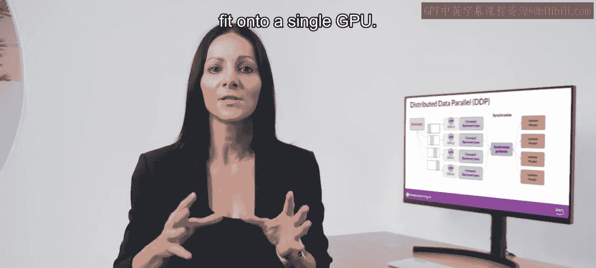
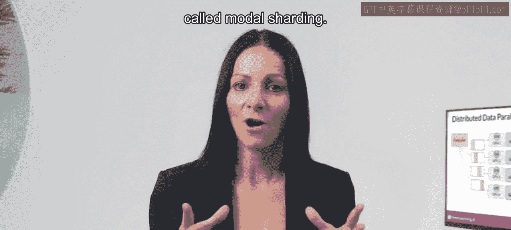
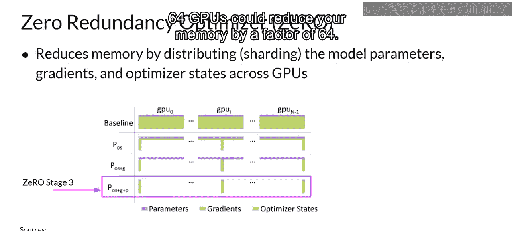
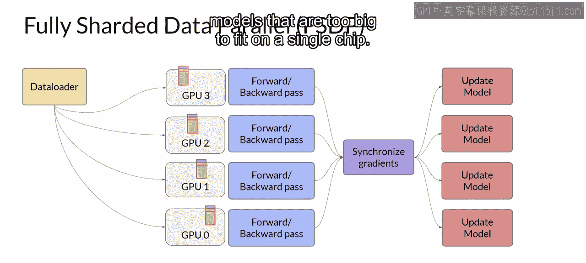
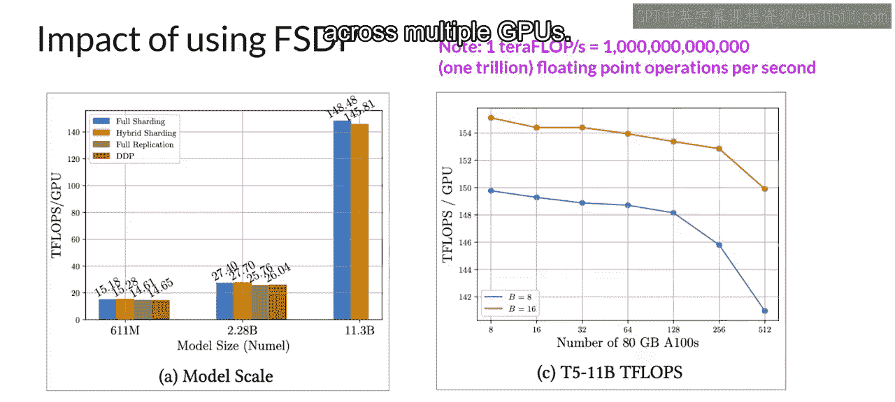
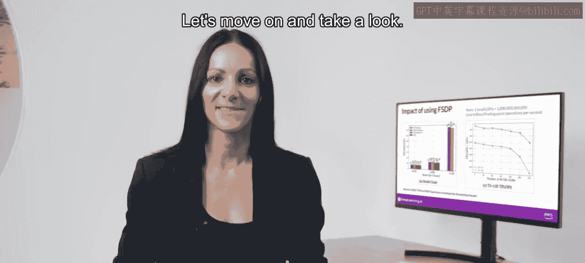

# 015：14_可选视频- 高效的多GPU计算策略 🚀

在本节课中，我们将要学习如何将模型训练扩展到单个GPU之外。我们将探讨两种核心的多GPU计算策略：模型复制与模型分片，并了解它们如何帮助加速训练或处理无法放入单个GPU的大型模型。

## 概述

当模型变得太大，无法放入单个GPU时，或者即使模型能放入单个GPU，但为了加速训练，我们都需要使用多GPU计算策略。了解如何在GPU之间高效地分配计算至关重要。

上一节我们介绍了多GPU计算的必要性，本节中我们来看看具体的实现策略。

## 模型复制策略：分布式数据并行

首先，考虑模型仍能放入单个GPU的情况。扩展模型训练的第一步是将大型数据集分发到多个GPU上，并并行处理这些数据批次。

以下是实现模型复制的一种流行方法：

*   **PyTorch分布式数据并行**：简称**DDP**。其工作原理如下：
    1.  将你的模型复制到每个GPU上。
    2.  并行地向每个GPU发送一批数据。
    3.  每个GPU并行处理其数据。
    4.  通过一个同步步骤，合并每个GPU的计算结果。
    5.  根据合并的结果更新每个GPU上的模型，确保所有GPU上的模型始终保持一致。

这种实现方式允许在所有GPU上进行并行计算，从而带来更快的训练速度。

**注意**：DDP要求你的模型权重以及训练所需的所有额外参数（梯度和优化器状态）都能放入单个GPU。如果你的模型太大，无法满足此条件，则应考虑另一种称为**模型分片**的技术。

## 模型分片策略：全分片数据并行

模型分片的一个流行实现是**PyTorch Fully Sharded Data Parallel**，简称**FSDP**。FSDP的灵感来源于微软研究人员在2019年发表的一篇论文，该论文提出了一种名为**ZeRO**的技术。ZeRO代表“零冗余优化器”，其目标是通过在GPU之间分发（或分片）模型状态且**零数据重叠**来优化内存。这使你能够在模型无法放入单个芯片内存时，跨GPU扩展模型训练。

在深入FSDP之前，我们先快速了解一下ZeRO的工作原理。本周早些时候，我们了解了训练LLM所需的所有内存组件。其中最大的内存需求是**优化器状态**，它占用的空间是权重的两倍，其次是**权重本身**和**梯度**。

让我们用蓝色方框代表参数，黄色代表梯度，绿色代表优化器状态。之前介绍的模型复制策略的一个限制是，你需要在每个GPU上保留一个完整的模型副本，这会导致冗余的内存消耗（你在每个GPU上存储相同的数据）。而**ZeRO则通过跨GPU分发（也称为分片）模型参数、梯度和优化器状态，而不是复制它们，从而消除了这种冗余**。同时，同步模型状态所需的通信开销与之前讨论的DDP保持接近。

ZeRO提供了三个优化阶段：

1.  **ZeRO阶段1**：仅跨GPU分片**优化器状态**。这最多可将内存占用减少4倍。
2.  **ZeRO阶段2**：在阶段1的基础上，**同时跨芯片分片梯度**。结合使用阶段1和2，最多可将内存占用减少8倍。
3.  **ZeRO阶段3**：分片所有组件，包括跨GPU的**模型参数**。结合使用阶段1、2和3，内存减少量与GPU数量成线性关系。例如，在64个GPU上进行分片，可将内存减少64倍。

让我们将这个分片概念应用到DDP的可视化中，并用模型参数、梯度和优化器状态的内存表示来替换LLM。当你使用FSDP时，你像在DDP中看到的那样，将**数据**分发到多个GPU上。

但与DDP不同的是，**FSDP还会使用ZeRO论文中指定的策略之一，将模型参数、梯度和优化器状态分发（分片）到GPU节点上**。通过这种策略，你现在可以处理那些太大而无法放入单个芯片的模型。

## FSDP与DDP的对比

与DDP（每个GPU本地拥有处理每批数据所需的所有模型状态）不同，**FSDP要求在前向传播和反向传播之前，从所有GPU收集这些数据**。

每个GPU按需从其他GPU请求数据，以便在操作期间将分片数据具体化为未分片数据。操作完成后，你将未分片的非本地数据作为原始分片数据释放回其他GPU。你也可以选择将其保留以供未来操作使用（例如，在反向传播期间），但这需要更多的GPU内存。这是一个典型的性能与内存权衡的决策。

在反向传播之后的最后一步，FSDP以与DDP相同的方式跨GPU同步梯度。通过FSDP描述的模型分片，可以降低整体GPU内存利用率。此外，你还可以指定FSDP将部分训练计算卸载到CPU上，以进一步减少GPU内存使用。

为了管理性能与内存利用率之间的权衡，你可以使用FSDP的**分片因子**来配置分片级别：

*   **分片因子为1**：基本上移除了分片，并像DDP一样复制完整模型。
*   **分片因子设置为最大可用GPU数量**：开启完全分片。这能最大程度节省内存，但会增加GPU间的通信量。
*   **介于两者之间的任何分片因子**：启用混合分片。

## 性能对比

让我们看看FSDP与DDP相比的性能如何（以每GPU的TFLOPS衡量）。这些测试使用最多512个NVIDIA A100 GPU（每个80GB内存）进行。注意：1 TFLOPS对应每秒1万亿次浮点运算。

第一张图显示了不同大小T5模型的FSDP性能。你可以看到FSDP完全分片（蓝色）、混合分片（橙色）和完全复制（绿色）的不同性能数字。作为参考，DDP性能以红色显示。对于前两个T5模型（6.11亿参数和22.8亿参数），FSDP和DDP的性能相似。

现在，如果你选择一个超过22.8亿参数的模型大小，例如113亿参数的T5模型，DDP会遇到内存不足错误。而另一方面，FSDP可以轻松处理这种大小的模型，并在将模型精度降低到16位时实现更高的TFLOPS。

第二张图显示，对于113亿参数的T5模型，当GPU数量从8个增加到512个时，每GPU的TFLOPS下降了约7%（图中橙色线为批次大小16，蓝色线为批次大小8）。随着模型规模增大并分布在越来越多的GPU上，芯片间通信量的增加开始影响性能，减慢计算速度。

总之，这表明你可以将FSDP用于小型和大型模型，并无缝地将模型训练扩展到多个GPU上。

## 总结

本节课中我们一起学习了两种高效的多GPU计算策略。我们首先介绍了**分布式数据并行**，它通过复制模型来并行处理数据以加速训练。接着，我们深入探讨了**全分片数据并行**，它基于ZeRO技术，通过分片模型状态来允许训练远超单个GPU内存容量的大型模型。理解这些策略如何分配数据、模型参数和计算，对于高效扩展LLM训练至关重要。鉴于跨GPU训练模型的昂贵性和技术复杂性，一些研究人员正在探索如何用更小的模型获得更好的性能，我们将在下一视频中了解相关内容。