# 016：缩放定律和计算优化模型

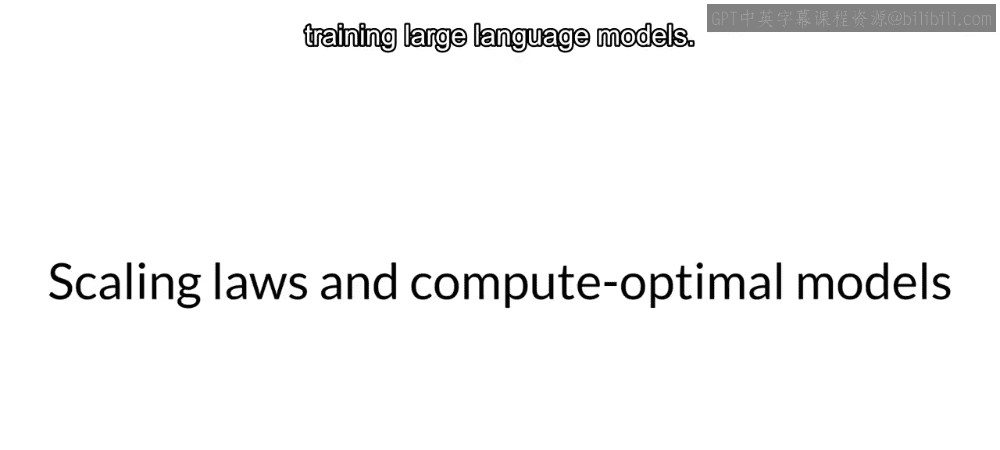

在本节课中，我们将要学习大型语言模型训练中的缩放定律，以及如何优化计算资源、模型大小和训练数据量之间的关系，以实现最佳性能。

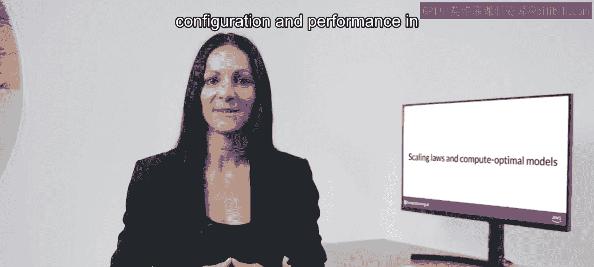

## 概述

上一节我们探讨了训练大型语言模型面临的一些计算挑战。本节中，我们将深入研究模型大小、训练配置与性能之间的关系，以确定模型究竟需要多大才能达到最佳效果。记住，预训练的目标是最大化模型在其学习目标上的性能，即最小化预测词元时的损失。

## 计算预算与性能

为了获得更好的性能，你可以选择增加训练模型的数据量，或者增加模型中的参数数量。理论上，你可以扩大其中任何一个或两个量来提高性能。

然而，另一个需要考虑的问题是计算预算，这包括你可用的GPU数量以及可用于训练模型的时间等因素。

为了帮助你理解接下来的讨论，我们首先定义一个量化所需资源的计算单位：**PetaFLOP/s-day**。这个单位衡量的是以每秒1 PetaFLOP（千万亿次浮点运算）的速度运行一整天所执行的浮点运算次数。

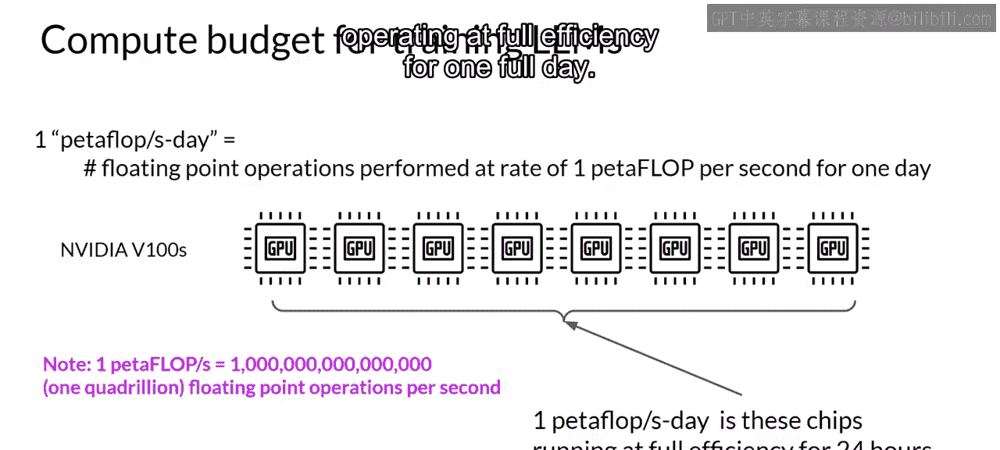

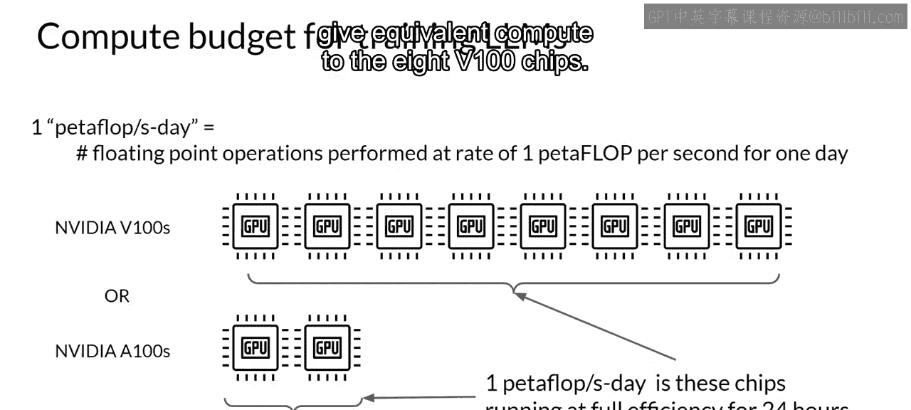

> 注：1 PetaFLOP 对应每秒一千万亿次浮点运算。具体到训练Transformer模型，1 PetaFLOP/s-day 大约相当于8个NVIDIA V100 GPU以最高效率运行一整天。如果你有更强大的处理器，可以同时执行更多操作，那么达到1 PetaFLOP/s-day所需的芯片数量会更少。例如，2个NVIDIA A100 GPU提供的计算能力就相当于8个V100芯片。

为了让你对这些计算预算的规模有个概念，下图比较了预训练不同变体模型所需的PetaFLOP/s-day天数。这些模型包括编码器-解码器模型T5和解码器模型GPT-3。每个模型家族内部的区别在于训练的参数数量，从数亿到1750亿不等。

> 注意：此处的Y轴是对数坐标，因此垂直方向的每个增量代表10的幂次方。我们可以看到，拥有30亿参数的T5-XL模型需要接近100 PetaFLOP/s-day，而更大的GPT-3（1750亿参数）模型则需要大约3700 PetaFLOP/s-day。这张图清楚地表明，训练最大的模型需要巨大的计算量。

由此可见，更大的模型需要更多的计算资源来训练，并且通常也需要更多的数据才能达到良好的性能。

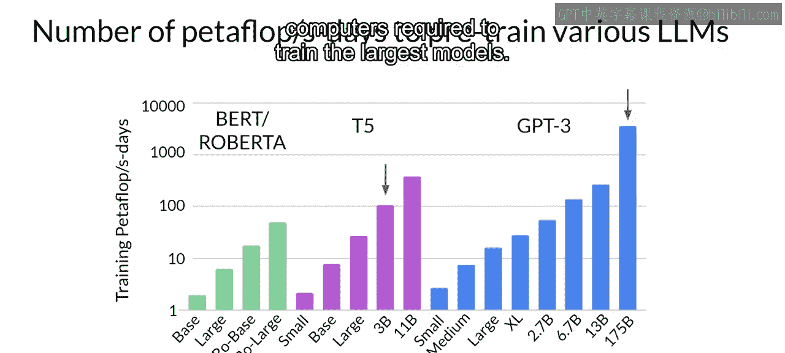

## 缩放定律

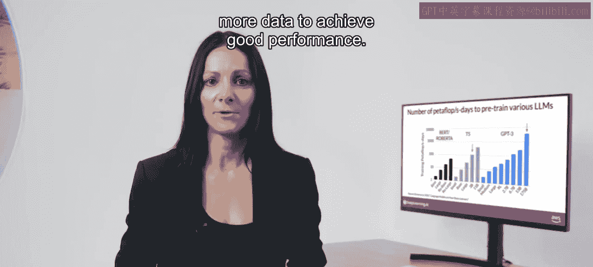

事实证明，这些选择之间存在着明确的关系。研究人员已经探索了训练数据集大小、模型大小和计算预算之间的权衡。

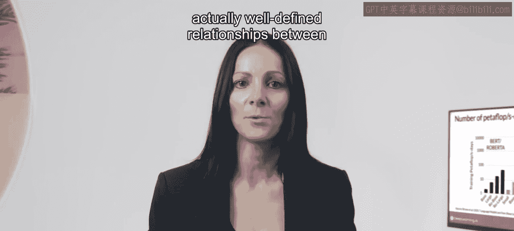

以下是OpenAI研究人员一篇论文中的图表，探讨了计算预算对模型性能的影响。Y轴是测试损失，你可以将其视为模型性能的代理指标，数值越小越好。X轴是以PetaFLOP/s-day为单位的计算预算。

每条细蓝线代表一次单独训练运行中模型损失的变化。观察每次运行中损失开始下降变缓的点，可以清晰地看到计算预算与模型性能之间的关系。这种关系可以用一条粉红色的幂律关系线来近似。

> **幂律** 是两个变量之间的一种数学关系，其中一个变量与另一个变量的某次幂成正比。在双对数坐标图中，幂律关系表现为一条直线。

只要模型大小和训练数据集大小不限制训练过程，这种关系就成立。因此，表面上看，这似乎意味着你可以通过增加计算预算来提高模型性能。

然而在实践中，你可用于训练的计算资源通常是一个硬性约束，由诸如可用硬件、训练可用时间和项目财务预算等因素决定。

## 固定计算预算下的优化

如果你将计算预算固定，那么提高模型性能的两个杠杆就是训练数据集的大小和模型中的参数数量。

OpenAI的研究人员发现，在另外两个变量保持不变的情况下，这两个量与测试损失之间也呈现出幂律关系。

以下是论文中另一张图，探讨了训练数据大小对模型性能的影响。在此图中，计算预算和模型大小保持不变，而训练数据集的大小是变化的。图表显示，随着训练数据量的增加，模型的性能持续提升。

在第二张图中，计算预算和训练数据集大小保持不变，训练了不同参数数量的模型。随着模型大小的增加，测试损失下降，表明性能更好。

此时你可能会问，这三个量之间的理想平衡点是什么？事实证明，很多人对这个问题感兴趣，研究和工业界都发布了大量关于预训练计算优化模型的实证数据。

## 计算优化模型：Chinchilla

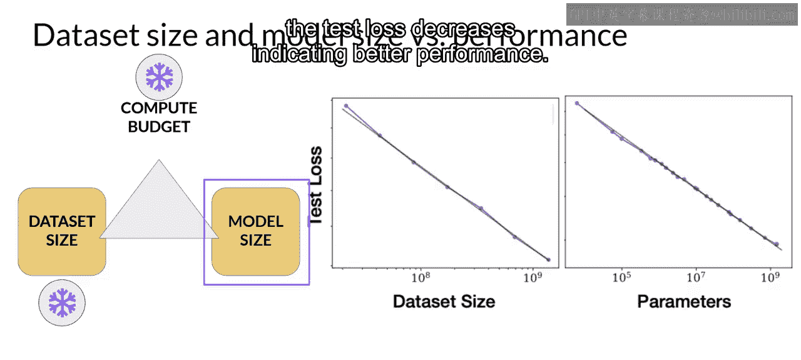

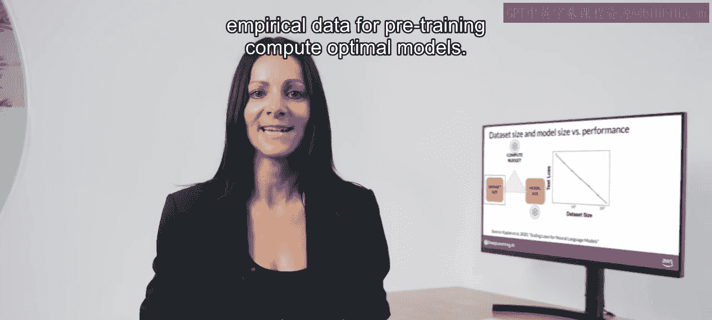

在2022年发表的一篇论文中，由Jordan Hoffman、Sebastian Borgeaud和Arthur Mensch领导的研究小组对不同大小和训练数据量的语言模型性能进行了详细研究。他们的目标是为给定的计算预算找到最优的参数数量和训练数据量。作者将得到的计算优化模型命名为 **Chinchilla**，因此这篇论文通常被称为 **Chinchilla论文**。

让我们看看他们的一些发现。Chinchilla论文暗示，许多像GPT-3这样的千亿参数大型语言模型实际上可能是**过度参数化**的，这意味着它们拥有的参数超过了实现良好语言理解所需的量；同时又是**训练不足**的，这意味着它们会从看到更多训练数据中受益。

作者假设，如果在小模型上使用更大的数据集进行训练，它们可能能够达到与更大模型相同的性能。

在下表中，你可以看到一系列模型及其大小和训练数据信息。

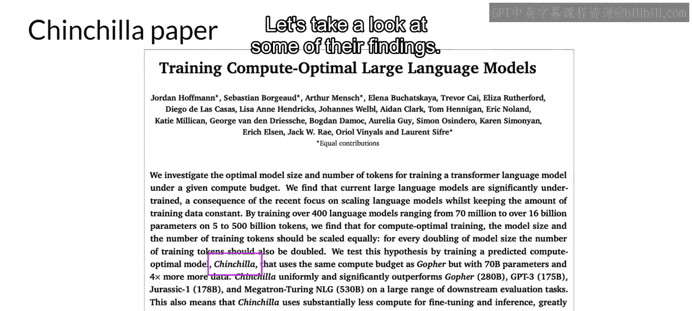

Chinchilla论文的一个重要结论是：对于给定模型，最优的训练数据集大小大约是模型参数数量的**20倍**。Chinchilla被确定为计算最优模型，因此对于一个700亿参数的模型，理想的训练数据集应包含**1.4万亿个词元**，即参数数量的20倍。

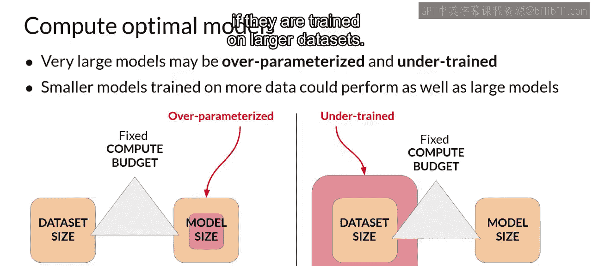

表中最后三个模型是在小于Chinchilla最优大小的数据集上训练的，因此这些模型可能确实训练不足。相比之下，LLaMA模型在1.4万亿词元的数据集上训练，这个数字接近Chinchilla推荐的数量。

该论文的另一个重要结果是，计算最优的Chinchilla模型在一系列下游评估任务上的表现优于非计算最优模型（如GPT-3）。

## 计算优化模型的影响

有了Chinchilla论文的结果，最近一些团队已经开始开发更小的模型，这些模型取得了与以非最优方式训练的更大模型相似甚至更好的结果。

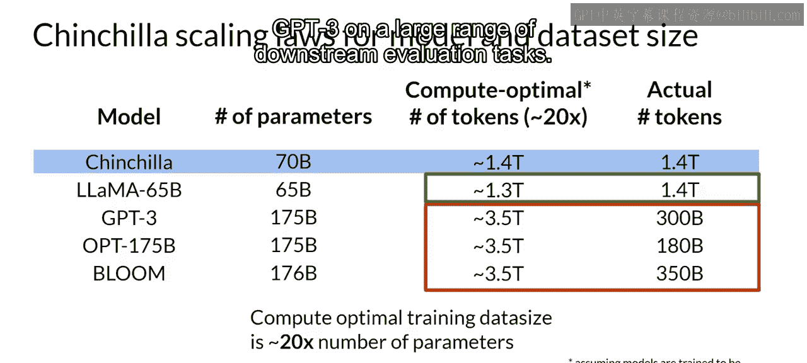

因此，展望未来，随着更多团队或像你一样的开发者开始优化他们的模型设计，你可能会看到与过去几年“越大越好”趋势的偏离。

本幻灯片中展示的最后一个模型，**BloombergGPT**，是一个非常有趣的模型。它遵循Chinchilla损失以计算最优的方式进行训练，因此以500亿参数的规模实现了良好的性能。

它也是一个有趣的例子，说明了在某些情况下，为了获得良好的任务性能，从头开始预训练模型是必要的。

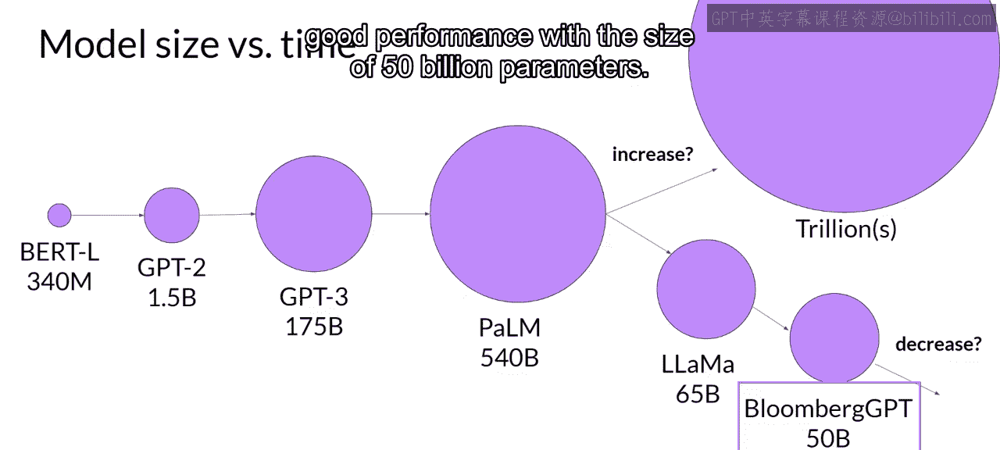

## 总结

本节课中，我们一起学习了大型语言模型训练中的缩放定律。我们了解到，模型性能与计算预算、模型大小和训练数据量之间存在幂律关系。通过Chinchilla论文，我们认识到，对于给定的计算预算，存在一个最优的模型大小与训练数据量的平衡点（约为1:20），这可以让我们用更小的模型和更多的数据，达到甚至超越非最优训练的大模型的性能。这为未来更高效地设计和训练语言模型提供了重要指导。