# 017：针对特定领域的预训练 🎯

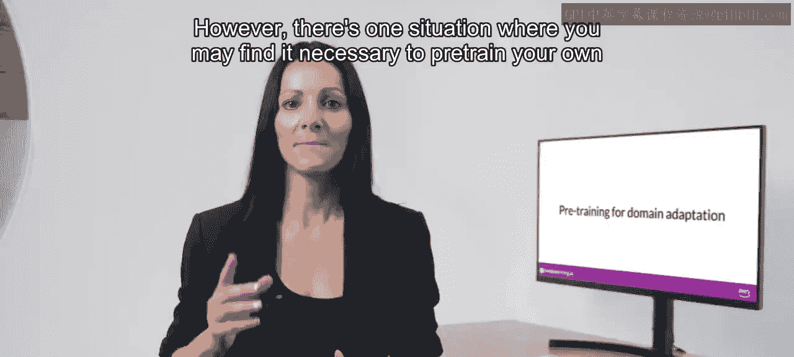

在本节课中，我们将要学习在何种情况下需要为一个高度专业化的领域从头开始预训练自己的大型语言模型，并以金融领域的Bloomberg GPT为例，探讨其中的权衡与考量。

到目前为止，我们一直强调，在开发应用时，通常会使用现有的大型语言模型。这可以节省大量时间，并更快地获得可工作的原型。然而，存在一种情况，您可能会发现有必要从头开始预训练自己的模型。

## 何时需要领域预训练？⚖️

如果您的目标领域使用的词汇和语言结构在日常语言中不常见，您可能需要进行领域适应才能获得良好的模型性能。

以下是几个具体例子：

*   **法律领域**：法律写作使用非常特定的术语，例如“Mens rea”（犯罪意图）和“res judicata”（既判力）。这些词汇在法律世界之外很少使用，这意味着它们不太可能广泛出现在现有LLM的训练文本中。因此，模型可能难以理解或正确使用这些术语。另一个问题是，法律语言有时会在不同的语境中使用日常词汇，例如“consideration”（对价），它与“友善”无关，而是指使合同协议可强制执行的主要要素。
*   **医疗领域**：医疗语言包含许多描述医疗状况和程序的不常见词汇，这些词汇在由网络抓取和书籍文本组成的数据集中可能不会频繁出现。某些领域还以高度特殊的方式使用语言。例如，处方缩写“1 tab PO QID AC & HS”对药剂师有非常明确的含义：“每日四次，每次一片，餐后及睡前口服”。

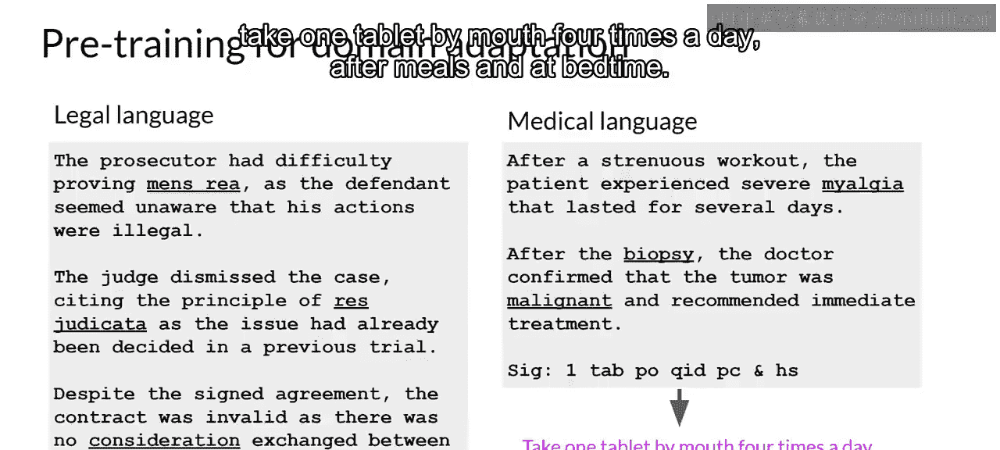

由于模型通过原始的预训练任务来学习词汇和对语言的理解，因此，对于法律、医学、金融或科学等高度专业化的领域，从头开始预训练模型将产生更好的模型。

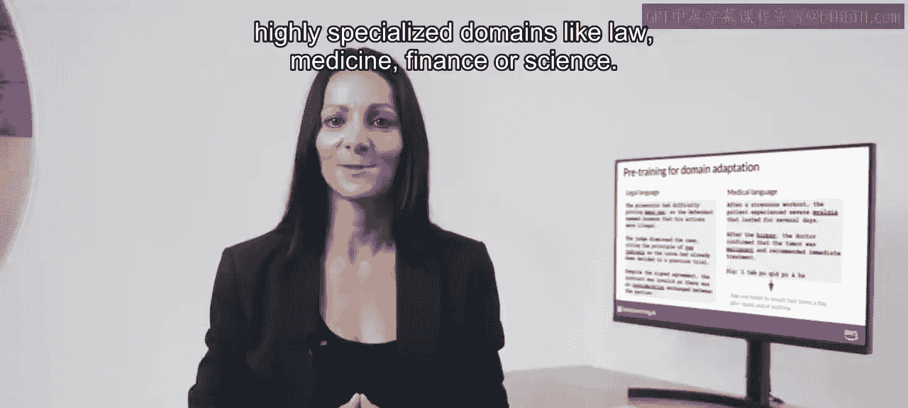

## 案例研究：Bloomberg GPT 📈

现在，让我们回到Bloomberg GPT。它于2023年由彭博社的X. Qi Wu、Stephen Luu及其同事在一篇论文中首次宣布。Bloomberg GPT是一个为特定领域（本例中是金融）预训练的大型语言模型的例子。

彭博社的研究人员选择结合金融数据和通用文本数据来预训练一个模型，该模型在金融基准测试中取得了最佳结果，同时在通用LLM基准测试中也保持了有竞争力的性能。因此，研究人员选择的数据集由51%的金融数据和49%的公共数据组成。

在他们的论文中，彭博社的研究人员更详细地描述了模型架构。他们还讨论了如何以Chinchilla缩放定律为指导，以及他们必须在哪些方面做出权衡。

以下两张图比较了包括Bloomberg GPT在内的多个LLM与研究人员讨论的缩放定律。左图中的对角线描绘了针对一系列计算预算（以十亿参数计）的最优模型大小。右图中的线描绘了计算最优的训练数据集大小（以token数量计）。

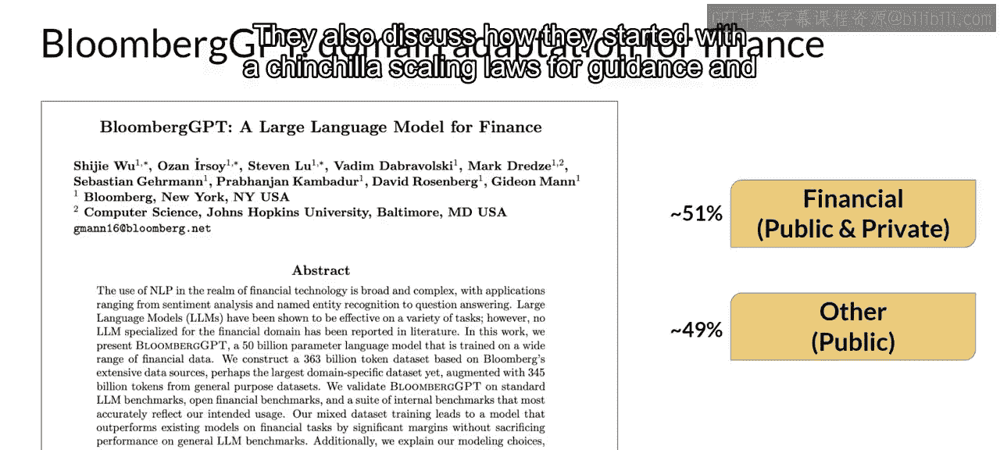

每张图中的粉色虚线表示彭博团队可用于训练新模型的计算预算。粉色阴影区域对应于Chinchilla论文中确定的计算最优缩放损失。

就模型大小而言，您可以看到，在给定的130万GPU小时（约2.3亿petaFLOPs）计算预算下，Bloomberg GPT大致遵循了Chinchilla方法。模型参数数量仅略高于粉色阴影区域，表明参数数量相当接近最优值。

然而，用于预训练Bloomberg GPT的实际token数量（5690亿）低于可用计算预算所推荐的Chinchilla值。这个小于最优值的训练数据集是由于金融领域数据的可用性有限，这表明现实世界的约束可能迫使您在预训练自己的模型时做出权衡。

## 第一周内容回顾 📚

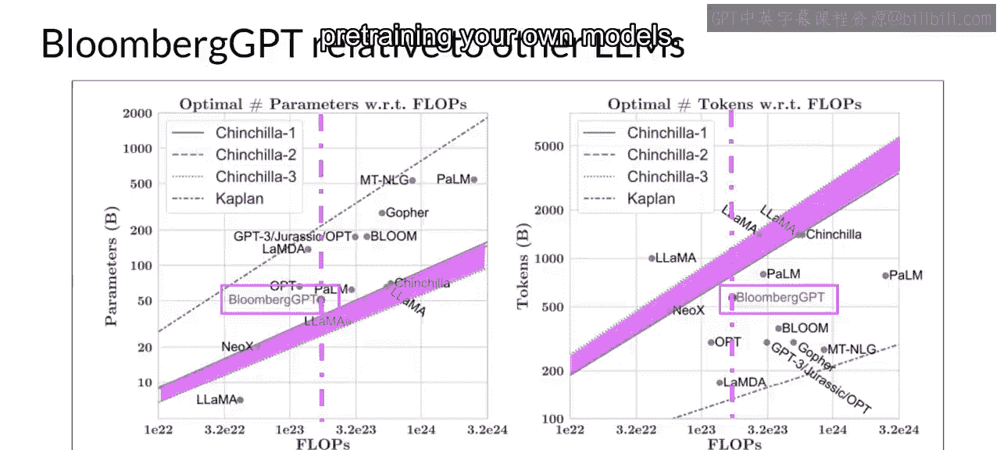

恭喜您完成第一周的学习！您已经涵盖了很多内容，让我们花点时间回顾一下您所看到的内容。

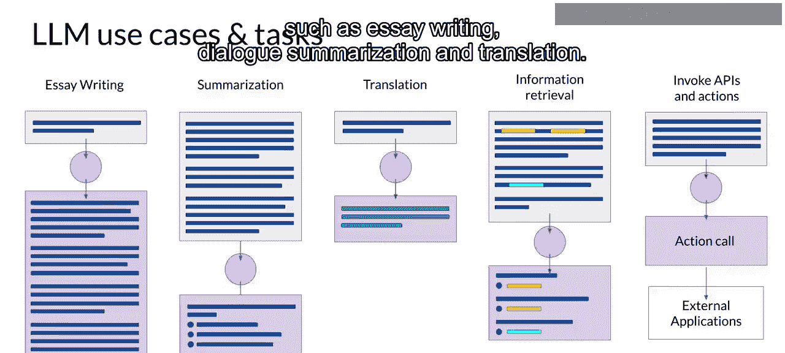

Mike带您了解了LLM的一些常见用例，例如论文写作、对话总结和翻译。

接着，他详细介绍了为这些模型提供动力的Transformer架构，并讨论了在推理时可以用来影响模型输出的一些参数。最后，他向您介绍了一个生成式AI项目生命周期，您可以用它来规划和指导您的应用开发工作。

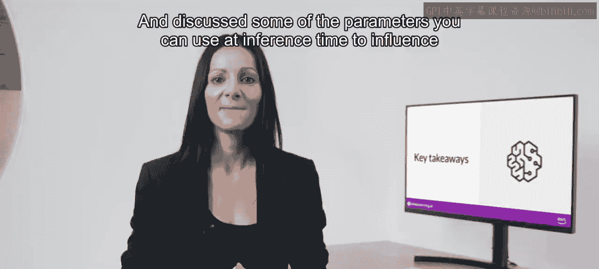

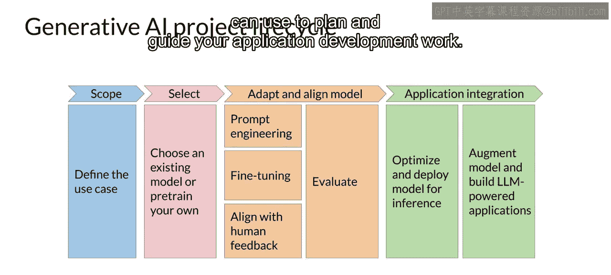

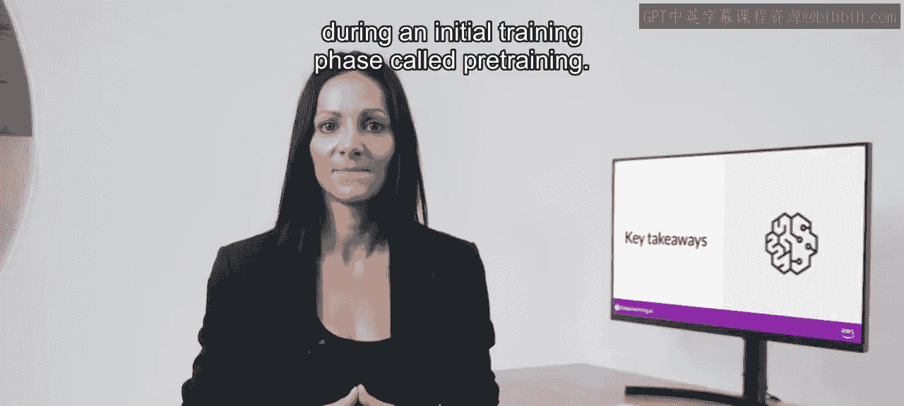

然后，您看到了模型在称为“预训练”的初始训练阶段是如何在大量文本数据上进行训练的。这是模型形成对语言理解的地方。您探讨了训练这些模型的一些计算挑战，这些挑战在实践中非常重要。由于GPU内存限制，在训练模型时几乎总是会使用某种形式的量化。

您将以对LLM已发现的缩放定律的讨论结束本周的学习，以及如何利用它们来设计计算最优的模型。如果您想了解更多细节，请务必查看本周的阅读练习。

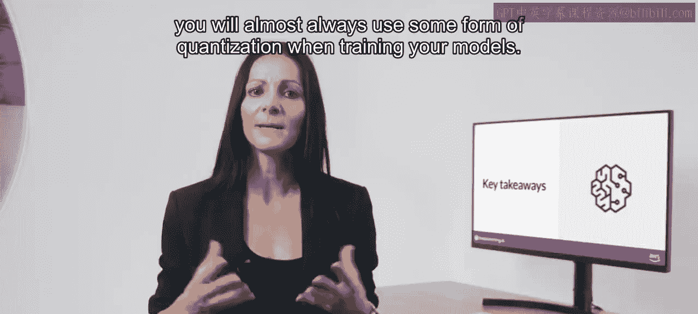

## 总结

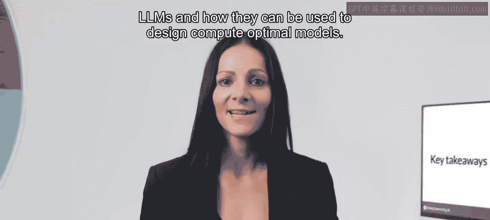

本节课中，我们一起学习了针对特定领域进行预训练的必要性。当目标领域（如法律、医疗、金融）使用大量专业术语或特殊语言结构时，使用通用语料库预训练的模型可能表现不佳。此时，结合领域数据从头预训练或继续预训练是更优选择。我们以Bloomberg GPT为例，看到了在实际操作中，研究人员需要在模型大小、训练数据量和计算预算之间根据领域数据的可用性做出权衡。这为我们在特定领域应用LLM提供了重要的实践指导。