# 019：指导式微调 🎯

在本节课中，我们将要学习如何通过指导式微调来提升大型语言模型在特定任务上的性能。我们将探讨微调的基本概念、具体步骤以及评估模型性能的重要指标。

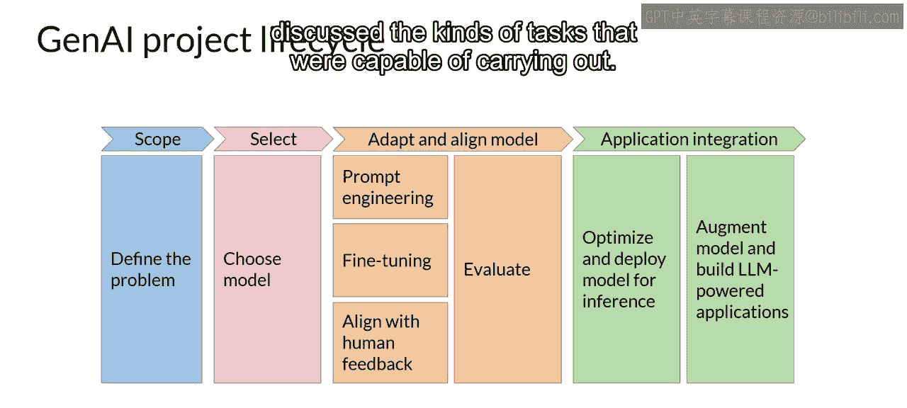

上周，我们介绍了生成式人工智能项目的生命周期。我们探讨了大型语言模型的用例，并讨论了它们能够执行的任务类型。

本节中，我们将学习可用于提升现有模型在特定用例上性能的方法。

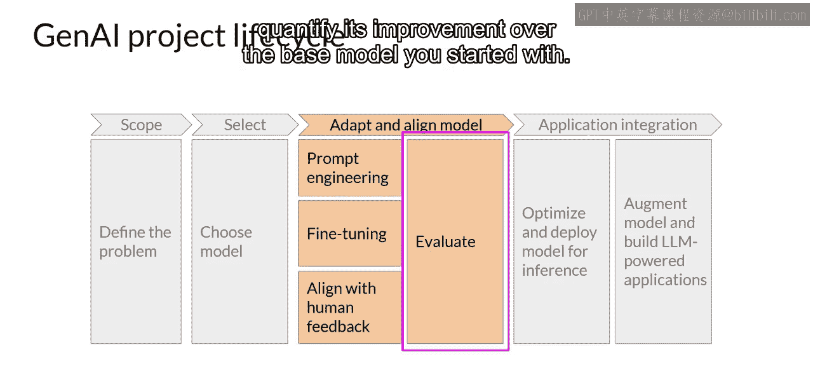

我们还将学习用于评估微调后LLM性能的重要指标，并量化其相对于初始基础模型的改进。

## 指导式微调简介

让我们从讨论如何使用指导提示对LLM进行微调开始。在本课程早期，我们看到一些模型能够识别提示中包含的指令并正确执行零样本推理。

而其他模型，例如较小的LLM，可能无法执行任务，如下面这个例子所示。

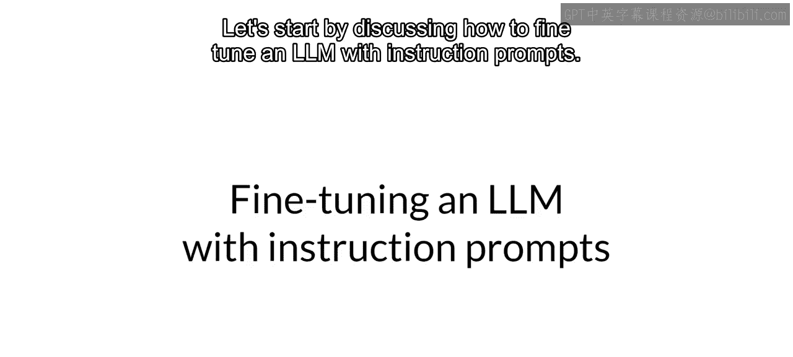

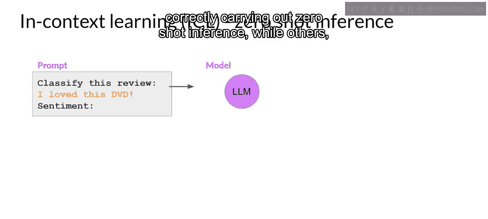

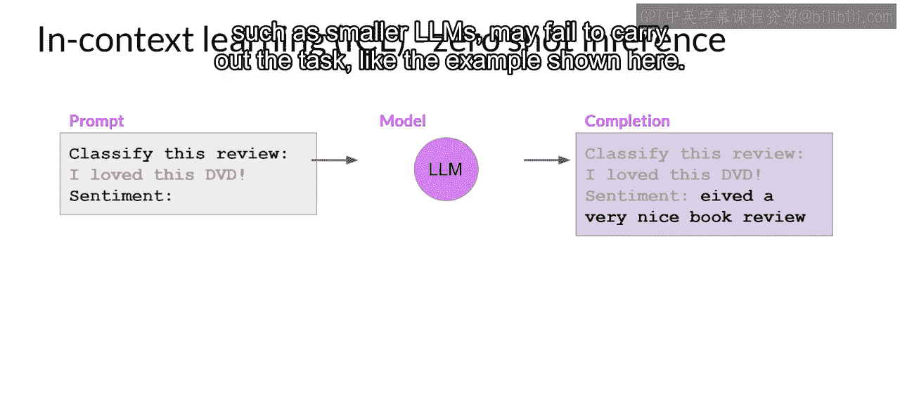

我们也看到，包含一个或多个你希望模型执行的示例（称为单样本或少样本推理）可能足以帮助模型识别任务并生成良好的补全。

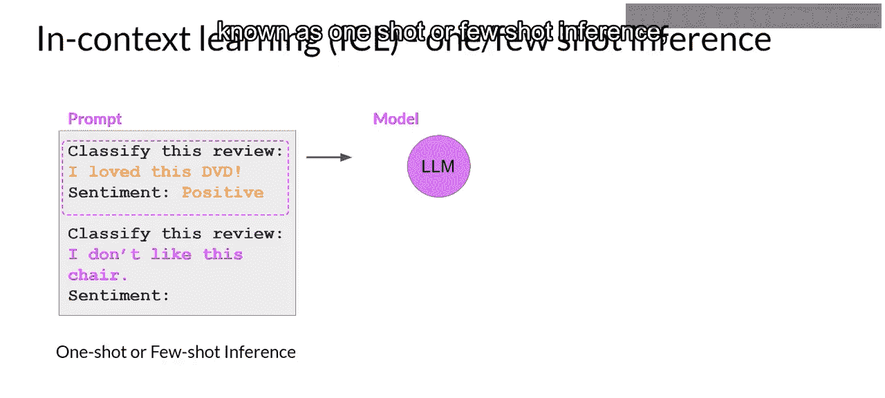

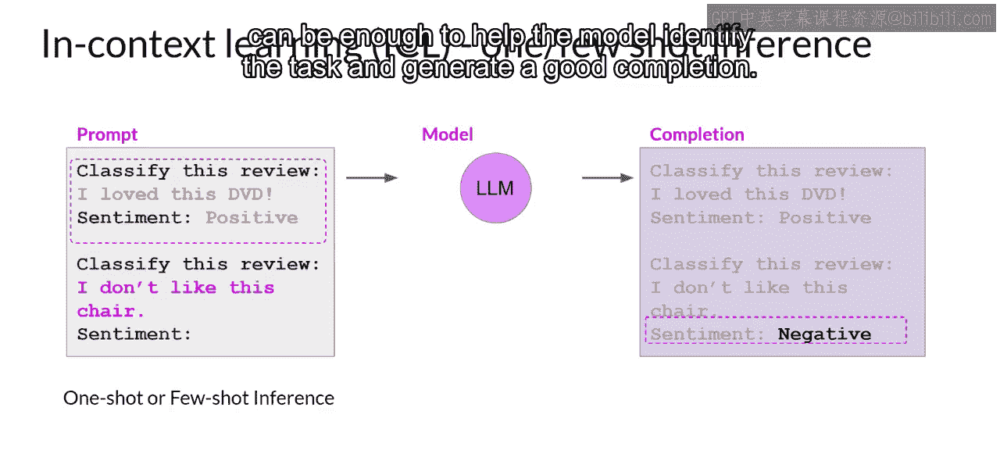

然而，这种策略有几个缺点。首先，对于较小的模型，即使包含五六个示例，它也不总是有效。

其次，提示中包含的示例会占用上下文窗口中的宝贵空间，减少了包含其他有用信息的空间。

幸运的是，存在另一种解决方案：你可以利用一个称为微调的过程来进一步训练基础模型。

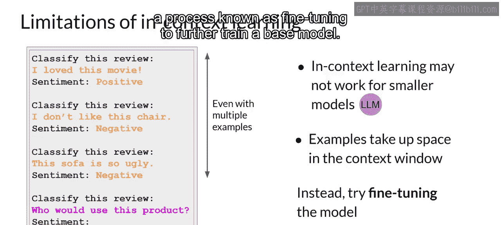

## 微调与预训练的区别

与预训练不同，预训练是通过自监督学习使用大量非结构化文本数据来训练LLM。

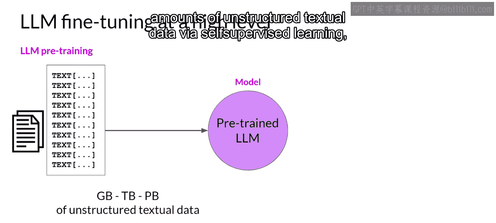

微调是一个监督学习过程，你使用带标签示例的数据集来更新LLM的权重。

带标签的示例是提示-补全对。微调过程扩展了模型的训练，以提高其针对特定任务生成良好补全的能力。

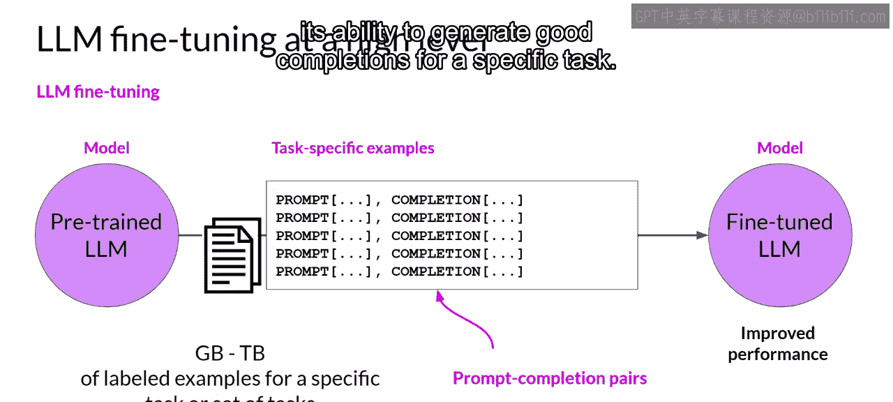

一种称为指导式微调的策略在提升模型在各种任务上的性能方面特别有效。

让我们更仔细地看看这是如何工作的。

## 指导式微调的工作原理

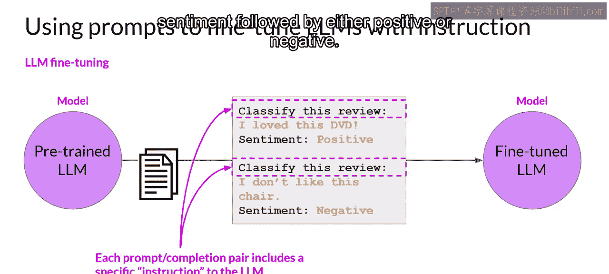

指导式微调使用展示模型应如何响应特定指令的示例来训练模型。

以下是几个示例提示来说明这个想法。

两个示例中的指令都是“classify this review”，期望的补全是一个以“sentiment”开头的文本字符串，后面跟着“positive”或“negative”。

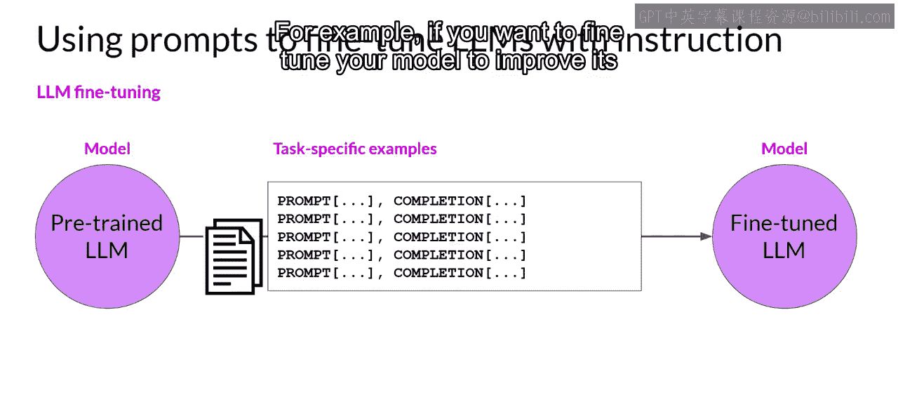

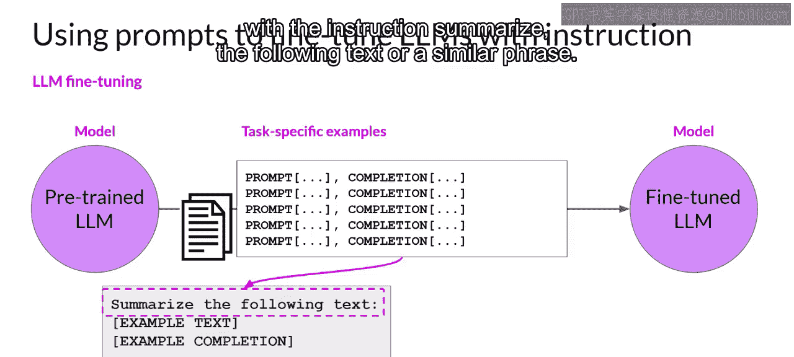

用于训练的数据包括许多你感兴趣任务的提示-补全示例对，每个示例都包含一个指令。

例如，如果你想微调模型以提高其摘要能力，你需要构建一个以“summarize the following text”或类似短语开头的示例数据集。

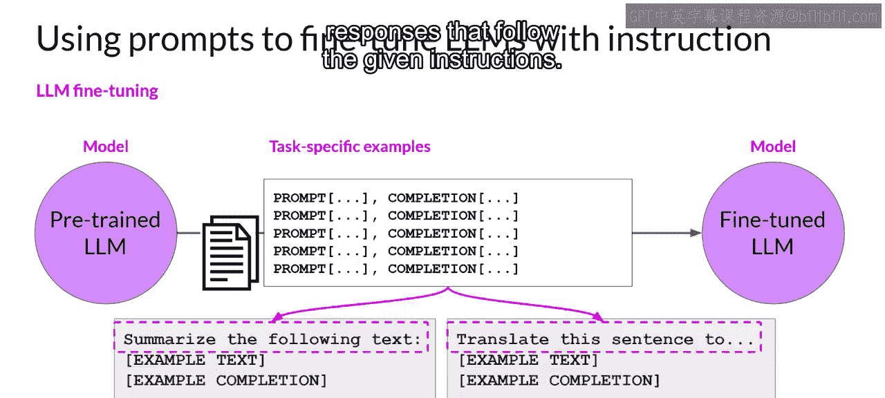

如果你想提升模型的翻译技能，你的示例将包含“translate this sentence”这样的指令。

这些提示-补全示例使模型能够学会生成遵循给定指令的响应。

## 全微调

指导式微调，即更新模型所有权重的方法，被称为全微调。

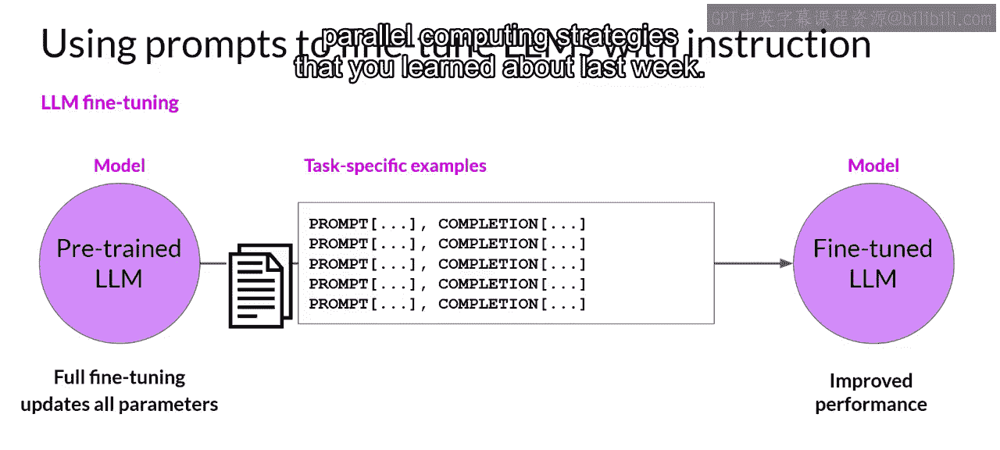

这个过程会产生一个具有更新权重的新版本模型。

需要注意的是，与预训练一样，全微调需要足够的内存和计算预算来存储和处理训练期间更新的所有梯度、优化器和其他组件。因此，你可以从上周学到的内存优化和并行计算策略中受益。

## 执行指导式微调的步骤

那么，你实际上如何进行LLM的指导式微调呢？

第一步是准备你的训练数据。有许多公开可用的数据集曾被用于训练早期版本的语言模型，尽管其中大多数并未格式化为指令。

幸运的是，开发人员已经组装了提示模板库，可用于将现有数据集（例如大型的亚马逊产品评论数据集）转换为用于微调的指导提示数据集。

提示模板库包含许多针对不同任务和不同数据集的模板。

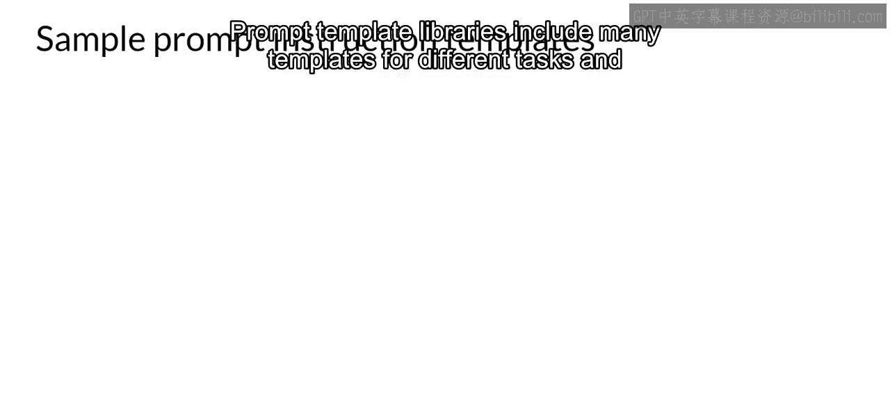

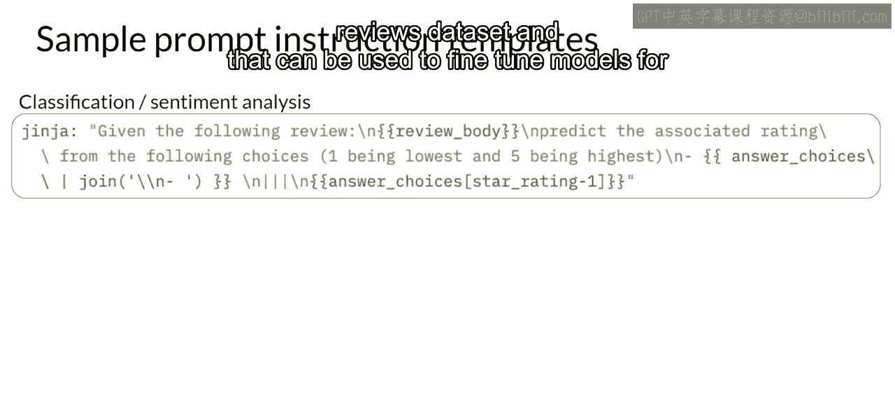

以下是三个设计用于亚马逊评论数据集的提示，可用于微调模型以进行分类、文本生成和文本摘要任务。你可以看到，在每种情况下，你将原始评论（此处称为“review body”）传递给模板，模板将其插入到以指令开头的文本中，例如“predict the associated rating”、“Generate a star review”或“give a short sentence describing the following product review”。

结果是一个现在既包含指令又包含数据集中示例的提示。

一旦你的指导数据集准备就绪，与标准监督学习一样，你将数据划分为训练集、验证集和测试集。

在微调期间，你从训练数据中选择提示并将其传递给LLM，LLM随后生成补全。

接下来，你将LLM生成的补全与训练数据中指定的响应进行比较。

你可以看到这里模型做得并不好，它将评论分类为“neutral”，这有点轻描淡写。该评论显然是非常积极的。

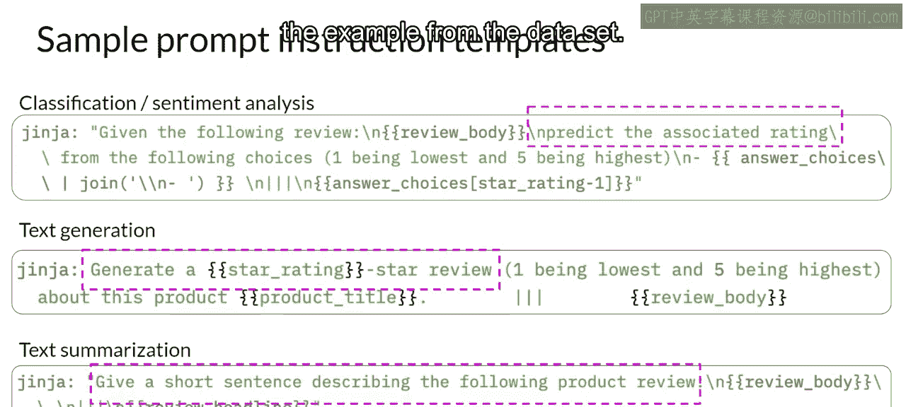

请记住，LLM的输出是跨词元的概率分布，因此你可以比较补全的分布和训练标签的分布，并使用标准的交叉熵函数来计算损失。

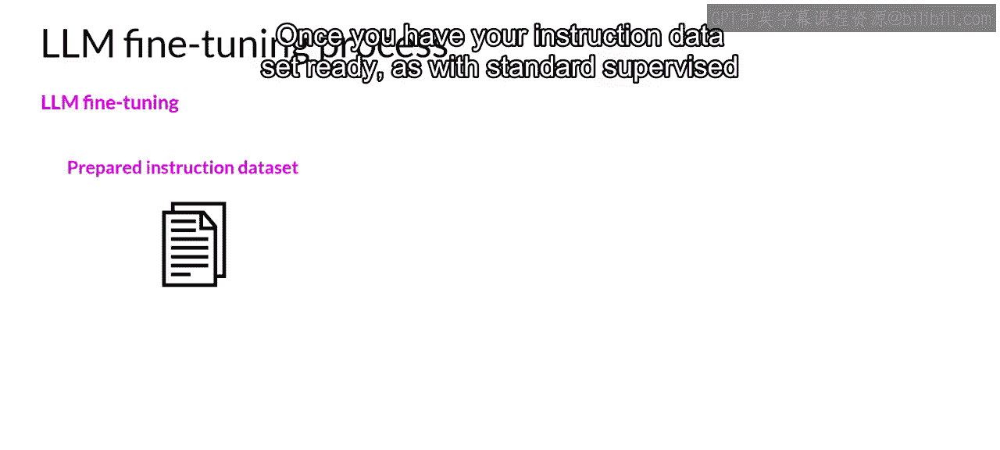

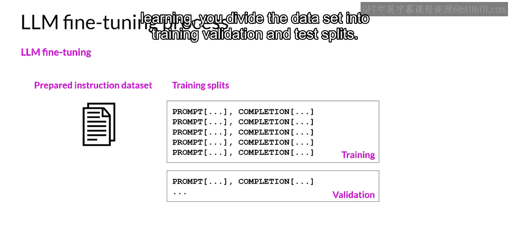

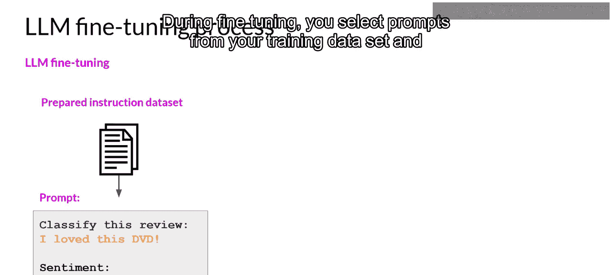

然后使用计算出的损失在标准反向传播中更新你的模型权重。

你将针对许多批次的提示-补全对执行此操作，并在多个训练周期中更新权重，以提高模型在该任务上的性能。

## 评估微调后的模型

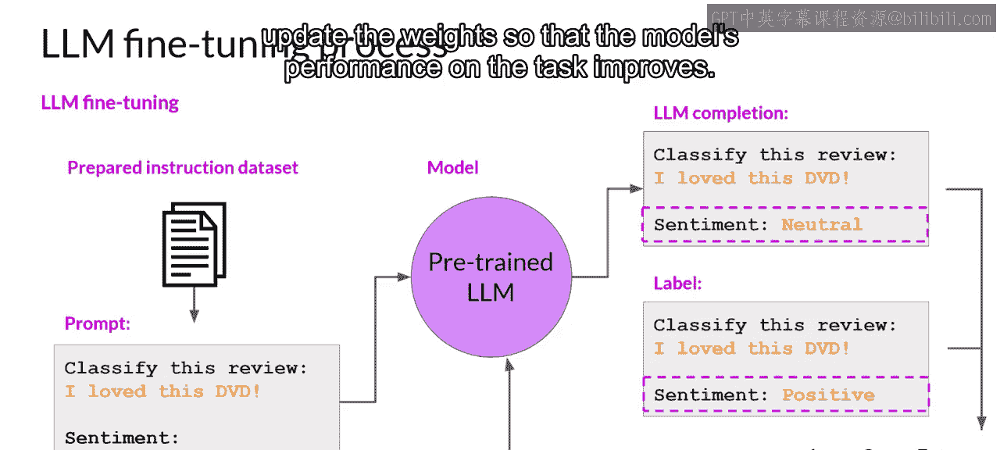

与标准监督学习一样，你可以定义单独的评估步骤，使用留出的验证数据集来衡量LLM的性能。这将为你提供验证准确率。

完成微调后，你可以使用留出的测试数据集执行最终的性能评估。这将为你提供测试准确率。

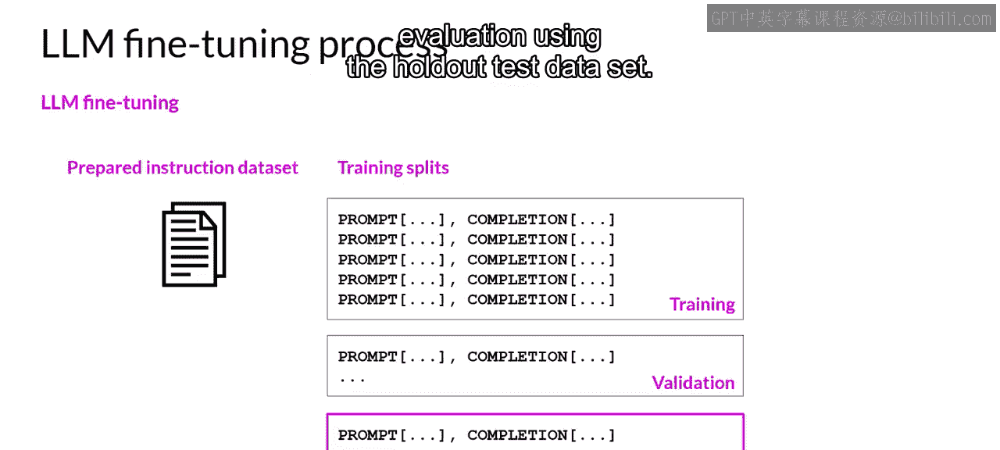

微调过程会产生基础模型的一个新版本，通常称为指导模型，它在您感兴趣的任务上表现更好。

使用指导提示进行微调是当前微调LLM最常见的方式。从现在开始，当你听到或看到“微调”这个术语时，可以假定它总是指指导式微调。

## 总结

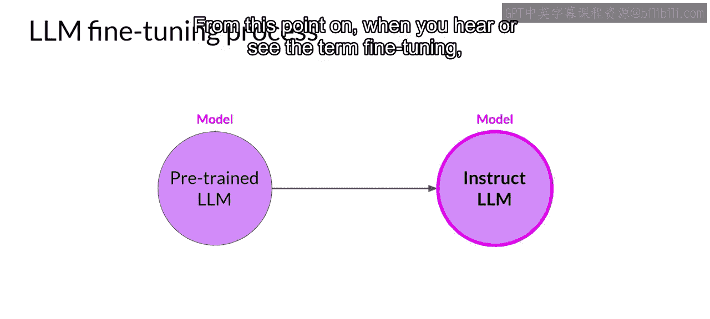

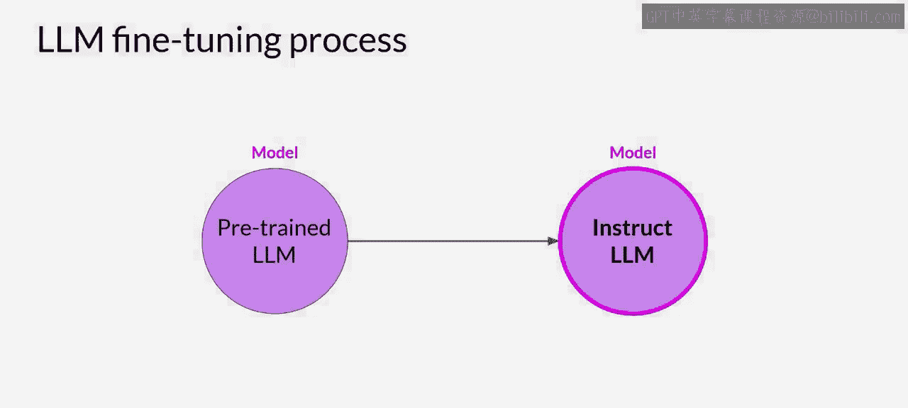

本节课中，我们一起学习了指导式微调的概念和方法。我们了解了微调与预训练的区别，探讨了指导式微调的工作原理和具体步骤，包括数据准备、训练过程和性能评估。通过指导式微调，我们可以显著提升大型语言模型在特定任务上的表现，使其更好地遵循指令并生成高质量的响应。