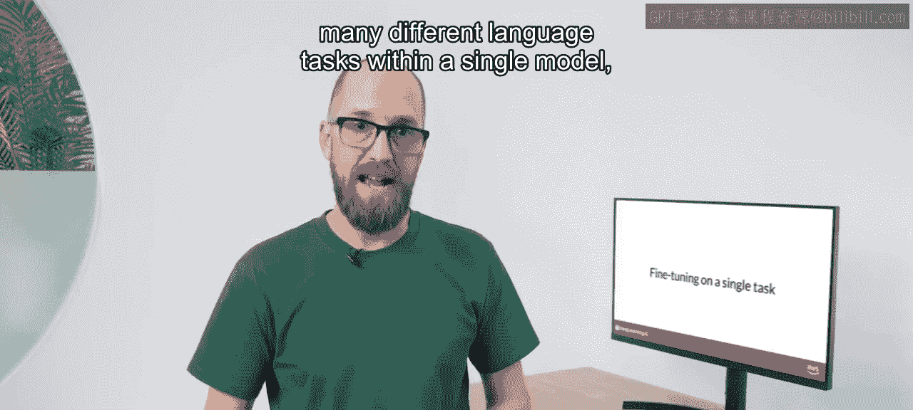
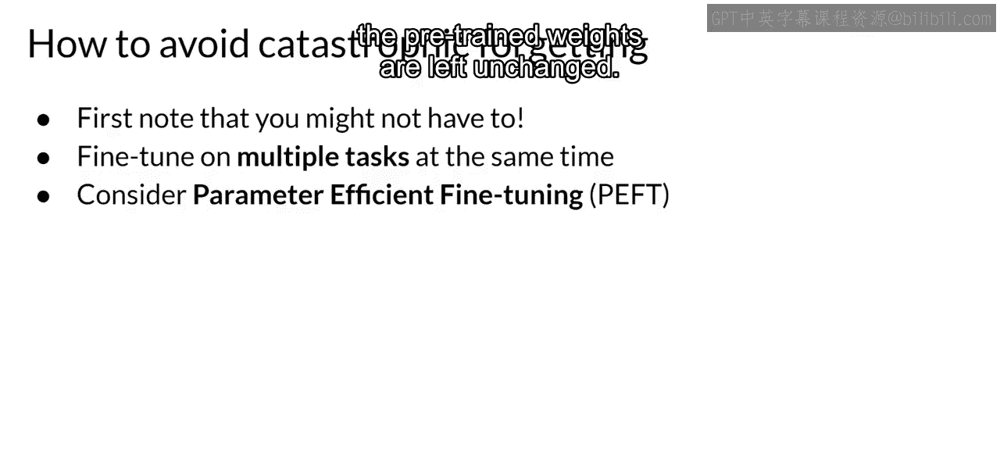

# 020：19_单任务指导式微调

## 概述
在本节课中，我们将要学习如何针对单一任务对预训练的大型语言模型进行微调。我们将探讨这种方法的优势、潜在风险（如灾难性遗忘）以及应对策略。

## 单任务微调简介
虽然大型语言模型因其能在单一模型中执行多种语言任务而闻名，但您的应用程序可能只需要执行单一任务。在这种情况下，您可以对预训练模型进行微调，以仅提升您所关注任务的性能。例如，使用该任务的数据集示例进行摘要生成。

## 微调所需的数据量
有趣的是，只需相对较少的示例即可获得良好的结果。通常，仅需500到1000个示例就能实现良好的性能。这与模型在预训练期间看到的数十亿条文本形成了鲜明对比。

## 灾难性遗忘的风险
然而，针对单一任务进行微调存在一个潜在的缺点。这个过程可能导致一种称为“灾难性遗忘”的现象。灾难性遗忘的发生是因为完整的微调过程会修改原始大型语言模型的权重。虽然这能显著提升单一微调任务的性能，但可能会降低模型在其他任务上的表现。

例如，微调可以提升模型对评论进行情感分析的能力并产生高质量的完成结果，但模型可能会忘记如何执行其他任务。该模型在微调前知道如何进行命名实体识别，能正确识别句子中猫的名字“Charlie”。但在微调后，模型无法再执行此任务，不仅混淆了应该识别的实体，还表现出与新任务相关的行为。

## 如何避免灾难性遗忘
那么，有哪些选项可以避免灾难性遗忘呢？首先，重要的是要判断灾难性遗忘是否真的影响您的用例。

如果您只需要在微调的单一任务上获得可靠的性能，那么模型无法泛化到其他任务可能不是问题。

如果您确实希望或需要模型保持其多任务泛化能力，您可以同时针对多个任务进行微调。良好的多任务微调可能需要跨多个任务的5万到10万个示例，因此需要更多的数据和计算资源来训练。我们稍后将更详细地讨论这个选项。

第二个选项是执行参数高效微调，简称PEFT，而不是完全微调。PEFT是一套技术，它保留原始大型语言模型的权重，只训练少量特定于任务的适配器层和参数。由于大部分预训练权重保持不变，PEFT对灾难性遗忘表现出更强的鲁棒性。PEFT是一个令人兴奋且活跃的研究领域，我们将在本周晚些时候进行介绍。

## 总结
本节课中，我们一起学习了针对单一任务进行模型微调的方法。我们了解到，虽然少量数据即可有效提升特定任务性能，但需警惕“灾难性遗忘”的风险。为此，我们探讨了两种主要应对策略：一是评估该风险对实际应用的影响，若无需多任务能力则可忽略；二是采用多任务微调或参数高效微调技术来保持模型的广泛能力。下一节，我们将更深入地探讨多任务微调。