# 021：多任务指导式微调 🎯

在本节课中，我们将要学习**多任务指导式微调**。这是一种扩展的单任务微调方法，旨在让模型同时学习并精通多个不同的任务，从而避免“灾难性遗忘”的问题。

## 什么是多任务指导式微调？🤔

上一节我们介绍了单任务微调，本节中我们来看看它的扩展形式——多任务指导式微调。

多任务指导式微调是单任务微调的扩展。其训练数据由多个任务的输入和输出示例组成。

以下是其核心特点：
*   **数据多样性**：数据集包含指示模型执行各种任务的示例，例如**摘要**、**评论评级**、**代码翻译**和**实体识别**。
*   **同步优化**：在此混合数据集上训练模型，可以同时提升模型在所有任务上的性能，从而避免灾难性遗忘的问题。
*   **训练过程**：经过多个训练周期，所有示例计算出的损失被用于更新模型权重，最终得到一个**指导式微调模型**，该模型学会了如何同时擅长多种不同任务。

## 多任务微调的优缺点 ⚖️

多任务微调的一个缺点是**需要大量数据**。你可能需要多达5万到10万个示例来构建训练集。

然而，投入精力收集这些数据通常是值得的。由此产生的模型通常能力非常全面，适用于需要模型在多种任务上都有良好表现的场景。

## FLAN模型家族实例 🍰

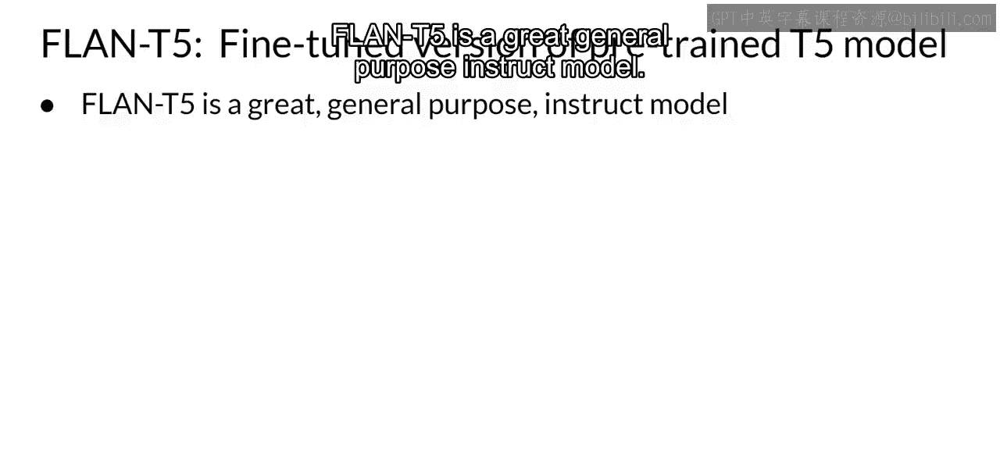

接下来，让我们看一个通过多任务指导式微调训练出来的模型家族。

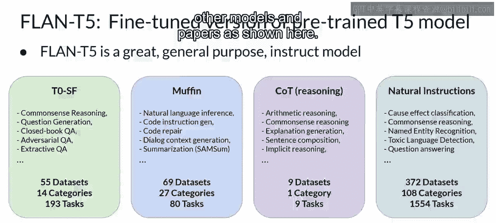

指导式模型变体之间的差异，主要基于微调时使用的数据集和任务。一个例子是**FLAN模型家族**。FLAN代表“微调语言网络”，是一套用于微调不同模型的特定指令集。由于FLAN微调是训练过程的最后一步，原论文作者将其比喻为预训练主菜之后的“甜点”，这个名字非常贴切。

以下是FLAN模型的两个例子：
*   **Flan-T5**：这是T5基础模型的FLAN指导版本。
*   **Flan-PaLM**：这是PaLM基础模型的FLAN指导版本。

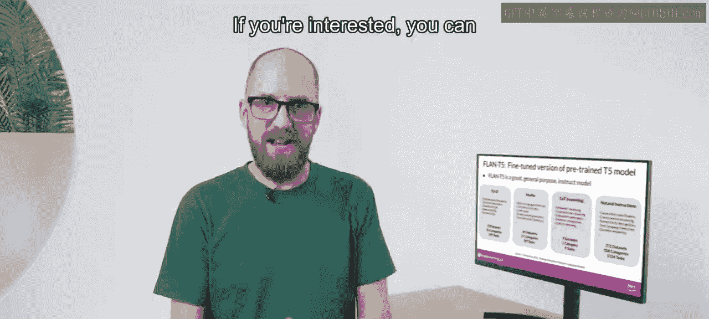

Flan-T5是一个出色的通用指导模型。它总共在**146个任务类别**的**473个数据集**上进行了微调。这些数据集选自其他模型和论文。

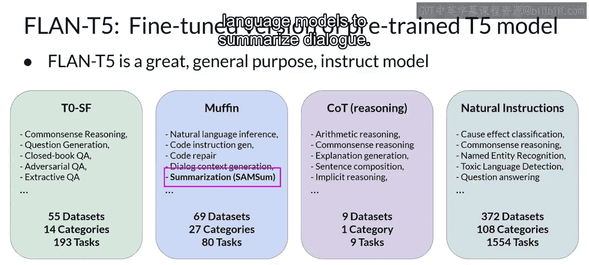

## 数据集示例：SAMSum 📝

用于Flan-T5摘要任务的一个提示数据集例子是**SAMSum**。它属于MUFFIN任务和数据集集合的一部分，用于训练语言模型总结对话。SAMSum是一个包含1.6万个类似即时通讯的对话及其摘要的数据集。

以下是三个示例，左侧为对话，右侧为摘要。这些对话和摘要由语言学家专门制作，旨在为语言模型生成高质量的训练数据集。语言学家被要求创建他们日常会写的对话，反映其真实生活中即时通讯对话的话题比例。然后，其他语言专家为这些对话创建简短摘要，其中包含重要信息和对话中人物的姓名。

## 提示模板与泛化能力 🔧

这是一个为SAMSum对话摘要数据集设计的提示模板。该模板实际上由几个不同的指令组成，这些指令基本上都要求模型做同一件事：总结对话。

以下是几个指令变体：
*   简要总结该对话。
*   这个对话的摘要是什么？
*   那个对话中发生了什么？

包含表达同一指令的不同方式，有助于模型更好地**泛化**和**提升性能**。就像之前看到的提示模板一样，在每个案例中，SAMSum数据集中的对话都被插入到模板中“{dialogue}”字段出现的位置。摘要则用作标签。将此模板应用于SAMSum数据集的每一行后，就可以用它来微调对话摘要任务。

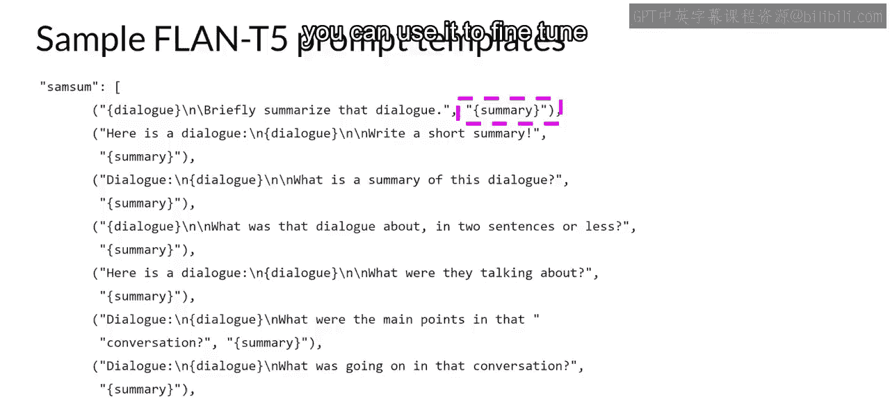

## 特定领域微调的必要性 🎯

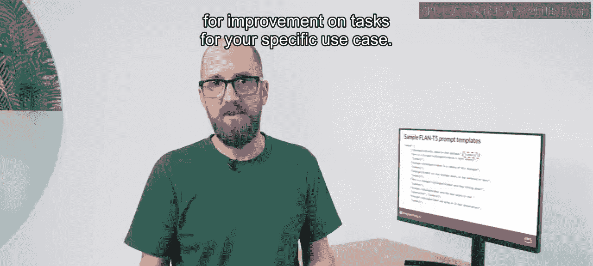

虽然Flan-T5是一个在许多任务上都表现出良好能力的通用模型，但你可能会发现，对于你的特定用例任务，它仍有改进空间。

例如，假设你是一名数据科学家，正在构建一个应用程序来支持客服团队处理通过聊天机器人收到的请求。你的客服团队需要每个对话的摘要，以识别客户请求的关键行动，并确定应采取何种应对措施。

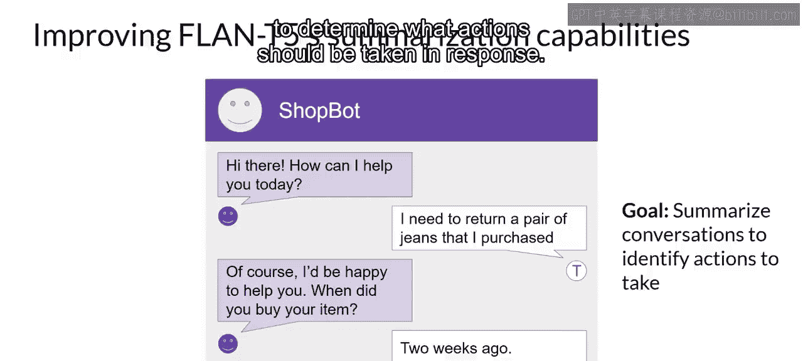

SAMSum数据集赋予了Flan-T5一些总结对话的能力。然而，该数据中的示例大多是朋友之间关于日常活动的对话，与客服聊天中观察到的语言结构重叠不多。

你可以使用一个与你聊天机器人对话更接近的对话数据集，对Flan-T5模型进行**额外的微调**。这正是本周实验中将探索的确切场景。你将利用一个名为**DialogSum**的额外领域特定摘要数据集，来提升Flan-T5总结客服聊天对话的能力。

## 微调效果对比：以DialogSum为例 📊

DialogSum数据包含超过1.3万个客服聊天对话及其摘要。该数据不属于Flan-T5的训练数据，因此模型之前从未见过这些对话。

让我们看一个DialogSum中的例子，并讨论额外一轮微调如何改进模型。这是一个典型的DialogSum数据集示例中的客服聊天，对话发生在客户和酒店前台工作人员之间。聊天已应用了模板，因此总结对话的指令包含在文本开头。

现在，让我们看看在进行任何额外微调之前，Flan-T5如何响应这个提示。

**模型响应（微调前）**：
`The conversation is about a reservation for Tommy.`

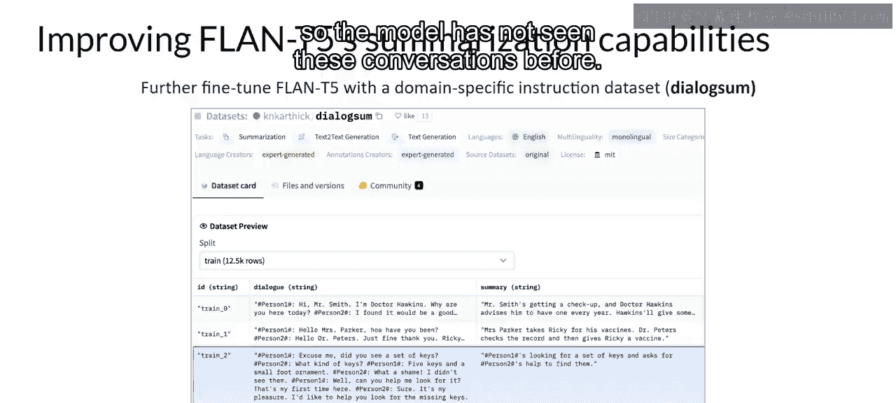

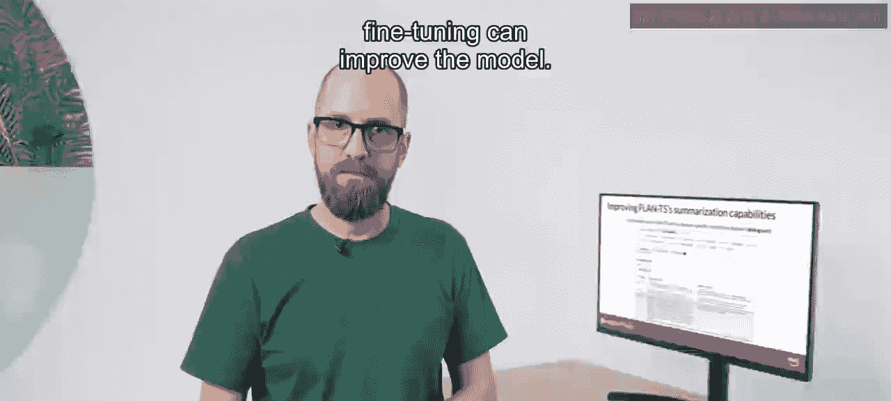

**人类生成的基线摘要**：
`Mike asks for information to facilitate check-in for Tommy's reservation.`

可以看到，模型表现尚可，能够识别对话是关于Tommy的预订。然而，它不如人类生成的基线摘要，后者包含了重要信息，例如Mike要求信息以方便办理入住。此外，模型的补全还**编造了**原始对话中未包含的信息，特别是酒店名称及其所在城市。

现在，让我们看看模型在DialogSum数据集上微调后的表现。

**模型响应（微调后）**：
`Mike asks for information to facilitate check-in for Tommy's reservation.`

希望你会同意，这个结果更接近人类生成的摘要。它没有编造信息，并且摘要包含了所有重要细节，包括参与对话的双方姓名。这个例子使用公共的DialogSum数据来演示在自定义数据上的微调。

## 实践建议：使用内部数据 🏢

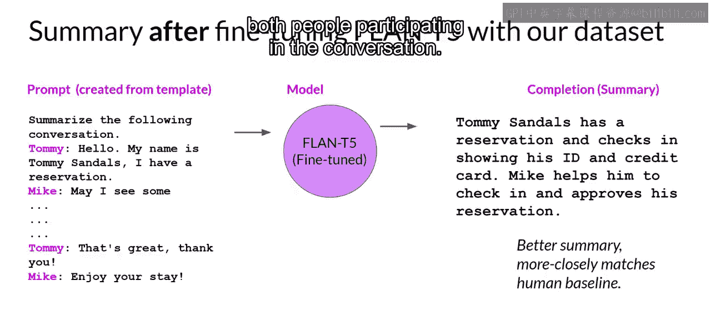

在实践中，通过使用公司自己的**内部数据**，你能从微调中获得最大收益。例如，来自你客服应用程序的客服聊天对话。这将帮助模型学习你公司总结对话的具体方式，以及什么对你的客服同事最有用。

我知道这里有很多内容需要消化，但别担心，这个例子将在实验课中详细讲解，你将有机会亲眼看到并亲自尝试。

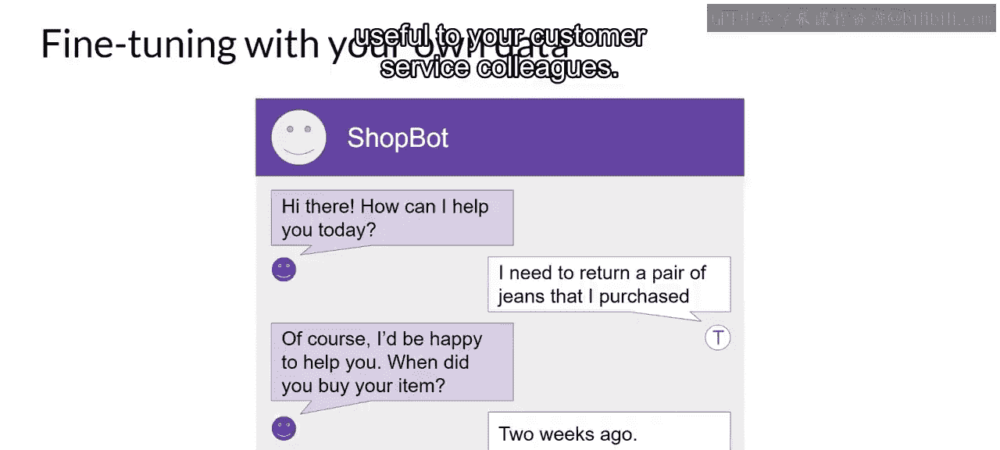

进行微调时，你需要考虑的一件事是如何评估模型补全的质量。在下一个视频中，你将学习几种**指标**和**基准测试**，可以用来确定模型的性能如何，以及你的微调版本比原始基础模型好了多少。

---

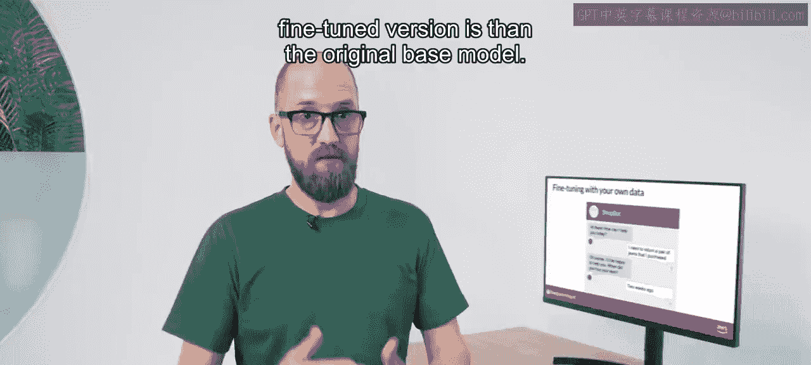

**本节课中我们一起学习了**：多任务指导式微调的概念、其优缺点，以及FLAN模型家族（如Flan-T5）如何通过大量多样化数据集进行训练。我们还探讨了针对特定领域（如客服聊天摘要）进行额外微调的必要性和效果，并了解了使用内部数据进行微调的最佳实践。