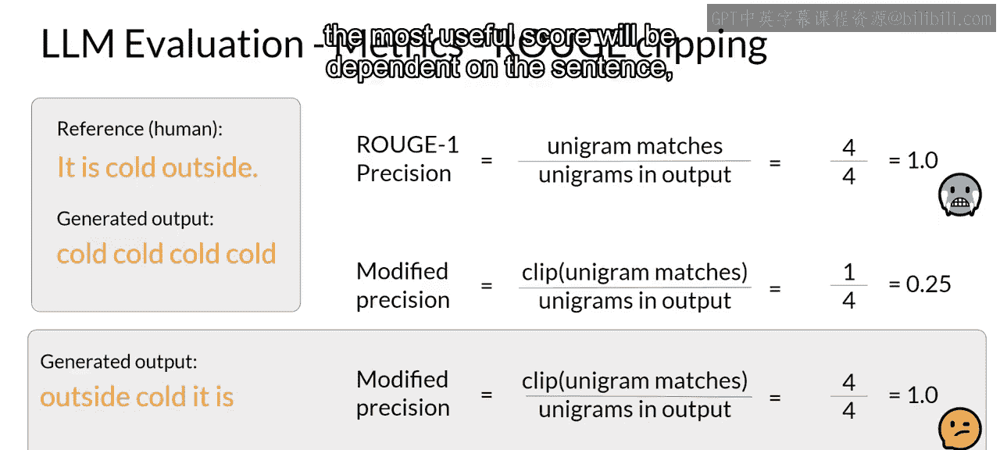
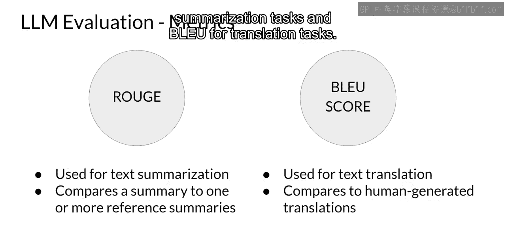

# 022：模型评估

在本节课中，我们将学习如何评估大型语言模型的性能。你将了解如何量化模型在特定任务上的表现，以及如何比较微调模型与基础预训练模型之间的性能差异。我们将介绍两种核心评估指标：Rouge和BLEU，并解释它们的计算方法和适用场景。

## 概述

在之前的课程中，我们经常看到诸如“模型在此任务上表现出色”或“微调模型相比基础模型性能有显著提升”的表述。这些表述具体意味着什么？我们如何将微调模型相对于初始预训练模型的性能提升进行形式化衡量？本节将探讨大型语言模型开发者使用的几种评估指标，你可以用它们来评估自己模型的性能，并与世界上的其他模型进行比较。

## 从传统机器学习到LLM评估

在传统机器学习中，你可以通过观察模型在已知输出的训练集和验证集上的表现来评估其性能。由于模型是确定性的，你可以计算简单的指标，例如**准确率**，它表示所有预测中正确的比例。

然而，对于输出非确定性且基于语言的大型语言模型，评估则更具挑战性。例如，句子“Mike really loves drinking tea”与“Mike adores sipping tea”非常相似，但我们如何衡量这种相似性？再看另外两个句子：“Mike does not drink coffee”和“Mike does drink coffee”。它们之间只有一个词的差异，但含义却完全不同。

对于我们人类来说，可以轻易看出这些句子的异同。但当你用数百万个句子训练模型时，你需要一种自动化、结构化的方式进行测量。

## 核心评估指标：Rouge与BLEU

以下是两种针对不同任务广泛使用的评估指标。

*   **Rouge**：全称为“面向召回率的摘要评估替身”，主要用于通过将自动生成的摘要与人工生成的参考摘要进行比较，来评估摘要的质量。
*   **BLEU**：全称为“双语评估替身”，是一种通过将机器翻译文本与人工翻译进行比较来评估其质量的算法。BLEU在法语中是“蓝色”的意思，所以你可能会听到有人称它为“Blue”，但这里我们将坚持使用原始的“BLEU”。

在开始计算指标之前，我们先回顾一些术语。在语言构成中：
*   **Unigram** 相当于一个单词。
*   **Bigram** 是两个单词。
*   **N-gram** 是一组N个单词。

这是非常直接的概念。

## 深入理解Rouge指标

首先，让我们看看Rouge-1指标。为此，我们来看一个由人生成的参考句子“It is cold outside”和一个模型生成的输出“It is very cold outside”。你可以使用**召回率**、**精确率**和**F1分数**进行计算，类似于其他机器学习任务。

*   **召回率**衡量的是参考句子和生成输出之间匹配的单词（unigram）数量，除以参考句子中的单词总数。在本例中，由于所有生成的单词都与参考句子中的单词匹配，因此获得了完美的分数1。
*   **精确率**衡量的是匹配的unigram数量除以生成输出的总单词数。
*   **F1分数**是召回率和精确率的调和平均数。

这些是非常基础的指标，只关注单个单词（因此名称中有“1”），不考虑单词的顺序，所以可能具有欺骗性。模型很容易生成得分很高但主观上质量很差的句子。

停下来想一想，如果模型生成的句子只差一个词，比如“It is **not** cold outside”，其得分会是一样的。你可以通过考虑**bigram**（即每次从参考句子和生成句子中取两个词的组合）来获得稍好的分数。通过处理词对，你以一种非常简单的方式承认了句子中单词的顺序。使用bigram，你可以计算Rouge-2。现在，你可以使用bigram匹配而不是单个单词来计算召回率、精确率和F1分数。你会注意到，这些分数低于Rouge-1的分数。对于更长的句子，bigram不匹配的几率更大，分数可能更低。

与其继续使用更大的n（如三元组或四元组）来计算Rouge-N，不如采用不同的方法。接下来，你将在生成输出和参考输出中寻找最长的公共子序列。在本例中，最长的匹配子序列是“it is”和“cold outside”，每个长度为2。你现在可以使用LCS值来计算召回率、精确率和F1分数，其中召回率和精确率计算公式的分子都是最长公共子序列的长度（本例中为2）。这三个量统称为**Rouge-L**分数。

与所有Rouge分数一样，你需要结合上下文来理解这些值。只有在为相同任务（例如摘要）确定分数时，你才能使用这些分数来比较模型的能力。不同任务的Rouge分数彼此之间不可比。

## Rouge指标的局限性及改进

正如你所见，简单Rouge分数的一个特定问题是，一个糟糕的生成结果也可能导致高分。例如，考虑这个生成输出：“cold, cold, cold, cold”。由于这个生成输出包含了参考句子中的一个词，即使同一个词重复了多次，它也会得到相当高的分数。Rouge-1精确率得分将是完美的。

解决此问题的一种方法是使用**截断函数**，将unigram匹配的数量限制为该unigram在参考句子中出现的最大次数。在本例中，“cold”在参考句子中出现了一次，因此，对unigram匹配进行截断后的修正精确率会导致分数大幅降低。

然而，如果生成的单词都存在，只是顺序不同，你仍然会面临挑战。例如，对于这个生成的句子“outside cold, it is”，即使在使用了截断函数的修正精确率上，这个句子也能获得完美分数，因为生成输出中的所有单词都存在于参考句子中。

因此，虽然使用不同的Rouge分数会有所帮助，但实验确定能计算出最有用的分数的n-gram大小，将取决于句子本身、句子长度和你的具体用例。

请注意，许多语言模型库（例如你在第一周实验中使用过的Hugging Face）都包含了Rouge分数的实现，你可以轻松地使用它们来评估模型的输出。在本周的实验中，你将尝试使用Rouge分数来比较模型在微调前后的性能。

## BLEU评分详解

另一个可用于评估模型性能的有用分数是**BLEU分数**，它代表“双语评估替身”。提醒一下，BLEU分数对于评估机器翻译文本的质量很有用。该分数本身是通过对多个n-gram大小的精确率取平均值来计算的，就像我们之前看到的Rouge-1分数一样，但是针对一系列n-gram大小进行计算然后取平均。

让我们更仔细地看看它衡量什么以及如何计算。BLEU分数通过检查机器生成的翻译中有多少n-gram与参考翻译中的n-gram匹配来量化翻译的质量。要计算该分数，你需要对一系列不同n-gram大小的精确率取平均值。如果你要手动计算，你将执行多次计算，然后对所有结果取平均值以找到BLEU分数。

对于这个例子，让我们看一个更长的句子，以便你能更好地理解分数的价值。参考的人工提供句子是：“I am very happy to say that I am drinking a warm cup of tea.” 既然你已经深入了解了Rouge的各个计算步骤，我将使用一个标准库向你展示BLEU的结果。使用像Hugging Face这样的提供商提供的预写库来计算BLEU分数很容易。我已经为我们的每个候选句子做了计算。

第一个候选句子是“I am very happy that I am drinking a cup of tea.”，其BLEU分数是0.495。随着生成的句子越来越接近原始句子，我们得到的分数也越来越接近1。

## 总结与最佳实践

Rouge和BLEU都是相当简单的指标，计算成本相对较低。你可以在迭代优化模型时将它们用作简单的参考。但你不应单独使用它们来报告大型语言模型的最终评估结果。使用Rouge进行摘要任务的诊断性评估，使用BLEU进行翻译任务的评估。

然而，要对模型的整体性能进行评估，你需要查看研究人员开发的一些评估基准。我们将在下一个视频中更详细地了解其中的一些基准。

在本节课中，我们一起学习了如何评估大型语言模型的性能。我们介绍了Rouge和BLEU这两种核心评估指标，解释了它们分别适用于摘要和翻译任务，并讨论了它们的计算方式及局限性。记住，这些自动化指标是强大的工具，但应结合具体任务上下文和更全面的评估基准来使用。