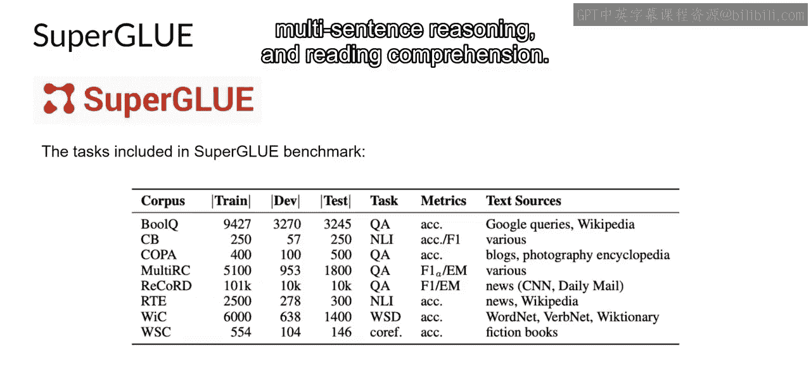
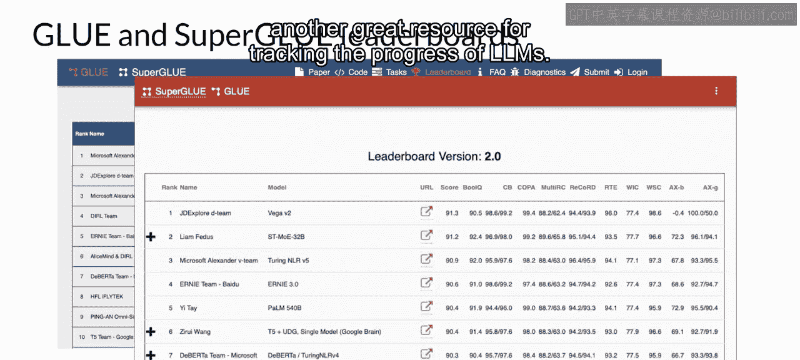
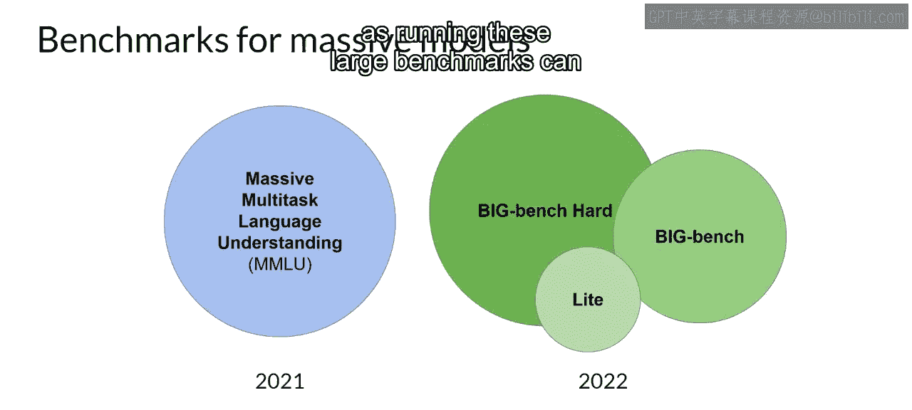
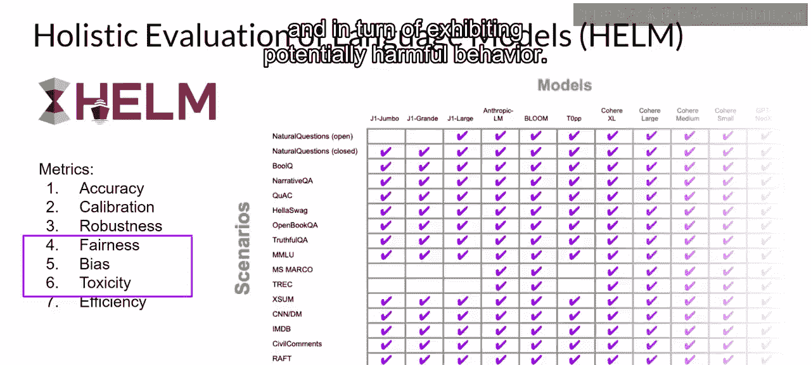

# 023：基准测试

## 概述
在本节课中，我们将要学习如何更全面地评估大型语言模型的性能。我们将介绍一系列由研究人员专门设计的基准测试和数据集，它们能帮助我们衡量模型在推理、常识、风险等多方面的能力，并理解如何选择合适的评估数据。

---

正如上一节视频所见，大型语言模型非常复杂，像Rouge和BLEU分数这样的简单评估指标，只能有限地反映模型的能力。

为了更全面地衡量和比较大型语言模型，你可以利用由LLM研究人员专门为此目的建立的现有数据集和相关基准。

选择合适的评估数据集至关重要，这能让你准确评估LLM的性能并理解其真实能力。

你会发现，选择那些能**隔离特定模型技能**（如推理或常识知识）的数据集，以及那些关注**潜在风险**（如虚假信息或版权侵权）的数据集，会非常有用。

你需要考虑的一个重要问题是，模型在训练期间是否见过你的评估数据。通过评估模型在**未见过的数据**上的表现，你能对模型能力获得更准确、更有用的认识。

---

## 主流基准测试概览

以下是几个覆盖广泛任务和场景的基准测试，它们通过设计或收集能测试LLM特定方面的数据集来实现这一目标。

**GLUE**（通用语言理解评估基准）于2018年推出。它是一个自然语言任务的集合，例如情感分析和问答。GLUE的创建是为了鼓励开发能够**跨多个任务泛化**的模型，你可以使用这个基准来衡量和比较模型性能。

作为GLUE的继任者，**SuperGLUE**于2019年推出，以解决其前身的局限性。它由一系列任务组成，其中一些是GLUE未包含的，另一些则是相同任务的更具挑战性的版本。SuperGLUE包括多句子推理和阅读理解等任务。

GLUE和SuperGLUE基准测试都设有排行榜，可用于比较和对比已评估的模型。其结果页面也是跟踪LLM进展的绝佳资源。

---

## 基准测试的发展与挑战

随着模型变得越来越大，它们在SuperGLUE等基准测试上的表现开始在某些特定任务上匹配人类能力。这意味着模型在基准测试中能表现得和人类一样好。但从主观上看，我们发现它们在**通用任务上并未达到人类水平**。

因此，在LLM的**涌现特性**和旨在衡量它们的基准测试之间，本质上存在一场“军备竞赛”。

以下是几个推动LLM进一步发展的近期基准测试：

**MMLU**（大规模多任务语言理解）是专门为现代LLM设计的。为了表现出色，模型必须拥有**广泛的世界知识**和**解决问题的能力**。模型将在初等数学、美国历史、计算机科学、法律等领域接受测试。换句话说，这些任务远远超出了基本的语言理解。

**BIG-bench**目前包含204项任务，涵盖语言学、儿童发展、数学、常识推理、生物学、物理学、社会偏见、软件开发等。BIG-bench有三种不同的规模。部分原因是为了控制成本可行，因为运行这些大型基准测试可能会产生高昂的推理成本。

---

## HELM：一个全面的评估框架

最后一个你应该了解的基准测试是**HELM**（语言模型整体评估）。

HELM框架旨在提高模型的透明度，并就哪些模型在特定任务上表现良好提供指导。HELM采用**多指标方法**，在16个核心场景中测量7个指标，确保模型和指标之间的权衡被清晰地揭示出来。

HELM的一个重要特点是，它评估的指标超出了精确度或F1分数等基本准确性度量。该基准测试还包括**公平性、偏见和毒性**的指标。随着LLM越来越能够生成类人语言，并可能因此表现出有害行为，评估这些指标正变得越来越重要。

HELM是一个**动态发展的基准测试**，旨在通过添加新的场景、指标和模型来持续演进。你可以查看其结果页面，浏览已评估的LLM，并查看与你的项目需求相关的分数。

---

## 总结
本节课中，我们一起学习了评估大型语言模型性能的重要工具——基准测试。我们了解到，简单的评估指标不足以全面衡量LLM，因此需要利用GLUE、SuperGLUE、MMLU、BIG-bench和HELM等专门的基准测试。这些测试通过设计多样化的任务和引入多维度指标（包括公平性和毒性），帮助我们更准确、更全面地评估模型在知识、推理、风险等方面的真实能力，并为模型选择和应用提供重要指导。