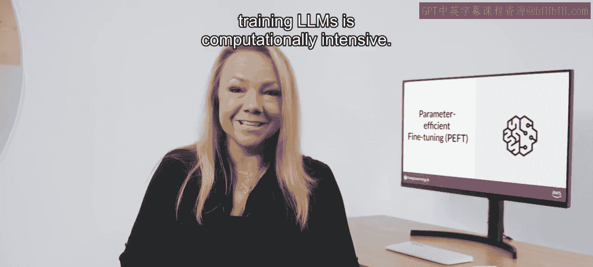
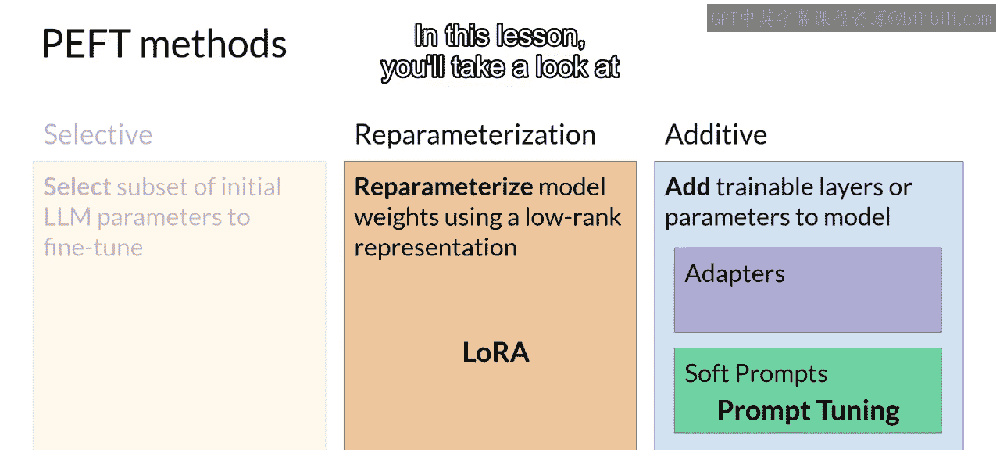
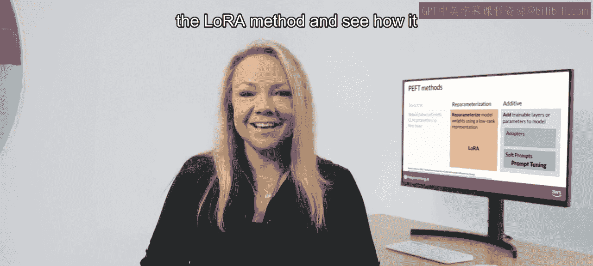

# 024：参数高效微调 🎯

在本节课中，我们将要学习参数高效微调技术。这是一种在资源有限的情况下，通过仅更新模型的一小部分参数来适应新任务的方法，从而避免了完整微调带来的巨大计算和存储开销。

正如你在课程第一周所见，训练大型语言模型在计算上是密集的。完整微调不仅需要存储模型本身的内存，还需要存储训练过程中所需的各种其他参数。

即使你的计算机能够容纳模型权重（对于最大的模型，权重可达数百GB），你也必须能够为优化器状态、梯度、前向激活值和整个训练过程中的临时内存分配空间。这些额外的组件可能比模型本身大许多倍，并且可能迅速超出消费级硬件的处理能力。

与完整微调（在监督学习期间更新每个模型参数）不同，参数高效微调方法只更新一小部分参数。

## 参数高效微调的核心思想

一些PEFT技术冻结了大部分模型权重，专注于微调现有模型参数的一个子集（例如，特定层或组件）。另一些技术则完全不触及原始模型权重，而是添加少量新参数或层，并且只微调这些新组件。

使用PEFT时，大部分（即使不是全部）LLM权重都被冻结。因此，训练的参数数量远少于原始LLM的参数数量。在某些情况下，仅占原始LLM权重的15%到20%。这使得训练的内存需求变得更容易管理。事实上，PEFT通常可以在单个GPU上执行。并且由于原始LLM只被轻微修改或保持不变，PEFT更不容易出现完整微调可能导致的灾难性遗忘问题。

完整微调会为你训练的每个任务生成一个新版本的模型。每个新模型都与原始模型大小相同，因此如果你为多个任务进行微调，可能会造成昂贵的存储问题。

让我们看看如何使用PEFT来改善这种情况。通过参数高效微调，你只训练少量权重，这导致整体占用空间小得多（根据任务不同，可能小到几兆字节）。这些新参数在推理时会与原始LLM权重结合使用。PEFT权重是为每个任务训练的，并且可以在推理时轻松替换，从而允许原始模型高效地适应多个任务。

## 主要的PEFT方法类别

以下是几种可用于参数高效微调的方法，每种方法在参数效率、内存效率、训练速度、模型质量和推理成本方面都有权衡。让我们来看看PEFT方法的三个主要类别。

**选择性方法**：这类方法仅微调原始LLM参数的一个子集。有几种方法可以用来确定你想要更新的参数。你可以选择只训练模型的某些组件、特定层，甚至是个别参数类型。研究人员发现这些方法的性能参差不齐，并且在参数效率和计算效率之间存在显著的权衡，因此本课程将不重点讨论它们。

**重参数化方法**：这类方法也处理原始LLM参数，但通过对原始网络权重创建新的低秩变换来减少需要训练的参数数量。这类方法中常用的技术是LoRA，你将在下一个视频中详细探讨。

**添加性方法**：这类方法通过保持所有原始LLM权重冻结，并引入新的可训练组件来进行微调。这里有两种主要方法：
*   **适配器方法**：向模型架构中添加新的可训练层，通常位于注意力层或前馈层之后的编码器或解码器组件内部。
*   **软提示方法**：另一方面，保持模型架构固定和冻结，专注于操纵输入以获得更好的性能。这可以通过向提示嵌入中添加可训练参数，或者保持输入固定并重新训练嵌入权重来实现。

在本课中，你将了解一种名为“提示调优”的特定软提示技术。

## 总结与过渡

本节课中，我们一起学习了参数高效微调的基本概念、优势以及三种主要方法类别（选择性、重参数化和添加性）。我们了解到，PEFT通过大幅减少需要训练和存储的参数，使得在有限资源下定制大模型成为可能。

接下来，让我们进入下一个视频，更仔细地研究LoRA方法，看看它是如何减少训练所需内存的。

