# 025：参数高效微调技术1 - LoRA 🎯

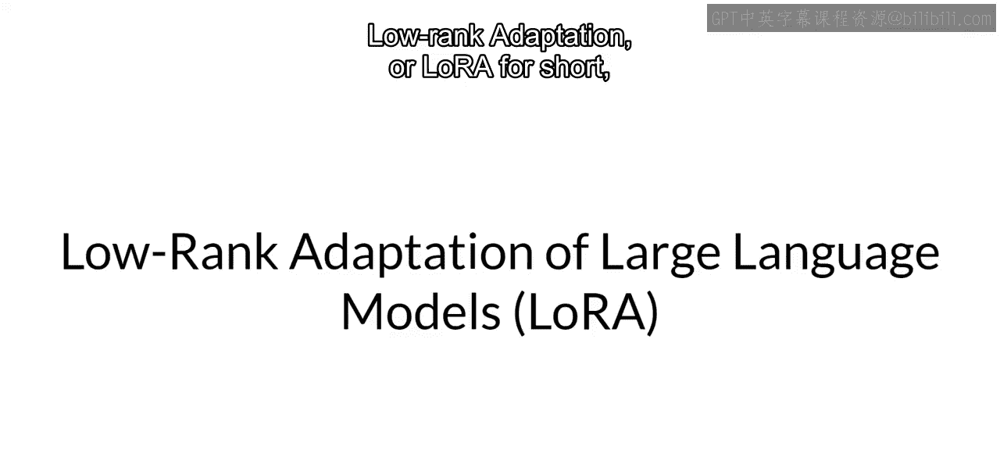

在本节课中，我们将要学习一种名为**低秩适应**的参数高效微调技术，简称**LoRA**。这是一种属于重参数化范畴的技术，它能显著减少微调时需要训练的参数数量，从而降低计算成本。

## 回顾Transformer架构

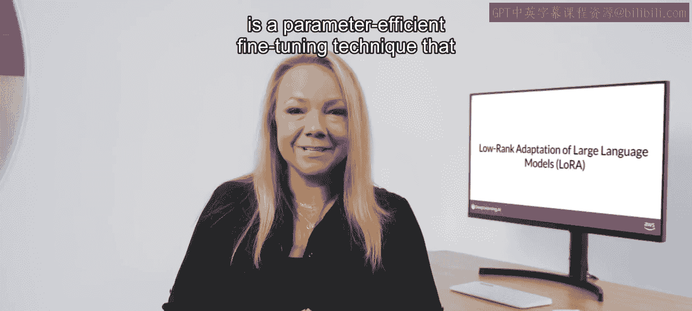

在深入了解LoRA之前，我们先快速回顾一下Transformer架构。输入提示被转换为词元，然后转化为嵌入向量，并传入Transformer的编码器和/或解码器部分。在这些组件中，存在两种神经网络：**自注意力层**和**前馈网络**。这些网络的权重在预训练期间学习得到。

嵌入向量生成后，会被送入自注意力层。在该层中，会应用一系列权重来计算注意力分数。在**全量微调**过程中，这些层中的每一个参数都会被更新。

## LoRA的工作原理 🔧

上一节我们介绍了全量微调，本节中我们来看看LoRA如何以更高效的方式工作。

LoRA是一种通过冻结原始模型的所有参数，然后在原始权重旁边注入一对**低秩分解矩阵**来减少微调期间训练参数数量的策略。这两个较小矩阵的维度被设定为：它们的乘积是一个与它们要修改的权重矩阵维度相同的矩阵。

在微调过程中，保持LLM的原始权重冻结，仅使用本周早些时候介绍的监督学习过程来训练这些较小的矩阵。对于推理，将两个低秩矩阵相乘，创建一个与冻结权重维度相同的矩阵，然后将其加到原始权重上，并用这些更新后的值替换模型中的原始权重。

这样，你就得到了一个经过LoRA微调的模型，可以执行你的特定任务。由于该模型具有与原始模型相同数量的参数，因此对推理延迟几乎没有影响。

## LoRA的应用与优势

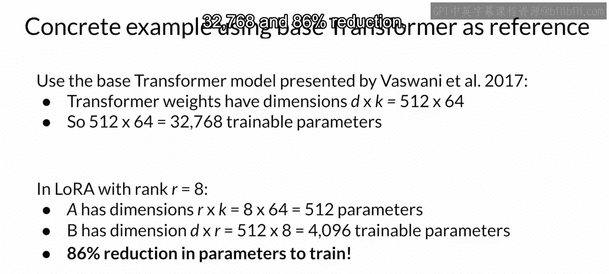

研究发现，仅将LoRA应用于模型的自注意力层，通常就足以针对任务进行微调并获得性能提升。原则上，你也可以将其用于其他组件，如前馈层。但由于LLM的大部分参数都在注意力层中，因此通过将LoRA应用于这些权重矩阵，可以获得最大的可训练参数节省。

以下是LoRA的一个实际优势：
*   **显著减少参数**：通过更新新的低秩矩阵的权重，而非原始权重，可训练参数数量大幅下降。
*   **降低硬件需求**：由于可训练参数显著减少，通常可以使用单个GPU执行这种参数高效微调，而无需分布式GPU集群。
*   **灵活的任务切换**：由于低秩分解矩阵很小，你可以为每个任务微调一组不同的矩阵，然后在推理时通过更新权重来切换它们。这避免了存储多个完整尺寸LLM版本的需要。

## 实例分析：参数计算

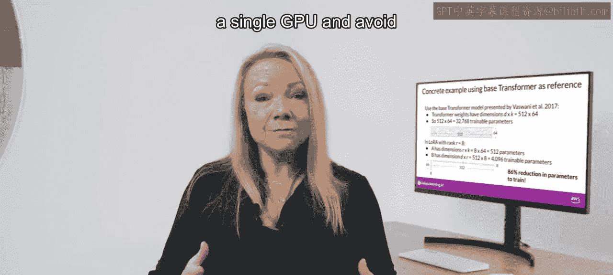

让我们以《Attention Is All You Need》论文中描述的Transformer架构为例进行具体分析。论文指明Transformer权重维度为512x64。这意味着每个权重矩阵有 **32,768** 个可训练参数。

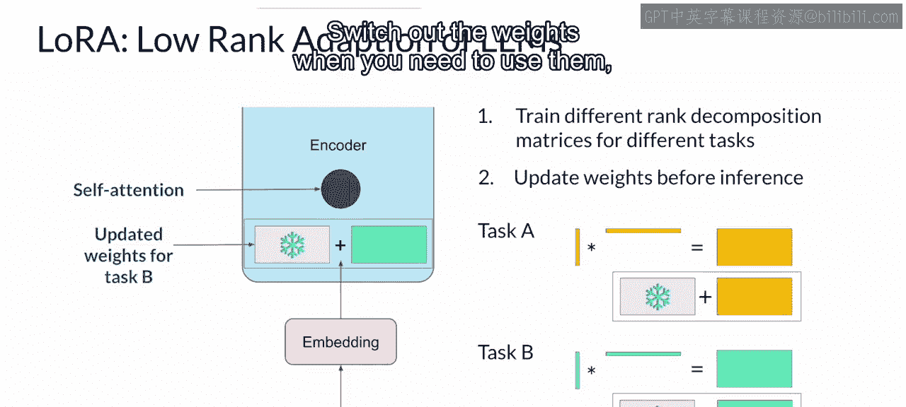

如果你使用秩为8的LoRA进行微调，你将训练两个小的低秩分解矩阵，其较小维度为8。这意味着：
*   矩阵A的维度为8x64，总计 **512** 个参数。
*   矩阵B的维度为512x8，总计 **4,096** 个参数。

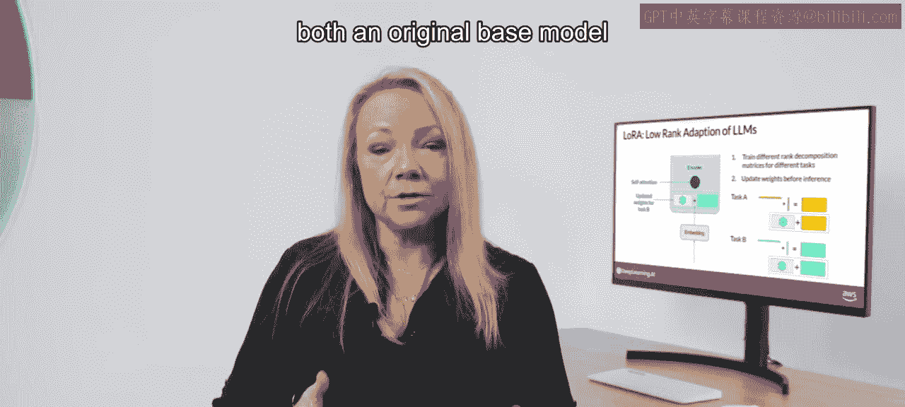

因此，通过更新这些新的低秩矩阵的权重，你将训练 **4,608** 个参数，而不是原来的32,768个，减少了 **86%**。

## 性能评估：LoRA vs. 全量微调

那么，这些模型的效果如何呢？我们使用本周早些时候学到的Rouge指标，来比较LoRA微调模型、原始基础模型和全量微调版本的性能。

我们专注于对FLAN-T5进行对话摘要任务的微调。首先，为FLAN-T5基础模型和我们之前讨论过的摘要数据集设定一个基线分数。基础模型的Rouge分数相对较低。

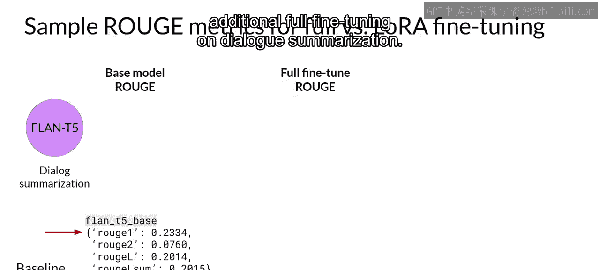

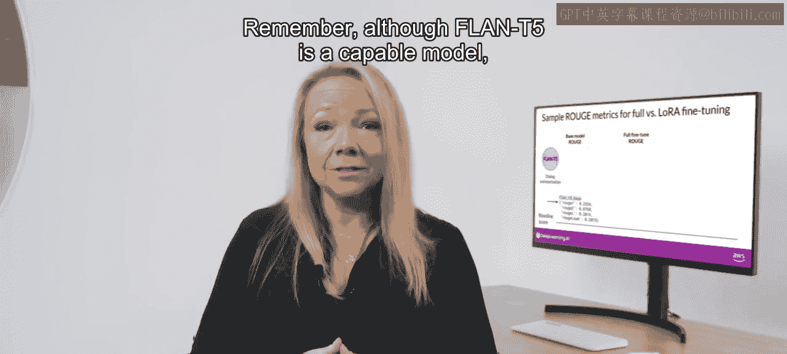

接下来，查看在对话摘要上进行了额外全量微调的模型的分数。全量微调在监督学习期间更新模型中的每一个权重，这导致了更高的Rouge-1分数，比基础FLAN-T5模型提高了0.19。

现在，让我们看看LoRA微调模型的分数。这个过程也带来了性能的大幅提升。Rouge-1分数比基线提高了0.17，略低于全量微调，但相差不大。然而，使用LoRA进行微调所训练的参数数量远少于全量微调，使用的计算资源也显著减少。因此，性能上的这点微小折衷可能是非常值得的。

## 如何选择LoRA的秩？

你可能会想知道如何选择LoRA矩阵的秩。这是一个好问题，并且仍然是一个活跃的研究领域。原则上，秩越小，可训练参数越少，计算节省越大。然而，需要考虑一些与模型性能相关的问题。

在首次提出LoRA的论文中，微软的研究人员探索了不同的秩选择如何影响模型在语言生成任务上的性能。他们发现，对于大于16的秩，损失值会达到一个平台期。换句话说，使用更大的LoRA矩阵并没有改善性能。

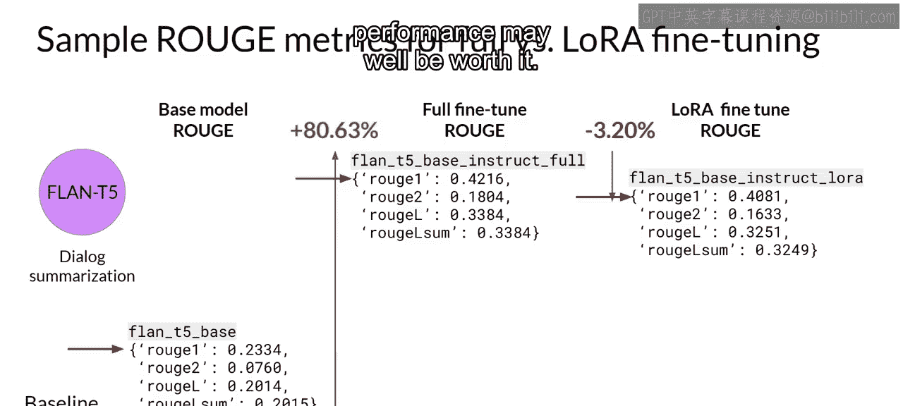

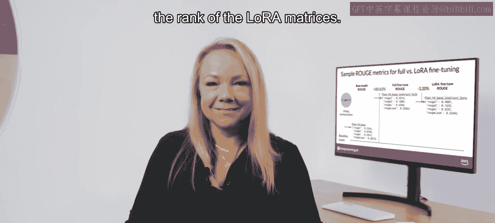

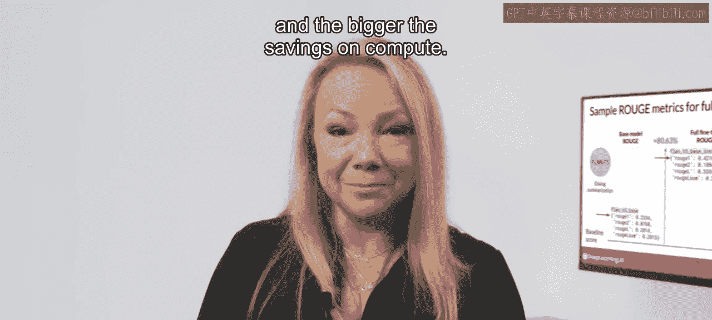

这里的启示是，**4到32之间**的秩可以在减少可训练参数和保持性能之间提供良好的平衡。优化秩的选择是一个持续的研究领域，随着更多像你一样的实践者使用LoRA，最佳实践可能会不断发展。

## 总结与展望

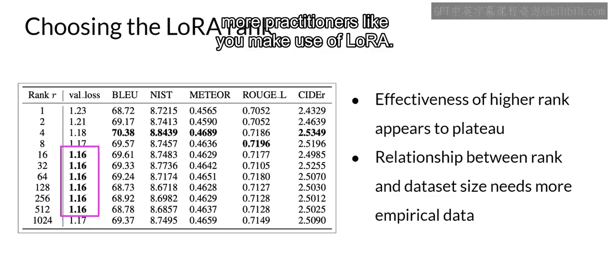

本节课中我们一起学习了**LoRA**这一强大的微调方法。它通过引入和训练低秩矩阵来近似权重更新，实现了出色的性能，同时大幅降低了计算和存储需求。该方法背后的原理不仅适用于训练LLM，也适用于其他领域的模型。

本周你将探索的最后一种PEFT方法完全不改变LLM本身，而是专注于训练你的输入文本。我将在下一个视频中与你分享更多。