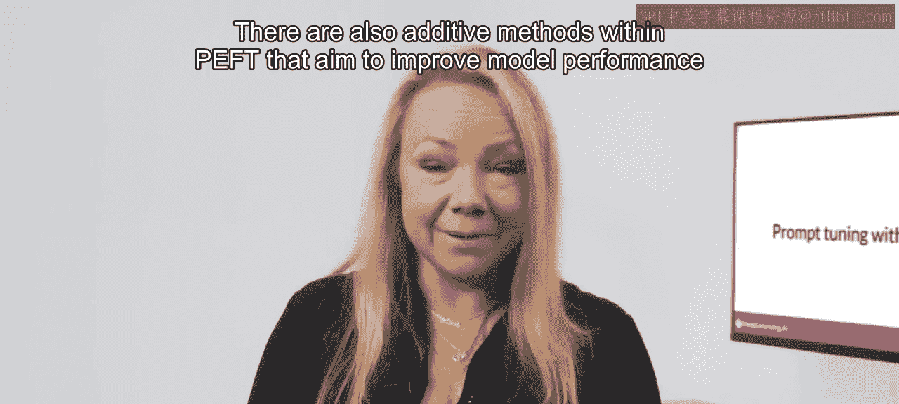
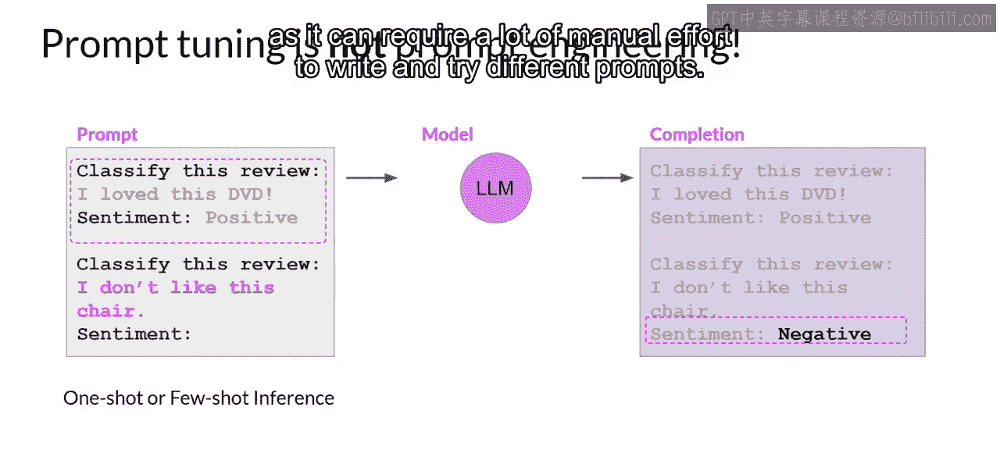
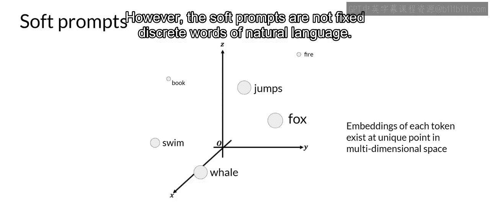
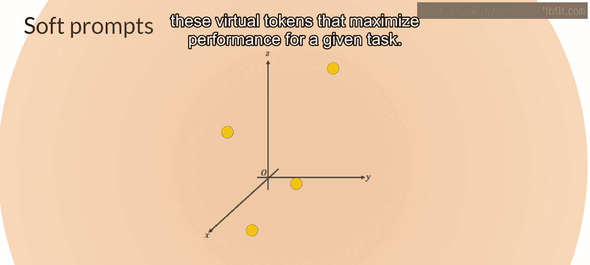
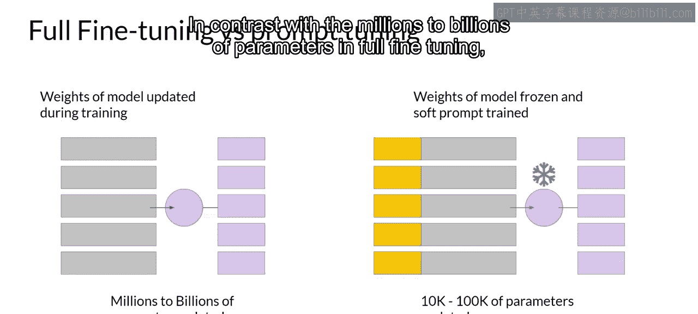
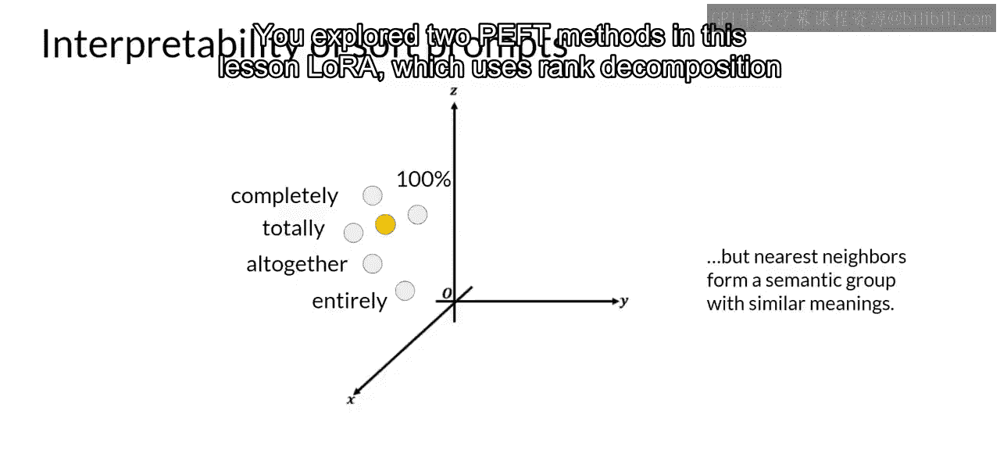
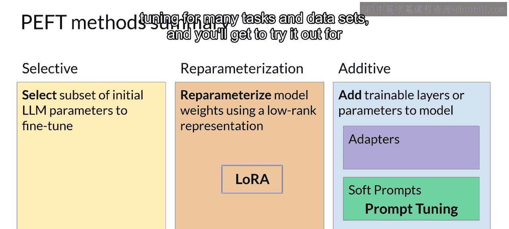
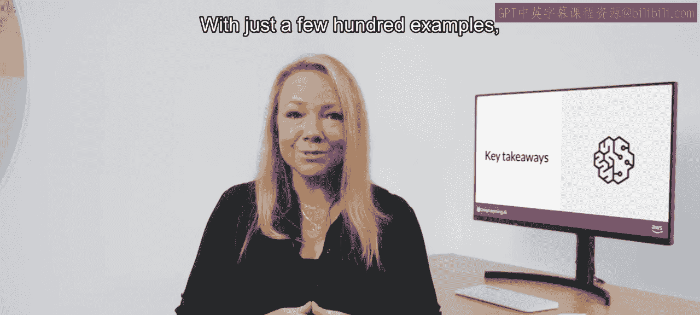

# 026：参数高效微调技术2-软提示 🎯

在本节课中，我们将要学习第二种参数高效微调（PEFT）方法——**提示调优**。我们将探讨它与提示工程的区别，了解其工作原理，并分析其性能表现。

上一节我们介绍了LoRA，其目标是找到一种无需重新训练所有参数的模型权重更新方法。而在PEFT中，还存在一些**加性方法**，其目标是在完全不改变模型权重的情况下提升模型性能。

## 提示工程与提示调优的区别 🤔

提示调优听起来与提示工程有些相似，但两者截然不同。

以下是提示工程的核心思路：
*   **目标**：通过优化提示的语言，来获得期望的模型输出。
*   **方法**：尝试不同的词语、短语，或包含示例进行单样本/少样本推理。
*   **目的**：帮助模型理解你要求其执行的任务性质，从而生成更好的输出。

然而，提示工程存在一些局限性：
*   需要大量手动工作来编写和尝试不同的提示。
*   受限于上下文窗口的长度。
*   最终可能仍无法为特定任务达到所需的性能。

## 什么是提示调优？ 🧠

与提示工程不同，提示调优会向你的提示中添加额外的**可训练标记**，并让监督学习过程来决定这些标记的最优值。

这组可训练标记被称为**软提示**。它会被**前置**到代表输入文本的嵌入向量之前。

软提示向量与语言标记的嵌入向量长度相同。通常，包含**20到100个虚拟标记**就足以获得良好的性能。

自然语言标记是“硬”的，因为它们各自对应嵌入向量空间中的一个固定位置。而软提示并非固定的自然语言离散词汇。你可以将它们视为**虚拟标记**，可以在连续的多维嵌入空间中取任何值。通过监督学习，模型会学习到这些虚拟标记的值，以最大化特定任务的性能。

## 与全参数微调的对比 ⚖️

以下是两种方法的核心区别：

*   **全参数微调**：
    *   训练数据集由输入提示和输出补全（或标签）组成。
    *   在监督学习过程中，**大型语言模型的权重会被更新**。

*   **提示调优**：
    *   **大型语言模型的权重被冻结**，底层模型不会被更新。
    *   取而代之的是，**软提示的嵌入向量会随着时间被更新**，以优化模型对提示的补全。

提示调优是一种**参数效率极高**的策略，因为只有少量参数被训练，这与全参数微调中需要更新数百万到数十亿参数形成鲜明对比。

## 提示调优的优势与灵活性 🔄

与LoRA类似，你可以为每个任务训练一组不同的软提示，然后在推理时轻松地切换它们。

以下是其工作流程：
1.  为任务A训练一组软提示。
2.  为任务B训练另一组软提示。
3.  在推理时，只需将输入提示与学习到的软提示拼接即可。
4.  要切换到另一个任务，只需更换软提示。

软提示在磁盘上占用的空间非常小，因此这种微调方式极其**高效和灵活**。你会注意到，所有任务都使用**同一个LLM**，在推理时只需切换软提示即可。

## 性能表现分析 📊

在Brian Lester及其谷歌合作者探索该方法的原始论文中，作者将提示调优与其他几种方法在不同模型规模下进行了比较。

从论文中的图表可以看出：
*   **X轴**：模型规模。
*   **Y轴**：SuperGLUE基准测试得分（用于评估模型在多种不同语言任务上的性能）。
*   **红线**：通过单任务全参数微调创建的模型得分。
*   **橙线**：使用多任务微调创建的模型得分。
*   **绿线**：提示调优的性能。
*   **蓝线**：仅使用提示工程的得分。

分析表明，对于较小的LLM，提示调优的性能不如全参数微调。然而，**随着模型规模的增大，提示调优的性能也随之提升**。一旦模型参数达到约**100亿**，提示调优的效果可以与全参数微调相媲美，并且比单纯的提示工程带来显著的性能提升。

## 软提示的可解释性 🔍

一个需要考虑的潜在问题是学习到的虚拟标记的可解释性。由于软提示标记可以在连续的嵌入向量空间中取任何值，训练后的标记并不对应LLM词汇表中的任何已知标记、单词或短语。

然而，对软提示位置最近邻标记的分析表明，它们形成了紧密的**语义聚类**。换句话说，最接近软提示标记的词语具有相似的含义。识别出的词语通常具有与任务相关的某种意义，这表明软提示正在学习类似词语的表征。

## 本周内容回顾与总结 🎉

本节课中，我们一起探讨了两种PEFT方法：
1.  **LoRA**：使用低秩分解矩阵来高效地更新模型参数。
2.  **提示调优**：向提示中添加可训练标记，而保持模型权重不变。

这两种方法都能让你以远低于全参数微调的计算成本对模型进行微调，并有可能在特定任务上获得更好的性能。LoRA因其在许多任务和数据集上可与全参数微调相媲美的性能而在实践中被广泛使用。

**恭喜你完成第二周的学习！让我们简要回顾一下本周内容：**

本周初，Mike引导你了解了如何通过**指令微调**的过程来适配基础模型。你看到了一些用于训练FLAN-T5模型的提示模板和数据集。你也学习了如何使用如ROUGE和HELM这样的评估指标和基准来度量模型微调过程中的成功。在实践中，指令微调已被证明在广泛的自然语言用例和任务中非常有效和实用。仅需几百个示例，你就可以将模型微调到你的特定任务，这非常令人惊叹。

接下来，你看到了**参数高效微调**如何减少微调模型所需的计算量。你学习了两种可用于此目的的方法：**LoRA**和**提示调优**。顺便一提，你还可以将LoRA与第一周学到的**量化技术**结合，以进一步减少内存占用，这被称为**QLoRA**。

在实践中，PEFT被大量用于最小化计算和内存资源，最终降低微调成本，使你能够充分利用计算预算并加速开发流程。