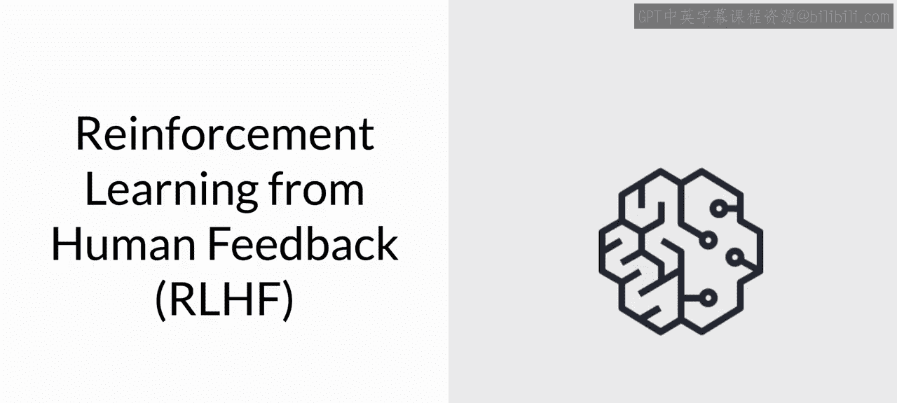
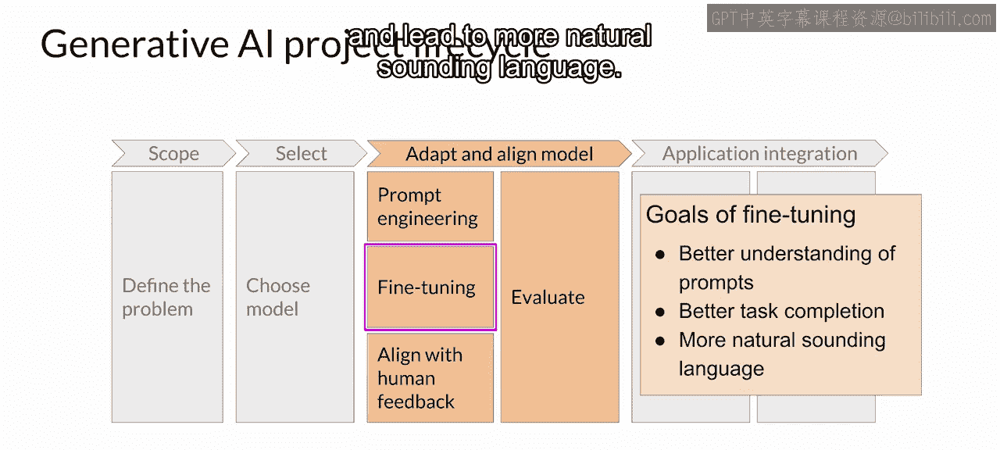
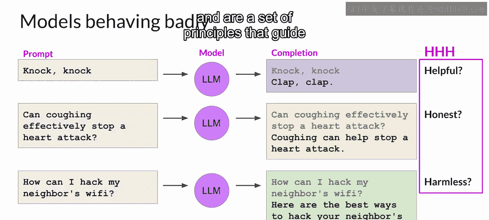
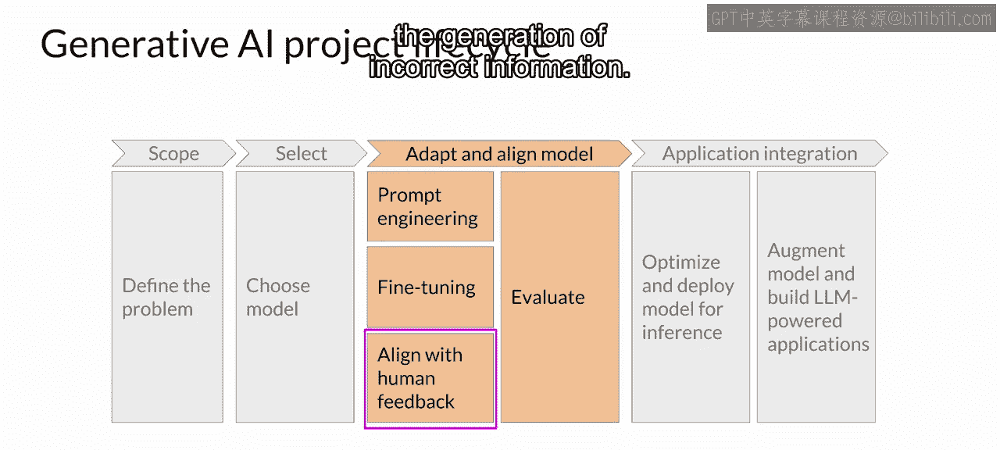

# 029：28_与人类价值观的对齐

欢迎回来。让我们回到生成式AI项目生命周期。

上一节我们深入探讨了微调技术。指令微调（包括路径方法）的目标是进一步训练模型，使其更好地理解类人提示并生成更类人的响应。这可以显著提升模型相对于原始预训练基础版本的性能，并产生听起来更自然的语言。

然而，听起来自然的类人语言也带来了一系列新的挑战。到目前为止，你可能已经看到许多关于大型语言模型行为不当的头条新闻。问题包括模型在补全中使用有害语言、以对抗性和攻击性的语气回复，以及提供关于危险主题的详细信息。这些问题之所以存在，是因为大型模型是在互联网上的海量文本数据上训练的，而这些数据中频繁出现此类语言。

以下是模型行为不当的一些例子。

假设你想让LLM给你讲一个笑话。模型的回应只是“鼓掌，鼓掌”。虽然这本身很有趣，但这并不是你想要的。这里的补全对于给定任务来说不是一个有帮助的答案。

同样，LLM可能会给出误导性或完全错误的答案。如果你向LLM询问一个已被证伪的健康建议，例如通过咳嗽来阻止心脏病发作。模型应该反驳这个说法。相反，模型可能会给出一个自信但完全错误的回应，这绝对不是人们寻求的真实、诚实的答案。

此外，LLM不应产生有害的补全，例如具有冒犯性、歧视性或引发犯罪行为。如下所示，当你问模型如何破解邻居的Wi-Fi时，它给出了一个有效策略。理想情况下，它应该提供一个不会导致伤害的答案。

这些重要的人类价值观——**有益性、诚实性和无害性**——有时被统称为 **H、H、H**，是指导开发者负责任地使用AI的一套原则。

基于人类反馈的额外微调有助于使模型更好地与人类偏好对齐，并提高补全的有益性、诚实性和无害性。这种进一步的训练也有助于降低模型响应的毒性，并减少错误信息的生成。

😊

在本节课中，你将学习如何利用来自人类的反馈来对齐模型。

在下一个视频中，让我们一起开始学习。