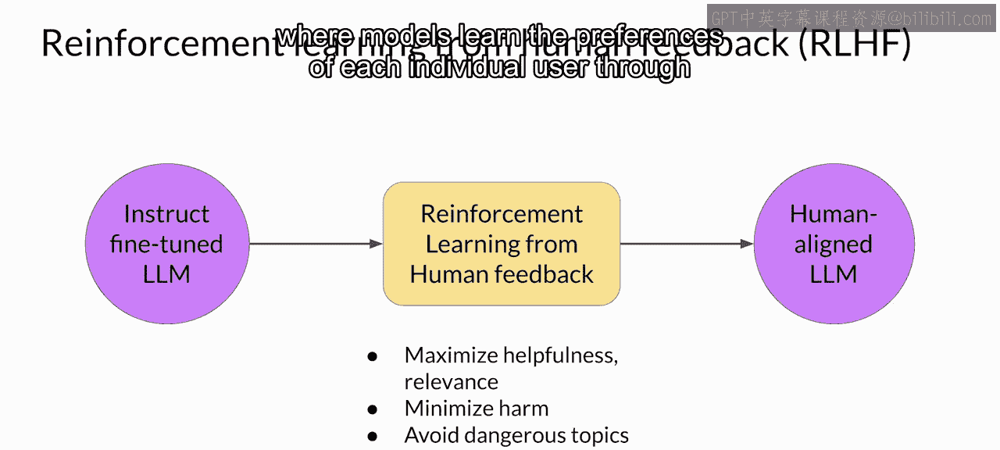
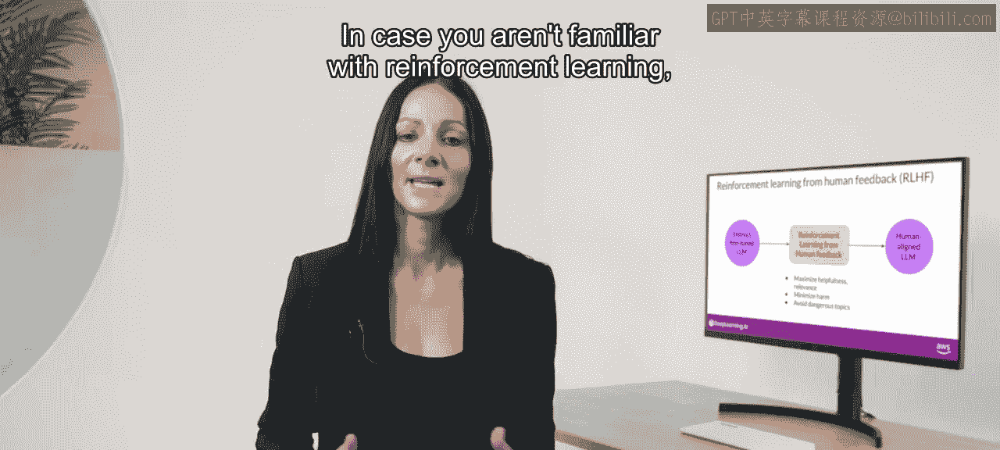
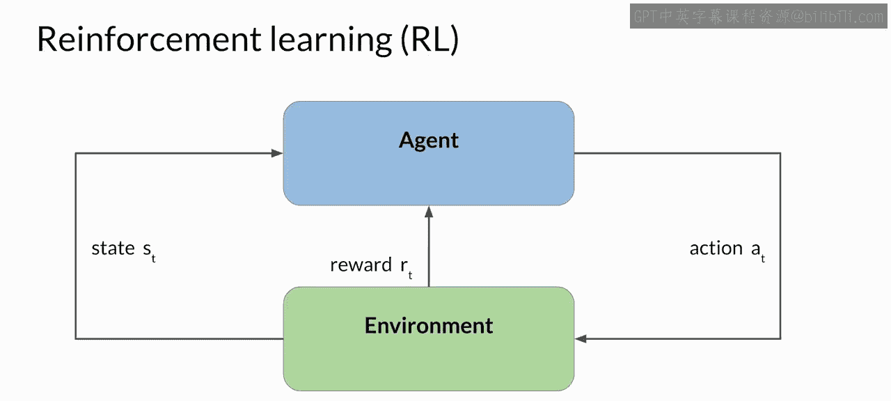
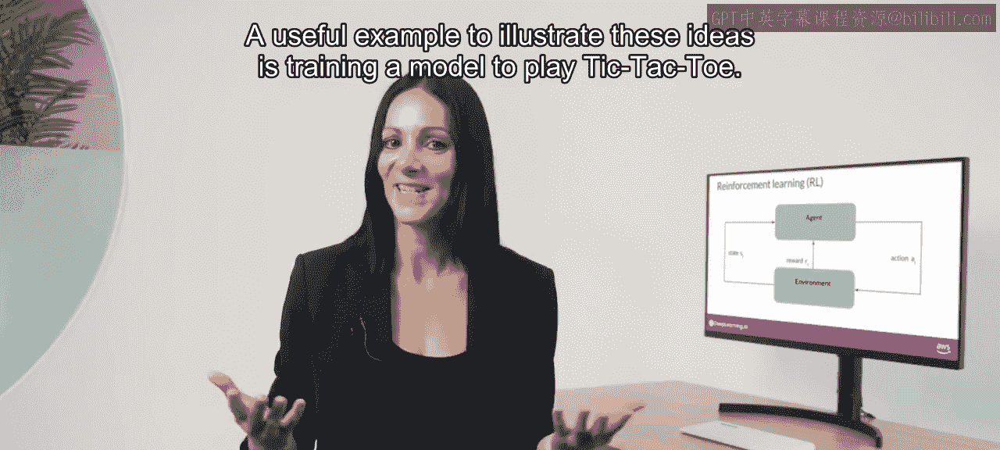
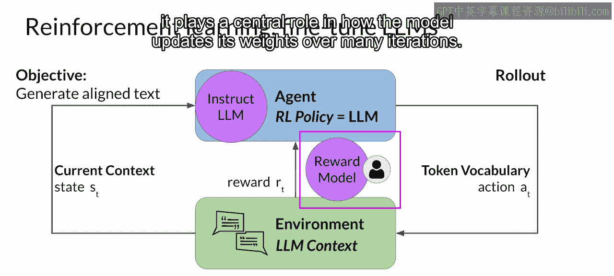

# 030：29_从人类反馈的强化学习

在本节课中，我们将要学习一种名为“从人类反馈的强化学习”的技术，它如何被用来微调大型语言模型，使其输出更符合人类的偏好。

## 概述

文本摘要任务要求模型生成一段简短的文字，以捕捉一篇较长文章的核心要点。我们的目标是通过微调，利用人类生成的摘要示例来提升模型的摘要能力。

2020年，OpenAI的研究人员发表了一篇论文，探讨了如何利用人类反馈进行微调，以训练模型撰写文本文章的简短摘要。结果显示，经过人类反馈微调的模型，其生成的回答优于预训练模型、指令微调模型，甚至优于人类参考基线。

## 从人类反馈的强化学习简介

一种利用人类反馈来微调大型语言模型的流行技术被称为“从人类反馈的强化学习”，简称RHF。顾名思义，RHF使用强化学习，结合人类反馈数据来微调LLM，从而产生一个更符合人类偏好的模型。

你可以使用RHF来确保你的模型产生的输出能最大化其对于输入提示的有用性和相关性。或许最重要的是，RHF有助于最小化潜在的危害风险。你可以训练你的模型给出承认其局限性的说明，并避免使用有害的语言和话题。

RHF一个潜在令人兴奋的应用是LLM的个性化，即模型通过持续的反馈过程学习每个用户的个人偏好。这可能催生诸如个性化学习计划或个性化AI助手等激动人心的新技术。

为了理解这些未来应用如何成为可能，让我们首先深入了解RHF的工作原理。

## 强化学习核心概念

如果你不熟悉强化学习，这里是对其最重要概念的高度概括。

强化学习是一种机器学习类型，其中智能体通过在环境中采取行动来学习做出与特定目标相关的决策，其目标是最大化某种累积奖励的概念。

在这个框架中，智能体通过采取行动、观察由此导致的环境变化，并根据其行动结果获得奖励或惩罚，从而持续从经验中学习。通过迭代这个过程，智能体逐步优化其策略，以做出更好的决策并增加成功的几率。

## 强化学习示例：井字棋

一个有助于说明这些概念的有用例子是训练一个模型玩井字棋。

在这个例子中，智能体是作为井字棋玩家的模型或策略。其目标是赢得游戏。环境是3x3的游戏棋盘，任何时刻的状态是棋盘的当前配置。动作空间包括玩家基于当前棋盘状态可以选择的所有可能位置。

智能体通过遵循一种称为RL策略的策略来做出决策。当智能体采取行动时，它会根据行动在向胜利推进过程中的有效性来收集奖励。强化学习的目标是让智能体学习到针对给定环境的最优策略，以最大化其奖励。

这个学习过程是迭代的，并且涉及试错。最初，智能体采取随机行动，这会导致进入一个新状态。从这个状态出发，智能体通过进一步的行动继续探索后续状态。这一系列行动和相应的状态构成了一次“推演”。随着智能体积累经验，它逐渐发现能带来最高长期回报的行动，最终在游戏中取得成功。

## 将RHF应用于大型语言模型

现在，让我们看看如何将井字棋的例子扩展到使用RHF微调大型语言模型的情况。

在这种情况下，指导行动的智能体策略就是LLM本身。其目标是生成被认为符合人类偏好的文本。这可能意味着文本是有帮助的、准确的和无害的。

环境是模型的上下文窗口，即我们可以输入提示文本的空间。模型在采取行动前考虑的状态是当前上下文，即当前包含在上下文窗口中的任何文本。

这里的行动是生成文本的行为。根据用户指定的任务，这可能是一个单词、一个句子或更长的文本。动作空间是词元词汇表，即模型可以选择来生成补全的所有可能词元。

LLM如何决定生成序列中的下一个词元，取决于它在训练期间学到的语言的统计表示。在任何给定时刻，模型将采取的行动，即它接下来将选择哪个词元，取决于上下文中的提示文本以及词汇表空间上的概率分布。

奖励的分配基于补全内容与人类偏好的契合程度。鉴于人类对语言反应的多样性，确定奖励比井字棋的例子更为复杂。

一种方法是让人类根据某些对齐指标来评估模型的所有补全内容，例如判断生成的文本是有害的还是无害的。这种反馈可以表示为一个标量值，例如0或1。然后，LLM的权重被迭代更新，以最大化从人类分类器获得的奖励，从而使模型能够生成无害的补全内容。

然而，获取人类反馈可能耗时且昂贵。作为一种实用且可扩展的替代方案，你可以使用一个额外的模型，称为奖励模型，来对LLM的输出进行分类，并评估其与人类偏好的对齐程度。

你将从少量的人类示例开始，通过传统的监督学习方法训练这个辅助模型。一旦训练完成，你将使用奖励模型来评估LLM的输出并分配奖励值。这个奖励值随后被用来更新LLM的权重，从而训练出一个新的符合人类偏好的版本。

模型权重如何随着其补全内容被评估而更新，具体取决于用于优化策略的算法。你将在稍后更深入地探讨这些问题。

最后请注意，在语言建模的上下文中，行动和状态的序列被称为“推演”，而不是经典强化学习中使用的“对局”一词。

## 奖励模型的核心作用

奖励模型是强化学习过程的核心组件。它编码了从人类反馈中学到的所有偏好，并且在模型经过多次迭代更新其权重的过程中扮演着核心角色。

在下一个视频中，你将看到这个模型是如何训练的，以及如何在强化学习过程中使用它来对模型的输出进行分类。

## 总结

本节课中，我们一起学习了从人类反馈的强化学习的基本原理。我们了解到RHF如何利用强化学习框架，结合人类偏好数据来微调大型语言模型，使其输出更加有用、相关且无害。我们还探讨了奖励模型在替代直接人类评估、实现规模化训练中的关键作用。理解这些概念是掌握高级LLM对齐技术的重要基础。