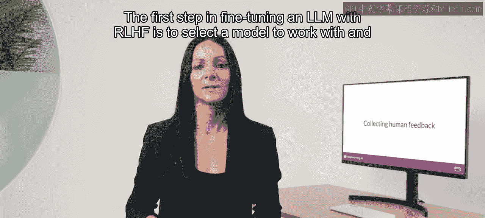
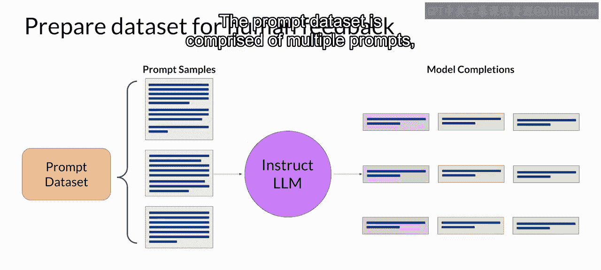
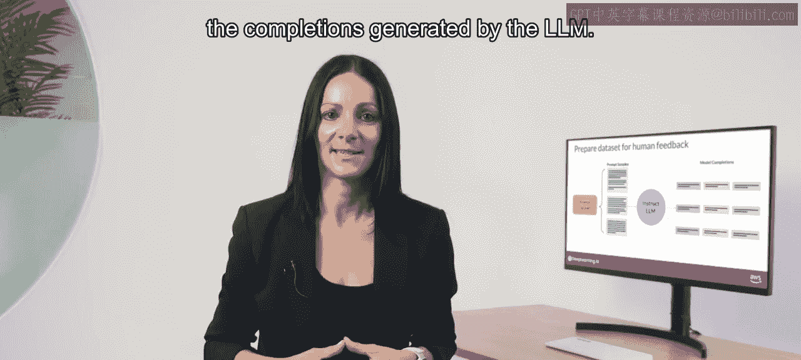
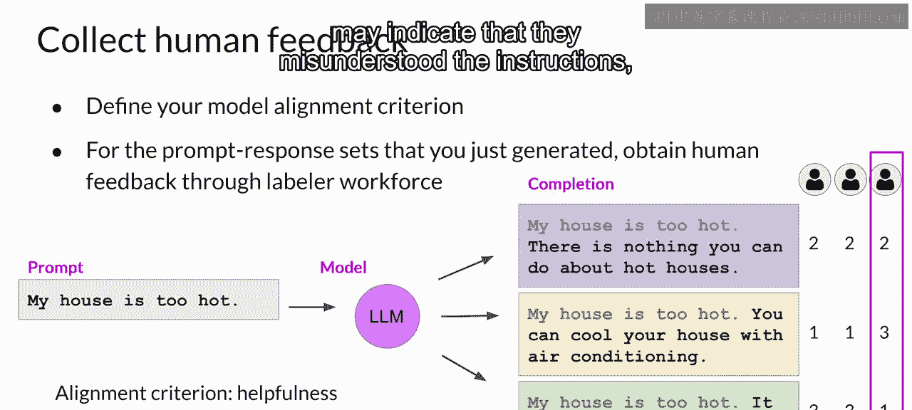
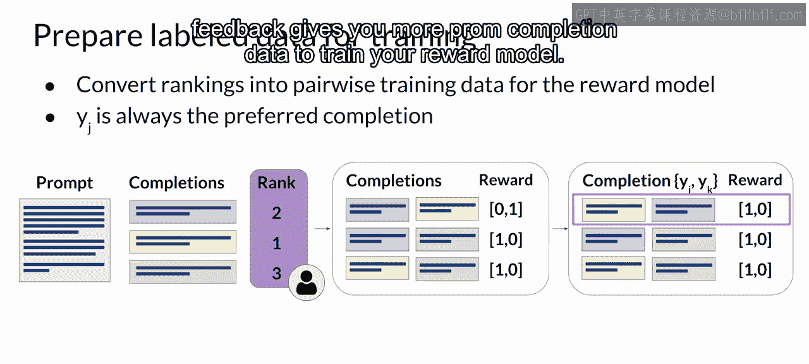
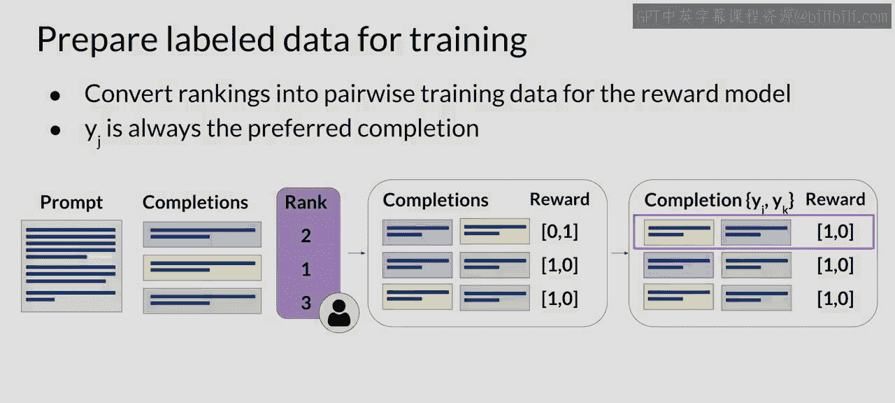

# 031：从人类获取反馈

在本节课中，我们将学习强化学习人类反馈（RLHF）微调流程的第一步：如何从人类标注员那里获取高质量的反馈数据。这是训练奖励模型的基础。

## 选择模型与生成响应

使用RLHF微调大语言模型的第一步，是选择一个基础模型，并用它来为人类反馈准备数据集。

你选择的模型应具备执行你感兴趣任务的基本能力，无论是文本摘要、问答还是其他任务。通常，从一个已经过多种任务微调、具备通用能力的指令模型开始会更容易。

接着，你将使用这个大语言模型，配合一个提示数据集，为每个提示生成多个不同的响应。提示数据集包含多个提示，每个提示都会经过大语言模型处理，产生一组补全（即模型的回答）。

## 收集人类反馈

下一步是从人类标注员那里收集对大语言模型生成的补全的反馈。这是强化学习人类反馈中“人类反馈”的部分。

首先，你必须决定希望人类依据什么标准来评估补全。这可以是之前讨论过的任何问题，例如“有帮助性”或“毒性”。确定标准后，你将要求标注员根据该标准评估数据集中的每个补全。

让我们看一个例子。在这个案例中，提示是“我的房子太热了”。你将这个提示输入大语言模型，模型生成了三个不同的补全。标注员的任务是按照“有帮助性”对这三个补全进行排序，从最有帮助到最没有帮助。

这里，标注员可能会认为补全2最有帮助，因为它告诉用户一个可以实际给房子降温的方法。补全1和3都不太有帮助，但标注员可能认为补全3更差，因为模型直接否定了用户的输入。因此，标注员将最佳补全排第一，次佳排第二，最差排第三。

这个过程会对许多“提示-补全”组合重复进行，从而构建一个可用于训练奖励模型的数据集，该模型最终将代替人类执行这项工作。通常，同一组“提示-补全”会分配给多位人类标注员，以建立共识并最小化组内低质量标注的影响。

## 提供清晰的标注指南

这一点非常重要。你提供的指南是否清晰，会极大地影响所获人类反馈的质量。标注员通常来自代表多元化和全球化思维的群体。

以下是为人类标注员编写的指南示例。这将在任务开始前呈现给标注员阅读，并在他们处理数据时可供随时查阅。

指南以标注员应执行的整体任务开始，在本例中是“为提示选择最佳补全”。指南继续提供更多细节，指导标注员如何完成任务。通常，这些指南越详细，标注员就越有可能理解他们必须执行的任务，并完全按照你的意愿完成。

例如，在第二条指南中，标注员被告知应根据他们对回答“正确性”和“信息量”的感知来做决定。他们被告知可以使用互联网进行事实核查和查找其他信息。同时，他们也得到了关于如何处理“平局”（即他们认为两个补全同样正确和信息丰富）的明确指示：可以给两个补全相同的排名，但应谨慎使用。最后一条值得注意的指南是关于如何处理无意义、令人困惑或不相关的答案：在这种情况下，标注员应选择“F”而不是排名，以便轻松剔除低质量答案。

提供这样一套详细的指南，可以增加获得高质量反馈的可能性，并确保不同个体执行任务的方式相似。这有助于确保标注完成的整体数据能代表共识观点。

## 为训练奖励模型准备数据

一旦人类标注员完成了对“提示-补全”组合的评估，你就拥有了训练奖励模型所需的所有数据。该模型将在强化学习微调过程中代替人类来对模型补全进行分类。

然而，在开始训练奖励模型之前，你需要将排名数据转换为补全的成对比较。换句话说，对于一个提示的所有可能补全对，都应被分类为0或1的分数。

在所示的例子中，一个提示有三个补全，人类标注员给出的排名是2、1、3（其中1对应最受偏好的响应）。对于三个不同的补全，存在三个可能的配对。根据每个提示的备选补全数量N，你将拥有 `C(N, 2)` 种组合。对于每一对，你将为首选响应分配奖励值1，为次选响应分配奖励值0。然后，你将重新排列提示，使首选选项排在前面。这是一个重要步骤，因为奖励模型期望首选补全（记为 `y_j`）在前。完成这种数据重构后，人类反馈就处于训练奖励模型的正确格式了。

需要注意的是，虽然“点赞/点踩”反馈通常比排名反馈更容易收集，但排名反馈能为你提供更多的“提示-补全”数据来训练奖励模型。正如你所见，从每次人类排名中，你可以得到三对“提示-补全”数据。

## 总结

本节课中，我们一起学习了RLHF流程中获取人类反馈的关键步骤。我们首先讨论了如何选择基础模型并生成初始响应。接着，我们详细介绍了如何设计任务、提供清晰指南，以从人类标注员那里收集高质量的排名反馈。最后，我们学习了如何将这些排名数据转换为成对比较格式，为下一步训练奖励模型做好准备。清晰的任务定义和详细的数据准备是确保后续微调成功的基础。