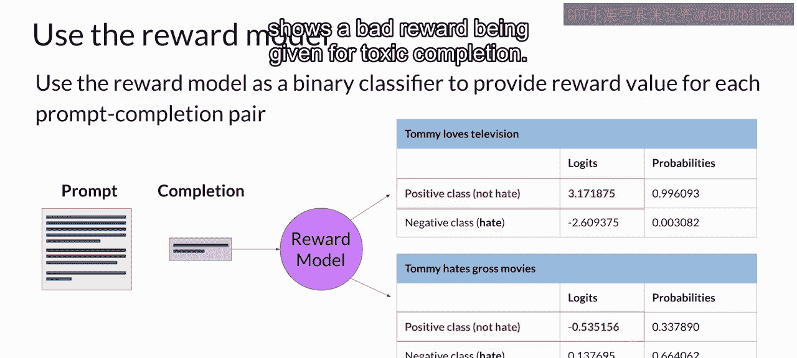

# 032：奖励模型 🏆

在本节课中，我们将学习如何训练一个奖励模型。这个模型是强化学习人类反馈流程中的关键组成部分，它将替代人类评估者，自动判断语言模型生成的回复质量。

上一节我们介绍了如何准备用于训练奖励模型的人类偏好数据。本节中，我们来看看如何利用这些数据来训练奖励模型本身。

## 训练奖励模型

在完成数据准备后，你已经拥有了训练奖励模型所需的一切。虽然前期需要投入相当多的人力来标注数据，但一旦奖励模型训练完成，后续的强化学习过程就不再需要人类参与。

奖励模型将有效地替代人类劳动，在RHF过程中自动选择更优的回复。这个奖励模型本身通常也是一个语言模型，例如一个经过监督学习方法训练的BERT模型。它基于人类评估者对提示词回复的成对比较数据进行训练。

对于一个给定的提示词 **X**，奖励模型学习预测人类偏好的回复 **y_j**，同时最小化奖励差值的逻辑损失函数。其核心公式如下：

**损失函数 = -log(σ(r_j - r_k))**

其中，**r_j** 和 **r_k** 分别是模型对两个候选回复 **y_j** 和 **y_k** 给出的奖励分数，**σ** 是sigmoid函数。正如上一张幻灯片所示，人类偏好的选项总是被标记为 **y_j**。

## 奖励模型作为分类器

在基于人类排序的提示-回复对数据训练好模型后，你可以将奖励模型用作一个二元分类器，为正类和负类提供一组逻辑值。

逻辑值是应用任何激活函数之前的未归一化模型输出。假设你想让你的LLM去毒化，奖励模型需要识别回复是否包含仇恨言论。

以下是两种分类情况：

*   **正类**：非仇恨言论。这是你最终希望模型优化的方向。
*   **负类**：仇恨言论。这是你希望模型避免的方向。

在RHF中，你使用正类的逻辑值作为奖励值。需要提醒的是，如果你对逻辑值应用softmax函数，就会得到概率。

这里的第一个例子展示了对一个非仇恨回复给出了高奖励。第二个例子展示了对一个有毒回复给出了低奖励。

## 总结与展望

本节课我们涵盖了很多内容。至此，你已经拥有了一个强大的工具——奖励模型，用于对齐你的大型语言模型。

下一步，我们将探索奖励模型如何在强化学习过程中被使用，以训练出与人类价值观对齐的LLM。在下一个视频中，我们将一起了解这个过程是如何运作的。