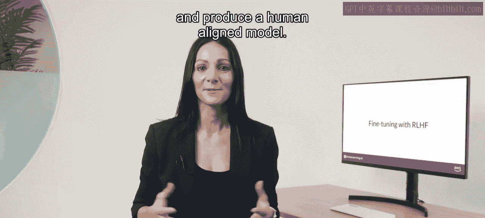
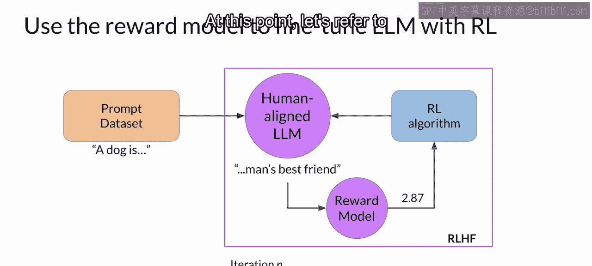
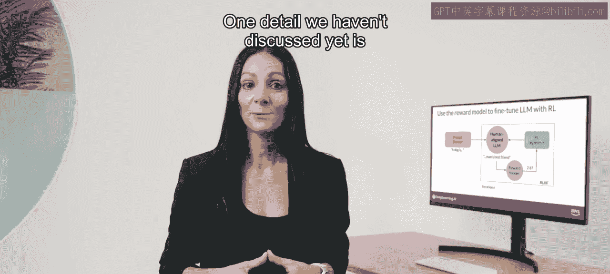
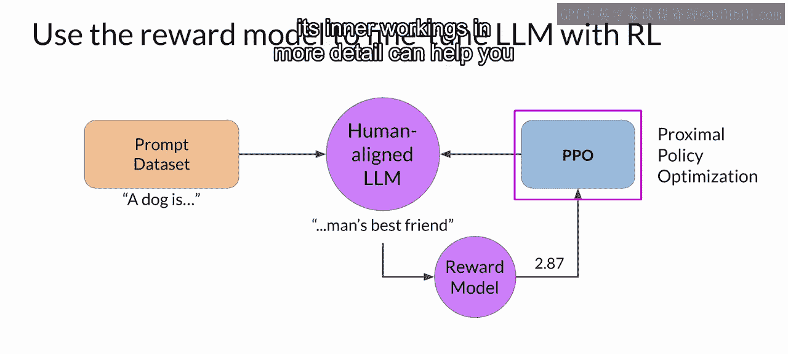
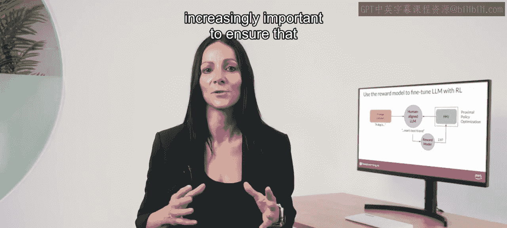

# 033：32_强化学习微调

在本节课中，我们将学习如何将奖励模型整合到强化学习过程中，以更新大型语言模型的权重，从而生成与人类偏好对齐的模型。我们将从整体流程开始，逐步深入到核心算法。

## 概述

强化学习人类反馈微调旨在使模型输出更符合人类价值观。整个过程始于一个在特定任务上已有良好表现的指令微调模型。我们将通过迭代的强化学习过程，利用奖励模型的评分来引导模型生成更优的响应。

## 强化学习人类反馈流程详解

上一节我们介绍了奖励模型的构建，本节中我们来看看如何利用它来微调语言模型。

整个流程是一个迭代过程，其核心步骤如下：

以下是RHF单次迭代的具体步骤：

1.  **输入提示**：从提示数据集中选取一个提示（例如，“A dog is”）输入给指令微调后的LLM。
2.  **生成补全**：LLM根据提示生成一个补全文本（例如，“a furry animal”）。
3.  **评估奖励**：将原始提示和生成的补全文本作为一对（PRm completion pair）输入给奖励模型。奖励模型根据其训练时学习到的人类反馈标准进行评估，并返回一个奖励值。
4.  **更新模型**：将此奖励值传递给强化学习算法（如PPO），算法据此更新LLM的权重，使其倾向于生成能获得更高奖励（即更符合人类偏好）的响应。

我们将经过一次权重更新后的模型称为**RL更新后的LLM**。如果流程有效，随着迭代进行，模型生成的补全所获得的奖励分数会逐步提高。当模型达到预设的评估标准（例如，达到特定的“有用性”阈值或达到最大训练步数）时，迭代停止，此时得到的模型可称为**人类对齐的LLM**。

## 核心算法：近端策略优化

我们尚未讨论的一个关键细节是强化学习算法的具体实现。该算法负责接收奖励模型的输出，并利用它来更新LLM的权重，以使得奖励分数随时间推移而增加。

在RHF流程中，有多种算法可供选择，一个流行的选择是**近端策略优化**。

**PPO**是一个相当复杂的算法，使用者无需了解其所有细节即可应用它。然而，其实现可能具有挑战性，更深入地理解其内部工作原理有助于在遇到问题时进行排查。

> 接下来的视频将更详细地解释PPO算法的工作原理。该视频为可选内容，你可以选择跳过它并直接进入下一节关于奖励黑客的视频。掌握这部分信息并非完成测验或本周实验所必需，但了解这些细节正变得越来越重要，因为它能确保LLM在部署时以安全、对齐的方式运行。

## 总结

本节课中我们一起学习了强化学习人类反馈微调的核心流程。我们从已指令微调的模型出发，通过提示生成补全，再利用奖励模型进行评估打分，最后借助强化学习算法（如PPO）根据奖励分数迭代更新模型权重，最终目标是获得一个与人类偏好高度对齐的语言模型。理解这个端到端的流程是应用RHF技术对齐大模型行为的基础。