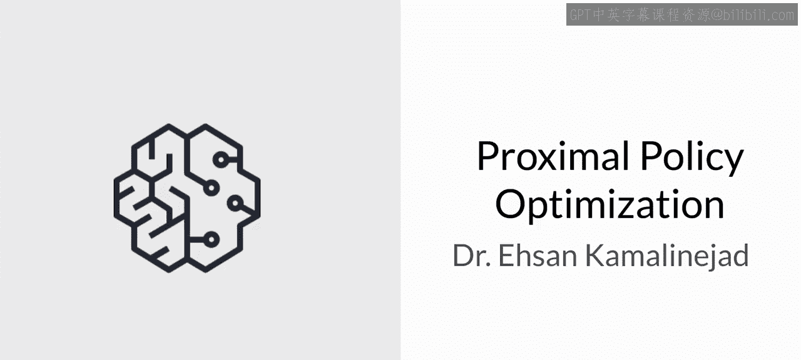
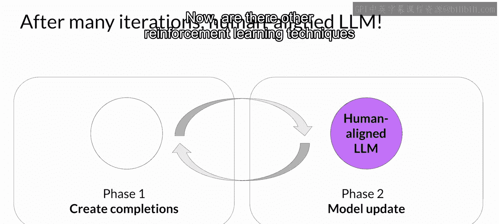

# 034：近端策略优化 (PPO) 🧠

在本节课中，我们将学习近端策略优化算法。这是一种用于强化学习的强大算法，特别适用于根据人类偏好来微调大型语言模型。我们将了解PPO如何工作，其核心组件，以及它如何帮助模型生成更符合人类期望的回复。

---

## 概述

近端策略优化是一种用于解决强化学习问题的强大算法。顾名思义，PPO优化一个策略，在本例中即大型语言模型，使其更符合人类偏好。经过多次迭代，PPO对LLM进行更新。这些更新幅度很小且在一个有界的区域内，从而产生一个与先前版本接近的更新后LLM，因此得名“近端”策略优化。将变化保持在这个小区域内可以实现更稳定的学习。

## 第一阶段：实验与评估

上一节我们介绍了PPO的目标，本节中我们来看看PPO每个周期的具体流程。PPO的每个周期分为两个阶段。

在**第一阶段**，使用LLM进行一系列实验，以完成给定的提示。这些实验允许你在第二阶段根据奖励模型来更新LLM。请记住，奖励模型捕捉了人类的偏好。例如，奖励可以定义回复的有用性、无害性和诚实性。

完成一个提示的**预期奖励**是PPO目标中使用的一个重要量。我们通过LLM的一个独立头部，称为**价值函数**，来估计这个量。

让我们更仔细地看看价值函数和价值损失。

假设给定了多个提示。首先，你生成LLM对这些提示的回复。然后，你使用奖励模型计算这些提示-完成对的奖励。例如，这里显示的第一个提示-完成对可能获得1.87的奖励，下一个可能获得-1.24的奖励，依此类推。你得到了一组提示-完成对及其对应的奖励。

价值函数估计给定状态 `S` 的预期总奖励。换句话说，当LLM生成一个回复的每个词元时，你希望基于当前的词元序列来估计未来的总奖励。你可以将其视为一个基线，用于根据你的对齐标准评估回复的质量。

假设在完成过程的这一步，估计的未来总奖励是0.34。随着生成下一个词元，估计的未来总奖励增加到1.23。目标是**最小化价值损失**，即实际未来总奖励（本例中为1.87）与其通过价值函数的近似值（本例中为1.23）之间的差值。价值损失使对未来奖励的估计更加准确。

价值函数随后将用于第二阶段的优势估计，我们稍后会讨论。这类似于你开始写一段文章时，甚至在动笔之前就对它的最终形式有一个大致的想法。

## 第二阶段：模型更新与策略目标

上一节我们介绍了第一阶段如何生成数据和评估奖励，本节中我们来看看如何利用这些信息更新模型。

在**第二阶段**，你对模型进行小幅更新，并评估这些更新对模型对齐目标的影响。模型权重的更新由提示-完成对的损失和奖励来指导。PPO还确保将模型更新保持在一个称为**信任区域**的特定小区域内。这就是PPO“近端”特性的体现。理想情况下，这一系列小更新将使模型朝着获得更高奖励的方向移动。

**PPO策略目标**是该方法的主要组成部分。请记住，目标是找到一个预期奖励高的策略。换句话说，你试图对LLM权重进行更新，使生成的回复更符合人类偏好，从而获得更高的奖励。策略损失是PPO算法在训练期间试图优化的主要目标。

我知道数学公式看起来很复杂，但实际上比看起来简单。让我们一步步分解它。

首先，关注最重要的表达式，暂时忽略其余部分。

`π(a_t | s_t)` 在LLM的上下文中，是给定当前提示 `s_t` 时下一个词元 `a_t` 的概率。动作 `a_t` 是下一个词元，状态 `s_t` 是到词元 `t` 为止已完成的提示。

分母是使用**初始版本**（已冻结）的LLM生成下一个词元的概率。分子是通过**更新后**的LLM（我们可以改变它以获得更好奖励）生成下一个词元的概率。

`Â_t` 称为给定动作选择的**估计优势项**。优势项估计当前动作与该状态下所有可能动作相比是好是坏的程度。因此，我们观察遵循新词元的完成的预期未来奖励，并估计这个完成与其他可能完成相比的优势程度。有一个基于我们之前讨论的价值函数的递归公式来估计这个量，这里我们专注于直观理解。

以下是我刚才描述内容的视觉表示。你有一个提示 `S`，并且有不同的路径来完成它，图中用不同的路径说明。优势项告诉你当前词元 `a_t` 相对于所有可能词元是好是坏。在这个可视化中，向上走的顶部路径是更好的完成，获得更高的奖励；向下走的底部路径是更差的完成。

那么我有一个问题，EK，为什么最大化这个项会导致更高的奖励？让我们考虑优势对于建议词元是正的情况。正优势意味着建议词元优于平均水平。因此，增加当前词元的概率似乎是一个能带来更高奖励的好策略。这转化为最大化我们这里的表达式。

如果建议词元比平均水平差，优势将为负。同样，最大化该表达式将降低该词元的概率，这是正确的策略。因此，总体结论是，最大化这个表达式会产生一个更好对齐的LLM。

好的，很好。那么我们就直接最大化这个表达式，对吗？直接最大化这个表达式会导致问题，因为我们的计算只有在优势估计有效的假设下才是可靠的。优势估计只有在旧策略和新策略彼此接近时才有效。这就是其余项发挥作用的地方。

因此，退一步再看整个方程，这里发生的是你选取两个项中较小的那个：一个是我们刚刚讨论的项，另一个是它的修改版本。注意，第二个表达式定义了两个策略彼此接近的区域。这些额外的项是护栏，它们简单地定义了LLM附近的一个区域，在这个区域内我们的估计误差很小。这被称为**信任区域**。这些额外的项确保我们不太可能离开信任区域。

总之，优化PPO策略目标可以在不超出不可靠区域的情况下，产生一个更好的LLM。

## 其他组件：熵损失

上一节我们讨论了策略目标的核心，本节中我们来看看另一个重要的组成部分——熵损失。

当策略损失推动模型朝向对齐目标时，**熵**允许模型保持**创造性**。如果你保持低熵，你可能会总是以相同的方式完成提示，如图所示。😡

更高的熵引导LLM走向更具创造性的方向。这类似于你在第一周看到的LLM的温度设置。区别在于，温度在**推理时**影响模型的创造性，而熵在**训练期间**影响模型的创造性。

## 整体目标与迭代

将所有项作为加权和放在一起，我们得到我们的PPO目标，它以稳定的方式将模型更新为更符合人类偏好。

这是整体的PPO目标。`C1` 和 `C2` 系数是超参数。

PPO目标通过反向传播在多个步骤中更新模型权重。一旦模型权重被更新，PPO就开始一个新的周期。对于下一次迭代，LLM被替换为更新后的LLM，并开始一个新的PPO周期。经过多次迭代，你得到了人类对齐的LLM。

## 其他技术与总结

现在，是否有其他用于RLHF的强化学习技术？是的，例如，**Q学习**是一种通过RL微调LLM的替代技术，但PPO是目前最流行的方法。在我看来，PPO之所以流行，是因为它在复杂性和性能之间取得了恰当的平衡。话虽如此，通过人类或AI反馈微调LLM是一个活跃的研究领域，我们预计在不久的将来会有更多的发展。例如，就在我们录制这个视频之前，斯坦福大学的研究人员发表了一篇论文，描述了一种称为**直接偏好优化**的技术，它是RLHF的一个更简单的替代方案。像这样的新方法仍处于积极开发中，需要做更多的工作来更好地理解它们的优势，但我认为这是一个非常令人兴奋的研究领域。

---

## 总结

本节课中我们一起学习了近端策略优化算法。我们了解到PPO通过两个阶段运作：第一阶段利用LLM生成回复并利用奖励模型进行评估；第二阶段基于策略目标、优势估计和信任区域对模型进行稳定的小幅更新，同时通过熵损失保持模型的创造性。PPO是目前将大型语言模型与人类偏好对齐的主流强化学习方法，平衡了效果与稳定性。该领域仍在快速发展，未来可能出现更优的算法。