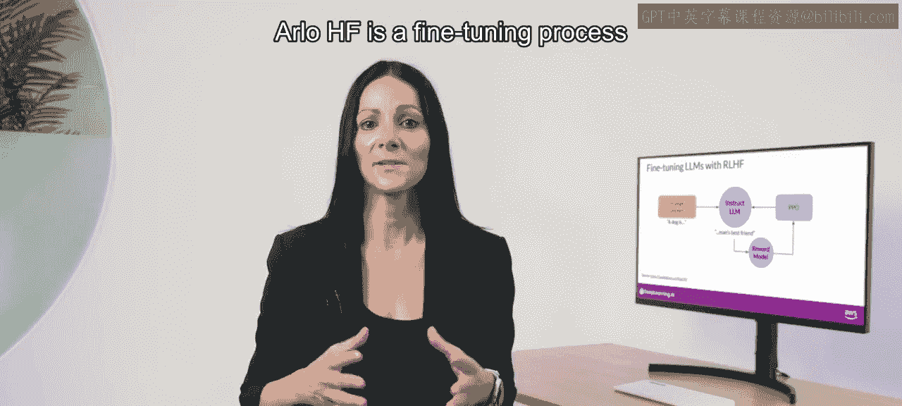
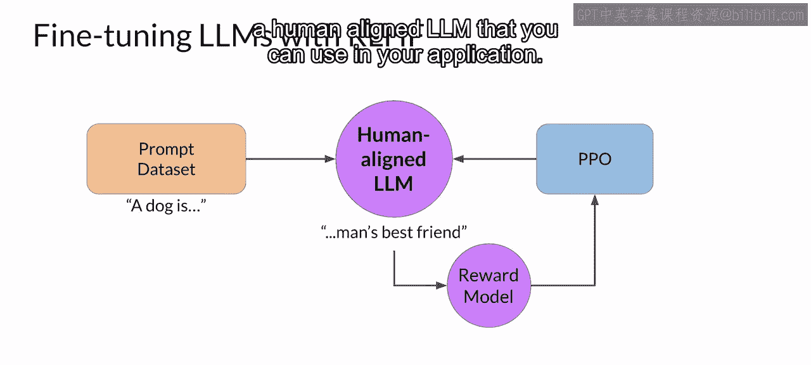
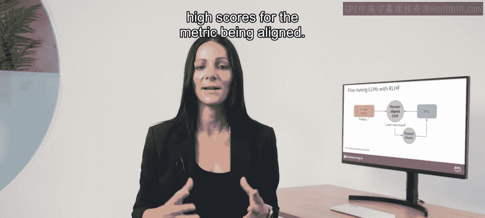
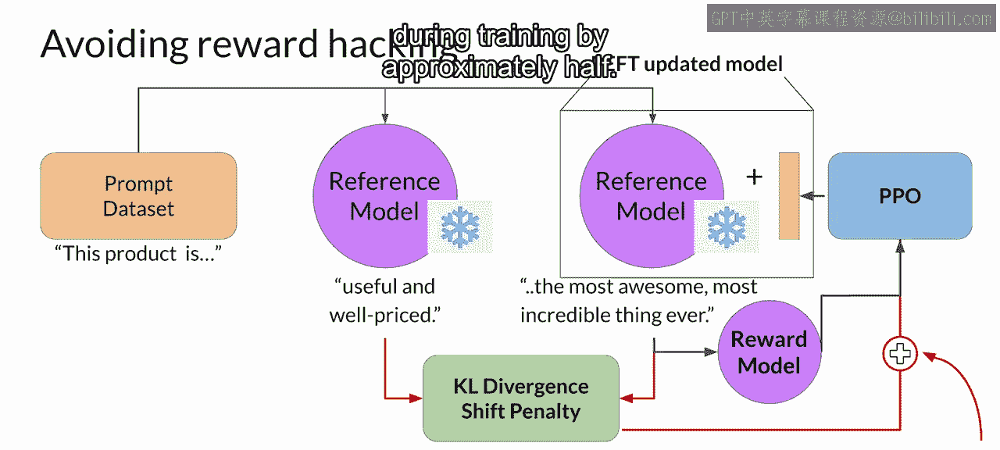
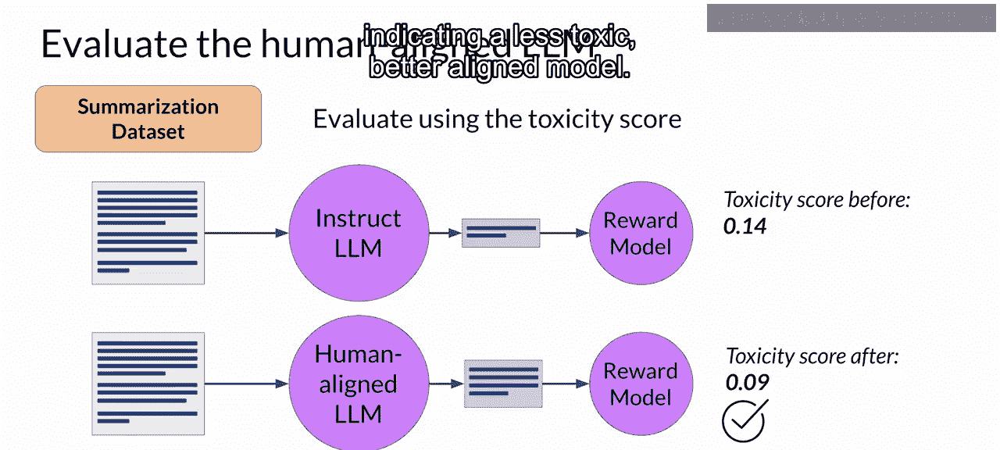

# 035：34_奖励欺骗

在本节课中，我们将回顾基于人类反馈的强化学习流程，并探讨一个可能出现的挑战——奖励欺骗。我们将了解其表现形式，并学习如何使用KL散度等技术来缓解这一问题，确保模型在优化目标的同时不偏离其核心语言能力。

## 强化学习与人类反馈流程回顾

上一节我们介绍了RLHF的基本流程。本节中，我们先来简要回顾一下。

基于人类反馈的强化学习是一种使大语言模型与人类偏好对齐的微调过程。该过程主要包含以下步骤：

1.  **使用奖励模型进行评估**：利用一个奖励模型，根据特定的人类偏好指标（例如“是否有帮助”），来评估大语言模型对一组提示数据集的补全结果。
2.  **应用强化学习算法更新权重**：使用强化学习算法（例如近端策略优化），根据当前版本大语言模型生成的补全所获得的奖励，来更新模型的权重。

你会使用许多不同的提示进行多次迭代，不断更新模型权重，直到获得期望的对齐程度。最终结果是一个与人类偏好对齐、可用于应用程序的大语言模型。

## 理解奖励欺骗问题

在强化学习中，一个有趣的问题是“奖励欺骗”。智能体可能学会通过选择能最大化奖励的动作来“欺骗”系统，即使这些动作与原始目标并不完全一致。

在大语言模型的上下文中，奖励欺骗可能表现为：模型在补全内容中添加某些词语或短语，这些内容能使其在对齐的指标上获得高分，但却降低了语言的整体质量。

例如，假设你正在使用RLHF来“净化”一个指令模型。你已经训练了一个可以进行情感分析、并将模型补全分类为“有毒”或“无毒”的奖励模型。

你从训练数据中选择提示“This product is”，并将其传递给指令模型以生成补全。一个不友好的补全，例如“complete garbage”，预计会获得较高的毒性评分。这个补全由奖励模型处理并生成分数，该分数被输入到PPO算法中，用于更新模型权重。

通过迭代，RLHF将更新大语言模型，使其生成毒性更低的回复。然而，当策略试图优化奖励时，它可能会过度偏离初始的语言模型。

在这个例子中，模型可能学会通过添加诸如“Most awesome, most incredible”之类的短语来生成能获得极低毒性评分的补全。这种语言听起来非常夸张。模型也可能开始生成无意义或语法错误的文本，仅仅因为这些文本碰巧能以类似的方式最大化奖励。这样的输出显然没有太大用处。

## 使用KL散度防止奖励欺骗

为了防止奖励欺骗的发生，你可以使用初始的指令模型作为性能参考。我们称之为**参考模型**。

参考模型的权重是冻结的，在RLHF迭代过程中不会更新。这样，你始终保留一个单一的参考模型用于比较。

在训练期间，每个提示会同时传递给两个模型：参考大语言模型和正在强化学习更新的中间模型，从而生成两个补全。

此时，你可以比较这两个补全，并计算一个称为**KL散度**的值。KL散度是一种衡量两个概率分布差异的统计指标。你可以用它来比较两个模型的补全，并确定更新后的模型与参考模型偏离了多少。

不必过于担心其工作原理的细节。KL散度算法包含在许多标准的机器学习库中，你可以在不了解背后所有数学原理的情况下使用它。在本周的实验中你将实际使用KL散度，从而亲身体验其工作方式。

KL散度是针对大语言模型整个词汇表中的每个生成词元进行计算的。这很容易达到数万甚至数十万个词元。然而，通过使用softmax函数，你可以将概率数量减少到远小于完整词汇表的大小。

请记住，这仍然是一个计算量相对较大的过程，因此使用GPU几乎总是有益的。

一旦计算了两个模型之间的KL散度，你就将其作为一项添加到奖励计算中。如果强化学习更新的模型偏离参考大语言模型太远，并生成了差异过大的补全，这项就会对模型进行惩罚。

需要注意的是，现在你需要大语言模型的两个完整副本来计算KL散度：冻结的参考大语言模型和正在强化学习更新的PPO大语言模型。

## 结合参数高效微调的优势

顺便提一下，你可以从将RLHF与参数高效微调结合中受益。在这种情况下，你只更新PEFT适配器的权重，而不是大语言模型的全部权重。

这意味着你可以为参考模型和PPO模型重用同一个底层大语言模型，PPO模型通过训练好的PEFT参数进行更新。这可以将训练期间的内存占用减少大约一半。

我知道这里有很多内容需要消化，但不用担心。结合PEFT的RLHF将在实验课中涉及，你将有机会看到它的实际运行并亲自尝试。

## 评估模型性能

完成模型的RLHF对齐后，你需要评估模型的性能。你可以使用摘要数据集来量化毒性的减少程度，例如本课程早期看到的对话摘要数据集。

这里使用的数字是**毒性分数**。这是负面类别（在本例中是有毒或仇恨回复）的概率，在所有补全结果上的平均值。

如果RLHF成功降低了大语言模型的毒性，这个分数应该下降。

以下是评估步骤：
1.  首先，通过使用能评估有毒语言的奖励模型，在摘要数据集上评估原始指令模型的补全，为其创建一个基线毒性分数。
2.  然后，在同一数据上评估你新得到的与人类对齐的模型，并比较分数。

在这个例子中，RLHF后的毒性分数确实下降了，表明模型毒性更低、对齐更好。同样，你将在本周的实验中看到所有这些内容。

## 总结

本节课中，我们一起学习了RLHF流程中可能出现的奖励欺骗问题。我们了解到，模型可能通过生成夸张或无意义的文本来“欺骗”奖励系统以获得高分。为了防止这种情况，我们引入了使用冻结的参考模型和计算KL散度的方法，将模型输出与原始分布进行比较并施加约束。此外，我们还看到了结合PEFT可以显著降低训练的内存需求。最后，我们介绍了如何使用毒性分数等指标来量化评估模型对齐后的性能改进。