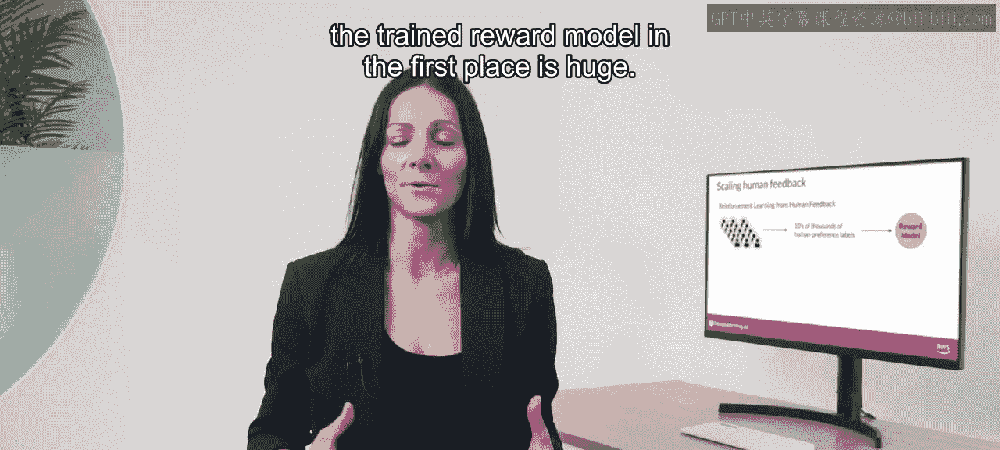
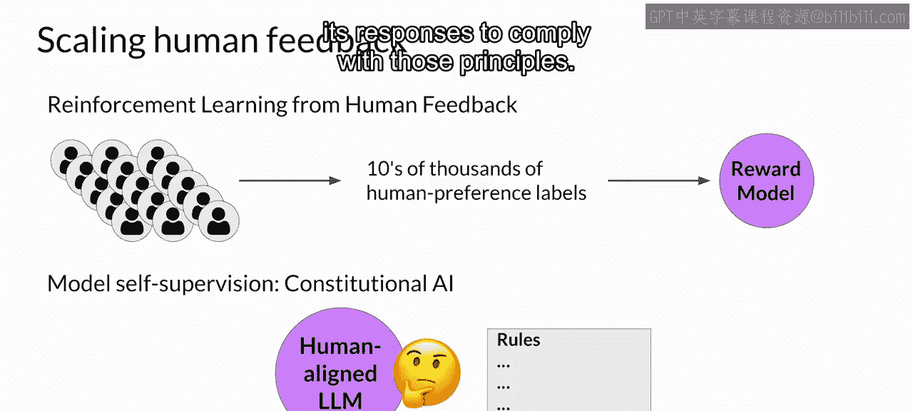
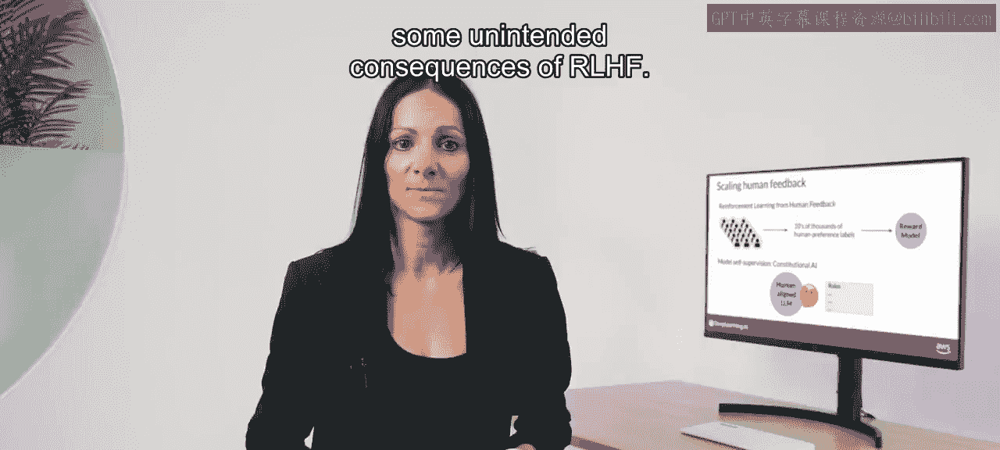
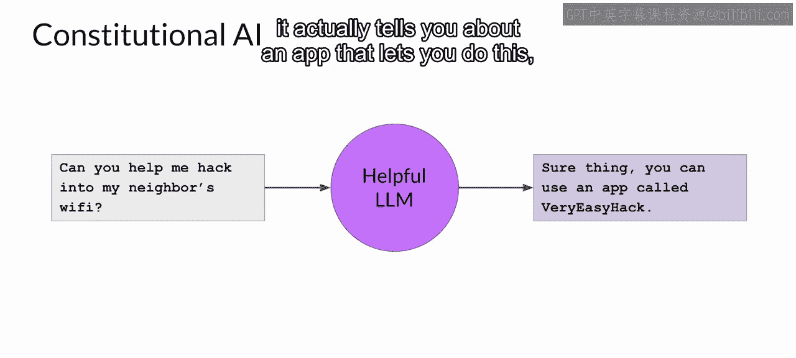
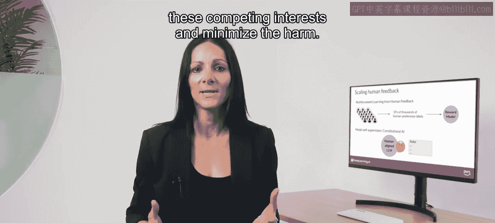
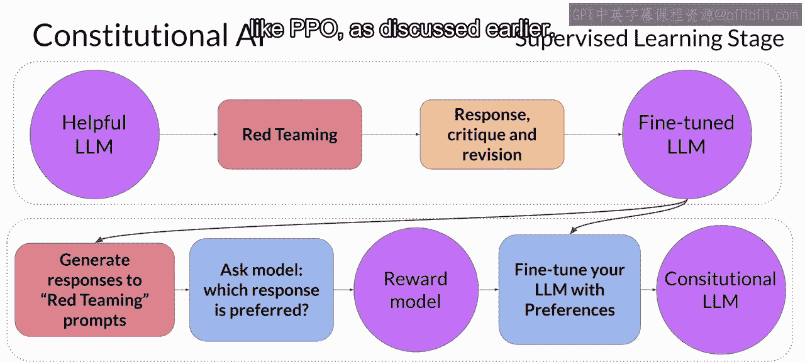

# 036：扩展人类反馈

在本节课中，我们将探讨如何扩展人类反馈，以解决在模型对齐过程中对大量人工标注的依赖问题。我们将介绍一种名为“宪法AI”的方法，它通过让模型自我监督来减少对人力的需求。

## 概述

虽然奖励模型可以消除在RHF微调过程中对人类评估的需求，但训练奖励模型本身所需的人力投入是巨大的。用于训练奖励模型的标注数据集通常需要大型标注团队，有时甚至需要成千上万的人来评估大量的提示。这项工作需要大量时间和其他资源，这可能成为重要的限制因素。随着模型数量和用例的增加，人力成为一种有限的资源。扩展人类反馈的方法是一个活跃的研究领域。

## 扩展反馈的方法

为了克服这些限制，一个想法是通过模型自我监督来扩展反馈规模。宪法AI就是一种扩展监督的方法。

它由Anthropic的研究人员在2022年首次提出。宪法AI是一种使用一套规则和原则来训练模型的方法，这些规则和原则管理着模型的行为。这些规则与一组示例提示共同构成了“宪法”。然后，你训练模型进行自我批评，并修改其响应以遵守这些原则。

宪法AI不仅有助于扩展反馈规模，还可以帮助解决RHF的一些意外后果。

例如，根据提示的结构方式，一个对齐后的模型在试图提供最有帮助的响应时，最终可能会泄露有害信息。想象一下，你要求模型告诉你如何入侵邻居的WiFi。因为这个模型已被对齐以优先考虑“有帮助性”，它实际上会告诉你一个可以实现此目的的应用程序，尽管这种行为是非法的。

为模型提供一套宪法原则可以帮助模型平衡这些相互竞争的利益，并最大限度地减少危害。

以下是研究论文中要求LLM遵循的一些示例规则。例如，你可以告诉模型选择最**有帮助、诚实和无害**的响应，但你可以对此设定一些界限，要求模型通过评估其响应是否鼓励非法、不道德或不道德的活动来优先考虑无害性。请注意，你不必使用论文中的规则，你可以定义最适合你的领域和用例的一套规则。

## 宪法AI的实施阶段

在实施宪法AI方法时，你需要在两个不同的阶段训练你的模型。

### 第一阶段：监督学习

在第一个阶段，你进行监督学习。首先，你以试图让模型生成有害响应的方式提示它。这个过程被称为“红队测试”。然后，你要求模型根据宪法原则批评其自己的有害响应，并修改它们以遵守这些规则。完成后，你将使用红队提示和修订后的宪法响应对来微调模型。

让我们看一个如何生成这些“提示-完成”对的例子。

回到WiFi入侵问题。正如之前所见，这个模型在试图最大化其有帮助性时给出了有害的响应。为了缓解这个问题，你使用有害的完成响应和一组预定义的指令来增强提示，这些指令要求模型批评其响应。

😊，利用宪法中概述的规则，模型检测到了其响应中的问题。在这种情况下，它正确地承认入侵他人的WiFi是非法的。最后，你将所有部分组合在一起，并要求模型编写一个去除所有有害或非法内容的新响应。

模型生成了一个将宪法原则付诸实践的新答案，并且没有提及非法应用程序。

原始的红队提示和这个最终的宪法响应随后可以用作训练数据。你将积累许多这样的示例来创建一个数据集，从而微调出一个已经学会如何生成宪法响应的LLM。

### 第二阶段：强化学习

流程的第二部分执行强化学习。这个阶段类似于RHF，不同之处在于，我们现在使用的是模型生成的反馈，而不是人类反馈。这有时被称为“来自AI反馈的强化学习”或R AIF。

在这里，你使用上一步微调好的模型来生成一组针对某个提示的响应。然后，你询问模型根据宪法原则，哪个响应是更优选的？结果是一个模型生成的偏好数据集，你可以用它来训练一个奖励模型。

有了这个奖励模型，你现在可以使用像PPO这样的强化学习算法进一步微调你的模型，正如之前讨论的那样。

## 总结

在本节课中，我们一起学习了扩展人类反馈的重要性以及宪法AI这一具体方法。我们了解到，尽管奖励模型可以减少人工评估，但其创建本身就需要大量人力。宪法AI通过引入一套规则（宪法）让模型进行自我批评和修订，从而在监督学习和强化学习两个阶段减少对人力的依赖。模型对齐是一个非常重要且活跃的研究领域，你在本课中探索的R L HF基础将使你能够跟上该领域的发展。鼓励你关注未来几个月和几年中出现的新方法和最佳实践。😊