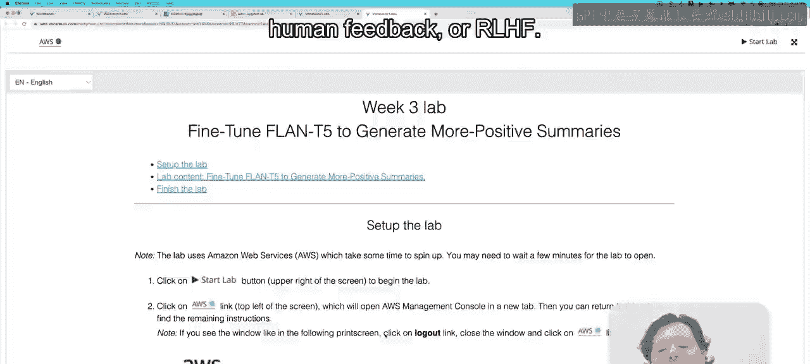
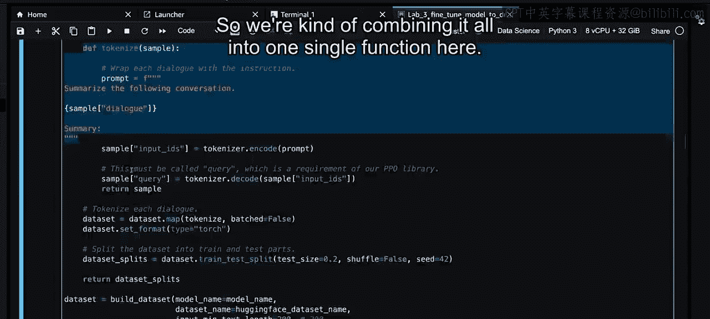
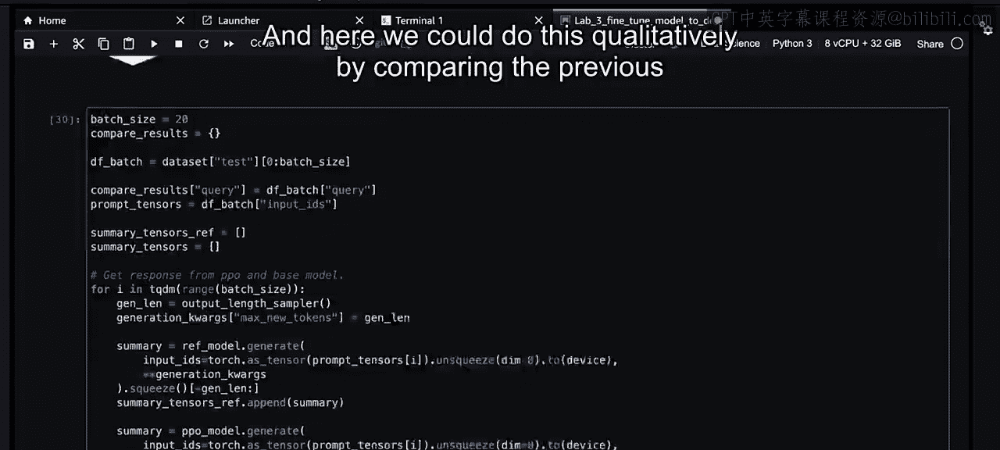

# 037：36_实验室3演练 🧪

在本节课中，我们将学习如何通过强化学习人类反馈来降低语言模型的毒性。我们将动手实践，使用PPO算法和一个仇恨言论奖励模型，对之前微调好的模型进行“解毒”处理。



---

## 概述 📋

上一节我们介绍了RLHF的理论基础。本节中，我们将通过一个实验来具体实现它。实验的目标是降低我们在Lab2中得到的指令微调模型的毒性。我们将使用一个仇恨言论分类器作为奖励模型，通过PPO算法来优化模型，使其生成更少仇恨言论的文本。最后，我们将对“解毒”前后的模型进行定量和定性比较。

## 环境与库安装 🔧

以下是实验所需的Python库。我们使用PyTorch作为深度学习框架，并引入了一些新的库来支持RLHF。

```python
# 安装必要的库
!pip install torch transformers datasets evaluate peft trl tqdm
```

*   **torch**: 深度学习框架。
*   **transformers**: Hugging Face的模型库，用于加载和使用预训练模型。
*   **datasets**: 用于加载和处理数据集。
*   **evaluate**: 用于模型评估，例如计算ROUGE分数。
*   **peft**: 参数高效微调库，我们将使用LoRA进行微调。
*   **trl**: 一个新的库，它为我们提供了PPO算法及其训练器。
*   **tqdm**: 用于显示进度条。

## 数据与模型准备 📊

我们将加载在Lab2中训练好的模型作为本次实验的起点。同时，我们需要准备一个用于评估毒性的数据集。

```python
from transformers import AutoModelForSeq2SeqLM, AutoTokenizer, AutoModelForSequenceClassification
from peft import LoraConfig, get_peft_model
from trl import PPOTrainer, PPOConfig, AutoModelForSeq2SeqLMWithValueHead, create_reference_model
from datasets import load_dataset
import torch

# 加载Lab2训练好的模型
model_name = “your_lab2_model_checkpoint”
model = AutoModelForSeq2SeqLM.from_pretrained(model_name)
tokenizer = AutoTokenizer.from_pretrained(model_name)

# 打印可训练参数数量（使用LoRA，仅占一小部分）
def print_trainable_parameters(model):
    trainable_params = sum(p.numel() for p in model.parameters() if p.requires_grad)
    all_params = sum(p.numel() for p in model.parameters())
    print(f”可训练参数: {trainable_params} | 全部参数: {all_params} | 占比: {100 * trainable_params / all_params:.2f}%”)



print_trainable_parameters(model) # 输出例如：1.4%
```

为了进行PPO训练，我们需要一个带有价值头（Value Head）的模型。价值头是PPO算法中用于估计状态价值的部分。

```python
# 为PPO训练准备模型（带有价值头）
model_for_training = AutoModelForSeq2SeqLMWithValueHead.from_pretrained(model_name)
print_trainable_parameters(model_for_training) # 参数数会略微增加，因为加入了价值头
```

## 奖励模型：仇恨言论分类器 🎯

我们将使用一个预训练的序列分类模型作为奖励模型。它的作用是判断一段文本是否包含仇恨言论。

```python
# 加载Facebook的RoBERTa仇恨言论分类模型
toxicity_model_name = “facebook/roberta-hate-speech-dynabench-r4-target”
toxicity_tokenizer = AutoTokenizer.from_pretrained(toxicity_model_name)
toxicity_model = AutoModelForSequenceClassification.from_pretrained(toxicity_model_name)

# 定义“非仇恨”类别的索引（非常重要！）
not_hate_index = 0 # 该模型输出中，索引0代表“非仇恨”
hate_index = 1 # 索引1代表“仇恨”

# 测试奖励模型
def get_toxicity_score(text):
    inputs = toxicity_tokenizer(text, return_tensors=“pt”, truncation=True)
    logits = toxicity_model(**inputs).logits
    # 获取“非仇恨”类别的分数（我们将最大化这个分数）
    not_hate_score = logits[0, not_hate_index].item()
    return not_hate_score

# 测试非毒性文本
print(get_toxicity_score(“I want to kiss you”)) # 应输出一个很高的正数
# 测试毒性文本（示例，实际使用时请谨慎）
# print(get_toxicity_score(“...")) # 应输出一个较低的分数或负数
```

**核心概念**：奖励模型 `toxicity_model` 对输入文本进行打分。在PPO中，我们的目标是**最大化** `not_hate_score`，即模型生成“非仇恨”文本的倾向。

## 构建PPO训练流程 ⚙️

接下来，我们配置PPO训练器并开始训练。PPO训练需要三个关键部分：要训练的模型、参考模型（用于计算KL散度以防止奖励黑客）和奖励函数。

```python
# 1. 创建参考模型（固定不变，用于KL散度计算）
ref_model = create_reference_model(model_for_training)

# 2. 定义PPO配置
ppo_config = PPOConfig(
    model_name=model_name,
    learning_rate=1.41e-5,
    batch_size=16,
    ppo_epochs=4, # PPO训练轮数
)

# 3. 初始化PPO训练器
ppo_trainer = PPOTrainer(
    config=ppo_config,
    model=model_for_training, # 要训练的模型（带价值头）
    ref_model=ref_model, # 参考模型
    tokenizer=tokenizer,
)

# 4. 准备训练数据（构建查询-响应对）
def build_dataset_for_ppo(dialogue_dataset):
    # 此函数将对话数据转换为模型用于总结的提示（prompt）
    # 例如：”Summarize the following conversation: ...”
    prompts = []
    for dialogue in dialogue_dataset[“dialogue”]:
        prompt = f”Summarize the following conversation:\n{dialogue}\n\nSummary:”
        prompts.append(prompt)
    return prompts

# 加载对话数据集
dataset = load_dataset(“dialog_sum”) # 示例数据集
train_prompts = build_dataset_for_ppo(dataset[“train”])
```

现在，我们进入核心的训练循环。在每一步中，模型根据提示生成总结，奖励模型对该总结进行评分，然后PPO算法利用这个分数来更新模型参数。

```python
# 5. PPO训练循环
for epoch in range(ppo_config.ppo_epochs):
    for batch_prompts in train_prompts: # 在实际代码中，这里应是分批处理
        # 模型生成总结（响应）
        response_tensors = []
        for prompt in batch_prompts:
            input_ids = tokenizer(prompt, return_tensors=“pt”).input_ids
            # 使用模型生成总结
            generation = model_for_training.generate(input_ids, max_length=50)
            response_tensors.append(generation)

        # 将生成的文本解码
        batch_responses = [tokenizer.decode(r[0], skip_special_tokens=True) for r in response_tensors]

        # 使用奖励模型计算分数（查询+响应）
        rewards = []
        for prompt, response in zip(batch_prompts, batch_responses):
            query_response_text = prompt + “ “ + response
            # 计算“非仇恨”分数作为奖励
            reward_score = get_toxicity_score(query_response_text)
            rewards.append(torch.tensor([reward_score]))

        # 将数据转换为PPO训练器所需的格式
        batch_tensors = [tokenizer(p, return_tensors=“pt”).input_ids[0] for p in batch_prompts]

        # 执行PPO训练步骤
        stats = ppo_trainer.step(batch_tensors, response_tensors, rewards)

        # 打印训练状态，如KL散度（应保持在一定范围内）
        print(f”Epoch {epoch}, KL Div: {stats[‘ppo/returns/kl’]:.2f}, Mean Reward: {sum(rewards)/len(rewards):.2f}”)
```

**核心概念**：`ppo_trainer.step()` 是训练的关键。它接收**提示（prompts）**、模型生成的**响应（responses）**和对应的**奖励（rewards）**，然后执行PPO更新，在最大化奖励的同时，通过KL散度约束模型不要偏离原始模型（`ref_model`）太远。

## 评估与结果比较 📈

训练完成后，我们需要评估“解毒”效果。我们将从定量（平均毒性分数）和定性（生成文本示例）两个方面进行比较。

```python
# 定量评估：计算模型生成文本的平均毒性分数
def evaluate_toxicity(model, tokenizer, eval_prompts, num_samples=50):
    toxicity_scores = []
    for prompt in eval_prompts[:num_samples]:
        input_ids = tokenizer(prompt, return_tensors=“pt”).input_ids
        with torch.no_grad(): # 评估时不计算梯度
            output = model.generate(input_ids, max_length=50)
        response = tokenizer.decode(output[0], skip_special_tokens=True)
        score = get_toxicity_score(prompt + “ “ + response)
        toxicity_scores.append(score)
    mean_score = sum(toxicity_scores) / len(toxicity_scores)
    std_score = torch.tensor(toxicity_scores).std().item()
    return mean_score, std_score

# 评估原始模型（Lab2的模型）
print(“评估原始模型...”)
orig_model = AutoModelForSeq2SeqLM.from_pretrained(model_name)
orig_mean, orig_std = evaluate_toxicity(orig_model, tokenizer, train_prompts[:100])
print(f”原始模型 - 平均毒性分数: {orig_mean:.4f} (±{orig_std:.4f})“)

# 评估PPO微调后的模型
print(”\n评估PPO微调后的模型...“)
ppo_mean, ppo_std = evaluate_toxicity(model_for_training, tokenizer, train_prompts[:100])
print(f”PPO模型 - 平均毒性分数: {ppo_mean:.4f} (±{ppo_std:.4f})“)

# 我们希望PPO模型的平均分数（非仇恨分数）更高，表示毒性更低。
print(f”毒性降低（分数增加）: {ppo_mean - orig_mean:.4f}“)
```

以下是定性比较的示例。我们可以观察模型对相同提示的总结在训练前后有何变化。

```python
# 定性评估：查看具体示例
sample_prompts = train_prompts[:5]
print(“定性比较（前 vs 后）:”)
print(“=”*50)
for i, prompt in enumerate(sample_prompts):
    # 原始模型生成
    orig_input_ids = tokenizer(prompt, return_tensors=“pt”).input_ids
    orig_output = orig_model.generate(orig_input_ids, max_length=50)
    orig_summary = tokenizer.decode(orig_output[0], skip_special_tokens=True)

    # PPO模型生成
    ppo_input_ids = tokenizer(prompt, return_tensors=“pt”).input_ids
    ppo_output = model_for_training.generate(ppo_input_ids, max_length=50)
    ppo_summary = tokenizer.decode(ppo_output[0], skip_special_tokens=True)

    print(f”\n示例 {i+1}:“)
    print(f”提示: {prompt[:100]}...“)
    print(f”原始模型总结: {orig_summary}“)
    print(f”PPO模型总结: {ppo_summary}“)
    print(f”原始奖励分数: {get_toxicity_score(prompt + ‘ ‘ + orig_summary):.2f}“)
    print(f”PPO奖励分数: {get_toxicity_score(prompt + ‘ ‘ + ppo_summary):.2f}“)
    print(”-”*30)
```

## 总结 🎓



本节课中我们一起学习了强化学习人类反馈的实际应用。我们通过一个完整的实验流程，使用PPO算法和一个仇恨言论分类奖励模型，成功降低了指令微调语言模型的毒性。

关键步骤回顾：
1.  **准备阶段**：加载基础模型和奖励模型，并理解奖励模型输出的含义。
2.  **PPO配置**：设置带有价值头的训练模型、固定的参考模型以及PPO训练的超参数。
3.  **训练循环**：模型生成文本，奖励模型打分，PPO算法利用分数更新模型参数，同时用KL散度防止模型“作弊”。
4.  **评估比较**：通过计算平均毒性分数和对比生成文本的示例，定量和定性地验证了“解毒”效果。

通过本实验，你将更深入地理解RLHF如何将人类偏好（如“减少毒性”）转化为可优化的目标，从而引导大型语言模型生成更安全、更符合期望的内容。