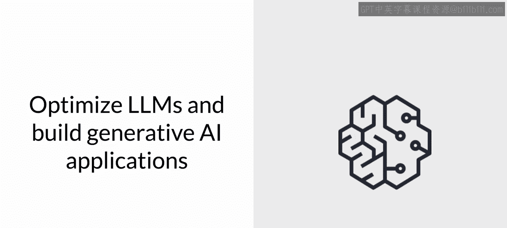
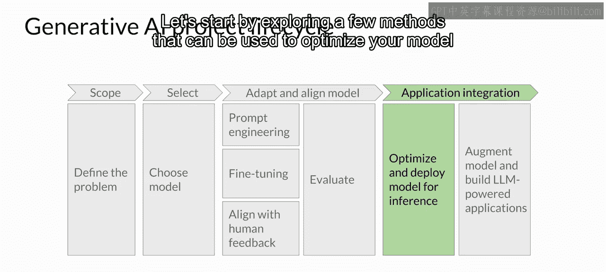
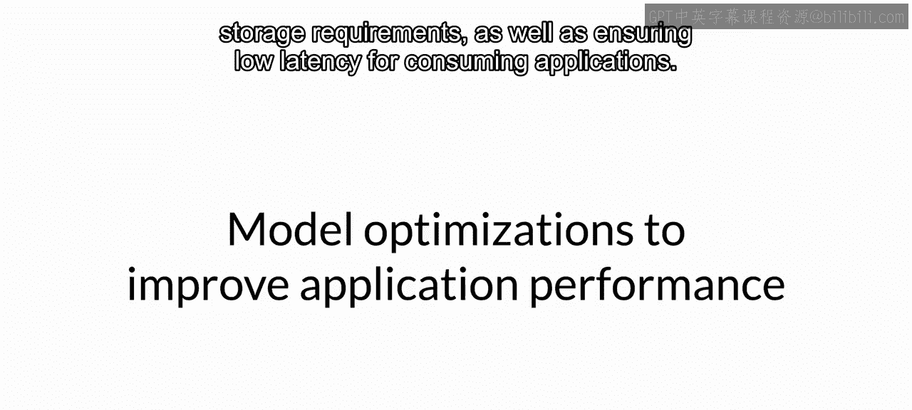
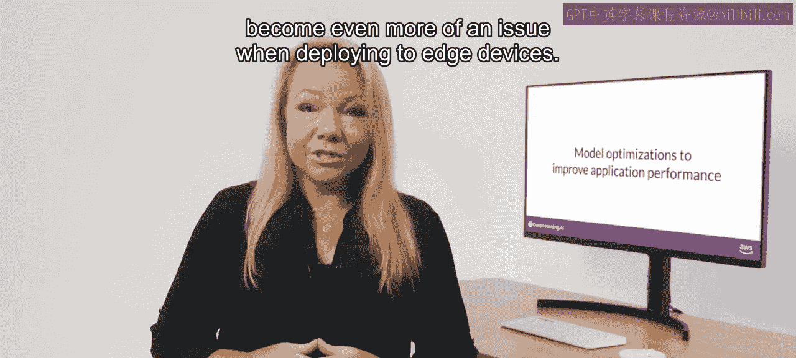
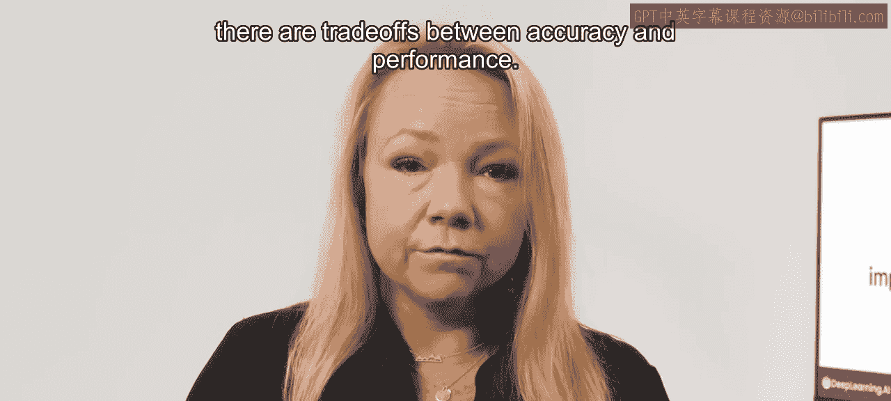
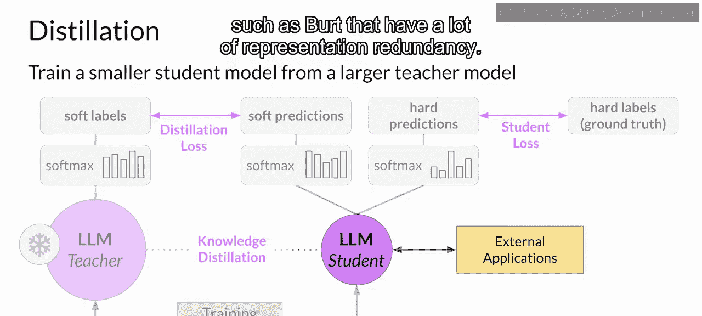
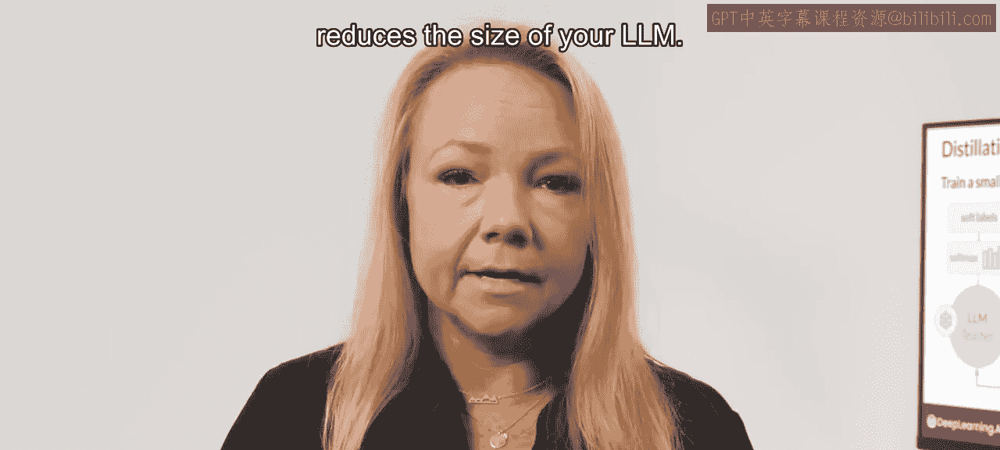
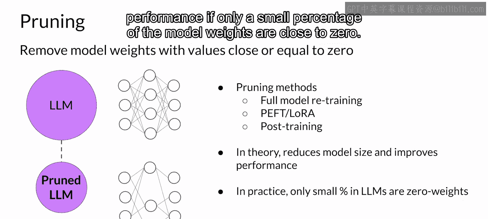

# 038：模型部署优化 🚀

在本节课中，我们将要学习如何将经过适配和对齐的大型语言模型集成到实际应用中。我们将探讨在部署前需要考虑的关键问题，并详细介绍三种优化模型以提升推理性能的技术：知识蒸馏、量化与剪枝。

现在你已经探索了如何使大型语言模型适应并对齐你的任务，接下来我们来讨论将模型集成到应用程序中需要考虑的事项。

在此阶段，有一系列重要问题需要提出。

第一组问题与你的LLM在部署中的功能表现相关。例如，你的模型需要以多快的速度生成补全内容？你拥有多少可用的计算预算？你是否愿意为了提升推理速度或降低存储成本，而在模型性能上做出一些妥协？

第二组问题则与你的模型可能需要的额外资源有关。你是否打算让模型与外部数据或其他应用程序交互？如果是，你将如何连接到这些资源？

最后，是关于模型如何被使用的问题。你的模型将通过什么样的预期应用程序或API接口来被消费？

让我们从探索几种在部署模型进行推理之前可以使用的优化方法开始。虽然我们可以用好几节课来深入探讨这个话题，但本节的目标是向你介绍最重要的优化技术。

## 计算与存储的挑战 💾

大型语言模型在推理时面临着计算和存储需求方面的挑战，同时还需要确保消费应用程序的低延迟。

无论你是部署在本地还是云端，这些挑战都持续存在。当部署到边缘设备时，这些问题会变得更加突出。提升应用程序性能的主要方法之一是减小LLM的规模。

## 模型优化的目标 ⚙️

减小模型规模可以加快模型的加载速度，从而降低推理延迟。然而，挑战在于如何在减小模型规模的同时，仍然保持模型的性能。对于生成式模型，某些技术比其他技术效果更好，并且在准确性和性能之间需要权衡取舍。

你将在本节学习三种技术。以下是这三种核心优化技术的简要介绍：

*   **知识蒸馏**：使用一个更大的模型（教师模型）来训练一个更小的模型（学生模型）。然后使用较小的模型进行推理，以降低存储和计算预算。
*   **量化**：类似于量化感知训练，训练后量化将模型的权重转换为更低精度的表示（例如16位浮点数或8位整数）。正如你在课程第一周所学，这可以减少模型的内存占用。
*   **模型剪枝**：移除对模型性能贡献很小的冗余模型参数。

让我们更详细地讨论这些选项。

## 知识蒸馏 👨‍🏫➡️👨‍🎓

知识蒸馏是一种技术，重点是让一个更大的教师模型训练一个更小的学生模型。学生模型学习在统计上模仿教师模型的行为，可以仅在最终预测层模仿，也可以在模型的隐藏层也进行模仿。

这里你将专注于第一种选项。你从微调好的LLM作为教师模型开始，并为学生模型创建一个更小的LLM。你冻结教师模型的权重，并使用它为你的训练数据生成补全内容。同时，你使用学生模型为训练数据生成补全内容。

教师模型和学生模型之间的知识蒸馏是通过最小化一个称为**蒸馏损失**的损失函数来实现的。其核心公式是计算两个概率分布之间的差异：

`蒸馏损失 = 损失函数(教师模型的软标签， 学生模型的软预测)`

为了计算这个损失，蒸馏使用了由教师模型的softmax层产生的词元概率分布。现在教师模型已经在训练数据上进行了微调，因此概率分布很可能与真实数据紧密匹配，并且在词元上不会有太大变化。

这就是为什么蒸馏应用了一个小技巧：向softmax函数添加一个**温度参数**。正如你在第一课中学到的，更高的温度会增加模型生成语言的创造性。当温度参数大于1时，概率分布变得更广泛，峰值不那么尖锐。这种更“柔和”的分布为你提供了一组与真实词元相似的词元。

在蒸馏的上下文中，教师模型的输出通常被称为**软标签**，而学生模型的预测被称为**软预测**。

与此同时，你训练学生模型基于你的真实训练数据生成正确的预测。在这里，你不使用温度设置，而是使用标准的softmax函数。蒸馏将学生模型的输出称为**硬预测**和**硬标签**。这两者之间的损失是**学生损失**。

结合蒸馏损失和学生损失，通过反向传播来更新学生模型的权重。

蒸馏方法的主要好处是，在部署时可以使用较小的学生模型进行推理，而不是教师模型。在实践中，蒸馏对于生成式解码器模型效果不那么显著，它通常对像BERT这样具有大量表示冗余的仅编码器模型更有效。

需要注意的是，通过蒸馏，你是在训练第二个更小的模型用于推理，你并没有以任何方式减小初始LLM的模型大小。

## 训练后量化 🔢

让我们看看下一个实际减小LLM大小的模型优化技术。你在第一周的训练背景下已经介绍了第二种方法——量化，特别是**量化感知训练**。

然而，在模型训练完成后，你可以执行**训练后量化**以优化其部署。PTQ将模型的权重转换为更低精度的表示（例如16位浮点数或8位整数），以减少模型大小和内存占用，以及模型服务所需的计算资源。

量化可以仅应用于模型权重，也可以同时应用于权重和激活层。通常，包含激活层的量化方法可能对模型性能产生更大的影响。量化还需要一个额外的校准步骤，以统计方式捕获原始参数值的动态范围。

与其他方法一样，这里也存在权衡，因为有时量化会导致模型评估指标小幅下降。然而，这种下降通常值得换取成本节约和性能提升。

## 模型剪枝 ✂️

最后一个模型优化技术是剪枝。从高层次看，其目标是通过消除对整体模型性能贡献不大的权重来减小推理时的模型大小。这些是值非常接近或等于零的权重。

需要注意的是，一些剪枝方法需要模型完全重新训练，而另一些则属于参数高效微调的范畴，例如LoRA。也有一些方法专注于训练后剪枝。

理论上，这可以减少模型的大小并提高性能。然而，在实践中，如果只有一小部分模型权重接近零，那么对大小和性能的影响可能不大。

## 总结 📝

本节课中我们一起学习了模型部署前的关键考量与优化技术。量化、蒸馏和剪枝都旨在减小模型大小，以在不影响准确性的情况下提升推理时的模型性能。为部署优化你的模型将有助于确保你的应用程序运行良好，并为用户提供最佳的体验。