# 039：生成式AI项目生命周期备忘单 📋

在本节课中，我们将学习生成式AI项目生命周期的各个阶段，并了解每个阶段所需的时间和精力。这有助于你规划从模型选择到最终部署的整个流程。

到目前为止，你在课程中看到的所有内容——从选择模型、进行微调，到使其与人类偏好对齐——都将在你部署应用程序之前完成。

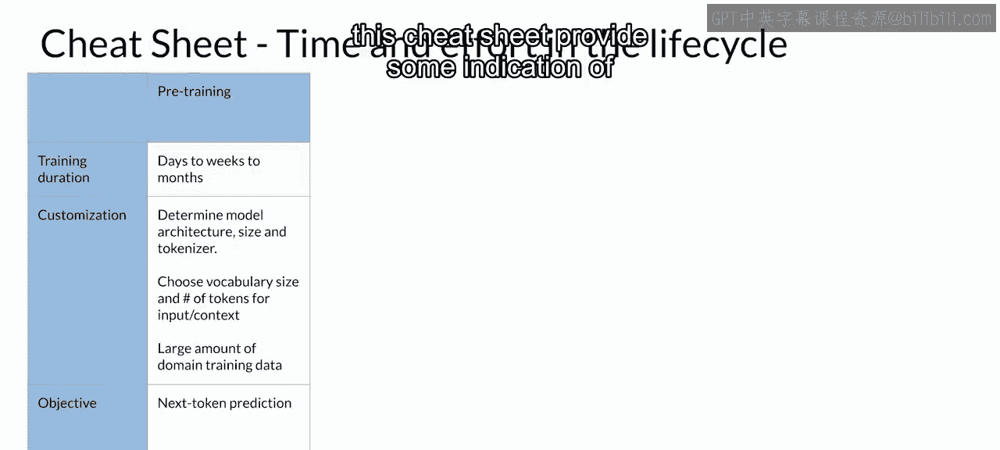

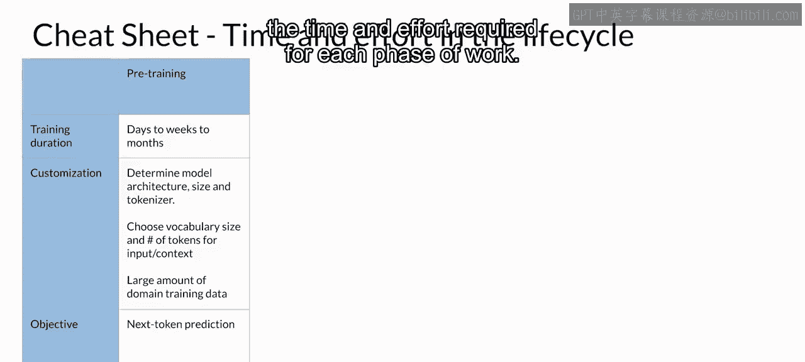

为了帮助你规划生成式AI项目生命周期的这些阶段，这份备忘单提供了每个工作阶段所需时间和精力的大致指示。

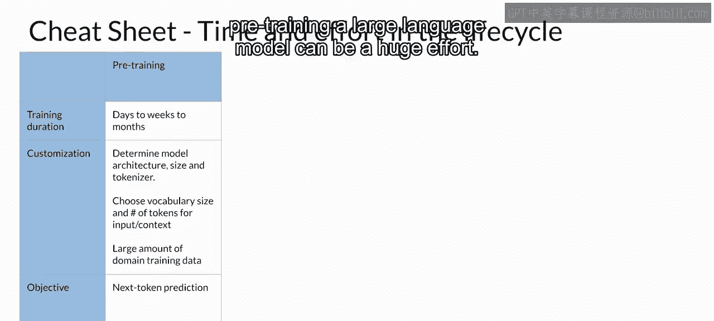

## 1. 预训练阶段 🏗️

正如之前所见，预训练一个大型语言模型可能是一项巨大的工程。

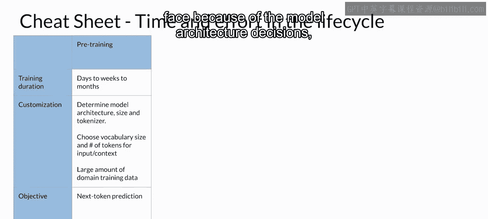

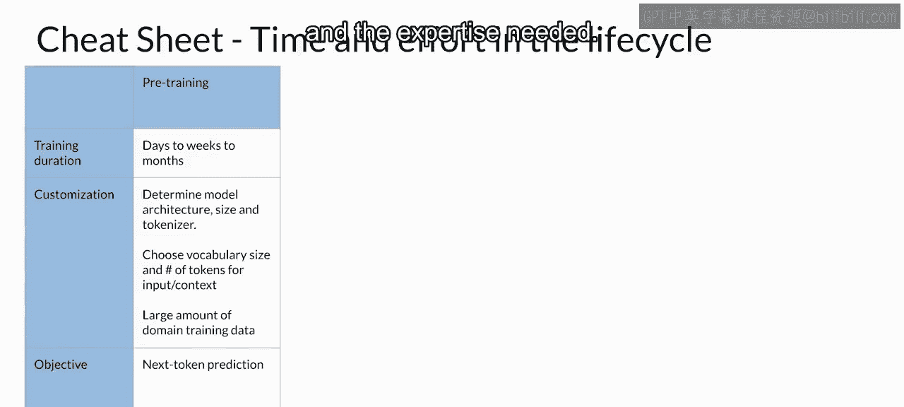

这个阶段是你将面临的最复杂的阶段，因为它涉及模型架构的决策、所需的大量训练数据以及必要的专业知识。

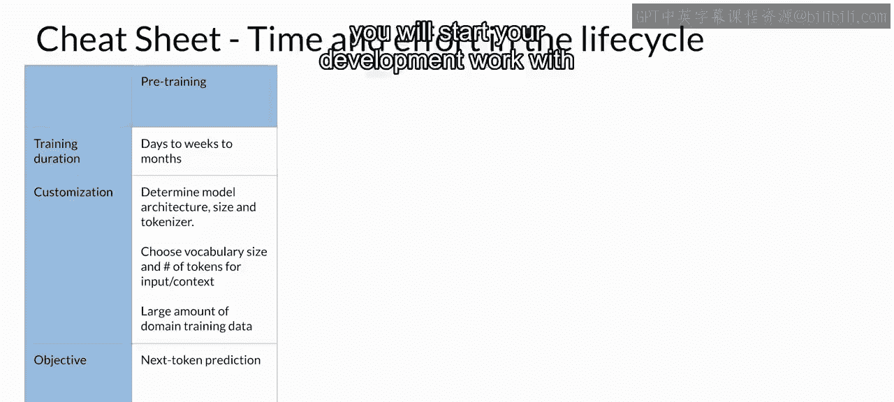

**核心概念**：`预训练 = 大规模数据 + 复杂模型架构 + 专业知识`

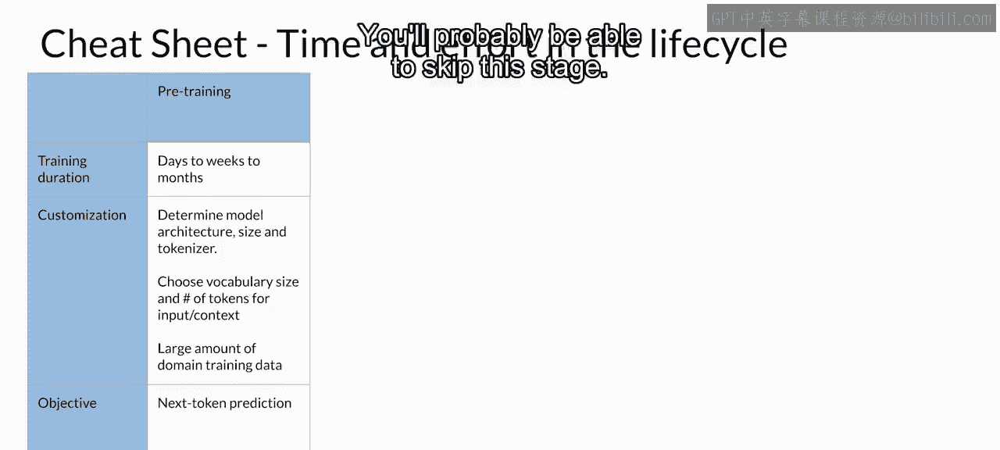

不过请记住，通常你会从一个现有的基础模型开始你的开发工作，因此你很可能可以跳过这个阶段。

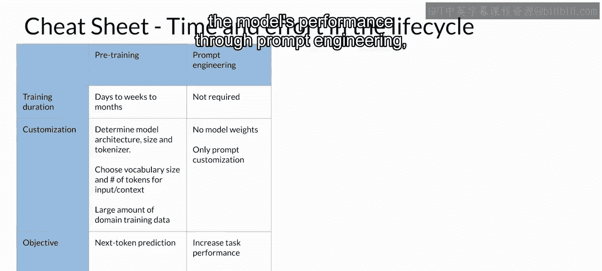

## 2. 提示工程阶段 ✍️

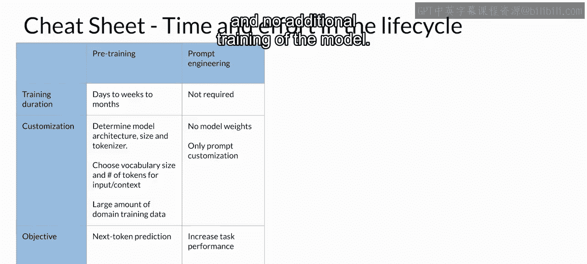

上一节我们介绍了最复杂的预训练阶段，本节中我们来看看更常见的起点。如果你正在使用一个基础模型，你很可能会通过提示工程来开始评估模型的性能。

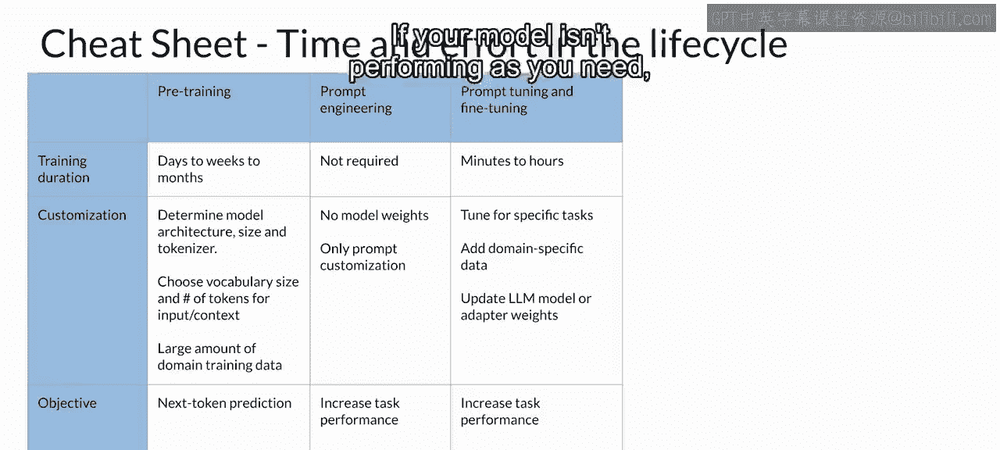

这种方法对技术专业知识要求较低，且不需要对模型进行额外的训练。

以下是提示工程阶段的特点：
*   对技术专业知识要求较低。
*   无需额外训练模型。
*   是评估和初步改进模型性能的快速起点。

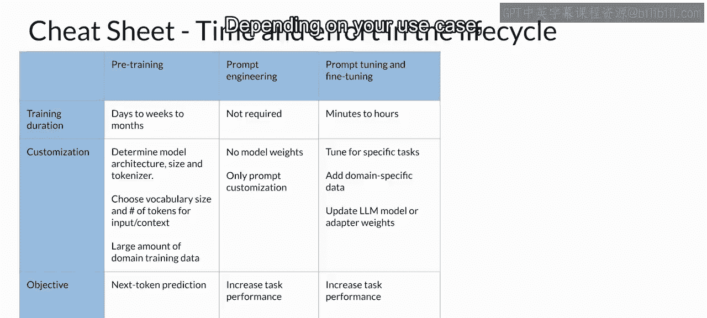

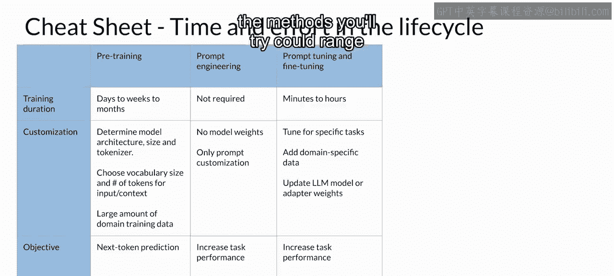

## 3. 提示调优与微调阶段 🔧

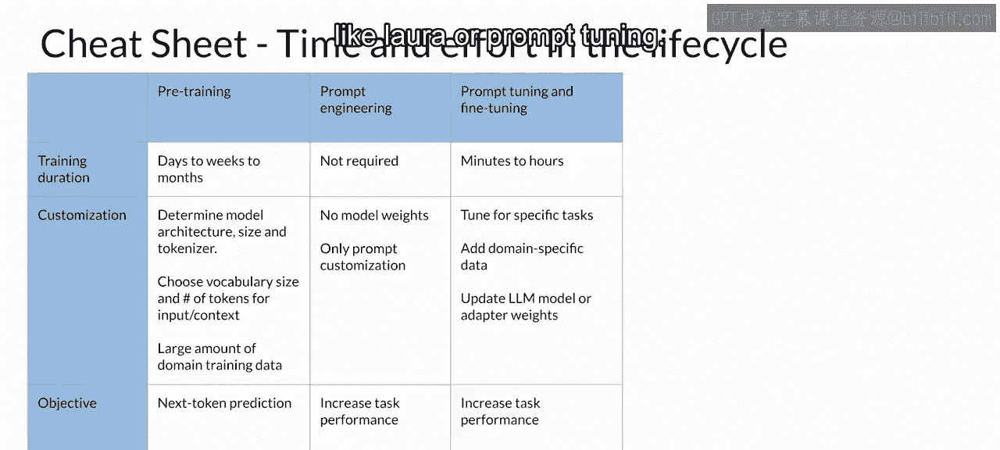

如果你的模型表现未达预期，接下来你会考虑提示调优和微调。

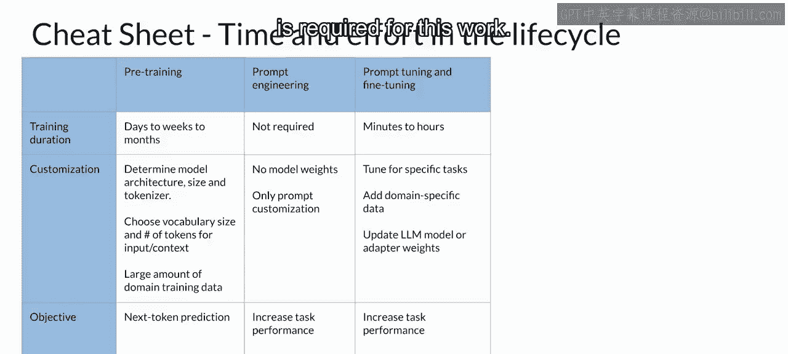

根据你的具体用例、性能目标和计算预算，你可以尝试的方法范围很广，从**完全微调**到参数高效的微调技术，如 **LoRA** 或 **提示调优**。

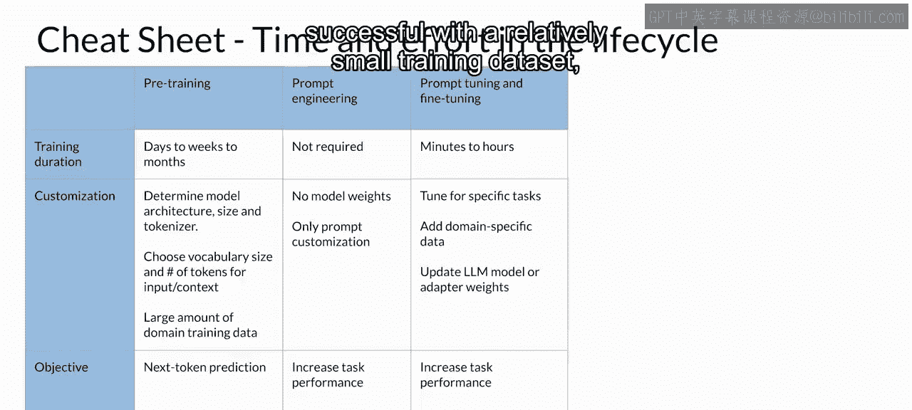

这项工作需要一定的技术专业知识。但由于微调通常只需要相对较小的训练数据集就能取得很好的效果，这个阶段有可能在一天内完成。

以下是微调阶段的关键点：
*   需要一定的技术专业知识。
*   可使用**完全微调**或**参数高效微调**等方法。
*   通常所需训练数据量较小，可能快速完成。

## 4. 基于人类反馈的强化学习对齐阶段 🎯

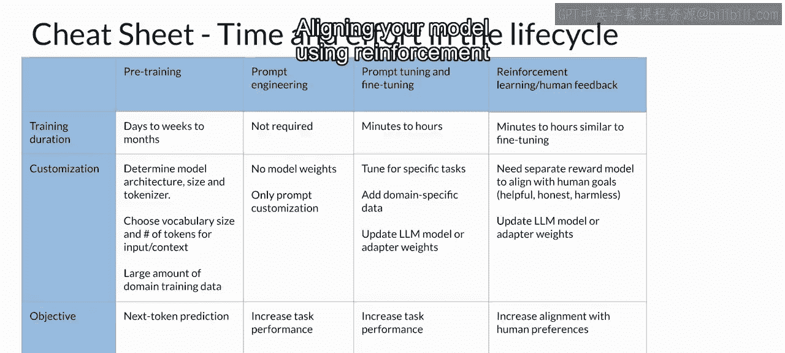

在拥有训练好的奖励模型后，使用基于人类反馈的强化学习来对齐你的模型可以快速完成。因此，你可能会看看是否能使用现有的奖励模型来完成这项工作，正如你在本周实验中所见。

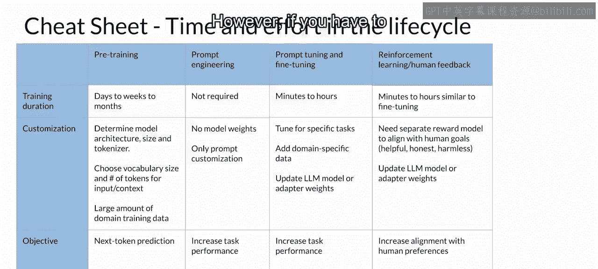

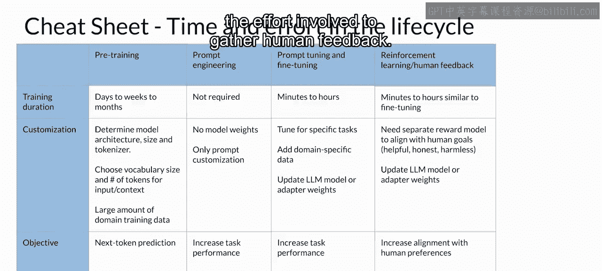

然而，如果你必须从头开始训练一个奖励模型，由于收集人类反馈的工作量很大，这可能会花费很长时间。

## 5. 优化阶段 ⚡

最后，你在上一个视频中学到的优化技术，通常在复杂度和工作量上处于中等水平，但如果对模型的改动不会对性能造成太大影响，优化可以相当快速地进行。

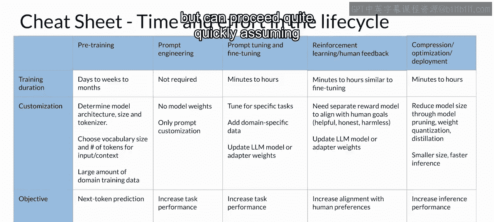

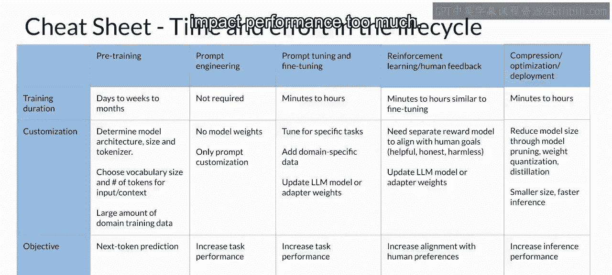

## 总结与展望 🚀

在完成了所有这些步骤之后，希望你已经训练和调优出了一个出色的LLM，它能够很好地服务于你的特定用例，并已为部署做好了优化。恭喜你！

在本课程的最后一系列视频中，你将探讨在启动应用程序之前可能还需要解决的有关LLM性能的剩余问题，以及可以克服这些问题的技术。让我们继续前进，一探究竟。

本节课中我们一起学习了生成式AI项目生命周期的完整路线图，从预训练、提示工程、微调、对齐到优化，了解了每个阶段的特点、所需资源和时间成本，为规划和实施你自己的AI项目提供了清晰的指引。