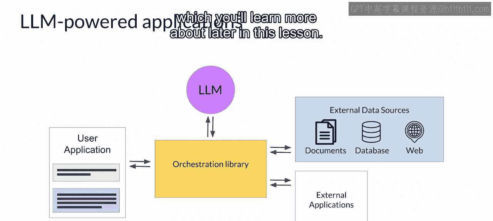
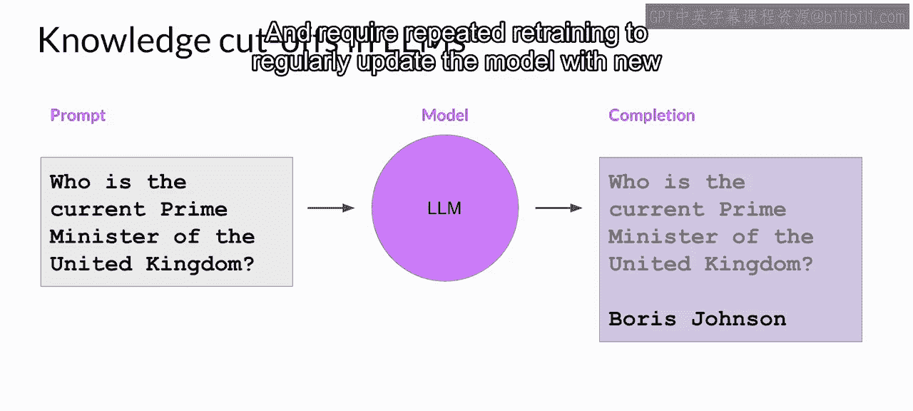
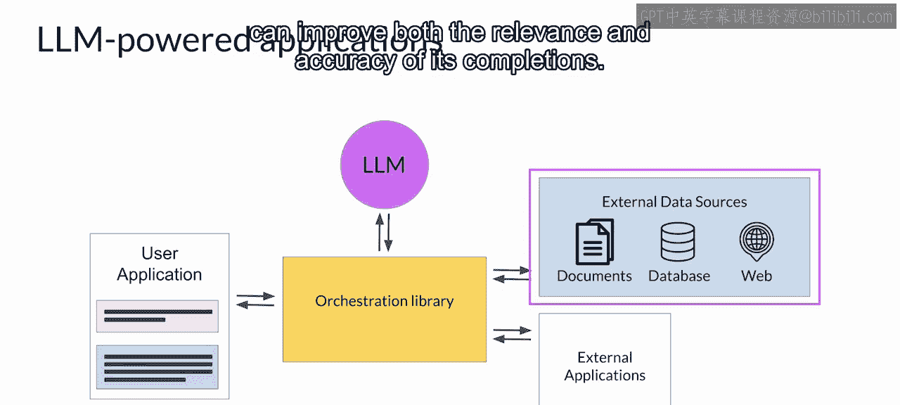
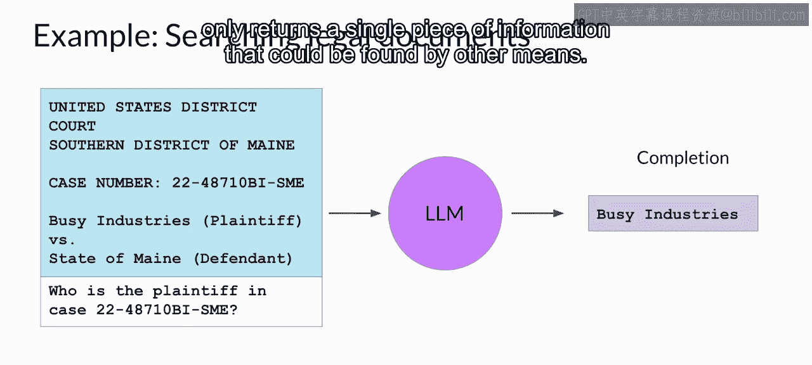
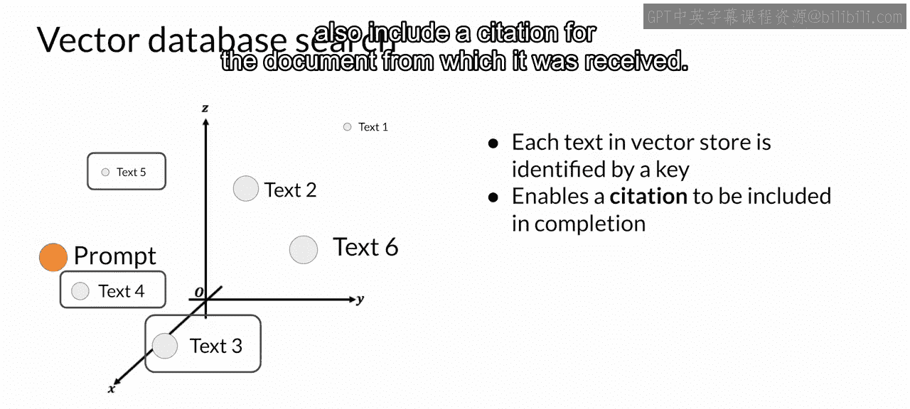

# 040：在应用中使用大语言模型 🚀

在本节课中，我们将要学习如何将大型语言模型集成到实际应用中，并探讨如何通过连接外部数据源来克服模型自身的局限性，例如知识过时、数学计算错误和“幻觉”问题。

尽管您之前探索的所有训练、微调和对齐技术都有助于为您的应用构建一个出色的模型，但大型语言模型存在一些更广泛的挑战，仅靠训练无法解决。让我们来看几个例子。

一个问题是模型所持有的内部知识截止于其预训练的时刻。例如，如果您询问一个在2022年初训练的模型“英国首相是谁”，它很可能会告诉您是鲍里斯·约翰逊。这个知识已经过时了。模型并不知道约翰逊在2022年底离任，因为该事件发生在它的训练之后。

模型也可能在复杂数学问题上遇到困难。如果您提示模型表现得像一个计算器，它可能会给出错误答案，这取决于问题的难度。在这里，您要求模型执行一个除法问题。模型返回了一个接近正确答案的数字，但它是错误的。请注意，**大型语言模型并不执行数学运算**。它们仍然只是试图基于其训练来预测下一个最佳标记，因此很容易得出错误答案。

最后，大型语言模型最著名的问题之一是，即使在不知道问题答案时，它们也倾向于生成文本。这通常被称为“幻觉”。在这里，您可以看到模型明显编造了一种不存在的植物——火星沙丘树——的描述。尽管目前仍然没有火星上存在生命的明确证据，但模型会很乐意告诉您相反的情况。

在本节中，您将学习一些技术，通过将大型语言模型连接到外部数据源和应用程序，来帮助您的模型克服这些问题。您需要做更多的工作，才能将您的大型语言模型连接到这些外部组件，并将所有内容完全集成以部署在您的应用程序中。

您的应用程序必须管理将用户输入传递给大型语言模型以及返回补全结果的过程。这通常通过某种编排库来完成。这一层可以实现一些强大的技术，在运行时增强和提升大型语言模型的性能，例如提供对外部数据源的访问或连接到其他应用程序的现有API。一个实现示例是LangChain，您将在本课后面了解更多。

让我们首先考虑如何将大型语言模型连接到外部数据源。

检索增强生成，简称RAG，是一个用于构建由大型语言模型驱动的系统的框架，它利用外部数据源和应用程序来克服这些模型的一些局限性。RAG是克服知识截止问题的绝佳方法，有助于模型更新其对世界的理解。虽然您可以在新数据上重新训练模型，但这很快就会变得非常昂贵，并且需要反复重新训练才能定期用新知识更新模型。

一个更灵活、成本更低廉的克服知识截止的方法是，在推理时让您的模型能够访问额外的外部数据。RAG在任何您希望语言模型能够访问它可能未曾见过的数据的情况下都很有用。这可能是新信息、原始训练数据中未包含的文档，或是存储在您组织私有数据库中的专有知识。为您的模型提供外部信息可以提高其补全结果的相关性和准确性。

让我们更仔细地看看这是如何工作的。检索增强生成不是一套特定的技术，而是一个为大型语言模型提供访问其在训练期间未见过的数据的框架。存在多种不同的实现方式，您选择哪一种将取决于您任务的细节以及您需要处理的数据格式。

在这里，您将了解Facebook研究人员在2020年发表的一篇关于RAG的早期论文中讨论的实现方式。该实现的核心是一个称为“检索器”的模型组件，它由一个查询编码器和一个外部数据源组成。编码器接收用户的输入提示，并将其编码成可用于查询数据源的形式。在Facebook的论文中，外部数据是一个向量存储，我们稍后会详细讨论，但它也可以是SQL数据库、CSV文件或其他数据存储格式。这两个组件一起训练，以在外部数据中找到与输入查询最相关的文档。检索器从数据源返回最佳的单篇或一组文档，并将新信息与原始用户查询相结合。然后，这个新的扩展提示被传递给语言模型，模型利用这些数据生成补全。

让我们看一个更具体的例子。想象您是一名律师，使用大型语言模型帮助您处理案件的取证阶段。一个RAG架构可以帮助您向文档语料库（例如，先前的法庭文件）提问。在这里，您向模型询问特定案件编号中提到的原告姓名。提示被传递给查询编码器，编码器以与外部文档相同的格式编码数据，然后在文档语料库中搜索相关条目。找到包含所请求信息的一段文本后，检索器将新文本与原始提示相结合。现在包含特定案件信息的扩展提示随后被传递给大型语言模型。模型利用提示上下文中的信息生成包含正确答案的补全。

您在这里看到的用例相当简单，只返回了可以通过其他方式找到的单一信息，但想象一下RAG的强大功能：能够生成文件摘要或在全部法律文档语料库中识别特定的人、地点和组织。

允许模型访问包含在此外部数据集中的信息，极大地提高了其在此特定用例中的效用。除了克服知识截止问题，RAG还有助于避免模型在不知道答案时产生幻觉的问题。

RAG架构可用于集成多种类型的外部信息源。您可以通过访问本地文档（包括私有维基和专家系统）来增强大型语言模型。RAG还可以实现访问互联网以提取网页上发布的信息，例如维基百科。通过将用户输入提示编码为SQL查询，RAG也可以与数据库交互。另一个重要的数据存储策略是向量存储，它包含文本的向量表示。这对于语言模型来说是一种特别有用的数据格式，因为它们在内部使用语言的向量表示来生成文本。向量存储支持一种基于相似性的快速高效的相关搜索。

请注意，实现RAG比简单地将文本添加到大型语言模型中要复杂一些。有几个关键的考虑因素需要注意，首先是上下文窗口的大小。大多数文本源太长，无法放入模型有限的上下文窗口中，而上下文窗口最多也只有几千个标记。因此，外部数据源被分割成许多块，每一块都能放入上下文窗口。像LangChain这样的包可以为您处理这项工作。

其次，数据必须以一种易于检索最相关文本的格式提供。回想一下，大型语言模型不直接处理文本，而是在嵌入空间中为每个标记创建向量表示。这些嵌入向量允许大型语言模型通过诸如余弦相似度之类的度量来识别语义相关的词。RAG方法获取外部数据的小块，并通过大型语言模型进行处理，为每个块创建嵌入向量。这些数据的新表示可以存储在称为向量存储的结构中，从而允许快速搜索数据集并高效识别语义相关的文本。向量数据库是向量存储的一种特定实现，其中每个向量也由一个键标识。例如，这可以允许RAG生成的文本也包含其来源文档的引用。

因此，您已经看到了访问外部数据源如何帮助模型克服其内部知识的限制。通过提供最新、相关的信息并避免幻觉，您可以极大地改善用户使用您应用程序的体验。接下来，我们将探索一种可以提高模型推理和制定计划能力的技术，这是使用大型语言模型驱动应用程序时的重要步骤。请加入下一个视频以了解更多。

---

**本节课总结**

在本节课中，我们一起学习了如何将大型语言模型集成到实际应用中，并重点探讨了检索增强生成框架。我们了解到，RAG通过连接外部数据源，可以有效解决模型的知识过时问题、减少幻觉，并提升回答的准确性和相关性。我们还讨论了实现RAG的关键考虑因素，如处理长文本的上下文窗口限制，以及利用向量存储进行高效语义检索。这些技术是构建强大、可靠的大型语言模型应用的重要基石。