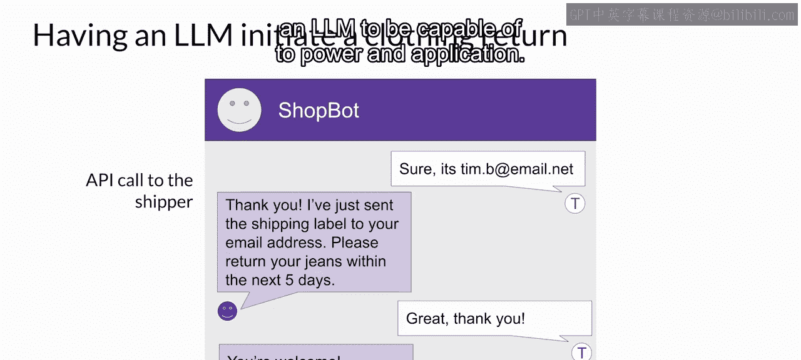
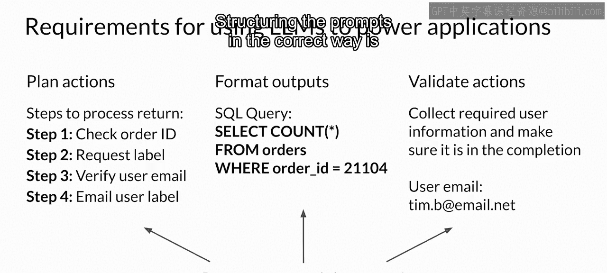

# 041：与外部应用交互 🚀


在本节课中，我们将学习大型语言模型如何与外部应用程序进行交互。你将了解这种交互的必要性、典型用例以及实现交互所需的关键信息。


上一节我们介绍了LLM如何与外部数据集交互。本节中，我们来看看它们如何与外部应用程序交互。

## 动机与用例 🤔

为了说明需要此类LLM增强功能的问题和用例类型，我们将回顾课程早期提到的客户服务机器人示例。

以下是客户与购物机器人交互的流程，我们将分析允许应用程序端到端处理退货请求所需的集成。

## 交互流程示例 🛍️

在这个对话中，客户表示想退回购买的牛仔裤。购物机器人回应要求提供订单号，客户随后提供。接着，购物机器人在交易数据库中查找该订单号。一种实现方式是使用之前视频中见过的RAG（检索增强生成）方法。在这种情况下，你可能通过SQL查询后端订单数据库来检索数据，而不是从文档语料库中检索。

一旦购物机器人检索到客户订单，下一步是确认要退回的商品。机器人询问客户除了牛仔裤外是否还想退回其他物品。用户回答后，机器人向公司的物流合作伙伴发起退货标签请求。机器人使用物流商的Python API来请求标签。购物机器人将通过电子邮件向客户发送物流标签，因此它还需要客户确认其电子邮件地址。客户回复其电子邮件地址后，机器人将此信息包含在调用物流商API的请求中。API请求完成后，机器人通知客户标签已通过电子邮件发送，对话结束。

这个简短的例子说明了为应用程序提供支持时，你可能需要LLM具备的其中一组可能的交互能力。



## 连接LLM与外部应用 🌐

总的来说，将LLM连接到外部应用程序使得模型能够与更广阔的世界互动，将其效用扩展到语言任务之外。正如购物机器人示例所示，当LLM获得与API交互的能力时，它们可用于触发操作。

LLM还可以连接到其他编程资源，例如Python解释器，这能使模型将精确计算纳入其输出中。

需要注意的是，提示词和补全结果是这些工作流程的核心。应用程序为响应用户请求而采取的操作将由LLM决定，LLM充当应用程序的推理引擎。

## 触发操作的关键信息 🔑

为了触发操作，LLM生成的补全结果必须包含某些重要信息。

以下是所需的关键信息类型：

1.  **生成指令集**：模型需要能够生成一组指令，以便应用程序知道要采取什么操作。这些指令需要易于理解，并对应于允许的操作。例如，在购物机器人示例中，重要步骤包括：检查订单ID、请求物流标签、验证用户邮箱以及向用户发送标签邮件。
2.  **格式化输出**：补全结果需要以更广泛的应用程序能够理解的格式进行格式化。这可能简单到特定的句子结构，也可能复杂到编写Python脚本或生成SQL命令。例如，以下是一个SQL查询，用于确定某个订单是否存在于所有订单的数据库中：
    ```sql
    SELECT * FROM orders WHERE order_id = '[提供的订单号]';
    ```
3.  **收集验证信息**：模型可能需要收集用于验证操作的信息。例如，在购物机器人对话中，应用程序需要验证客户用于下原始订单的电子邮件地址。验证所需的任何信息都需要从用户处获取，并包含在补全结果中，以便传递给应用程序。

## 提示词结构的重要性 🏗️

以正确的方式构建提示词对于所有这些任务都至关重要，并且可以极大地影响生成计划的质量或对期望输出格式规范的遵守程度。



本节课中，我们一起学习了大型语言模型与外部应用程序交互的原理、流程和关键要素。我们了解到，通过精心设计的提示词和格式化的输出，LLM可以充当智能代理，触发外部API、执行查询并完成复杂的端到端任务，从而极大地扩展其应用范围。