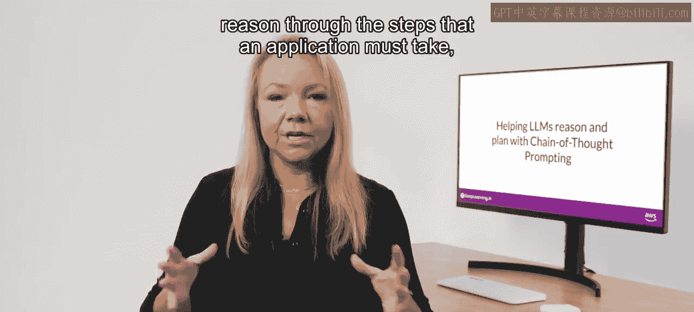
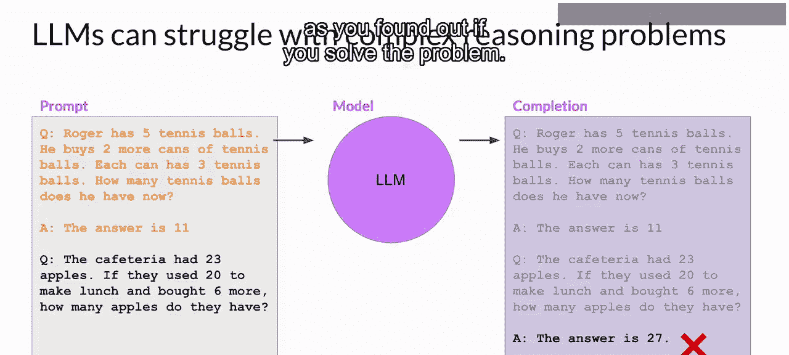
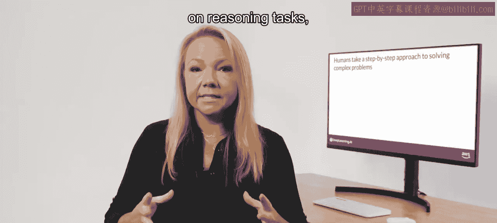
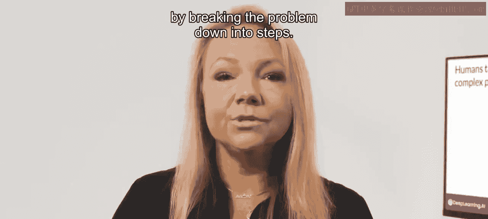
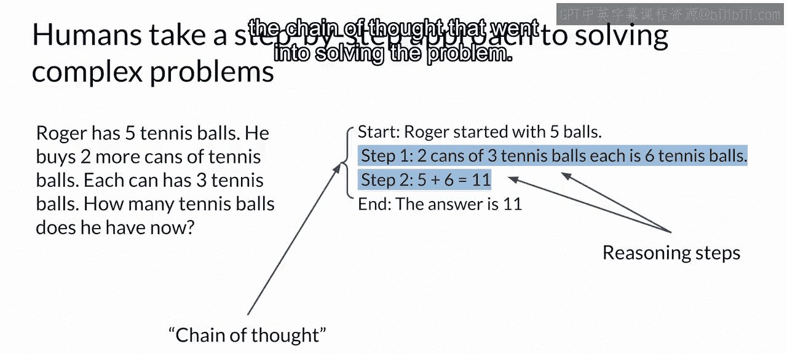
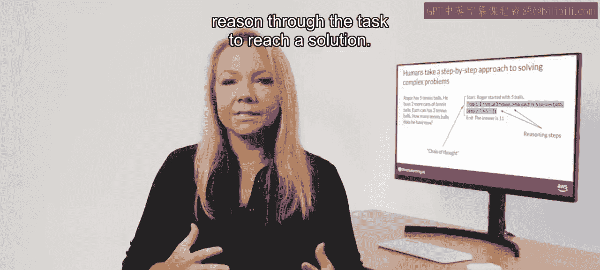
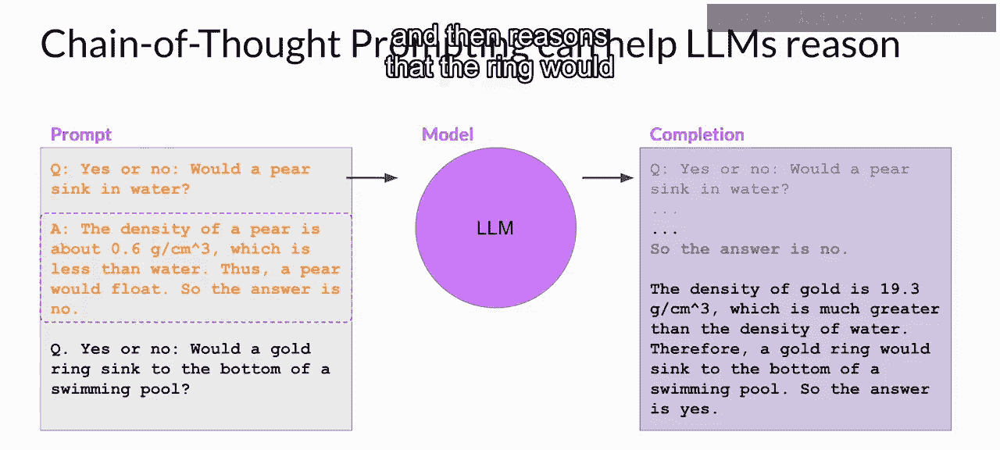

# 042：帮助大语言模型进行推理和规划 🧠

在本节课中，我们将要学习如何通过特定的提示技巧，帮助大型语言模型（LLM）更好地进行多步骤推理和规划，以解决其可能感到困难的复杂问题。

正如你所见，LLM能够推理出满足用户请求所需采取的步骤，这一点非常重要。

然而，复杂的推理对LLM来说可能具有挑战性。

特别是对于那些涉及多个步骤或数学计算的问题。

这些问题普遍存在，即使在许多其他任务上表现出色的大型模型中也不例外。

## 推理挑战示例

以下是LLM难以完成任务的一个例子。

你要求模型解决一个简单的多步骤数学问题，以确定食堂在使用一些苹果做午餐后又购买了一些之后，还剩下多少苹果。

你的提示中包含了一个类似的示例问题及其解决方案，旨在通过单样本推理帮助模型理解任务。

处理提示后，模型生成了此处所示的回答，声称答案是27。这个答案是错误的。如果你自己计算一下，会发现食堂实际上只剩下9个苹果。

## 引入思维链提示

研究人员一直在探索提高大型语言模型在类似推理任务上表现的方法。

一种已证明有效的方法是，通过提示模型将问题分解为步骤，使其更像人类一样思考。

那么，更像人类一样思考是什么意思呢？

让我们看看前一页幻灯片提示中的单样本示例问题。

这里的任务是计算罗杰在购买一些新网球后有多少个网球。

人类解决这个问题的一种方式可能如下：

首先，确定罗杰开始时拥有的网球数量。

然后，注意到罗杰购买了两罐网球。每罐包含三个球，所以他总共有六个新网球。

接着，将这六个新球与原来的五个相加，总共得到11个球。

最后陈述答案。这些中间计算构成了人类可能采取的推理步骤，而完整的步骤序列则展示了解决问题的思维链。

要求模型模仿这种行为被称为**思维链提示**。

它的工作原理是，在你用于单样本或少样本推理的任何示例中，包含一系列中间推理步骤。

通过这种方式构建示例，你本质上是在教模型如何通过推理来完成任务并得出解决方案。

## 应用思维链提示

以下是几页幻灯片前看到的同一个苹果问题，现在被重新构建为一个思维链提示。

罗杰购买网球的故事仍然被用作单样本示例，但这次你在解决方案文本中包含了中间推理步骤。

这些步骤基本上等同于几分钟前看到的人类可能采取的步骤。

然后，你将这个思维链提示发送给大型语言模型，模型会生成一个回答。

请注意，模型现在产生了一个更稳健、更透明的回答，它按照与单样本示例相似的结构解释了自己的推理步骤。

模型现在正确地确定剩下9个苹果。通过逐步思考问题，模型得出了正确答案。

需要指出的是，虽然这里的输入提示以压缩格式显示以节省空间，但完整的提示实际上都包含在输出中。

## 思维链提示的扩展应用

除了算术问题，你也可以使用思维链提示来帮助LLM提高对其他类型问题的推理能力。

以下是一个简单的物理问题示例，要求模型判断一枚金戒指是否会沉到游泳池底部。

这里作为单样本示例包含的思维链提示，向模型展示了如何通过推理“梨会漂浮是因为它的密度小于水”来解决这个问题。

当你将这个提示传递给LLM时，它会生成一个结构相似的回答。

模型正确地识别了金的密度（这是它从训练数据中学到的），然后推理出戒指会下沉，因为金的密度远大于水。

## 总结与展望

思维链提示是一种强大的技术，可以提高模型推理问题的能力。

虽然这可以极大地提高模型的性能，但如果你的任务需要精确计算（例如计算电子商务网站的总销售额、计算税款或应用折扣），LLM有限的数学技能仍然可能导致问题。

在下一个视频中，你将探索一种可以帮助你克服这个问题的方法，即让你的LLM与一个更擅长数学的程序进行“对话”。

让我们继续前进，一探究竟。

本节课中，我们一起学习了**思维链提示**这一核心技巧。我们了解到，通过要求模型**将复杂问题分解为中间步骤**并展示其推理过程，可以显著提升其在多步骤推理和数学计算任务上的表现。其核心公式可以概括为：

**问题 -> [中间推理步骤1 -> 中间推理步骤2 -> ... -> 中间推理步骤N] -> 最终答案**

这种方法模仿了人类的思考方式，使模型的输出更加透明和可靠。然而，我们也认识到LLM在精确计算方面仍有局限，这为后续学习更高级的解决方案（如工具调用）做好了铺垫。