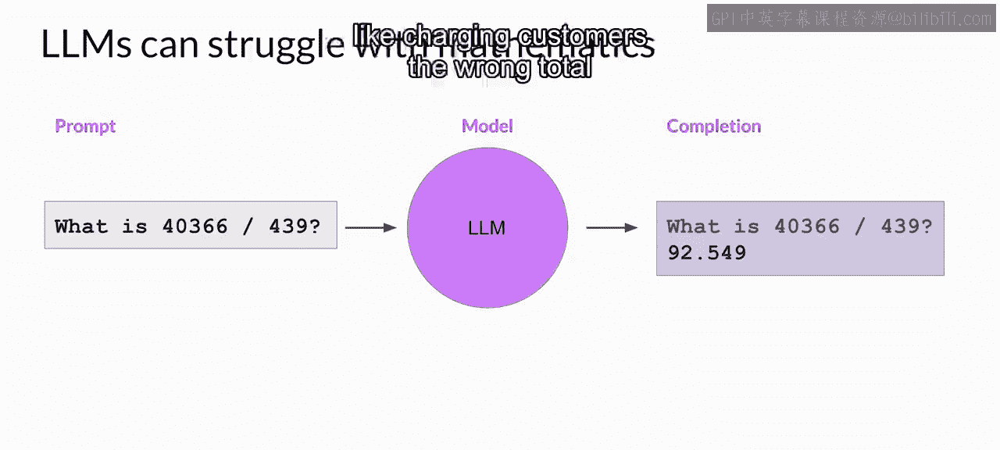
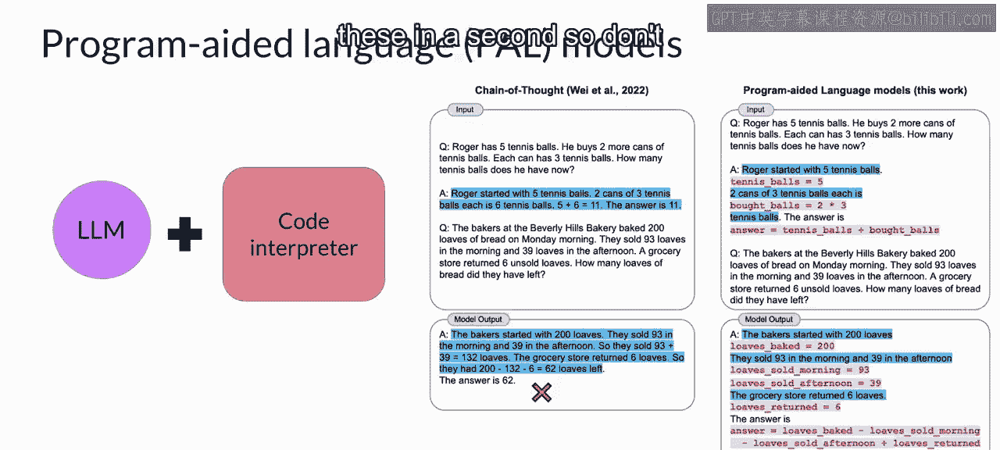
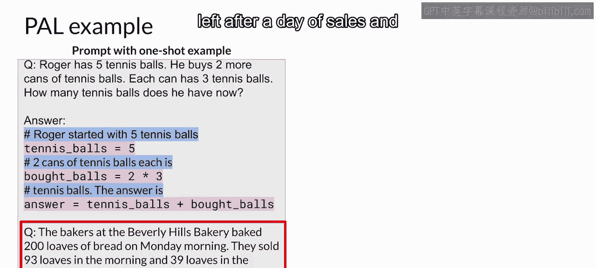
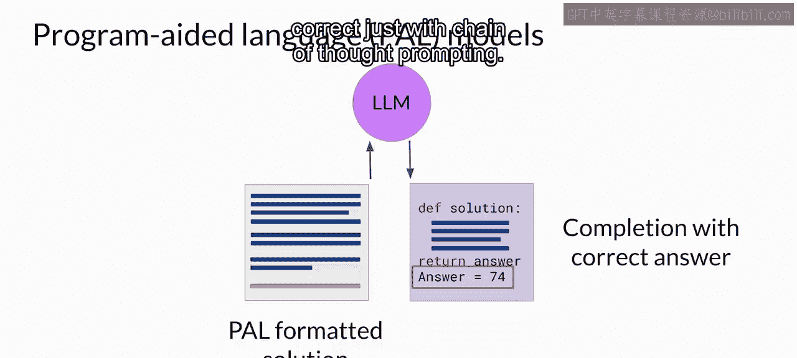
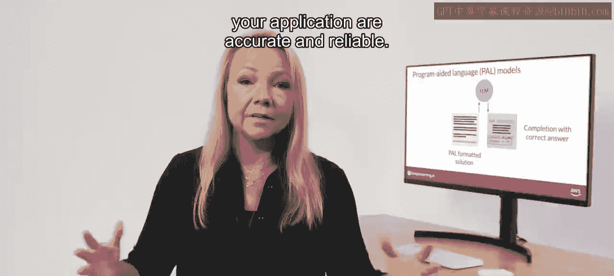
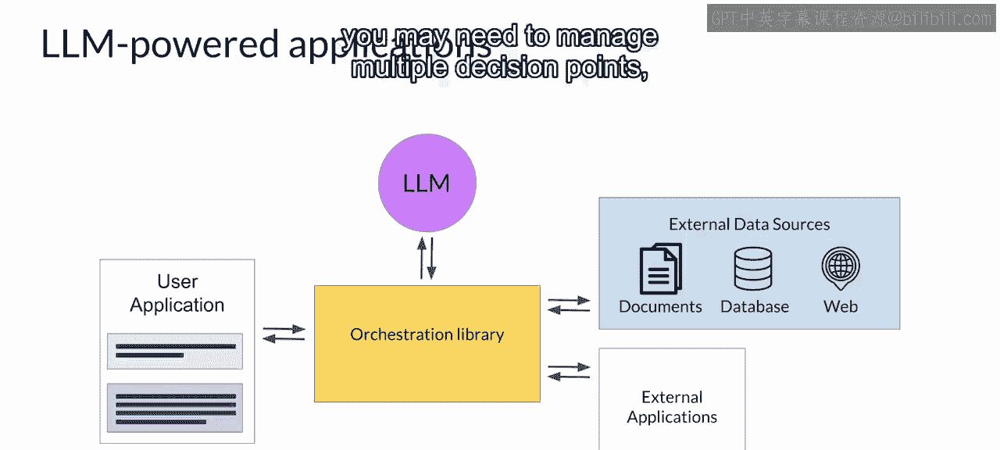

# 043：程序辅助语言模型 🧮

在本节课中，我们将要学习如何通过“程序辅助语言模型”框架，让大型语言模型与外部代码解释器协同工作，以克服其在执行数学运算方面的局限性。

## 概述

正如您在本课早些时候所见，大型语言模型执行算术和其他数学运算的能力是有限的。虽然可以尝试使用思维链提示来克服这一点，但效果有限。即使模型能正确推理问题，它仍可能在具体的数学运算上出错，尤其是在处理大数字或复杂运算时。

## 大型语言模型的数学局限性

上一节我们介绍了LLM在数学运算上的挑战，本节中我们来看看一个具体的例子。

这是之前看到的一个例子，LLM试图扮演计算器的角色，但得出了错误的答案。请记住，模型实际上并没有进行任何真正的数学计算。它只是在尝试预测最有可能完成提示的标记。根据您的使用场景，模型算错数学可能会带来许多负面后果，例如向客户收取错误的总金额或弄错食谱的配料比例。

## 引入程序辅助语言模型

为了克服这一限制，可以让模型与擅长数学的外部应用程序交互，例如Python解释器。一个以此方式增强LLM的有趣框架被称为“程序辅助语言模型”，简称PAL。这项工作由卡内基梅隆大学的Lou Yugao及其合作者于2022年首次提出，它将LLM与外部代码解释器配对以执行计算。

该方法利用思维链提示来生成可执行的Python脚本。模型生成的脚本被传递给解释器执行。右侧的图片取自论文，展示了一些示例提示和补全。我们稍后将详细分析一个例子，所以现在不必担心阅读所有细节。

## PAL的工作原理

PAL背后的策略是让LLM生成推理步骤伴随计算机代码的补全。然后将此代码传递给解释器，以执行解决问题所需的计算。通过在提示中包含一个或多个示例，来指定模型的输出格式。让我们仔细看看这些示例提示的结构。

我们将继续以罗杰购买网球的故事作为单样本示例。这里的设置现在看起来应该很熟悉。这是一个思维链示例。您可以看到用文字写出的推理步骤，在蓝色高亮行中。与之前看到的问题不同之处在于，包含了用粉色显示的Python代码行。这些代码行将涉及计算的任何推理步骤转化为代码。

以下是变量声明和赋值的逻辑：
*   变量根据每个推理步骤中的文本声明。
*   它们的值要么直接赋值（如这里的第一行代码所示），要么使用推理文本中存在的数字进行计算赋值（如第二行Python代码所示）。
*   模型也可以使用它在其他步骤中创建的变量（如第三行所示）。

请注意，每个推理步骤的文本都以井号开头，这样该行就可以被Python解释器作为注释跳过。提示在此处以需要解决的新问题结束。在这个案例中，目标是确定一家面包店在一天的销售以及从杂货店合作伙伴退回一些面包后，还剩下多少条面包。在右侧，您可以看到LLM生成的补全。同样，思维链推理步骤用蓝色显示，Python代码用粉色显示。

如您所见，模型创建了许多变量来跟踪烘烤的面包数量、一天中每个时段售出的面包数量以及杂货店退回的面包数量。然后通过对这些变量进行算术运算来计算答案。模型正确识别了各项是应该相加还是相减，以得出正确的总数。

## 构建PAL推理流程

既然您知道了如何构建示例来指示LLM根据其推理步骤编写Python脚本，让我们来看看PAL框架如何使LLM能够与外部解释器交互。

要为PAL推理做准备，您需要格式化提示以包含一个或多个示例。每个示例应包含一个问题，后跟解决问题的推理步骤和Python代码行。

接下来，您需要将想要回答的新问题附加到提示模板中。您生成的PAL格式化提示现在同时包含了示例和要解决的问题。然后，将此组合提示传递给您的LLM。LLM随后会生成一个Python脚本形式的补全，因为它已根据提示中的示例学会了如何格式化输出。

现在，您可以将脚本移交给Python解释器，用它来运行代码并生成答案。对于上一张幻灯片中看到的面包店示例脚本，答案是74。现在，您将包含答案的文本（您知道它是准确的，因为计算是在Python中执行的）附加到您最初使用的PAL格式化提示中。至此，您有了一个在上下文中包含正确答案的提示。现在，当您将更新后的提示传递给LLM时，它会生成包含正确答案的补全。

鉴于面包店面包问题中的数学相对简单，模型可能仅通过思维链提示就能得到正确答案。

但对于更复杂的数学，包括大数字的算术、三角学或微积分，PAL是一种强大的技术，可确保应用程序执行的任何计算都是准确可靠的。

## 自动化与编排器

您可能想知道如何自动化此过程，以免手动在LLM和解释器之间来回传递信息。这就是您之前看到的编排器发挥作用的地方。

此处显示为黄色框的编排器是一个技术组件，可以管理信息流以及对外部数据源或应用程序的调用启动。它还可以根据LLM输出中包含的信息决定采取什么行动。请记住，LLM是您应用程序的推理引擎。最终，它创建编排器将解释和执行的计划。在PAL中，只需要执行一个操作：运行Python代码。因此，LLM实际上不必决定运行代码，它只需要编写脚本，然后由编排器传递给外部解释器运行。

然而，大多数现实世界的应用程序可能比简单的PAL架构更复杂。您的使用场景可能需要与多个外部数据源交互。正如您在Sho机器人示例中看到的那样，您可能需要管理多个决策点、验证操作以及对外部应用程序的调用。

那么，如何使用LLM来驱动更复杂的应用程序呢？让我们在下一个视频中探讨一种策略。

## 总结

本节课中我们一起学习了程序辅助语言模型。我们了解到LLM在数学运算上的固有局限性，并探索了如何通过PAL框架，将LLM的推理能力与Python解释器的精确计算能力相结合。PAL通过让LLM生成伴随代码的推理步骤，并将代码交由外部解释器执行，从而确保了复杂数学运算的准确性。我们还简要介绍了编排器在自动化此流程中的作用，为构建更复杂的AI应用奠定了基础。